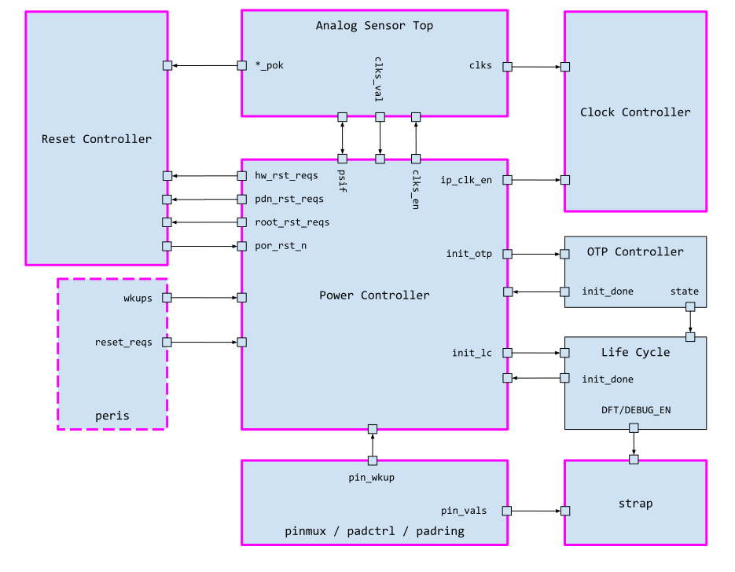
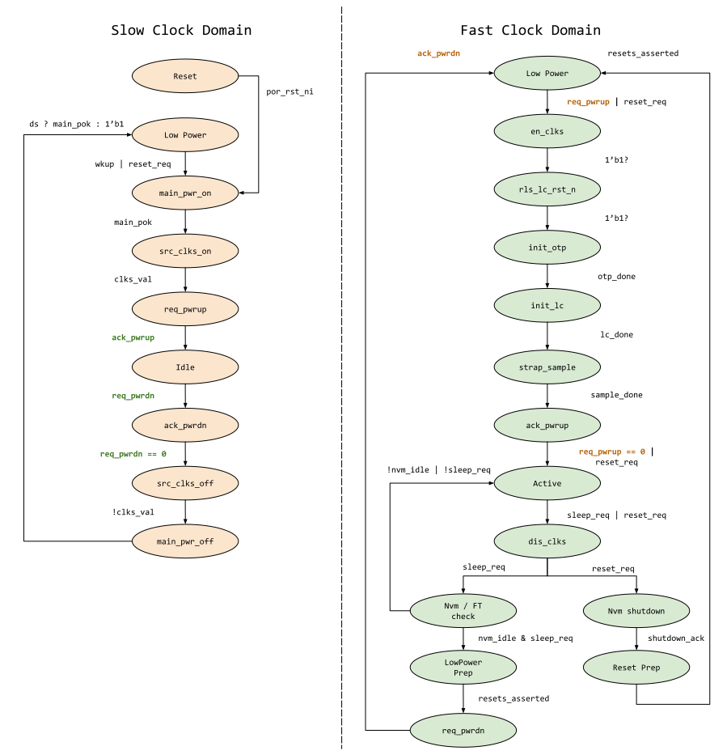

# Overview

This document specifies the functionality of the OpenTitan power manager.

## Features

- Cold boot, low power entry / exit and reset support.
- 2 different low power modes.
- Software initiated low power entry and hardware requested low power exit.
- Peripheral reset requests
- Low power abort and low power fall-through support.

## Description

The power manager sequences power, clocks, and reset resources of the design through cold boot, low power entry/exit and reset scenarios.

Cold boot, also known as POR (power on reset) is the first reset state of the design.
The power manager sequences the design from a freshly reset state to an active state where software can be initialized.

- Low power entry is the process in which the device enters one of two low power modes (sleep or deep sleep).
- Low power exit is the process in which the device exits low power mode and returns to active state.
- Low power entry is always initiated by software, while low power exit is always initiated by a previously setup hardware event such as pins or internal timers.
- The power manager processes the software and hardware requests to perform the appropriate actions.

Reset scenarios refer to non-POR events that cause the device to reboot.
There are various stimuli that can cause such a reset, ranging from external user input to watchdog timeout.
The power manager processes the reset request and brings the device to an appropriate state.

# Theory Of Operation

The power manager performs the following functions:
- Turn on/off power domain(s).
- Control root resets with the reset manager.
- Control root clock enables with AST and clock manager.
- Sequence various power up activities such as OTP sensing, life cycle initiation and releasing software to execute.

If there is a need to perform ROM hashing as an integrity check in the future, that will also be managed by the power manager.

## Block Diagram

See the below high level block diagram that illustrates the connections between the power manager and various system components.
Blocks outlined with a solid magenta line are always on; while blocks outlined with a dashed magenta line are a mix of components that are and those that are not.

## Overall Sequencing

The power manager contains two state machines.
One operates on the always-on slow clock (this clock is always running and usually measured in KHz) and is responsible for turning faster clocks on and off and managing the power domains.
The other operates on a normal fixed clock (usually measured in MHz) and is responsible for everything else in the power sequence.

The following diagram breaks down the general functionality of both.
The state machines are colored based on their clock domains.
The green state machine is clocked by the normal fixed domain, while the orange state machine is clocked by the slow domain.
Specific request / acknowledge signals are also highlighted in this color scheme to show where the two state machines communicate.

Note, most of the states are transitional states, and only the following state combinations are resting states.

*   Slow FSM `Idle` and fast FSM `Active`
*   Slow FSM `Low Power` and fast FSM `Low Power`

The slow FSM `Low Power` and fast FSM `Active` states specifically are concepts useful when examining [reset handling](#Reset-Request-Handling).

## Slow Clock Domain FSM

The slow clock domain FSM (referred to as the slow FSM from here on) resets to the Reset state.
This state is released by `por_rst_n`, which is supplied from the reset controller.
The `por_rst_n` signal is released when the reset controller detects the root power domains (`vcaon_pok` from AST) of the system are ready.
Please see the [AST interface]() for more details.

The slow FSM requests the AST to power up the main domain and high speed clocks.
Once those steps are done, it requests the fast FSM to begin operation.
The slow FSM also handles power isolation controls as part of this process.

Once the fast FSM acknowledges the power-up completion, the slow FSM transitions to `Idle` and waits for a power down request.
When a power down request is received, the slow FSM turns off AST clocks and power as directed by software configuration.
This means the clocks and power are not always turned off, but are rather controlled by software configurations in  prior to low power entry .
Once these steps are complete, the slow FSM transitions to a low power state and awaits a wake request, which can come either as an actual wakeup, or a reset event (for example always on watchdog expiration).

## Fast Clock Domain FSM

The fast clock domain FSM (referred to as fast FSM from here on) resets to `Low Power` state and waits for a power-up request from the slow FSM.

Once received, the fast FSM releases the life cycle reset stage (see [reset controller](https://docs.google.com/document/d/1oprdDwbm-_opDwMuu-kmmaFVwt4-f1EGqCf0nkO8VpM/edit?usp=sharing) for more details).
This allows the [OTP]() to begin sensing.
Once OTP sensing completes , the life cycle controller is initialized.
The initialization of the life cycle controller puts the device into its allowed operating state (see [life cycle controller](https://docs.google.com/document/d/1H6jHtX2xYgy3nmkWKeHMkYcP0vsPq9duyUtLu5imX2E/edit?usp=sharing) for more details).

Once life cycle initialization is done, the fast FSM enables all second level clock gating (see [clock controller](https://docs.google.com/document/d/1j8H9ikPO2TKTRQvRFItjE5myiba1825PD-Yhy-yaLt0/edit?usp=sharing) for more details) and initiates strap sampling.
For more details on what exactly the strap samples, please see [here](https://docs.google.com/spreadsheets/d/1pH8T1MhQ7TXtP_bFNT85T9jSVIHlxHAfbMnPbsMdjc0/edit?usp=sharing).

Once strap sampling is complete, the system is ready to begin normal operations (note flash initialization is explicitly not done here, please see [sections below](#Flash-Handling) for more details).
The fast FSM acknowledges the slow FSM (which made the original power up request) and releases the system reset stage - this enables the processor to begin operation.
Afterwards, the fast FSM transitions to `Active` state and waits for a software low power entry request.

A low power request is initiated by software through a combination of WFI and software low power hint in .
Specifically, this means if software issues only WFI, the power manager does not treat it as a power down request.
The notion of WFI is exported from the processor.
For Ibex, this is currently in the form of `core_sleeping_o`.

In response to the low power entry request, the fast FSM disables all second level clock gating and asserts appropriate resets if required.  The
fast FSM then requests the slow FSM to take over.
Once the request is acknowledged, the fast FSM transitions to low power and waits for the next power up request.

## Reset Request Handling

There are 3 reset requests in the system - peripheral requested reset such as watchdog, alert escalation reset and non-debug module reset.
Flash brownout is handled separately and described in [flash handling section](#Flash-Handling) below.

Watchdog and alert escalation resets are handled directly by the power manager, while the non-debug module reset is handled by the reset controller.
This separation is because the non-debug reset does not affect the life cycle controller, non-volatile storage controllers and alert states.
There is thus no need to sequence its operation like the others.

The power controller only observes reset requests in two states - the slow FSM `Low Power` state and the fast FSM `Active` state.
When a reset request is received during slow FSM `Low Power` state, the system begins its usual power up sequence even if a wakeup has not been received.

When a reset request is received during fast FSM `Active` state, the fast FSM asserts resets and transitions back to its `Low Power` state.
The normal power-up process described [above](#Fast-Clock-Domain-FSM) is then followed to release the resets.
Note in this case, the slow FSM is "not activated" and remains in its `Idle` state.

### Reset Requests Received During Other States

All other states in the slow / fast FSM are considered transitional states.
Resets are not observed in other states because the system will always be transitioning towards one of the steady states (the system is in the process of powering down or powering up).
Once a steady state is reached, reset requests are then observed and processed.

### Reset Recording

There are three ways in which the device is reset:
- Non-debug-module reset request
- Low power entry (`sleep_req` in the state diagram)
- Direct reset requests by peripherals or alert escalation

The power manager does not handle the non-debug-module request (please see reset controller).
For the remaining two reset causes, the power manager handles only 1 pathway at a time (see state diagrams).
This means if reset request and low power entry collide, the power manager will handle them on a first come first served basis.
When the handling of the first is completed, the power manager handles the second pending request if it is still present.

This is done because low power resets and peripheral requested resets lead to different behaviors.
When the power manager commits to handling a specific request, it informs the reset manager why it has reset the processor.

For example, assume a low power entry request arrives slightly ahead of reset requests.
The power manager will:
- Transition the system into low power state.
- Inform the reset manager to record "low power exit" as the reset reason.
- Once in low state, transition the system to `Active` state by using the reset request as a wakeup indicator.
- Inform the reset manager to also record the peripheral that requested reset.
- Once in `Active` state, reset the system and begin normal power-up routines again.

If reset requests arrive slightly ahead of a low power entry request, then power manager will:
- Reset the system and begin normal power-up routines.
- Inform the reset manager to record the peripheral that requested reset.
- Once in `Active` state, if the low power entry request is still present, transition to low power state.
  - Inform the reset manager to also record "low power exit" as the reset reason.
- If the low power entry request was wiped out by reset, the system then stays in `Active` state and awaits software instructions.

Ultimately when control is returned to software, it may see two reset reasons and must handle them accordingly.

## Wakeup Recording

Similar to [reset handling](#Reset-Request-Handling), wakeup signals are only observed during slow FSM `Low Power`; however their recording is continuous until explicitly disabled by software.

Wakeup recording begins when the fast FSM transitions out of `Active` state and continues until explicitly disabled by software.
This ensures wakeup events are not missed until software has set up the appropriate peripherals.

The software is also able to enable recording during `Active` state if it chooses to do so.  The recording enables are OR’d together for hardware purposes.

## Flash Handling

### Power-Up Handling

The AST automatically takes flash out of power down state as part of the power manager's power up request.
Once flash is powered up, the power manager keeps a running count of the flash initialization time.
When this time has expired, an acknowledgment is forwarded to the flash controller.
Once the boot ROM is allowed to execute, it is expected to initialize the flash prior to using it.
This involves 4 steps:

*   Poll flash control register to ensure flash has powered up (this is the same signal mentioned above).
*   Obtain flash redundancy or configuration information (could be in flash or OTP)
    *   If in flash, this information is unscrambled
    *   This item is TBD and must be further discussed.
*   Program redundancy or configuration information into the flash controller and lock it from further modification (this item is TBD).
*   Initialize flash scrambling and program any excluded regions based on OTP or other information.

There may be additional steps depending on flash design and software needs.

### Power-Down Handling

When the device enters deep sleep, the flash is automatically put into power down mode by the AST.
When the device exits low power state, it is the responsibility of the boot ROM to poll for flash power-up complete.

### Flash Brownout Handling

When the supply of the device dips below a certain point during a stateful flash operation (program or erase) the flash requires the operation to terminate in a pre-defined manner.
This sequence will be exclusively handled by the AST.
The power manager is unaware of the difference between POR and flash brownout.
Because of this, the software also cannot distinguish between these two reset causes.

## Supported Low Power Modes

This section details the various low power modes supported by OpenTitan.

### Deep Sleep or Standby

This represents the lowest power mode of the device (outside of full power down or device held in reset).
During this state:

*   All clocks other than the KHz slow clock are turned off at the source.
*   All non-always-on digital domains are powered off.
*   I/O power domains may or may not be off.
    *   The state of the IO power domain has no impact on the digital core’s power budget, e.g. the IO power being off does not cause the accompanying digital logic in pads or elsewhere to leak more.

### Normal Sleep

This represents a fast low power mode of the device that compromises power consumed and resume latency.
During this state:

*   All clocks other than the KHz slow clock are turned off at the source.
*   All power domains are kept on for fast resume.
*   Sensor countermeasures can be opportunistically on.
*   I/O power domains may or may not be off.
    *   The state of the IO power domain has no impact on the digital core’s power budget, e.g. the IO power being off does not cause the accompanying digital logic in pads or elsewhere to leak more.

## Life Cycle and Debug

This item is TBD

Life cycle and TAP debug are two functions that may need to prevent the device from going into a low power state (imagine software is running and a TAP connection is made for specific debug).
In these scenarios, it must be possible for the life cycle and debug functions to set a bit that prevents the power controller from entering sleep even if instructed to do so by software.
The life cycle controller can maintain one such bit that is accessible from the life cycle TAP, while the normal debug TAP should maintain something similar.

# Programmers Guide

Please see [power management programmers model](https://docs.google.com/document/d/1w86rmvylJgZVmmQ6Q1YBcCp2VFctkQT3zJ408SJMLPE/edit?usp=sharing) for now.

## Register Table


