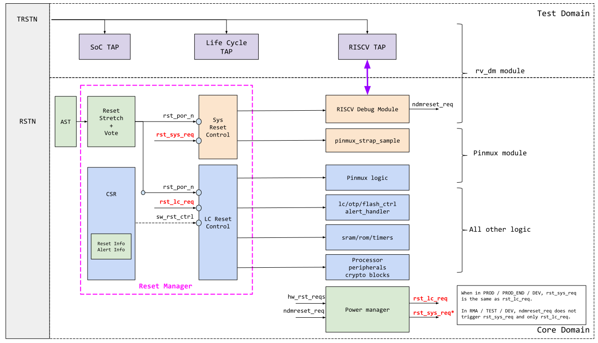

# Overview

This document describes the functionality of the reset controller and its interaction with the rest of the OpenTitan system.

## Features

*   Stretch incoming POR.
*   Cascaded system resets.
*   Peripheral system reset requests.
*   RISC-V non-debug-module reset support.
*   Limited and selective software controlled module reset.
*   Always-on reset information register.
*   Always-on alert information register.

# Theory of Operation

The OpenTitan reset topology and reset controller block diagram are shown in the diagram below.
The reset controller is closely related to the [power controller](), please refer to that spec for details on how reset controller inputs are controlled.

## Reset Topology

The topology can be summarized as follows:

*   There are two reset domains
    *   Test Domain - Driven by `TRSTn`
    *   Core Domain - Driven by internal [POR circuitry]() and an external pin reset connection.
*   Test domain is comprised of the following components
    *   SOC TAP and related DFT circuits
    *   RISC-V TAP (part of the `rv_dm` module)

The test domain does not have sub reset trees.
`TRSTn` is used directly by all components in the domain.

The Core domain consists of all remaining logic and contains 4 sub reset trees, see table below.

<table>
  <tr>
   <td>
<strong>Reset Tree</strong>
   </td>
   <td><strong>Description</strong>
   </td>
  </tr>
  <tr>
   <td><code>rst_por_n</code>
   </td>
   <td><code>POR reset tree.</code>

<code>This reset is driven by ast, stretched inside the reset manager and resets all core domain logic in the design. </code>
   </td>
  </tr>
  <tr>
   <td><code>rst_lc_n</code>
   </td>
   <td><code>Life Cycle reset tree.</code>

<code>This reset is derived from rst_por_n and resets all logic in the design except:</code><ul>

<li><code>Power manager</code>
<li><code>Clock manager </code>
<li><code>Reset manager</code></li></ul>

   </td>
  </tr>
  <tr>
   <td><code>rst_sys_n</code>
   </td>
   <td><code>System reset tree.</code>

<code>This reset is derived from rst_lc_n and resets all logic in the design except:</code><ul>

<li><code>Power manager</code>
<li><code>Clock manager</code>
<li><code>Reset manager</code>
<li><code>OTP controller</code>
<li><code>Flash controller</code>
<li><code>Life cycle controller</code>
<li><code>Alert manager</code>
<li><code>Always-on timers</code></li></ul>

   </td>
  </tr>
  <tr>
   <td><code>rst_{module}_n</code>
   </td>
   <td><code>Module specific reset.</code>

<code>This reset is derived from rst_sys_n and sets only the targeted module and nothing else.</code>

<code>For OpenTitan, the only current targets are spi_device and usb_device.</code>
   </td>
  </tr>
</table>

The reset trees are cascaded upon one another in this order:
`rst_por_n` -> `rst_lc_n` -> `rst_sys_n` -> `rst_module_n`
This means when a particular reset asserts, all downstream resets also assert.

The primary difference between `rst_lc_n` and `rst_sys_n` is that the former controls the reset state of all non-volatile related logic in the system, while the latter can be used to issue system resets for debug.
This separation is required because the non-volatile controllers (OTP / Lifecycle) are used to qualify DFT and debug functions of the design.
If these modules are reset along with the rest of the system, the TAP and related debug functions would also be reset.
By keeping these reset trees separate, we allow the state of the test domain functions to persist while functionally resetting the rest of the core domain.

Additionally, modules such as [alert handler]() and [aon timers]() (which contain the watchdog function) are also kept on the `rst_lc_n` tree.
This ensures that an erroneously requested system reset through `rst_sys_n` cannot silence the alert mechanism or prevent the system from triggering a watchdog mechanism.

The reset topology also contains additional properties:
*   Selective processor HART resets, such as `hartreset` in `dmcontrol`, are not implemented, as it causes a security policy inconsistency with the remaining system.
    *   Specifically, these selective resets can cause the cascaded property shown above to not be obeyed.
*   Modules do not implement local resets that wipe configuration registers, especially if there are configuration enable locks.
    *   Modules are allowed to implement local soft resets that clear datapaths; but these are examined on a case by case basis for possible security side channels.
*   In a production system, the Test Reset Input (`TRSTn`) should be explicitly asserted through system integration.
    *   In a production system, `TRSTn` only needs to be released for RMA transitions and nothing else.
.

## Reset Manager

The reset manager handles the reset of the core domain, and also holds relevant reset time information such as [reset reason]() and [alert_reason]().
*  Reset reason indicates why the system was reset.
*  Alert reason indicates the recorded alert status prior to system reset.
   *  This is useful in case the reset was triggered by an alert escalation.

There is another TBD feature for recording [last host state](https://docs.google.com/document/d/1KnmIt7vj8vkfqgAIcx6HJo8KH6zirFNF1TxlL5K6Aso/edit?usp=sharing).
*  Last host state indicates approximately what the host was doing prior to system reset.
   *  This is useful in case the reset was triggered by a watchdog where the host hung on a particular bus transaction.

Additionally, the reset manager, along with the power manager, accepts requests from the system and asserts resets for the appropriate clock trees.
These requests primarily come from the following sources:
*  Peripherals capable of reset requests: such as [rbox]() and [always on timers ]().
*  Debug modules such as `rv_dm`.
*  Power manager request for low power entry and exit.

### Shadow Resets

OpenTitan supports the concept of shadow registers.
These are registers stored in two-or-more constantly checking copies to ensure the values were not maliciously or accidentally disturbed.
For these components, the reset manager outputs a shadow reset dedicated to resetting only the shadow storage.
This reset separation ensures that a targetted attack on the reset line cannot easily defeat shadow registers.

Shadow resets have not been implemented yet.

## Hardware Interfaces



### Signals

Signal                  | Direction | Description
------------------------|-----------|---------------
`ast_i.aon_pok`         | `input`   | Input from `ast`.  This signal is the root reset of the design and is used to generate `rst_por_n`.
`cpu_i.rst_cpu_n`       | `input`   | CPU reset indication.  This informs the reset manager that the processor has reset.
`cpu_i.ndmreset_req`    | `input`   | Non-debug-module reset request from `rv_dm`.
`pwr_i.rst_lc_req`      | `input`   | Power manager request to assert the `rst_lc_n` tree.
`pwr_i.rst_sys_req`     | `input`   | Power manager request to assert the `rst_sys_n` tree.
`pwr_i.reset_cause`     | `input`   | Power manager indication for why it requested reset, the cause can be low power entry or peripheral issued request.
`pwr_i.rstreqs`         | `input`   | Peripheral reset requests.
`pwr_o.rst_lc_src_n`    | `output`  | Current state of `rst_lc_n` tree.
`pwr_o.rst_sys_src_n`   | `output`  | Current state of `rst_sys_n` tree.
`resets_ast_o`          | `output`  | Resets used by `ast`.
`resets_o`              | `output`  | Resets used by the rest of the core domain.

## Design Details

The reset manager generates the resets required by the system by synchronizing reset tree components to appropriate output clocks.
As a result, a particular reset tree (for example `rst_lc_n`) may have multiple outputs depending on the clock domains of its consumers.

Each reset tree is discussed in detail below.

## POR Reset Tree

The POR reset tree, `rst_por_n`, is the root reset of the entire device.
If this reset ever asserts, everything in the design is reset.

The `ast` input `aon_pok` is used as the root reset indication.
It is filtered and stretched to cover any slow voltage ramp scenarios.
The stretch parameters are design time configurations.

*   The filter acts as a synchronizer and is by default 3 stages.
*   The count by default is 32.
    *   The counter increments only when the last two stages of the filter are both '1'
    *   If any stage at any point becomes '0', the reset counter returns to 0 and downstream logic is driven to reset again.
*   Both functions are expected to operate on slow, always available KHz clocks.

## Life Cycle Reset Tree

Life cycle reset, `rst_lc_n` asserts under the following conditions:
*  Whenever `rst_por_n` asserts.
*  Whenever a peripheral reset request (always on timer watchdog, rbox reset request, alert handler escalation) is received.

The `rst_lc_n` tree contains both always-on and non-always-on versions.
How many non-always-on versions is dependent on how many power domains are supported by the system.

## System Reset Tree

System reset, `rst_sys_n` asserts under the following conditions:
*  Whenever `rst_lc_n` asserts.
*  Whenever `ndmreset_req` asserts.

The `rst_sys_n` tree contains both always-on and non-always-on versions.
How many non-always-on versions is dependent on how many power domains are supported by the system.

## Output Leaf Resets

The reset trees discussed above are not directly output to the system for consumption.
Instead, the output leaf resets are synchronized versions of the various root resets.
How many leaf resets there are and to which clock is decided by the system and templated through the reset manager module.

Assuming a leaf output has N power domains and M clock domains, it potentially means one reset tree may output NxM outputs to satisfy all the reset scenario combinations.

## Power Domains and Reset Trees

It is alluded above that reset trees may contain both always-on and non-always-on versions.
This distinction is required to support power manager's various low power states.
When a power domain goes offline, all of its components must assert, regardless of the reset tree to which it belongs.

For example, assume a system with two power domains - `Domain A` is always-on, and `Domain B` is non-always-on.
When `Domain B` is powered off, all of `Domain B`'s resets, from `rst_lc_n`, `rst_sys_n` to `rst_module_n` are asserted.
However, the corresponding resets for `Domain A` are left untouched because it has not been powered off.

## Software Controlled Resets

Certain leaf resets can be directly controlled by software.
Due to security considerations, most leaf resets cannot be controlled, only a few blocks are given exceptions.
The only blocks currently allowed to software reset are `usbdev` and `spidev`.  Future potential candidates are `i2cdev`, `i2chost` and `spihost`.

The criteria for selecting which block is software reset controllable is meant to be overly restrictive.
Unless there is a clear need, the default option is to not provide reset control.

In general, the following rules apply:
*   If a module has configuration register lockdown, it cannot be software resettable.
*   If a module operates on secret data (keys), it cannot be software resettable.
    *   Or a software reset should render the secret data unusable until some initialization routine is run to reduce the Hamming leakage of secret data.
*   If a module can alter the software's perception of time or general control flow (timer or interrupt aggregator), it cannot be software resettable.
*   If a module contains sensor functions for security, it cannot be software resettable.
*   If a module controls life cycle or related function, it cannot be software resettable.

## Shadow Resets

Leaf resets also can be design time configured to output [shadow resets](https://docs.google.com/document/d/1Oiv1ewvxhhk6c8aY2f2bV6tTZMI-zUlLeRZJMmXMBmo/edit?usp=sharing).
The details of this function are TBD.

## Reset Information

The reset information register is a reflection of the reset state from the perspective of the system.
In OpenTitan, since there is only 1 host, it is thus from the perspective of the processor.
This also suggests that if the design had multiple processors, there would need to be multiple such registers.

If a reset does not cause the processor to reset, there is no reason for the reset information to change (this is also why there is a strong security link between the reset of the processor and the rest of the system).
The following are the currently defined reset reasons and their meaning:

Reset Cause             | Description
------------------------|---------------
`POR`                   | Cold boot, the system was reset through POR circuitry.
`LOW_POWER_EXIT`        | Warm boot, the system was reset through low power exit.
`NDM RESET`             | Warm boot, the system was reset through `rv_dm` non-debug-module request.
`HW_REQ`                | Warm boot, the system was reset through peripheral requests.  There may be multiple such requests.

The reset info register is write 1 clear.
It is software responsibility to clear old reset reasons; the reset manager simply records based on the rules below.

Excluding power on reset, which is always recorded when the device POR circuitry is triggered, the other resets are recorded when authorized by the reset manager.
Reset manager authorization in turn is based on reset category as indicated by the power manager.
The power manager observes 3 categories of reset states that are mutually exclusive.
*   No resets are triggered through the power manager.
*   Resets triggered by low power entry.
*   Resets triggered by a peripheral request.

Whenever the power manager begins one of the latter two sequences, it sends a hint to the reset manager so that the reset manager can decide which reason to record when the processor reset is observed.
Whenever the power manager is NOT in one of the two latter states, non-debug-module resets are allowed and directly handled and recorded by the reset manager.

Since a reset could be motivated by multiple reasons (a security escalation during low power transition for example), the reset information registers constantly record all reset causes in which it is allowed.
The only case where this is not done is `POR`, where active recording is silenced until the first processor reset release.

Despite 3 reset causes all labeled as warm boot, their effects on the system are not identical.

*  When the reset cause is `LOW_POWER_EXIT`, it means only the non-always-on domains have been reset
   *  Always-on domains retain their pre-low power values.
*  When the reset cause is `NDM_RESET`, it means only the `rst_sys_n` tree has asserted for all power domains.
*  When the reset cause is `HW_REQ`, it means everything other than power / clock / reset managers have reset.

This behavioral difference may be important to software, as it implies the configuration of the system may need to be different.

## Alert Information

The alert information register contains the value of the alert crash dump prior to a triggered reset.
Since this information differs in length between system implementation, the alert information register only displays 32-bits at a time.

The [alert_info_attr]() register indicates how many 32-bit data segments must be read.
Software then simply needs to pick the segment it wishes to read and then read out the [alert_info]() register.

# Programmers Guide

## Alert Information Gathering and Reading

To enable alert crash dump capture, set  to 1.
Once the system has reset, check  for how many reads need to be done.
Set  to the desired segment, and then read the output from .

## Register Table


