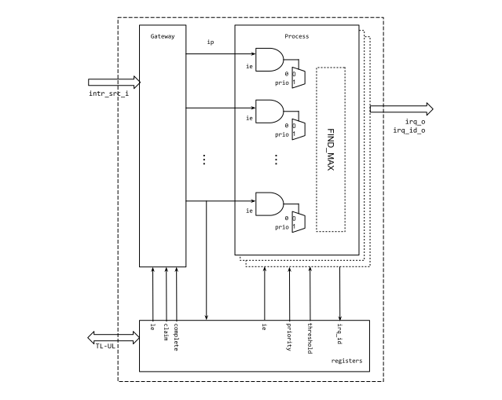

# Overview

This document specifies the Interrupt Controller (RV_PLIC) functionality. This
module conforms to the
[Comportable guideline for peripheral functionality]().
See that document for integration overview within the broader top level system.


## Features

- RISC-V Platform-Level Interrupt Controller (PLIC) compliant interrupt controller
- Support arbitrary number of interrupt vectors (up to 255) and targets
- Support interrupt enable, interrupt status registers
- Memory-mapped MSIP register per HART for software interrupt control.

## Description

The RV_PLIC module is designed to manage various interrupt sources from the
peripherals. It receives interrupt events as either edge or level of the
incoming interrupt signals (``intr_src_i``) and can notify multiple targets.

## Compatibility

The RV_PLIC is compatible with any RISC-V core implementing the RISC-V privilege specification.

# Theory of Operations

## Block Diagram



## Hardware Interfaces



## Design Details

### Identifier

Each interrupt source has a unique ID assigned based upon its bit position
within the input `intr_src_i`. ID ranges from 0 to N, the number of interrupt
sources. ID 0 is reserved and represents no interrupt. The bit 0 of
`intr_src_i` shall be tied to 0 from the outside of RV_PLIC. The
`intr_src_i[i]` bit has an ID of `i`. This ID is used when targets "claim" the
interrupt and to "complete" the interrupt event.

### Priority and Threshold

Interrupt sources have configurable priority values. The maximum value of the
priority is configurable through the localparam `MAX_PRIO` in the rv_plic
top-level module. For each target there is a threshold value ( for
target 0). RV_PLIC notifies a target of an interrupt only if it's priority is
strictly greater than the target's threshold. Note this means an interrupt with
a priority is 0 is effectively prevented from causing an interrupt at any target
and a target can suppress all interrupts by setting it's threshold to the max
priority value.

`MAX_PRIO` parameter is most area contributing option in RV_PLIC. If `MAX_PRIO`
is big, then finding the highest priority in Process module may consume a lot of
logic gates.

### Interrupt Gateways

The Gateway observes incoming interrupt sources and converts them to a common
interrupt format used internally by RV_PLIC. It can be configured to detect
interrupts events on an edge (when the signal changes from **0** to **1**) or
level basis (where the signal remains at **1**).

When the gateway detects an interrupt event it raises the interrupt pending bit
() for that interrupt source. When an interrupt is claimed by a target the
relevant bit of  is cleared. A bit in  will not be reasserted until the
target signals completion of the interrupt. Any new interrupt event between a
bit in  asserting and completing that interrupt is ignored. In particular
this means that for edge triggered interrupts if a new edge is seen after the
source's  bit is asserted but before completion, that edge will be ignored
(counting missed edges as discussed in the RISC-V PLIC specification is not
supported).

Note that there is no ability for a level triggered interrupt to be cancelled.
If the interrupt drops after the gateway has set a bit in , the bit will
remain set until the interrupt is completed. The SW handler should be conscious
of this and check the interrupt still requires handling in the handler if this
behaviour is possible.

### Interrupt Enables

Each target has a set of Interrupt Enable ( for target 0) registers. Each
bit in the  registers controls the corresponding interrupt source. If an
interrupt source is disabled for a target, then interrupt events from that
source won't trigger an interrupt at the target. RV_PLIC doesn't have a global
interrupt disable feature.

### Interrupt Claims

"Claiming" an interrupt is done by a target reading the associated
Claim/Completion register for the target ( for target 0). The return value
of the  read represents the ID of the pending interrupt that has the
highest priority.  If two or more pending interrupts have the same priority,
RV_PLIC chooses the one with lowest ID. Only interrupts that that are enabled
for the target can be claimed. The target priority threshold doesn't matter
(this only factors into whether an interrupt is signalled to the target) so
lower priority interrupt IDs can be returned on a read from . If no
interrupt is pending (or all pending interrupts are disabled for the target) a
read of  returns an ID of 0.

### Interrupt Completion

After an interrupt is claimed, the relevant bit of interrupt pending () is
cleared, regardless of the status of the `intr_src_i` input value.  Until a
target "completes" the interrupt, it won't be re-asserted if a new event for the
interrupt occurs. A target completes the interrupt by writing the ID of the
interrupt to the Claim/Complete register ( for target 0). The write event
is forwarded to the Gateway logic, which resets the interrupt status to accept a
new interrupt event. The assumption is that the processor has cleaned up the
originating interrupt event during the time between claim and complete such that
`intr_src_i[ID]` will have de-asserted (unless a new interrupt has occurred).


{ signal: [
  { name: 'clk',           wave: 'p...........' },
  { name: 'intr_src_i[i]', wave: '01....0.1...', node:'.a....e.f...'},
  { name: 'irq_o',         wave: '0.1.0......1', node:'..b.d......h'},
  { name: 'irq_id_o',      wave: '=.=.=......=',
                           data: ["0","i","0","i"] },
  { name: 'claim',         wave: '0..10.......', node:'...c........'},
  { name: 'complete',      wave: '0.........10', node:'..........g.'},
  ],
  head:{
    text: 'Interrupt Flow',
    tick: 0,
  },
}


In the example above an interrupt for source ID `i` is configured as a level
interrupt and is raised at a, this results in the target being notified of the
interrupt at b. The target claims the interrupt at c (reading `i` from it's
Claim/Complete register) so `irq_o` deasserts though `intr_src_i[i]` remains
raised.  The SW handles the interrupt and it drops at e. However a new interrupt
quickly occurs at f. As complete hasn't been signaled yet `irq_o` isn't
asserted. At g the interrupt is completed (by writing `i` to it's
Claim/Complete register) so at h `irq_o` is asserted due to the new interrupt.


# Programmers Guide

## Initialization

After reset, RV_PLIC doesn't generate any interrupts to any targets even if
interrupt sources are set, as all priorities and thresholds are 0 by default and
all ``IE`` values are 0. Software should configure the above three registers and the
interrupt source type  .

 and  ..  registers are unique. So, only one of the targets
shall configure them.

```c
// Pseudo-code below
void plic_init() {
  // Set to level-triggered for interrupt sources
  for (int i = 0; i < ceil(N_SOURCE / 32); ++i) {
    *(LE + i) = 0;
  }

  // Configure priority
  // Note that PRIO0 register doesn't affect as intr_src_i[0] is tied to 0.
  for (int i = 0; i < N_SOURCE; ++i) {
    *(PRIO + i) = value(i);
  }
}

void plic_threshold(tid, threshold) {
  *(THRESHOLD + tid) = threshold;
}

void plic_enable(tid, iid) {
  // iid: 0-based ID
  int offset = ceil(N_SOURCE / 32) * tid + (iid >> 5);

  *(IE + offset) = *(IE + offset) | (1 << (iid % 32));
}
```

## Handling Interrupt Request Events

If software receives an interrupt request, it is recommended to follow the steps
shown below (assuming target 0 which uses  for claim/complete).

1. Claim the interrupts right after entering to the interrupt service routine
   by reading the  register.
2. Determine which interrupt should be serviced based on the values read from
   the  register.
3. Execute ISR, clearing the originating peripheral interrupt.
4. Write Interrupt ID to 
5. Repeat as necessary for other pending interrupts.

It is possible to have multiple interrupt events claimed. If software claims one
interrupt request, then the process module advertises any pending interrupts
with lower priority unless new higher priority interrupt events occur. If a
higher interrupt event occurs after previous interrupt is claimed, the RV_PLIC
IP advertises the higher priority interrupt. Software may utilize an event
manager inside a loop so that interrupt claiming and completion can be
separated.

~~~~c
void interrupt_service() {
  uint32_t tid = /* ... */;
  uint32_t iid = *(CC + tid);
  if (iid == 0) {
    // Interrupt is claimed by one of other targets.
    return;
  }

  do {
    // Process interrupts...
    // ...

    // Finish.
    *(CC + tid) = iid;
    iid = *(CC + tid);
  } while (iid != 0);
}
~~~~

## Device Interface Functions (DIFs)



## Registers

The register description below matches the instance in the [Earl Grey top level
design]().

A similar register description can be generated with `reg_rv_plic.py` script.
The reason another script for register generation is that RV_PLIC is
configurable to the number of input sources and output targets. To implement it,
some of the registers (see below **IE**) should be double nested in register
description file. As of Jan. 2019, `regtool.py` supports only one nested
multiple register format `multireg`.

The RV_PLIC in the top level is generated by topgen tool so that the number of
interrupt sources may be different.

-   LE: CEILING(N_SOURCE / DW)
    Value 1 indicates the interrupt source's behavior is edge-triggered It is
    used in the gateways module.
-   IE: CEILING(N_SOURCE / DW) X N_TARGET
    Each bit enables corresponding interrupt source. Each target has IE set.
-   PRIO: N_SOURCE
    Universal set across all targets. Lower n bits are valid. n is determined by
    MAX_PRIO parameter
-   THRESHOLD: N_TARGET
    Priority threshold per target. Only priority of the interrupt greater than
    threshold can raise interrupt notification to the target.
-   IP: CEILING(N_SOURCE / DW)
    Pending bits right after the gateways. Read-only
-   CC: N_TARGET
    Claim by read, complete by write


