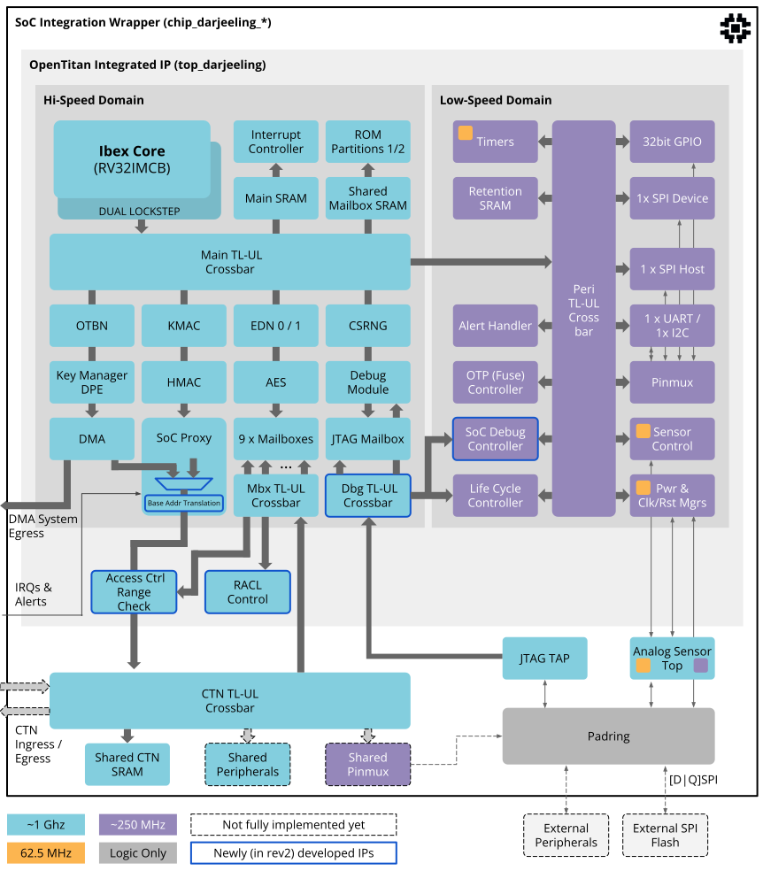

# OpenTitan Darjeeling (Integrated Admissible Architecture) Datasheet

## Overview

OpenTitan Darjeeling is a system-on-a-chip Secure Execution Environment, capable of serving as a root of trust (RoT) for measurement and attestation among other applications, for instantiation within a larger system.
It can serve as the SoC root of trust, a platform root of trust, or even be integrated and leveraged for individual chiplet RoTs.

Darjeeling's block diagram shows the system configuration, including the RISC-V Ibex processor and all of the memories and comportable peripheral IPs.
The system is split into a high speed domain (e.g. 1 GHz clock in a recent process node) and a peripheral domain (e.g. 250 MHz).
The system has support for light sleep only, since the entire root-of-trust is expected to be always-on in an integrated context.

The SoC integration wrapper contains shared infrastructure that can be adapted based on the integrator's needs.
It contains a control network (CTN) crossbar for attaching shared SoC-level peripherals, as well as a large, shared CTN SRAM.

Communication with the SoC is mainly via the mailboxes, DMA and SoC proxy module.
The SoC proxy module serves as a comportable IP frontend for incoming IRQs, reset requests, wake up requests, alerts and the TL-UL egress port into the CTN network.
Egress TL-UL requests are filtered by address checking and binary address translation (BAT) logic that provides flexibility and isolation in the CTN space.
Code can be executed from both internal memories (ROM partitions 1 and 2, main SRAM) and CTN SRAM.

Debug access is established via the JTAG TAP attached to a debug TL-UL crossbar.
Through that, the debug module, life cycle controller, and a JTAG mailbox can be accessed.
The JTAG mailbox can be used to implement firmware-driven SoC-level debug authorization.
Infrastructure signals such as clocks, resets and the entropy source are provided by the analog sensor top (AST) block, which is connected to the Darjeeling-internal power, clock and reset manager blocks.
The sensor control block provides a comportable IP front-end for the AST block that the Ibex processor can interact with.

The following table provides a more detailed summary of the supported features:

<table>
<thead style='font-size:100%'>
  <tr>
    <th colspan="2">OpenTitan Darjeeling Features</th>
  </tr>
</thead>
<tbody style='font-size:90%;line-height:110%'>
  <tr>
    <td>
      <ul>
        <li>RV32IMCB RISC-V "Ibex" core:
          <ul>
            <li>3-stage pipeline, single-cycle multiplier</li>
            <li>Support for the full ratified bit manipulation extension and some unratified subsets</li>
            <li>4KiB instruction cache with 2 ways</li>
            <li>RISC-V compliant JTAG DM (debug module)</li>
            <li>PLIC (platform level interrupt controller)</li>
            <li>U/M (user/machine) execution modes </li>
            <li>Enhanced Physical Memory Protection (ePMP)</li>
            <li>Security features:
              <ul>
                <li>Low-latency memory scrambling on the icache</li>
                <li>Dual-core lockstep configuration</li>
                <li>Data independent timing</li>
                <li>Dummy instruction insertion</li>
                <li>Bus and register file integrity</li>
                <li>Hardened PC</li>
              </ul>
            </li>
          </ul>
        </li>
          
        <li>Security peripherals:
          <ul>
            <li>AES-128/192/256 with ECB/CBC/CFB/OFB/CTR modes</li>
            <li>HMAC / SHA2-256</li>
            <li>KMAC / SHA3-224, 256, 384, 512, [c]SHAKE-128, 256</li>
            <li>Programmable big number accelerator for RSA and ECC (OTBN)</li>
            <li>NIST-compliant cryptographically secure random number generator (CSRNG)</li>
            <li>Entropy source, with FIPS- and CC-compliant health checks, which can be bypassed depending on the properties of the connected digital noise source</li>
            <li>Key manager with DICE & DPE support</li>
            <li>Manufacturing life cycle manager</li>
            <li>Alert handler for handling critical security events</li>
            <li>OTP controller with access controls and memory scrambling</li>
            <li>Flash controller with access controls and memory scrambling</li>
            <li>ROM and SRAM controllers with low-latency memory scrambling</li>
          </ul>
        </li>
      </ul>
    </td>
    <td>
      <ul>
        <li>Memory:
          <ul>
            <li>1 MiB shared CTN SRAM (in wrapper)</li>
            <li>64KiB main SRAM</li>
            <li>4KiB retention SRAM</li>
            <li>32KiB ROM partition 1</li>
            <li>64KiB ROM partition 2</li>
            <li>16KiB (=128 kibit) OTP</li>
          </ul>
        </li>
          
        <li>IO peripherals:
          <ul>
            <li>32 bit GPIO</li>
            <li>1x UART</li>
            <li>1x I2C with host and device modes</li>
            <li>1x SPI host with 1 chip select</li>
            <li>1x SPI device</li>
            <li>9x DOE Mailboxes</li>
            <li>1x JTAG Mailbox</li>
            <li>1x DMA Controller</li>
            <li>1x SoC Proxy module for external alerts and interrupt requests</li>
          </ul>
        </li>
          
        <li>Other peripherals:
          <ul>
            <li>Clock, reset and power management</li>
            <li>Fixed-frequency timer</li>
            <li>Watchdog (always-on timer)</li>
          </ul>
        </li>
          
        <li>Software:
          <ul>
            <li>Boot ROM code implementing secure boot, including owner-approved second signing, and chip configuration</li>
            <li>Bare metal top-level tests</li>
            <li>OpenTitan Crypto Library with OTBN accelerated standard algorithms for </li>
            <ul>
              <li>RSA 2K, 3K, 4K</li>
              <li>ECC with NIST P256/P384, Brainpool P256r1 or X25519/Ed25519</li>
              <li>SHA2-256, 384, 512</li>
            </ul>
            <li>SPHINCS+ PQ-secure boot using a stateless hash-based signatures scheme</li>
            <li>SPDM responder application</li>
          </ul>
        </li>
      </ul>
    </td>
  </tr>
</tbody>
</table>

## Discrete Earl Grey Differences

The Darjeeling configuration derived from the OpenTitan's discrete "Earl Grey" has been extended to meet the requirements for an SoC-integrated RoT.
The main processing elements and cryptographic features are significantly similar, while several unneeded IO peripherals in an integrated context have been removed. A set of new IP blocks have been developed to enable integration into a larger SoC.
These blocks are highlighted with a blue in the block diagram, and include:

- An [extended key manager block](https://github.com/lowRISC/opentitan/blob/integrated_dev/hw/ip/keymgr_dpe/README.md) with support for TCG’s DICE Protection Environment (DPE)
- A [DMA controller](https://github.com/lowRISC/opentitan/blob/integrated_dev/hw/ip/dma/doc/theory_of_operation.md) facilitating data exchange between the OpenTitan IP and the SoC
- A [mailbox IP](https://github.com/lowRISC/opentitan/blob/integrated_dev/hw/ip/mbx/README.md) with TL-UL bus interface and configurable shared memory region
- A SoC proxy module that serves as a comportable fronted for external interrupts, alerts and the like

## Development Status

OpenTitan Darjeeling is currently developed on a side branch named [opentitan/integrated_dev](https://github.com/lowRISC/opentitan/blob/integrated_dev), which will be consolidated with [opentitan/master](https://github.com/lowRISC/opentitan/blob/master) at a later date.

Certain functions and blocks remain under active development.
Contributions are welcome, but this design is provided as-is.

- DV and and SoC wrapper infrastructure is being developed to enable the debug crossbar.
- The binary translation logic and the SoC DFx control module are under development. The former will allow for granular filtering and remapping of TL-UL requests, while the latter will provide SoC level gating functionality for DFT and debug infrastructure.
- Crossbar generation support at the SoC-integration is not yet mature, so some TL-UL connections have not been made at this point.

Since Darjeeling was derived from the discrete "Earl Grey" chip, several legacy structures are temporarily present.

- The pinmux and padring will eventually be removed.
- The always-on / non-always-on power and clock domain split from "Earl Grey" will eventually be removed. This is evident in the current clock and reset tree organization.
- The JTAG TAP has not been fully unified yet (i.e., the life cycle controller and debug module still have two separate TAPs).
