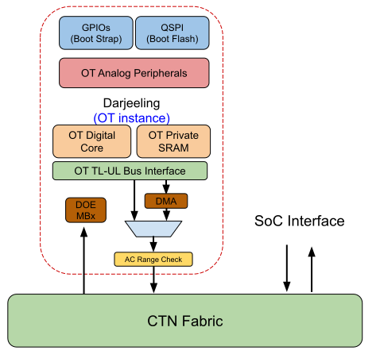

# Access Control Range Check (AC Range Check)

The System on Chip (SoC) must implement differentiated security access controls for shared memory regions located outside of the Root of Trust (RoT).
To facilitate access to these memory regions, a dedicated TL-UL port is provided, connecting to the Control Network (CTN) fabric.
This document outlines the requirements for a framework, referred to as Access Control Range Check (AC Range Check).
In the proposed architecture, the AC Range Check mechanism intercepts the outgoing TL-UL bus, ensuring that only valid and authorized addresses are accessed.
Adding the AC Range Check on the TL-UL bus will likely introduce a flop stage to meet the timings, which will cause a cycle of delay for bus initiators to receive their response.

## Comparison to IOPMP

AC Range checks on the memory bus shares similarities with an I/O Peripheral Memory Protection (IOPMP) in that both mechanisms control access to memory regions, ensuring that only authorized transactions pass through.
Like an IOPMP, AC ranges define specific address spaces and enforce permissions, preventing unauthorized access.
However, AC range checks offer a simpler implementation and verification process.

## Parameterizable Range Registers

The AC range check IP shall support a configurable number of range registers, allowing a flexible and granular security configuration.
The number of range registers shall be parameterizable at design time for every instance of the IP to accommodate different use cases and system requirements, providing scalability based on system size and complexity.
A typical configuration would be between 16 and 32 ranges, but the design should not be limited to those bounds.

## Range Configuration

Each range register shall be configured by the following mechanism:

* **Base/Limit Register** (Top-of-Range Matching):
  * The range is defined using a base address and an upper limit address, where the base represents the starting address and the limit represents the end of the range.

The limit register should be sufficiently large to cover the whole 32-bit address space.
Each range register shall also be associated with a set of permissions that determine the allowed access types within that range.
The permission options shall include:

* **READ:** Allows read access within the range.
* **WRITE:** Allows write access within the range.
* **EXECUTE:** Allows to execute code from this range.

If all, READ, WRITE, and EXECUTE are cleared any access to that range shall be denied.

## Request Matching and Permissions

Incoming access requests (e.g., memory reads or writes) shall be compared against all enabled range registers.
Each request shall be evaluated for a match based on its address and the configured ranges.
The matching process includes:

* **Address Match:** The request's address is checked against the ranges defined by the enabled range registers (top-of-range matching).
* **Permission Check:** For each matching range, the permissions associated with that range (READ, WRITE) are checked against the type of access requested.
* **RACL Check:** For each matching range, the RACL policy associated with that range (read_perm, write_perm) is checked against the source role of the access requested.
RACL is specified in Integrated OpenTitan: Register Access Control (RACL).

## Access Policy

The following policy governs the handling of access requests based on the outcome of the range and permission matching:

* **Allowed Access:** If an incoming request matches an enabled range and the corresponding permission allows the requested operation (READ or WRITE), the request is granted, and the transaction proceeds normally.
* **Denied Access:** If the request does not match any range or matches a range but the configured permission denied the requested operation, the TL-UL response shall return an error, i.e., setting `d_error = 1` when acknowledging the request.
Further, the request is denied as follows:
  * **Write Requests** Denied write requests shall be dropped, meaning no write operation is performed.
  * **Read/Execute Requests:** Denied read/execute requests shall return a zero value as a response.

Range register 0 may be used as a configurable default policy to match the whole address space.
Subsequent range configuration may overwrite this policy to allow a different behavior.
See Priority of Matching for the priority based address matching.

## Priority of Matching

If a request matches multiple ranges with conflicting permissions, the following priority shall be enforced:

* If multiple ranges allow the operation, the first matching range (based on register configuration order) shall determine the access rights.

## Error Logging and Interrupt Mechanism

To ensure proper tracking and response to unauthorized access attempts, the system shall implement an error logging mechanism that monitors denied access requests across all configured ranges.

### Global Denied Access Counter

* A **global counter** shall be maintained to track the total number of denied access requests across all enabled range registers in the system.
* The counter increments by one each time a request is denied, regardless of whether the denial results from a READ or WRITE operation.
* The counter saturates once it reaches the programmed threshold.

### Programmable Denied Access Threshold

* The system shall support a programmable threshold that specifies the maximum number of denied access requests before triggering a further action.
* Once the number of denied accesses reaches or exceeds this threshold, the system shall raise an interrupt to the RoT.
* Acknowledging the interrupt automatically clears the denied access counter.

To facilitate detailed diagnostics, the system shall implement a logging mechanism for the first denied access request.
This log captures key information to help identify the cause and context of the denial.

### First Denied Access Log

Upon the **first denied request**, the system shall record the following information:

* **Range Index:** Identifies the specific range responsible for denying the request. If the access is denied because no range matches, it is logged in a dedicated status bit.
* **Access Type:** Indicates whether the request was a READ, WRITE, or EXECUTE operation.
* **RACL role:** Indicates the RACL role of th request and an indicator if a RACL read or write check caused the denial.
* **Access Address:** Logs the exact address that the request attempted to access.

### Single Event Logging

* This logging mechanism is triggered only for the first denied access after a reset or after the log has been cleared, ensuring that only the initial violation is captured for diagnostics.
* Subsequent denied requests will not overwrite the log, preserving the information of the first event until manually cleared by the RoT.
The log is cleared automatically when the interrupt is acknowledged or manually by writing a configuration bit.

## Enable/Disable Control and Lock Mechanism

Each range register shall include both an enable/disable control bit and a lock mechanism.
The following controls apply:

* **Enable/Disable** Control: Each range register can be enabled or disabled individually.
Disabled range registers shall not participate in the matching process and shall have no effect on access control decisions.
* **Lock Mechanism:** Once a range register is configured, a lock can be asserted to prevent further modification of the range's configuration.
When the lock is active, the base, mask/limit, and permission settings of the range register are immutable and cannot be altered until the system is reset.

## Bypass Mode

The system shall support a bypass mode controlled via a bypass_wire signal.
The bypass_signal shall be driven by a 8-bit encoded multi-bit encoded signal in the ROT-controlled register space.
A single bypass_signal shall manage access override for all source AC range registers within the system.

When the bypass_wire is asserted, the range register logic shall allow access for all transactions, overriding any existing configuration settings.
This includes ignoring permission restrictions such as READ, WRITE, or  EXECUTE and RACL checks, ensuring all transactions are permitted while bypass mode is active.

The bypass mode may be used during early silicon bring-up or debugging phases, where reducing the security due to disabled range filters is acceptable.
