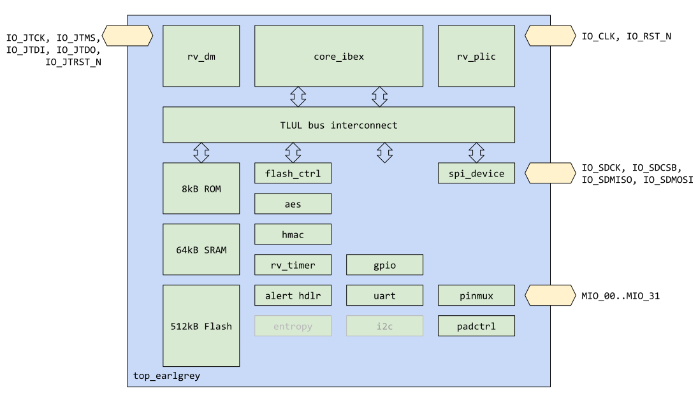
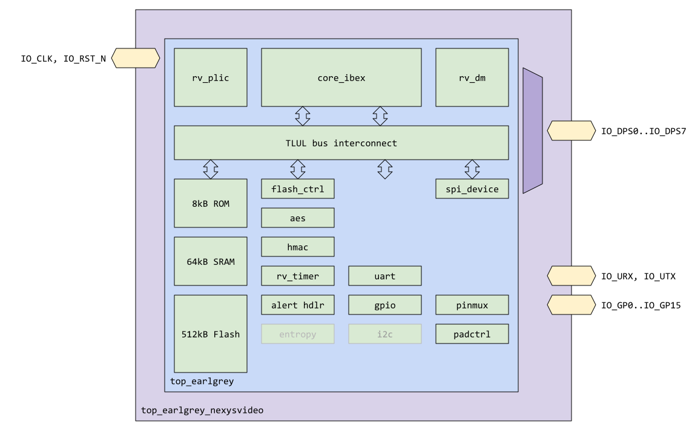

# Overview


This document specifies the top level functionality of the "Earl Grey" chip (`top_earlgrey`).
This version of the chip specification is intended to be kept up to date with the current content of the project repository, but might lag or contain *coming soon* placeholders.
This is not a specification of the final implementation.

## Features

- RISC-V microprocessor ("Ibex") and associated JTAG IO. Related features:
  - DM (debug module)
  - PLIC (platform level interrupt controller)
  - U/M execution modes (user/machine)
- Memory contents
  - 512kB emulated eFlash for code and data storage
  - 64kB SRAM for data storage
  - 16kB ROM for secure boot code storage
- Security peripherals
  - Flash controller
  - AES module with support for ECB, CBC, CFB, OFB and CTR modes of operation
  - SHA-256/HMAC module
  - Basic alert responder
  - (coming soon) emulated TRNG entropy source
- IO peripherals
  - 32 multiplexable IO pads with pin multiplexing unit and pad control
  - One UART peripheral (using multiplexable IO)
  - GPIO peripheral (using multiplexable IO)
  - (coming soon) I2C host (using multiplexable IO)
  - SPI device (using fixed IO)
- Other peripherals
  - Fixed-frequency timer
- clock and reset IO and management
- Software
  - Boot ROM implementing code signing of e-flash contents
  - Bare metal applications and validation tests

## Description

The netlist `top_earlgrey` contains the features listed above, proving basic functionality of the Ibex RISC-V processor core on an FPGA development environment, with a suite of peripherals and memories.
The functionality as specified at this point in time is an incomplete subset of the final functionality required to meet OpenTitan root of trust goals.
This specification will continue to grow to add those features as the contents of the repository are updated.

The center of the Earl Grey design is the Ibex RISC-V compliant processor.
The code for Ibex is developed in its own [lowRISC repo](http://github.com/lowrisc/ibex), and is [*vendored in*]() to this repository.
Surrounding Ibex is a suite of *Comportable* peripherals that follow the [Comportability Guidelines]() for lowRISC peripheral IP.
Each of these IP has its own specification.
See the table produced in the [hardware documentation page]() for links to those specifications.

At this time, the top-level netlist for earlgrey is a combination of hand-written SystemVerilog RTL with auto-generated sections for wiring of comportability interfaces.
There is a script for this auto-generation, centered around the top-level descriptor file `top_earlgrey.hjson` found in the repository.
A full definition of this descriptor file, its features, and related scripting is forthcoming.
This tooling generates the interconnecting crossbar (via `TLUL`) as well as the instantiations at the top level.
It also feeds into this document generation to ensure that the chosen address locations are documented automatically using the data in the source files.

# Theory of Operations

This section discusses some operational details on `top_earlgrey`.
It should first be **NOTED** that there is some subtlety on the notion of hierarchy within the top level.
There is netlist automation to create the module `top_earlgrey` as indicated in sections of this specification that follow.
**On top** of that module, hierarchically in the repo, are top level instantiation targets directed towards a particular use case.
This includes `top_earlgrey_nexsysvideo` for use in FPGA, and `top_earlgrey_asic` for use (eventually) in a silicon implementation.
These top level targets will include the actual pads as needed by the target platform.
At the time of this writing the two are not in perfect synchronization, but the intention will be for them to be as identical as possible.
Where appropriate, including the block diagram below, notes will be provided where the hierarchy subtleties are explained.

## Block Diagram

The block diagram of `top_earlgrey` (the auto-generated module) is shown below.



In this diagram, the instantiation of the Ibex processor and all of the memories and comportable IPs are shown.
The IO shown at this level are the internal signals between the IP and the pads instantiated at the target top level netlist.

In the block diagram below, the target netlist `top_earlgrey_nexsysvideo` is shown, including the FPGA pad names created.



In this diagram, pads for clock and reset are shown, as well as pads for JTAG, SPI device, UART, and GPIO.
In this platform, at the moment, the logic for the JTAG and the SPI device are multiplexed within `top_earlgrey_nexsysvideo`.
This is done for ease of programming by the external host.
In addition, at the moment, the UART pins and GPIO pins are separated out from the multipurpose `MIO` pins.
This will change as software and scripting matures and pin selection is defined more efficiently.

## Hardware Interfaces

Below are the expected hardware interfaces of the autogenerated `top_earlgrey` netlist.
These are the internal signals between that module and the pads of the platform netlist.
**Note** in the current design the UART pins bypass the `pinmux` module and its `MIO` related signals, and have their own direct signals to pads.

| Signal Name | Direction | Description |
| --- | --- | --- |
| `clk_i` | input | Chip level functional clock |
| `rst_ni` | input | Chip level reset, active low |
| `jtag_tck_i` | input | JTAG Clock |
| `jtag_tms_i` | input | JTAG Test Mode Select |
| `jtag_td_i` | input | JTAG Test Data In |
| `jtag_td_o` | output | JTAG Test Data Out |
| `jtag_trst_ni` | input | JTAG Test Reset |
| `dio_spi_device_sck_i` | input | SPI device clock |
| `dio_spi_device_csb_i` | input | SPI device chip select |
| `dio_spi_device_sdi_i` | input | SPI device input data |
| `dio_spi_device_sdo_o` | output | SPI device output data |
| `dio_spi_device_sdo_en_o` | output | SPI device output enable |
| `dio_uart_rx_i` | input | UART input receive data |
| `dio_uart_tx_o` | output | UART output transmit data |
| `dio_uart_tx_en_o` | output | UART output transmit output enable |
| `mio_in_i[31:0]` | input | Multiplexible input pins (currently only connected to GPIO) |
| `mio_out_o[31:0]` | output | Multiplexible output pins (currently only connected to GPIO) |
| `mio_oe_o[31:0]` | output | Multiplexible output enables (currently only connected to GPIO) |

Below are the hardware interfaces of the FPGA target `top_earlgrey_nexsysvideo` netlist.

| Signal Name | Direction | Description |
| --- | --- | --- |
| `IO_CLK`    | input  | Chip level functional clock |
| `IO_RST_N`  | input  | Chip level reset, active low |
| `IO_DPS0`   | input  | Muxed functionality: JTAG `TCK` and `spi_device_sck_i` |
| `IO_DPS1`   | input  | Muxed functionality: JTAG `TDI` and `spi_device_sdi_i` |
| `IO_DPS2`   | output | Muxed functionality: JTAG `TDO` and `spi_device_sdo_o` |
| `IO_DPS3`   | input  | Muxed functionality: JTAG `TMS` and `spi_device_csb_i` |
| `IO_DPS4`   | input  | JTAG `TRST_N` |
| `IO_DPS5`   | input  | JTAG `SRST_N` |
| `IO_DPS6`   | input  | Muxed select: 0 = JTAG, 1 = `spi_device` |
| `IO_DPS7`   | input  | Bootstrap pin for software |
| `IO_URX`    | input  | UART RX |
| `IO_UTX`    | output | UART TX |
| `IO_GP0` .. `IO_GP15` | inout  | 16 GPIO pins connected to `MIO` pins |

## Design Details

This section provides some details for the processor and the peripherals.
See their representative specifications for more information.
This section also contains a brief overview of some of the features of the final product.

### Clocking and Reset

In the current version of the chip, clock and reset come from outside the device.
Eventually these will be generated internally to reduce risk of security attack, but internal clock generation is not implemented at this time.
The clock pin is `IO_CLK` and all of the design is synchronous to this one clock.
(Exceptions are peripheral IO that might be synchronized to a local peripheral clock like JTAG TCK or SPI device clock).

Deassertion of the active low reset pin `IO_RST_N` causes the processor to come out of reset and begin executing code at its reset vector.
The reset vector begins in ROM, whose job is to validate code in the emulated e-flash before jumping to it.
The assumption is that the code has been instantiated into the e-flash before reset is released.
This can be done with JTAG commands (see that section), through virtual assignment in verification, or through the `spi_device` peripheral.
Resets throughout the design are asynchronous active low as per the Comportability specification.
Other resets may be generated internally via the alert responder, watchdog timer, etc., and other resets for subunits may be disseminated.
These will be detailed in this section over time.

### Main processor (`core_ibex`)

The main processor (`core_ibex`) is a small and efficient, 32-bit, in-order RISC-V core with a 2-stage pipeline that implements the RV32IMC instruction set architecture.
It was initially developed as part of the [PULP platform](https://www.pulp-platform.org) under the name "Zero-riscy" [\[1\]](https://doi.org/10.1109/PATMOS.2017.8106976), and has been contributed to [lowRISC](https://www.lowrisc.org) who maintains it and develops it further.
See the [core_ibex specification](https://ibex-core.readthedocs.io/en/latest/) for more details of the core.
In addition to the standard RISC-V functionality, Ibex implements M (machine) and U (user) mode per the RISC-V standard.
Attached to the Ibex core are a debug module (DM) and interrupt module (PLIC).

#### JTAG / Debug module

One feature available for Earl Grey processor core is debug access.
By interfacing with JTAG pins, logic in the debug module allows the core to enter debug mode (per RISC-V 0.13 debug spec), and gives the design the ability to inject code either into the device - by emulating an instruction - or into memory.
Full details can be found in the [rv_dm specification]().

#### Interrupt Controller

Adjacent to the Ibex core is an interrupt controller that implements the RISC-V PLIC standard.
This accepts a vector of interrupt sources within the device, and assigns leveling and priority to them before sending to the core for handling.
See the details in the [rv_plic specification]().

#### Performance

Ibex currently achieves a [CoreMark](https://www.eembc.org/coremark/) per MHz of 2.36 on the earlgrey verilator system.
Performance improvements are ongoing, including the following items being considered:

1. Adding a new ALU to calculate branch targets to remove a cycle of latency on taken conditional branches (currently the single ALU is used to compute the branch condition then the branch target the cycle following if the branch is taken).
2. A 3rd pipeline stage to perform register writeback, this will remove a cycle of latency from all loads and stores and prevent a pipeline stall where a response to a load or store is available the cycle after the request.
3. Implement a single-cycle multiplier.
4. Produce an imprecise exception on an error response to a store allowing Ibex to continue executing past a store without waiting for the response.

The method for including these features, e.g. whether they will be configurable options or not, is still being discussed.

The Ibex documentation has more details on the current pipeline operation, including stall behaviour for each instruction in the [Pipeline Details](https://ibex-core.readthedocs.io/en/latest/03_reference/pipeline_details.html) section.

The CoreMark performance achieved relies in part on single-cycle access to instruction memory.
An instruction cache is planned to help maintain this performance when using flash memory that will likely not have single-cycle access times.

CoreMark was compiled with GCC 9.2.0 with flags: `-march=rv32imc -mabi=ilp32 -mcmodel=medany -mtune=sifive-3-series -O3 -falign-functions=16 -funroll-all-loops -finline-functions -falign-jumps=4 -mstrict-align`

### Memory

The device contains three memory address spaces for instruction and data.

Instruction ROM (16kB) is the target for the Ibex processor after release of external reset.
The ROM contains hard-coded instructions whose purpose is to do a minimal subset of platform checking before checking the next stage of code.
The next stage - a boot loader stored in embedded flash memory - is the first piece of code that is not hard-coded into the silicon of the device, and thus must be signature checked.
The ROM executes this signature check by implementing a RSA-check algorithm on the full contents of the boot loader.
The details of this check will come at a later date.
For verification execute-time reasons, this RSA check will be overridable in the FPGA and verification platforms (details TBD).
This is part of the *Secure Boot Process* that will be detailed in a security section in the future.

Earl Grey contains 512kB of emulated embedded-flash (e-flash) memory for code storage.
This is intended to house the boot loader mentioned above, as well as the operating system and application that layers on top.
At this time there is no operating system provided; applications are simple proof of concept code to show that the chip can do with a bare-metal framework.

Embedded-flash is the intended technology for a silicon design implementing the full OpenTitan device.
It has interesting and challenging parameters that are unique to the technology that the silicon is implemented in.
Earl Grey, as an FPGA proof of concept, will model these parameters in its emulation of the memory in order to prepare for the replacement with the silicon flash macros that will come.
This includes the read-speeds, the page-sized erase and program interfaces, the two-bank update scheme, and the non-volatile nature of the memory.
Since by definition these details can't be finalized until a silicon technology node is chosen, these can only be emulated in the FPGA environment.
We will choose parameters that are considered roughly equivalent of the state of the art embedded-flash macros on the market today.

Details on how e-flash memory is used by software will be detailed in future Secure Boot Process and Software sections over time.

The intent is for the contents of the embedded flash code to survive FPGA reset as it would as a NVM in silicon.
Loading of the FPGA with initial content, or updating with new content, is described in other software specifications.
The SPI device peripheral is provided as a method to bulk-load e-flash memory.
The processor debug port (via JTAG) is also available for code loading.
See those specifications for more details.

Also included is a 64kB scratch pad SRAM available for data storage (stack, heap, etc.) by the Ibex processor.
It is also available for code storage, though that is not its intended purpose.

The base address of the ROM, Flash, and SRAM are given in the address map section later in this document.

### Peripherals

Earl Grey contains a suite of "peripherals", or subservient execution units connected to the Ibex processor by means of a bus interconnect.
Each of these peripherals follows an interface scheme dictated in the
[Comportability Specification.]()
That specification details how the processor communicates with the peripheral (via TLUL interconnect); how the peripheral communicates with the chip IO (via fixed or multiplexable IO); how the peripheral communicates with the processor (interrupts); and how the peripheral communicates security events (via alerts).
See that specification for generic details on this scheme.

The peripherals included within Earl Grey for at this time give some basic outside-world communication, the beginnings of a security roadmap for the device, internal housekeeping, and processor control.
These are described briefly for each peripheral below.
Where available today, detailed specifications will be linked, or one can find an up-to-date list at the [hardware landing page]().
In other cases, the details will come as the peripherals are fully specified.
The address for each of the peripherals will be given at the end of this document in an auto-generate address map based upon the source configuration files for Earl Grey.

#### Chip IO Peripherals

##### Pin Multiplexor (`pinmux`) and Pad Control (`padctrl`)

**TODO: this section needs to be updated to reflect the pinmux/padctrl merger**

The pin multiplexor's purpose is to route between peripherals and the available multiplexable IO (`MIO_00 .. MIO_31`) of the chip.
At this time, the pin multiplexor is provided, but it is not used to its full potential.
In addition, the `padctrl` device manages control or pad attributes like drive strength, technology (OD, OS, etc), pull up, pull down, etc., of the chip's external IO.
At this time, the `padctrl` module is provided, but not yet wired up.
It is notable that there are many differences between an FPGA implementation of Earl Grey and an ASIC version when it comes to pins and pads.
For both, the `pinmux` and `padctrl` are expected to play the same role.
Their effect, however, over things like drive strength and Open Drain technology are highly platform-dependent, and are not finalized at this time.

Both `pinmux` and `padctrl` are themselves peripherals on the TLUL bus, with collections of registers that provide software configurability.
See the [pinmux specification]() for how to connect peripheral IO to chip IO and for information on pad control features.

##### UART

The chip contains one UART peripheral that implement single-lane duplex UART functionality.
The outputs and inputs can be configured to any chip IO via the pinmux.
(Exception: in the current design the UART pins are directly connected to their own pin IO.)
See the
[UART specification]()
for more details on this peripheral.

##### GPIO

The chip contains one GPIO peripheral that creates 32 bits of bidrectional communication with the outside world via the pinmux.
Via pinmux any of the 32 pins of GPIO can be connected to any of the 32 MIO chip pins, in any direction.
See the [GPIO specification]() for more details on this peripheral.
See the [pinmux specification]() for how to connect peripheral IO to chip IO.

##### SPI device

The SPI device implements Firmware Mode, a feature that provides the ability for external drivers to send firmware upgrade code into a bank of embedded flash memory for in-field firmware updates.
Firmware mode has no addressing, and at the moment no other addressing modes are provided, though future improvements will include the ability to address internal Earl Grey memory through SPI transactions.

See the [SPI device specification]() for more details on the Firmware Mode implementation.

##### I2C host

In order to be able to command I2C devices on systems where Earl Grey will be included, I2C host functionality will be required.
This will include standard, full, and fast mode, up to 1Mbaud.
More details of the I2C host module will come in a later specification update.
The pins of the I2C host will be available to connect to any of the multiplexable IO (MIO) of the Earl Grey device.
More than one I2C host module might be instantiated in the top level.

#### Security Peripherals

The netlist contains a few functionality-only security peripherals and subsystems to head towards the full silicon security architecture required for the final OpenTitan device.
A security section will follow later to show how these work together.

##### AES

[AES](https://nvlpubs.nist.gov/nistpubs/fips/nist.fips.197.pdf)
is the primary
[symmetric encryption](https://en.wikipedia.org/wiki/Symmetric-key_algorithm)
and decryption mechanism used in OpenTitan protocols.
AES runs with key sizes of 128b, 192b, or 256b.
The module can select encryption or decryption of data that arrives in 16 byte quantities to be encrypted or decrypted using different block cipher modes of operation.
It supports [ECB mode](https://en.wikipedia.org/wiki/Block_cipher_mode_of_operation#ECB), [CBC mode](https://en.wikipedia.org/wiki/Block_cipher_mode_of_operation#CBC), [CFB mode](https://en.wikipedia.org/wiki/Block_cipher_mode_of_operation#CFB), [OFB mode](https://en.wikipedia.org/wiki/Block_cipher_mode_of_operation#OFB) and [CTR mode](https://en.wikipedia.org/wiki/Block_cipher_mode_of_operation#CTR).
For this version, all data transfer is processor-available, i.e. key and data material is passed into the module via register writes.
Future versions might have provisions for private transfer of key and data material to reduce exposure from potentially untrusted processor activity.
This version does not attempt to add any side-channel or fault-injection resistance into the design.

In short, this version of AES is a functional proof of concept of the algorithm that will be augmented to its final hardened state for silicon implementation purposes.

Details on how to write key and data material into the peripheral, how to initiate encryption and decryption, and how to read out results, are available in the [AES specification]().

##### SHA-256/HMAC

SHA-256 is the primary
[hashing algorithm](https://en.wikipedia.org/wiki/Cryptographic_hash_function)
used in OpenTitan protocols.
SHA-256 is a member of the
[SHA-2](https://en.wikipedia.org/wiki/SHA-2)
family of hashing algorithms, where the digest (or hash output) is of 256b length, regardless of the data size of the input to be hashed.
The data is sent into the SHA peripheral after declaring the beginning of a hash request (effectively zeroing out the internal state to initial conditions), 32b at a time.
Once all data has been sent, the user can indicate the completion of the hash request (with optional partial-word final write).
The peripheral produces the hash result available for register read by the user.
All data transfer is processor-available, i.e. data is passed into the module via register writes.
Future versions will have provisions for private transfer of data to reduce exposure from potentially untrusted processor activity.
This version does not attempt to add any side-channel or fault-injection resistance into the design.
Future versions will begin to add in such countermeasures.

[HMAC](https://en.wikipedia.org/wiki/HMAC)
is a message authentication protocol layered on top of a hashing function (in this case SHA-256), mixing in a secret key for cryptographic purposes.
HMAC is a particular application of appending the secret key in a prescribed manner, twice, around the hashing (via SHA-256) of the message.
It is a stretch goal to add HMAC functionality on top of the SHA-256 functionality for the Earl Grey SHA-256 peripheral.
For this functionality, a 256b key must be programmed into the module before the message hash can begin.
Otherwise the interface to the peripheral is as described above.
The timing of authentication completion varies, being longer in latency than native SHA-256.
The similar commentary about the security of data transfer on SHA-256 above applies to HMAC, especially as regards the secret key.
Details on how to write key and data material into the peripheral, how to initiate hashing / authentication, and how to read out results, are available in the [SHA/HMAC specification]().

##### Alert Handler

Alerts, as defined in the [Comportability Specification](), are defined as security-sensitive interrupts that need to be handled in a timely manner to respond to a security threat.
Unlike standard interrupts, they are not solely handled by software.
Alerts trigger a first-stage request to be handled by software in the standard mode as interrupts, but trigger a second-stage response by the alert handler if software is not able to respond.
This ensures that the underlying concern is guaranteed to be addressed if the processor is busy, wedged, or itself under attack.

Each peripheral has an option to present a list of individual alerts, representing individual threats that require handling.
These alerts are sent in a particular encoding method to the alert handler module, itself a peripheral on the system bus.
See the details of the [alert handler specification]() for more information.

At this time, the alert handler module is not wired into the top level.

##### TRNG entropy source (coming soon)

Randomness is a critical part of any security chip.
It provides variations in execution that can keep attackers from predicting when the best time is to attack.
It provides secret material used for identity and cryptographic purposes.
It can be seeded into algorithmic computation to obscure sensitive data values.
In short, it is a source of critical functionality that must be designed to be truly random, but also free from attack itself.

Most
[TRNG](https://en.wikipedia.org/wiki/Hardware_random_number_generator)s
(True Random Number Generators) are analog designs, taking advantage of some physical event or process that is non-deterministic.
Example designs rely on metastability, electronic noise, timing variations, thermal noise, quantum variation, etc.
These are then filtered and sent into a pool of entropy that the device can sample at any time, for whatever purposes are needed.
The creation, filtering, storage, protection, and dissemination of the randomness are all deep topics of intense research in their own right.
Since the design is likely to be an analog design tied to the final chosen silicon technology process, our FPGA implementation can only approximate the results.
We can however fully specify the software interface to the TRNG in a digital wrapper.

The primary interface to the entropy pool is a read request of available random bits.
The TRNG interface can indicate how many bits are available, and then software can read from this pool, if available.
Reading of entropy that is not available should immediately trigger an interrupt or an alert.
In FPGA we can emulate the randomness with something akin to a
[PRBS](https://en.wikipedia.org/wiki/Pseudorandom_binary_sequence).

At this time, more details on the TRNG and its entropy source are not available.

#### Other peripherals

##### Timer(s)

Timers are critical for operating systems to ensure guaranteed performance for users.
To some level they are even required by the RISC-V specification.
At this time, one timer is provided, a 64b free running timer with a guaranteed (within a certain percentage) frequency.
A second one acting as a watchdog timer that can be used to backstop the processor in the case of it being unresponsive (usually due to development code that is wedged, rather than for instance due to security attack) will be provided in the future.
The goal is for both of these to be satisfied with the same timer module.

The specification for the timer can be found [here]().

##### Flash Controller

The final peripheral discussed in this release of the netlist is an emulated flash controller.
As mentioned in the memory section, up to 512kB of emulated embedded flash is available for code and data storage.
The primary read path for this data is in the standard memory address space.
Writes to that address space are ignored, however, since one can not write to flash in a standard way.
Instead, to write to flash, software must interact with the flash controller.

Flash functionality include three primary commands: read, erase, and program.
Read, as mentioned above, is standard, and uses the chip memory address space.
Erase is done at a page level, where the page size is parameterizable in the flash controller.
Upon receiving an erase request, the flash controller wipes all contents of that page, rendering the data in all `1`s state (`0xFFFFFFFF` per word).
Afterwards, software can program individual words to any value.
It is notable that software can continue to attempt to program words even before another erase, but it is not physically possible to return a flash bit back to a `'1'` state without another erase.
So future content is in effect an AND of the current content and the written value.

```
next_value = AND(current_value, write_word)
```

Erase and program are slow.
A typical erase time is measured in milliseconds, program times in microseconds.
The flash controller peripheral in this release approximates those expected times.

Security is also a concern, since secret data can be stored in the flash.
Some memory protection is provided by the flash controller.
For more details see the [flash controller module specification]().

### Interconnection

Interconnecting the processor and peripheral and memory units is a bus network built upon the TileLink-Uncached-Light protocol.
See the [OpenTitan bus specification]() for more details.

## Register Table

The base and bound addresses of the memory and peripherals are given in this table below.
This is cut/paste at the moment, and will be automated into this document in the future.

The choice of memory, or lack thereof at location 0x0 confers two exclusive benefits:
- If there are no memories at location 0x0, then null pointers will immediately error and be noticed by software (the xbar will fail to decode and route)
- If SRAM is placed at 0, accesses to data located within 2KB of 0x0 can be accomplished with a single instruction and thus reduce code size.

For the purpose of `top_earlgrey`, the first option has been chosen to benefit software development and testing

| Item | base address | bound address |
| --- | --- | --- |
| `ROM`        | `0x00008000` | `0x0000bfff` |
| `SRAM`       | `0x10000000` | `0x1000ffff` |
| `Flash`      | `0x20000000` | `0x2007ffff` |
| `uart`       | `0x40000000` | `0x4000ffff` |
| `gpio`       | `0x40010000` | `0x4001ffff` |
| `spi_device` | `0x40020000` | `0x4002ffff` |
| `flash_ctrl` | `0x40030000` | `0x4003ffff` |
| `rv_timer`   | `0x40040000` | `0x4004ffff` |
| `rv_plic`    | `0x40090000` | `0x4009ffff` |
| `aes`        | `0x40110000` | `0x4011ffff` |
| `hmac`       | `0x40120000` | `0x4012ffff` |
| `debug_ram`  | `0x1a110000` | `0x1a11ffff` |

## References
1. [Schiavone, Pasquale Davide, et al. "Slow and steady wins the race? A comparison of
 ultra-low-power RISC-V cores for Internet-of-Things applications."
 _27th International Symposium on Power and Timing Modeling, Optimization and Simulation
 (PATMOS 2017)_](https://doi.org/10.1109/PATMOS.2017.8106976)
