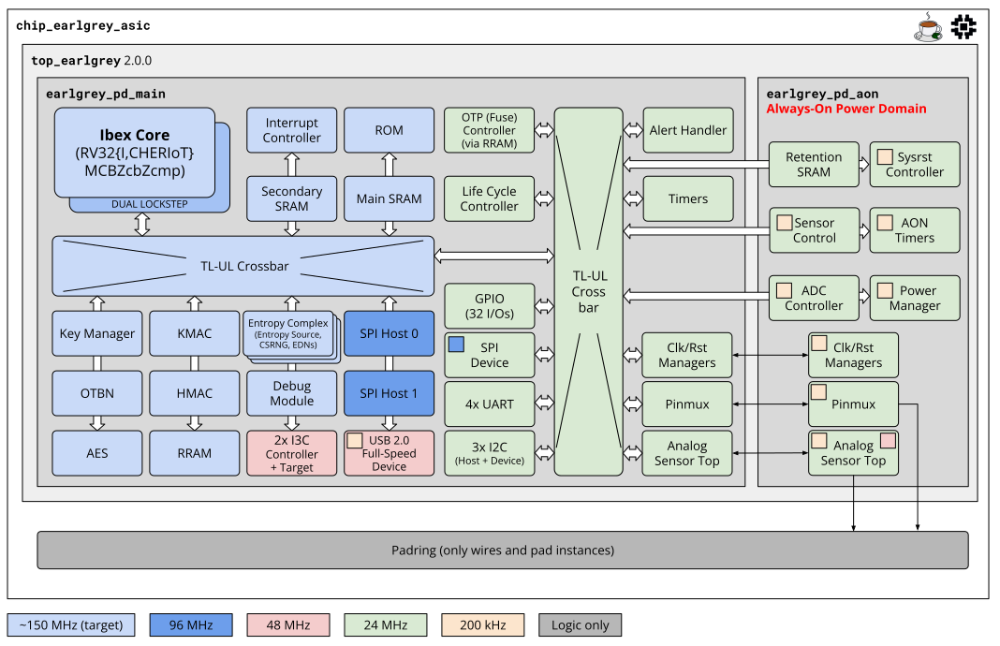

# OpenTitan Earl Grey 2 (Discrete Chip) Datasheet

**NOTE**: This datasheet refers to Earl Grey 2, i.e., the second generation of the discrete
OpenTitan chip design currently being developed on the [`master` branch](https://github.com/lowRISC/opentitan).
For the datasheet of the taped out Earl Grey design, i.e., the
first production OpenTitan silicon, refer to the documentation for the [`earlgrey_1.0.0` branch](https://github.com/lowRISC/opentitan/tree/earlgrey_1.0.0) [available here](https://opentitan.org/earlgrey_1.0.0/book/doc/introduction.html).

# Overview

**Earl Grey 2** is **OpenTitan's next-generation discrete secure microcontroller** architecture.
It's primary goals are
1. significantly enhanced support for **hardened Post-Quantum Cryptography (PQC)**,
2. support for **next-generation I/O standards**,
3. support for implementation in **recent silicon technologies**, replacing embedded Flash and fuses with **Resistive RAM (RRAM)** as on-chip non-volatile memory, and
4. support **CHERIoT** as switchable base ISA in addition to RV32I.

# Key Features

The OpenTitan Earl Grey 2 architecture supports the following key features:

<table>
<thead style='font-size:100%'>
  <tr>
    <th colspan="2">OpenTitan Earl Grey 2 Features</th>
  </tr>
</thead>
<tbody style='font-size:90%;line-height:110%'>
  <tr>
    <td>
      <ul>
        <li><b>Ibex 32-bit RISC-V CPU core</b> (RV32IMCB_Zicntr_Zicsr_Zifencei_ Zihpm_Zcb_Zcmp_Zbc_Zbkb_Zbkx):
          <ul>
            <li>3-stage pipeline: instruction fetch, decode and execute, writeback</li>
            <li>RV32I base ISA: version 2.1, active after reset</li>
            <li>CHERIoT base ISA: version v1.0, can be switched to once (i.e., no way back to RV32I until reset)</li>
            <li>M (integer multiplication and division) extension: version 2.0, single-cycle multiplier</li>
            <li>C (compressed instructions) extension: version 2.0</li>
            <li>ZcbZcmp (code size reduction) extensions: version 1.0.0</li>
            <li>Bit manipulation extensions:
              <ul>
                <li>version 1.0.0 of Zba_Zbb_Zbs (B)</li>
                <li>version 1.0.0 of Zbc_Zbkb_Zbkc_Zbkx</li>
              </ul>
            </li>
            <li>Smepmp: enhanced physical memory protection (ePMP) version 1.0, 16 entries, 4 byte minimum granularity</li>
            <li>Execution modes: M (machine), U (user)</li>
            <li>PLIC (platform level interrupt controller)</li>
            <li>Instruction cache:
              <ul>
                <li>4 KiB capacity</li>
                <li>2-way set associative</li>
                <li>64 instruction bit + 14 ECC bit per entry</li>
              </ul>
            </li>
            <li>Hardware Security features:
              <ul>
                <li>Dual-core lockstep configuration</li>
                <li>Integrity checks on register file (RF), instruction cache, and bus interfaces</li>
                <li>Hardened program counter (PC)</li>
                <li>Data-independent timing can be enabled in a CSR: Zkt extension plus branches</li>
                <li>Dummy instruction insertion</li>
                <li>Hardened PC</li>
                <li>Instruction cache scrambled with low-latency cipher</li>
              </ul>
            </li>
          </ul>
        </li>
          
        <li><b>Memories</b>:
          <ul>
            <li>128 KiB Main SRAM
              <ul>
                <li>intended use: general-purpose data (e.g., heap, stack) storage</li>
                <li>32 data bit + 7 ECC bit per architectural row</li>
                <li>CHERIoT support: full address range usable to store CHERIoT capabilities that can be revoked at a granularity of 8 bytes</li>
                <li>CHERIoT implementation: tag bits (2 KiB) and revocation bits (2 KiB) stored in the CHERIoT meta SRAM</li>
                <li>scrambling of address and data with reduced-round PRINCE cipher</li>
                <li>hardened against FI attacks with a readback mechanism</li>
              </ul>
            </li>
            <li>64 KiB Secondary SRAM
              <ul>
                <li>intended use: general-purpose data (e.g., heap, stack) storage</li>
                <li>32 data bit + 7 ECC bit per architectural row</li>
                <li>CHERIoT support: full address range usable to store CHERIoT capabilities that can be revoked at a granularity of 8 bytes</li>
                <li>CHERIoT implementation: tag bits (1 KiB) and revocation bits (1 KiB) stored in the CHERIoT meta SRAM</li>
                <li>scrambling of address and data with reduced-round PRINCE cipher</li>
                <li>hardened against FI attacks with a readback mechanism</li>
              </ul>
            </li>
            <li>8 KiB Always-On (AON) Retention SRAM
              <ul>
                <li>intended use: retain data during deep sleep</li>
                <li>32 data bit + 7 ECC bit per architectural row</li>
                <li>scrambling of address and data with reduced-round PRINCE cipher</li>
                <li>hardened against FI attacks with a readback mechanism</li>
              </ul>
            </li>
            <li>2 MiB on-chip non-volatile memory (RRAM)
              <ul>
                <li>128 data bit per architectural row</li>
                <li>vendor-implemented ECC</li>
                <li>scrambling of address and data with XEX tweakable block cipher</li>
                <li>OTP emulation</li>
                <li>CHERIoT support: full address range usable to store CHERIoT capabilities that cannot be revoked</li>
                <li>CHERIoT implementation: tag bits (32 KiB) stored in the CHERIoT meta SRAM</li>
              </ul>
            </li>
            <li>2 KiB one-time programmable (OTP) memory (stored in RRAM)
              <ul>
                <li>logically partitioned with support for scrambling, read locking, write locking, integrity protection, and zeroization</li>
              </ul>
            </li>
            <li>192 KiB ROM for Ibex CPU
              <ul>
                <li>scrambling of address and data with reduced-round PRINCE cipher</li>
              </ul>
            </li>
            <li>32 KiB OTBN data memory
              <ul>
                <li>256 data bit + 56 ECC bit per architectural row</li>
                <li>scrambling of address and data with reduced-round PRINCE cipher</li>
              </ul>
            </li>
            <li>16 KiB OTBN data memory
              <ul>
                <li>32 data bit + 7 ECC bit per architectural row</li>
                <li>scrambling of address and data with reduced-round PRINCE cipher</li>
              </ul>
            </li>
            <li>38 KiB CHERIoT meta SRAM
              <ul>
                <li>This stores the CHERIoT tag and revocation bits for the Main SRAM and the Secondary SRAM and the CHERIoT tag bits for the RRAM.</li>
                <li>In CHERIoT mode, this SRAM is only accessible by software as far as required and permitted by the CHERIoT specification.</li>
                <li>In non-CHERIoT mode, this SRAM is not accessible by software.</li>
              </ul>
            </li>
          </ul>
        </li>
          
          
      </ul>
    </td>
    <td>
      <ul>
        <li><b>Security hardware IP blocks</b>:
          <ul>
            <li>AES-128/192/256
              <ul>
                <li>ECB/CBC/CFB/OFB/CTR modes in hardware</li>
                <li>GCM mode through software on Ibex</li>
                <li>key sideload interface from Key Manager</li>
                <li>first-order SCA masking</li>
                <li>FI countermeasures on the control path</li>
              </ul>
            </li>
            <li>SHA2/HMAC-256/384/512
              <ul>
                <li>HMAC key length up to 1024 bit</li>
                <li>state save & restore (context switch)</li>
                <li>key sideload interface from Key Manager</li>
                <li>first-order SCA masking</li>
                <li>FI countermeasures on the control path</li>
              </ul>
            </li>
            <li>KMAC/SHA3-224/256/384/512/[c]SHAKE-128/256
              <ul>
                <li>KMAC key length up to 512 bit</li>
                <li>state save & restore (context switch) only on SW interface</li>
                <li>key sideload interface from Key Manager</li>
                <li>first-order SCA masking</li>
                <li>FI countermeasures on the control path</li>
              </ul>
            </li>
            <li>OpenTitan Big Number Accelerator (OTBN)
              <ul>
                <li>programmable accelerator for asymmetric cryptography including PQC, elliptic curve cryptography (ECC), and RSA</li>
                <li>key sideload interface from Key Manager</li>
                <li>supports hardened PQC (ML-DSA and ML-KEM) with SIMD instructions, masking accelerator (secure add and A2B/B2A mask conversions), and an interface to KMAC</li>
              </ul>
            </li>
            <li>Entropy complex
              <ul>
                <li>Entropy Source</li>
                <li>CSRNG with state save & restore (context switch)</li>
                <li>Entropy Distribution Network (EDN)</li>
              </ul>
            </li>
            <li>Key Manager
              <ul>
                <li>supporting DICE including the DICE Protection Environment (DPE) extension</li>
                <li>attestation chain with four stages: UDS0, UDS1 (including seed provided by Silicon Owner, which is stored in OTP, as HW binding value), CDI0, and CDI1</li>
                <li>sealing chain with four stages (ladder advancements symmetrical to attestation chain)</li>
                <li>4 internal key slots</li>
                <li>key sideloading to IPs:
                  <ul>
                    <li>512 bit to OTBN for PQC key material</li>
                    <li>512 bit to HMAC</li>
                    <li>256 bit to KMAC</li>
                    <li>256 bit to AES</li>
                  </ul>
                </li>
              </ul>
            </li>
            <li>Alert Handler</li>
            <li>Life Cycle Controller</li>
          </ul>
        </li>
          
        <li><b>IO hardware IP blocks</b>:
          <ul>
            <li>2x I3C Controller + Target (on muxed pins, restricted pin sets, tightly controlled timing)
              <ul>
                <li>Signaling modes: HDR-DDR (24 Mbps), SDR (12   Mbps)</li>
                <li>Programmed I/O (PIO) mode implementation of   Host Controller Interface (HCI)</li>
                <li>Transfer Command Response Interface (TCRI)</li>
                <li>In-band interrupts (IBI)</li>
                <li>Message buffer: 1024 entries x 32 bit</li>
                <li>Device Address Table (DAT): 32 entries x 52 bit  </li>
                <li>Device Characteristics Table (DCT): 32 entries   x 72 bit</li>
                <li>Virtual targets: 2 (per instance)</li>
                <li>Extra output signal controlling external   resistor for SDA pull-up in Controller mode</li>
              </ul>
            </li>
            <li>1x USB 2.0 Full-Speed (12 Mbps) Device (on fixed pins) with support for Test Packet mode and improved recovery from invalid traffic</li>
            <li>2x SPI Host (1 on fixed pins, 1 on muxed pins)
              <ul>
                <li>SPI Host 0:
                  <ul>
                    <li>Quad SPI</li>
                    <li>SCK at 48 MHz max (96 MHz internally)</li>
                    <li>fixed pins</li>
                    <li>3 chip select (1 on fixed pin, 2 on muxed pins)</li>
                    <li>Passthrough mode from SPI Device</li>
                  </ul>
                </li>
                <li>SPI Host 1:
                  <ul>
                    <li>Quad SPI</li>
                    <li>SCK at 48 MHz max (96 MHz internally)</li>
                    <li>muxed pins (restricted pin sets, tightly controlled timing)</li>
                    <li>3 chip select (on muxed pins)</li>
                  </ul>
                </li>
              </ul>
            </li>
            <li>1x SPI Device (on fixed pins)
              <ul>
                <li>Passthrough mode to SPI Host 0 on fixed pins</li>
                <li>2 chip select (1 on fixed pin, 1 on muxed pin)</li>
              </ul>
            </li>
            <li>3x I2C (on muxed pins)</li>
            <li>4x UART (on muxed pins)</li>
            <li>32x GPIO (on muxed pins)</li>
            <li>Pin Multiplexer</li>
            <li>ADC Controller</li>
            <li>System Reset Controller</li>
          </ul>
        </li>
          
        <li><b>Chip control hardware IP blocks</b>:
          <ul>
            <li>Clock, reset and power managers</li>
            <li>Fixed-frequency timers</li>
            <li>Always-On (AON) timer</li>
          </ul>
        </li>
          
        <li><b>Software</b>:
          <ul>
            <li>Boot ROM code implementing secure boot and chip configuration</li>
            <li>Bare metal top-level tests</li>
            <li>OpenTitan Crypto Library with OTBN accelerated and security hardened algorithms for </li>
            <ul>
              <li>ML-DSA-87 Sign, Verify, Keygen</li>
              <li>RSA 2K, 3K, 4K</li>
              <li>ECDSA-{P256,P384}, ECDH-{P256,P384}, Ed25519, X25519</li>
            </ul>
            <li>ML-DSA-87 PQ-secure boot</li>
          </ul>
        </li>
      </ul>
    </td>
  </tr>
</tbody>
</table>

# Silicon Technology

- Non-volatile on-chip memory: Resistive RAM (RRAM)
- No OTP macro; OTP to be emulated by connecting OTP Controller to new RRAM Controller instead of an OTP macro
- Target frequency for main/fast clock domain: ~150 MHz
- I/O clock domains frequency:
  - IO: 96 MHz
  - IO_DIV2: 48 MHz
  - IO_DIV4: 24 MHz
  - USB: 48 MHz
- Always-on clock domain frequency: 200 kHz

# Detailed Specification

For more detailed documentation including the pinout and system address map, see [OpenTitan Earl Grey Chip Specification](./design/README.md).
The [OpenTitan Earl Grey Chip DV Document](../dv/README.md) describes the chip-level DV environment and contains the chip-level test plan.
