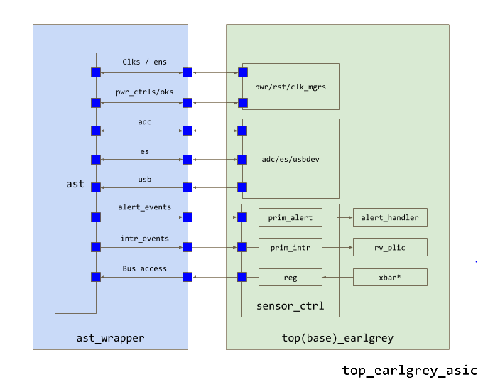

# Analog Sensor Top Technical Specification

Analog Sensor Top, also known as the AST, is the OpenTitan analog and
security companion. Within the AST are various analog functions (such as
clocks, regulators, random number generators) needed to make the device
function, as well as physical security sensors necessary to protect the
device from physical attacks or manipulation.

At a high level, AST communicates with a number of OpenTitan comportable
modules. See the diagram below for an overview.



In the following sections, each family of connections is briefly
described and explained. Note, the analog connections to AST are not
shown in the diagram, but will be explained as well.

# Interface Signals Table

See the table [here](./doc/interfaces.md).

# Interfaces Description Note

The information below augments the [Interface Signals Table](./doc/interfaces.md).
For further details, see the corresponding signals description in the
table.

# Power Connectivity

Note: Power signals may not appear in the verilog files, however, they
are described for completeness.

## External Supplies

AST has four external power supplies VCC, AVCC, VIOA and VIOB. VCC is
the main supply, AVCC is an analog VCC supply. VIOA and VIOB are two
additional I/O supplies.

## Core Supplies

The core supplies are generated from the VCC supply. There are two core
supply domains: VCMAIN and VCAON. VCAON, as its name implies, is the
always-on core supply used to power components that stay active during
device low power states. VCMAIN on the other hand, powers most chip
logic such as RISC-V processor, crypto modules and almost all memories
and peripherals. The VCMAIN supply can be turned off when requested,
VCAON on the other hand, is active whenever VCC is active. AST core
logic is powered by VCAON.

# Power Control and Reset

## Core Power Control and Indication

VCMAIN is the only supply that can be directly influenced by OpenTitan.
The power manager can request VCMAIN to shutdown through main_pd_ni. The
state of VCMAIN is reflected by the vcmain_pok_o signal.

## IO Power Indication

IO power state is reflected to OpenTitan by vioa_pok_o and viob_pok_o
signals

## Main (VCC) Power Detection and Flash Protection

On VCC power-down detection, 'flash_power_ready_h_o', is
immediately negated. In addition, SYS clock, IO clock and USB clock are
stopped. This means that negation of the VCC supply always triggers the
flash brown-out (BOR) protection circuitry.

When entering deep-sleep mode, 'flash_power_down_h_o' is
asserted before negating VCMAIN until VCMAIN is back up.

## Resets

The AST supports the generation of the root reset for the reset manager.
It is driven by 'vcaon_pok_o' which is generated inside AST.
The 'vcaon_pok_o' is activated when the following conditions
are met: VCC is detected, internal voltage regulator is active and
'por_ni' reset input is inactive. 'por_ni' is
driven by an external chip reset pin. The following table and diagrams
describe the AST sub-modules resets.

| **Components**                                   | **Reset by**             | **Comments**                                                                                                                             |
|--------------------------------------------------|--------------------------|------------------------------------------------------------------------------------------------------------------------------------------|
| Regulators, 'power-OK' logic and always-on clock | self-start / vcaon_pok_o | These circuits come to life shortly after VCC crosses its detection threshold. vcaon_pok_o serves as their register configuration reset. |
| System/USB/IO clock generators                   | vcmain_pok_o             | vcmain_pok_o is also fed by vcaon_pok_o and por_ni.                                                                                      |
| Interface functions                              | Input reset              | Per the corresponding interface [<u>clock domain reset input</u>](#clock-and-reset-inputs).                                              |

# Clock Outputs

AST generates four clocks: System clock, IO clock, USB clock and
Always-on clock. Most clocks have 'enable' inputs and a
corresponding 'valid' output. When the enable is
de-asserted, the corresponding clock stops and valid is dropped to 0.
When the enable is asserted, the clocks begin outputting in a
'glitchless' manner and the valid is raised to 1. Unless
noted otherwise, clocks duty cycle is 50% +/-5%. At boot time, clocks
start toggling at a different (typically slower) frequency than their
target. They are configured to their target frequency by the ROM code.
Once configured, their frequency is maintained within +/-3% of their
target as long as the chip remains in its intended operating conditions
until the next boot.

The OpenTitan power and clock managers are responsible for manipulating
the enables and observing the valids to know when clocks can be safely
released to the system.

## USB Clock Calibration

The USB clock requires an accuracy that cannot be achieved by the AST
clocks natively. As a result, information from USB frames are used to
[<u>calibrate the
clock</u>](../../../ip/usbdev/README.md#clocking).

# Clock and Reset Inputs

The root clocks and resets are generated inside AST. However, the clocks
go through gating and optional division in the OpenTitan top level and
propagate back into AST as feedback clocks, each with associated
synchronized reset de-assertion to ensure it can synchronize with the
various comportable modules. The input resets are used for the different
AST interface functions. For further details about AST resets, see
[<u>Resets</u>](#resets) section.

Note: There are several reasons for routing leaf clocks back into AST
instead of using the root clocks directly

- The leaf clocks may be divided down from the root clock and that
 frequency is used to drive the interface. For example,
 clk_src_io_clk_o is 96MHz, but comportable modules use either 48MHz
 or 24MHz.

- The leaf clocks and root clocks have very different clock tree depths
 and may be difficult for timing closure if they interacted directly.

- Decouple AST internal design from OpenTitan top-level interfaces clock
 and reset selection.

# Register Access Interface

AST registers can be accessed via TL-UL interface. These registers are
used for test and calibration purposes and are not required for runtime
operation. See the [<u>Interface Signals
Table</u>](#interface-signals-table) for more details.

## AST registers initialization during boot.

In PROD*/DEV Lifecycle states, the ROM code must copy all AST REGA
registers values from OTP to AST. During other Lifecycle states, the ROM
code may also copy all AST REGA registers. It is recommended for the
ROM code to condition the copy by a digest verification of the register
values. If such a digest is too complicated, a simple tag can be used to
condition the copy instead. The AST register copy operation must be
performed in order and must include all REGA registers (starting from
REGA0 and ending at the last REGA). AST sets the ast_init_done_o signal
after the copy completion.

After the copy, ROM code can either poll for ast_init_done_o assertion
with 100 us timeout (in practice, it should take way less) or ignore it
and let the next SW layers handle it. It is recommended to set an OTP
field for determining the ROM code action.

The boot code is expected to check all AST output alert signals before
handing over the control to the next code layer (ROM_EXT). The ROM code
response per alert should be defined in a dedicated OTP space.
Recommended response types (per alert):

1.  Do nothing and don't clear the event

2.  Do nothing (continue to the next SW layer) and clear the event

3.  Log the event in some NV space and halt

4.  Halt immediately

Note that in TEST_UNLOCK*/RMA state, the booter should always act per
#1 regardless of the OTP setting.

It is recommended to redundantly code the OTP fields that control the
ROM code branching and also to protect the branching code from fault
injection.

# ADC

AST contains an analog to digital converter that can be used to sample
various input signals. For OpenTitan this will primarily be used for
[<u>debug cable detection</u>](https://www.sparkfun.com/products/14746).
To activate the ADC, the corresponding [<u>comportable
module</u>](../../../ip/adc_ctrl/README.md) must first
activate the ADC through 'adc_pd_i'. Once activated, it should select
the channel to sample. Channel transition from zero to non-zero value
starts the ADC conversion. The ADC output is synchronous to the ADC
controller.

## ADC Usage Flow

1.  Activate the ADC by negating 'adc_pd_i'

2.  Wait 30 uS for the ADC to wake up.

3.  Select an analog channel to measure by setting the corresponding bit
 in 'adc_chnsel_i' bus. This triggers a measurement.

4.  Wait until 'adc_d_val' is set and read the result via
 'adc_d_o'

5.  Clear 'adc_chnsel_i' bus to 0. Note that adc_chnsel must
 be cleared to 0 before a new channel is selected.

6.  Repeat steps 3-5 if more channels or more measurements are required

7.  Deactivate the ADC by setting 'adc_pd_i' to save power.

```wavejson
{ signal: [ {node: '.a..b........', phase:0.2},
{name: 'adc_pd_i' , wave: '10|..|.....|....|..1'}, {name:
'clk_ast_adc_i', wave: 'p.|..|.....|....|...'}, {name:
'adc_chnsel_i' , wave: '0.|.3|..04.|....|0..'}, {name:
'adc_d_val_o' , wave: '0.|..|.1.0.|.1..|.0.'}, {name: 'adc_d_o' ,
wave: 'x.|..|.3.x.|.4..|.x.', data: ['ch0', 'ch1', 'ch1']}, ],
edge: [ 'a<->b wakeup time', ] }
```

# Random Number Generator

AST contains a random number generator that outputs random number
bitstreams whenever it is enabled. After enabled by the [<u>comportable
controller</u>](../../../ip/entropy_src/README.md)
through 'rng_en_i', the AST begins generating multiple
independent four random bit streams. rng_b_o bit streams are valid and
can be sampled whenever 'rng_val_o' is asserted according to the
following diagram.

```wavejson
{signal: [ {name: 'clk' , wave:
'p.|......|......|......'}, {name: 'rng_enable' , wave:
'01|......|......|......'}, {name: 'rng_valid' , wave:
'0.|..10..|..10..|..10..'}, {name: 'rng_b' , wave:
'x.|..3...|..4...|..5.....', data: ['es0','es1','es2']}, ]}
```

The expected rng_b_o valid output rate is about 50KHz. For more
information on the RNG interface, please see the [<u>OpenTitan entropy
source module</u>](../../../ip/entropy_src/README.md).

# Entropy Consumption

AST consumes entropy for defensive purposes. However, AST does not
consume its raw entropy directly. Instead, AST receives entropy from the
[<u>Entropy Distribution Network
(EDN)</u>](../../../ip/edn/README.md). Note
that entropy_ack and entropy_i are packed into enropy_rsp_i in the
interface. Also note that once entropy_req_o is set, it will remain set
until ack or until reset.

```wavejson
{signal: [

{name: 'clk_ast_es_i' , wave: 'p.|..........'},

{name: 'entropy_req_o' , wave: '01|.0.1.....0'},

{name: 'entropy_ack_i' , wave: '0.|10.1.01..0'},

{name: 'entropy_i' , wave: 'xx|2x.22x222x'},

] }
```

# Countermeasures and Alerts

## Alert Events

AST's sensors and detectors, when triggered, output alert events
to a sensor controller. The event signals are level until acknowledged
by the controller. Further, the events are differentially encoded to
ensure they cannot be hard-wired or faulted to either '1' or
'0'.

Inside the sensor controller, the events are then converted into alerts
as part of the wider [<u>OpenTitan alert handling
system</u>](../../ip_autogen/alert_handler/README.md).

## Alert Signaling

Outgoing alert events are level. Incoming event ack signals clear the
alert event (similar to an interrupt). Outgoing alert events should be
OR'd inside the sensor or power manager (depending on what level of deep
sleep support is needed) to generate wakeup, that way AST does not need
to do any additional handling for wakeups during low power mode.

The AST defines each alert signal in both positive (P) and negative (N)
polarity (see ast_dif_t typedef with 'p' and 'n'
signals), however, the P and N signals are not necessarily fully
differential, for example, at times, it might occur that both P and N
are at the same value. For alert_o case, the correct way to treat it is
to propagate an alert signal if either P is high or N is low.

## Countermeasures

Most countermeasure enablement is controlled by Nuvoton via the
registers interface. Clock jitter is an exception because there is a
reasoning for dynamically turning it on and off (security/performance
tradeoff). Unless stated otherwise, countermeasures are active in all
modes but deep-sleep.
