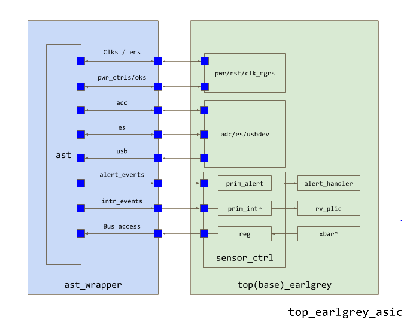
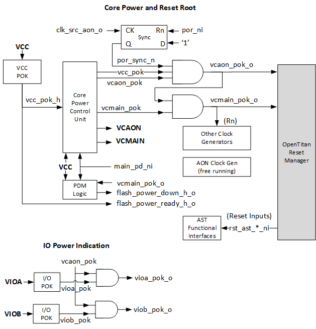
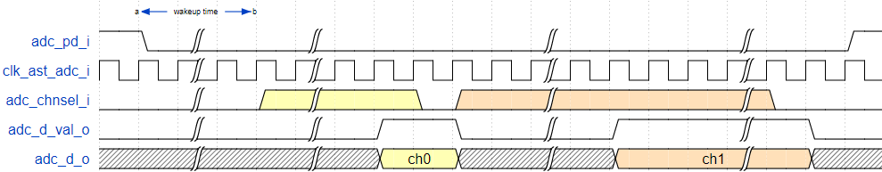
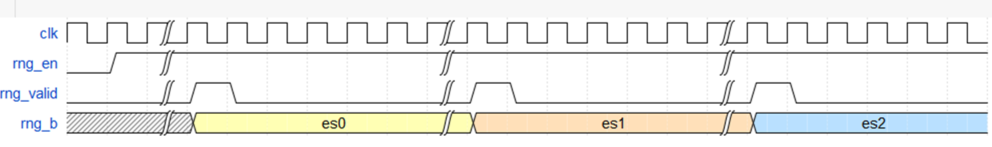
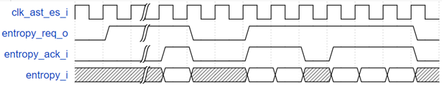

# Overview

AST, also known as the analog sensor top, is the OpenTitan analog and
security companion. Within AST are various analog functions (such as
clocks, regulators, random number generators) needed to make the device
function, as well as physical security sensors necessary to protect the
device from physical attacks or manipulation.

At a high level, AST communicates with a number of OpenTitan comportable
modules. See diagram below.

In the following sections, each family of connection is briefly
described and explained. Note, the analog connections to AST are not
shown in the diagram, but will be explained as well.

# Interface Signals Table

## Table notes

### Signal naming conventions used in this document

It complies with OpenTitan [<u>names
</u>](https://github.com/lowRISC/style-guides/blob/master/VerilogCodingStyle.md#naming)and
[<u>suffixes</u>](https://github.com/lowRISC/style-guides/blob/master/VerilogCodingStyle.md#suffixes)
with some augmentations.

  -  Clock signals start with clk\_\*

  -  Inputs and outputs are marked with \*\_i/\*\_o

  -  Analog signals are marked with \*\_a

  -  Non-core level signals are marked with \*\_h

  -  Dual and negative polarity signals are marked with \*\_p/n

### Clock domains column

  -  sys - system clock, mainly used for high performance and security
     modules. Up to 100MHz

  -  io - peripheral clock source, mainly used for peripherals and I/O
     related functionality. Up to 96MHz (divided by 4 by the clock
     manager)

  -  susb - USB module source clock. 48MHz

  -  aon - Always-on domain clock. The only active clock while chip is
     in deep-sleep power state, 200KHz

  -  async - when listed as async, it means it does not matter what
     domain drives the signal

  -  Input clocks: Each functional interface has a dedicated clock
     named after the interface.

<table>
<thead>
<tr class="header">
<th><strong>Signal Name &amp; Affiliation</strong></th>
<th><strong>I/O</strong></th>
<th><strong>Width</strong></th>
<th><strong>Clock Domain</strong></th>
<th><strong>Description</strong></th>
</tr>
</thead>
<tbody>
<tr class="odd">
<td><strong>Power Supplies</strong></td>
<td></td>
<td></td>
<td></td>
<td></td>
</tr>
<tr class="even">
<td>VCC</td>
<td>I</td>
<td></td>
<td></td>
<td>
VCC is the main power supply. It is driven from an external source and is used to power the internal VCMAIN and VCAON power domains.

VCC must always be present when the device is functioning; VCC is also used to power a number of pads that must be always on when the device is functioning.
</td>
</tr>
<tr class="odd">
<td>AVCC</td>
<td>I</td>
<td></td>
<td></td>
<td>Analog blocks power supply. AVCC and AGND are analog supply and ground signals for the AST analog functions. They mainly serve for ADC and USB clock functionality. AVCC is expected to be driven by the same voltage regulator and have similar power availability as VCC. AVCC and AGND have dedicated package balls/pins. In the future, package pins sharing with VCC and GND may be considered based on post-silicon test results.</td>
</tr>
<tr class="even">
<td>VCMAIN</td>
<td>O</td>
<td></td>
<td></td>
<td>Main core power, driven by internal capless voltage regulator</td>
</tr>
<tr class="odd">
<td>VCAON</td>
<td>O</td>
<td></td>
<td></td>
<td>Core voltage power for always-on domain (same voltage range as VCMAIN)</td>
</tr>
<tr class="even">
<td>VIOA</td>
<td>I</td>
<td></td>
<td></td>
<td>IO supply, powering a set of pads. Unlike VCC, the IO supplies can be turned off by external components and the device will continue to function, the unpowered pads however, become inoperable.</td>
</tr>
<tr class="odd">
<td>VIOB</td>
<td>I</td>
<td></td>
<td></td>
<td>Same as VIOA, but for a different set of pads.</td>
</tr>
<tr class="even">
<td>GND</td>
<td>I</td>
<td></td>
<td></td>
<td>Ground</td>
</tr>
<tr class="odd">
<td>AGND</td>
<td>I</td>
<td></td>
<td></td>
<td>Analog ground (see AVCC for further details)</td>
</tr>
<tr class="even">
<td><strong>Power Control and Reset</strong></td>
<td></td>
<td></td>
<td></td>
<td></td>
</tr>
<tr class="odd">
<td>otp_power_seq_i</td>
<td>I</td>
<td>2</td>
<td>async</td>
<td>Contains the power sequencing signals coming from the OTP macro.</td>
</tr>
<tr class="even">
<td>otp_power_seq_h_o</td>
<td>O</td>
<td>2</td>
<td>async</td>
<td>Contains the power sequencing signals going to the OTP macro (<strong>VCC domain</strong>).</td>
</tr>
<tr class="odd">
<td>flash_power_down_h_o</td>
<td>O</td>
<td>1</td>
<td>async</td>
<td>Connected to flash (<strong>VCC domain</strong>). Used for flash power management.</td>
</tr>
<tr class="even">
<td>flash_power_ready_h_o</td>
<td>O</td>
<td>1</td>
<td>async</td>
<td>Connected to flash (<strong>VCC domain</strong>). Used for flash power management.</td>
</tr>
<tr class="odd">
<td>vcmain_pok_o</td>
<td>O</td>
<td>1</td>
<td>async</td>
<td>Main core power-exist indication. Used by the OpenTitan power manager to determine the state of the main digital supply during power up and power down sequencing.</td>
</tr>
<tr class="even">
<td>vcaon_pok_o</td>
<td>O</td>
<td>1</td>
<td>async</td>
<td>Always-on power-exist indication. Used by the OpenTitan power manager for power-on reset root.</td>
</tr>
<tr class="odd">
<td>vioa_pok_o</td>
<td>O</td>
<td>1</td>
<td>async</td>
<td>VIOA power-exist indications. Used as a power-OK status signal.</td>
</tr>
<tr class="even">
<td>viob_pok_o</td>
<td>O</td>
<td>1</td>
<td>async</td>
<td>VIOB power-exist indication. Used as a power-OK status signal.</td>
</tr>
<tr class="odd">
<td>por_ni</td>
<td>I</td>
<td>1</td>
<td>async</td>
<td>Power on reset input signal to AST. See <a href="#resets"><u>Resets</u></a> section for further details</td>
</tr>
<tr class="even">
<td>main_pd_ni</td>
<td>I</td>
<td>1</td>
<td>aon</td>
<td>Power down enable for main core power 
0: main core power is down (deep-sleep state) 
1: main core power is up 
It may take up to 200 uS from this signal transition to power switching completion by AST (not including boot time and so). Note that flash must be prepared for power down before this signal is asserted.</td>
</tr>
<tr class="odd">
<td>main_iso_en_i</td>
<td>I</td>
<td>1</td>
<td>aon</td>
<td>Isolation enable for main core power (VCMAIN). This signal is fed to AST for any local power clamping needs. This signal is only valid after aon core is available, until then, VCC / AVCC components must take appropriate steps to protect themselves.</td>
</tr>
<tr class="even">
<td><strong>Clock Outputs</strong></td>
<td></td>
<td></td>
<td></td>
<td></td>
</tr>
<tr class="odd">
<td>clk_src_sys_o</td>
<td>O</td>
<td>1</td>
<td>sys</td>
<td>100 MHz clock with jitter (main clock domain). Used as the main system clock.</td>
</tr>
<tr class="even">
<td>clk_src_sys_val_o</td>
<td>O</td>
<td>1</td>
<td>async</td>
<td>System clock valid. Used as "ack" signals for the power manager (TBD - add a link)</td>
</tr>
<tr class="odd">
<td>clk_src_sys_en_i</td>
<td>I</td>
<td>1</td>
<td>aon</td>
<td>System clock enable.</td>
</tr>
<tr class="even">
<td>clk_src_sys_jen_i</td>
<td>I</td>
<td>1</td>
<td>async</td>
<td>System clock jitter enable</td>
</tr>
<tr class="odd">
<td>clk_src_aon_o</td>
<td>O</td>
<td>1</td>
<td>aon</td>
<td>200 KHz clock for always-on domain.</td>
</tr>
<tr class="even">
<td>clk_src_aon_val_o</td>
<td>O</td>
<td>1</td>
<td>async</td>
<td>aon clock valid</td>
</tr>
<tr class="odd">
<td>clk_src_usb_o</td>
<td>O</td>
<td>1</td>
<td>susb</td>
<td>48 MHz clock for USB. To comply with USB full speed clock specification, it supports frequency accuracy of +/-2500 ppm when usb_ref_pulse_i is available and +/-2% otherwise. It may take up to 50 ms for this clock to reach the accuracy target from the time ‘usb_ref_pulse_i’ is available. USB clock calibration interface is further detailed <a href="https://github.com/lowRISC/opentitan/blob/master/hw/ip/usbdev/doc/_index.md#clocking"><u>here</u></a>.</td>
</tr>
<tr class="even">
<td>clk_src_usb_val_o</td>
<td>O</td>
<td>1</td>
<td>async</td>
<td>USB clock valid</td>
</tr>
<tr class="odd">
<td>clk_src_usb_en_i</td>
<td>I</td>
<td>1</td>
<td>aon</td>
<td>USB clock enable</td>
</tr>
<tr class="even">
<td>usb_ref_pulse_i</td>
<td>I</td>
<td>1</td>
<td>usb</td>
<td>USB reference pulse +/-500ppm. When valid, it is expected to pulse every 1ms.</td>
</tr>
<tr class="odd">
<td>usb_ref_val_i</td>
<td>I</td>
<td>1</td>
<td>usb</td>
<td>USB reference valid. This bit serves as a valid signal for the usb_ref_pulse_i signal. It is set to 1 after the first valid usb_ref_pulse_i event is detected and remains high as long as usb_ref_pulse_i continues to behave as expected (per usb_ref_pulse description). Once usb_ref_pulse deviates from its expected behavior, usb_ref_val_i immediately negates to 0 and remains 0 until after the next valid usb_ref_val pulse.</td>
</tr>
<tr class="even">
<td>clk_src_io_o</td>
<td>O</td>
<td>1</td>
<td>io</td>
<td>96 MHz clock with +/-2% frequency accuracy. Used for peripherals that require a fixed frequency, for example SPI and UART</td>
</tr>
<tr class="odd">
<td>clk_src_io_val_o</td>
<td>O</td>
<td>1</td>
<td>async</td>
<td>I/O and timer clock valid. Used as "ack" signals for the power manager (TBD - add a link).</td>
</tr>
<tr class="even">
<td>clk_src_io_en_i</td>
<td>I</td>
<td>1</td>
<td>aon</td>
<td>I/O and timer clock enable</td>
</tr>
<tr class="odd">
<td><strong>Clock &amp; Reset Inputs</strong></td>
<td></td>
<td></td>
<td></td>
<td></td>
</tr>
<tr class="even">
<td>clk_ast_adc_i</td>
<td>I</td>
<td>1</td>
<td>adc</td>
<td>ADC interface clock input</td>
</tr>
<tr class="odd">
<td>clk_ast_rng_i</td>
<td>I</td>
<td>1</td>
<td>rng</td>
<td>RNG interface clock input</td>
</tr>
<tr class="even">
<td>clk_ast_usb_i</td>
<td>I</td>
<td>1</td>
<td>usb</td>
<td>USB reference interface clock input</td>
</tr>
<tr class="odd">
<td>clk_ast_es_i</td>
<td>I</td>
<td>1</td>
<td>es</td>
<td>Entropy source interface clock input</td>
</tr>
<tr class="even">
<td>clk_ast_alert_i</td>
<td>I</td>
<td>1</td>
<td>alert</td>
<td>Alert interface clock input</td>
</tr>
<tr class="odd">
<td>clk_ast_tlul_i</td>
<td>I</td>
<td>1</td>
<td>tlul</td>
<td>TLUL bus interface clock input</td>
</tr>
<tr class="even">
<td>rst_ast_adc_ni</td>
<td>I</td>
<td>1</td>
<td>adc</td>
<td>ADC interface reset (active low)</td>
</tr>
<tr class="odd">
<td>rst_ast_rng_ni</td>
<td>I</td>
<td>1</td>
<td>rng</td>
<td>RNG interface reset (active low)</td>
</tr>
<tr class="even">
<td>rst_ast_usb_ni</td>
<td>I</td>
<td>1</td>
<td>usb</td>
<td>USB reference interface reset (active low)</td>
</tr>
<tr class="odd">
<td>rst_ast_es_ni</td>
<td>I</td>
<td>1</td>
<td>es</td>
<td>Entropy source interface reset (active low)</td>
</tr>
<tr class="even">
<td>rst_ast_alert_ni</td>
<td>I</td>
<td>1</td>
<td>alert</td>
<td>Alert interface interface reset (active low)</td>
</tr>
<tr class="odd">
<td>rst_ast_tlul_ni</td>
<td>I</td>
<td>1</td>
<td>tlul</td>
<td>TLUL bus reference interface reset (active low)</td>
</tr>
<tr class="even">
<td><strong>Register Access Interface</strong></td>
<td></td>
<td></td>
<td></td>
<td></td>
</tr>
<tr class="odd">
<td>tlul</td>
<td>I/O</td>
<td>TBD</td>
<td>tlul</td>
<td>TLUL bus interface. Mainly used for configuration, calibration and trimming. At boot time, data is copied from non-volatile storage into AST registers by the SW boot entity. This interface has no further use beyond this point. Runtime interaction with AST is performed by other signals as described in this document.</td>
</tr>
<tr class="even">
<td><strong>Analog modules</strong></td>
<td></td>
<td></td>
<td></td>
<td></td>
</tr>
<tr class="odd">
<td>adc_a0_ai</td>
<td>I</td>
<td>1</td>
<td>async</td>
<td>ADC analog input channels 0 to be measured. 
Signal type is awire (see ana_pkg.sv)</td>
</tr>
<tr class="even">
<td>adc_a1_ai</td>
<td>I</td>
<td>1</td>
<td>async</td>
<td>ADC analog input channels 1 to be measured. 
Signal type is awire (see ana_pkg.sv)</td>
</tr>
<tr class="odd">
<td>adc_d_o</td>
<td>O</td>
<td>10</td>
<td>adc</td>
<td>ADC digital data</td>
</tr>
<tr class="even">
<td>adc_chnsel_i</td>
<td>I</td>
<td>2</td>
<td>adc</td>
<td>ADC input channel select (one hot). No more than one channel should be selected at a time. Any change in ‘adc_chnsel_i’ value must go through all ‘0’. Changing ‘adc_chnsel_i’ from ‘0’ value to non-’0’ value starts an ADC conversion.</td>
</tr>
<tr class="odd">
<td>adc_d_val_o</td>
<td>O</td>
<td>1</td>
<td>adc</td>
<td>ADC digital data valid</td>
</tr>
<tr class="even">
<td>adc_pd_i</td>
<td>I</td>
<td>1</td>
<td>adc</td>
<td>ADC power down - for saving power during deep-sleep state between measurements. When this signal is high, ADC module is in off state, otherwise, it is in active state. A setup time of TBD must be provided from activating ADC until performing a measurement (by asserting one of adc_cs signals)</td>
</tr>
<tr class="odd">
<td>entropy_req_o</td>
<td>O</td>
<td>1</td>
<td>es</td>
<td>Request entropy from CSRNG</td>
</tr>
<tr class="even">
<td>entropy_ack_i</td>
<td>I</td>
<td>1</td>
<td>es</td>
<td>CSRNG entropy request acknowledge</td>
</tr>
<tr class="odd">
<td>entropy_i</td>
<td>I</td>
<td>1</td>
<td>es</td>
<td>Random input from chip level.</td>
</tr>
<tr class="even">
<td>rng_en_i</td>
<td>I</td>
<td>1</td>
<td>rng</td>
<td>Input from controller to enable RNG</td>
</tr>
<tr class="odd">
<td>rng_val_o</td>
<td>O</td>
<td>1</td>
<td>rng</td>
<td>RNG bit valid. This is a per-transaction valid. rng_b_o can be sampled whenever this bit is high.</td>
</tr>
<tr class="even">
<td>rng_b_o</td>
<td>O</td>
<td>4</td>
<td>rng</td>
<td>RNG digital bit streams. The downstream controller of this signal should sample at the rates of 200 KHz / 100KHz / 50KHz / 25KHz / 12.5KHz (50 KHz is the target, the rest are for fallback and upside).</td>
</tr>
<tr class="odd">
<td><strong>Countermeasures and Alerts</strong></td>
<td></td>
<td></td>
<td></td>
<td></td>
</tr>
<tr class="even">
<td>as_alert_po/no</td>
<td>O</td>
<td>2</td>
<td>alert</td>
<td>Active shield alert</td>
</tr>
<tr class="odd">
<td>as_alert_ack_i</td>
<td>I</td>
<td>1</td>
<td>alert</td>
<td>single pulse ack, source and destination assumed to be synchronous</td>
</tr>
<tr class="even">
<td>as_alert_trig_i</td>
<td>I</td>
<td>1</td>
<td>alert</td>
<td>Alert force trigger by software - connected to a chip register</td>
</tr>
<tr class="odd">
<td>cg_alert_po/no</td>
<td>O</td>
<td>2</td>
<td>alert</td>
<td>Clock glitch detector alert</td>
</tr>
<tr class="even">
<td>cg_alert_ack_i</td>
<td>I</td>
<td>1</td>
<td>alert</td>
<td>single pulse ack, source and destination assumed to be synchronous</td>
</tr>
<tr class="odd">
<td>cg_alert_trig_i</td>
<td>I</td>
<td>1</td>
<td>alert</td>
<td>Alert force trigger by software - connected to a chip register</td>
</tr>
<tr class="even">
<td>gd_alert_po/no</td>
<td>O</td>
<td>2</td>
<td>alert</td>
<td>Voltage glitch detector alert</td>
</tr>
<tr class="odd">
<td>gd_alert_ack_i</td>
<td>I</td>
<td>1</td>
<td>alert</td>
<td>single pulse ack, source and destination assumed to be synchronous</td>
</tr>
<tr class="even">
<td>gd_alert_trig_i</td>
<td>I</td>
<td>1</td>
<td>alert</td>
<td>Alert force trigger by software - connected to a chip register</td>
</tr>
<tr class="odd">
<td>ts_alert_hi_po/no</td>
<td>O</td>
<td>2</td>
<td>alert</td>
<td>Temperature sensor alert for high temperature band</td>
</tr>
<tr class="even">
<td>ts_alert_hi_ack_i</td>
<td>I</td>
<td>1</td>
<td>alert</td>
<td>single pulse ack, source and destination assumed to be synchronous</td>
</tr>
<tr class="odd">
<td>ts_alert_hi_trig_i</td>
<td>I</td>
<td>1</td>
<td>alert</td>
<td>Alert force trigger by software - connected to a chip register</td>
</tr>
<tr class="even">
<td>ts_alert_lo_po/no</td>
<td>O</td>
<td>2</td>
<td>alert</td>
<td>Temperature sensor alert for low temperature band</td>
</tr>
<tr class="odd">
<td>ts_alert_lo_ack_i</td>
<td>I</td>
<td>1</td>
<td>alert</td>
<td>single pulse ack, source and destination assumed to be synchronous</td>
</tr>
<tr class="even">
<td>ts_alert_lo_trig_i</td>
<td>I</td>
<td>1</td>
<td>alert</td>
<td>Alert force trigger by software - connected to a chip register</td>
</tr>
<tr class="odd">
<td>ls_alert_po/no</td>
<td>O</td>
<td>2</td>
<td>alert</td>
<td>Light sensor alert (TBD)</td>
</tr>
<tr class="even">
<td>ls_alert_ack_i</td>
<td>I</td>
<td>1</td>
<td>alert</td>
<td>single pulse ack, source and destination assumed to be synchronous</td>
</tr>
<tr class="odd">
<td>ls_alert_trig_i</td>
<td>I</td>
<td>1</td>
<td>alert</td>
<td>Alert force trigger by software - connected to a chip register</td>
</tr>
<tr class="even">
<td>ot_alert_po/no</td>
<td>O</td>
<td>TBD</td>
<td>alert</td>
<td>Other alerts (TBD)</td>
</tr>
<tr class="odd">
<td>ot_alert_ack_i</td>
<td>I</td>
<td>1</td>
<td>alert</td>
<td>single pulse ack, source and destination assumed to be synchronous</td>
</tr>
<tr class="even">
<td>ot_alert_trig_i</td>
<td>I</td>
<td>1</td>
<td>alert</td>
<td>Alert force trigger by software - connected to a chip register</td>
</tr>
<tr class="odd">
<td><strong>Trimming Test and Debug</strong></td>
<td></td>
<td></td>
<td></td>
<td></td>
</tr>
<tr class="even">
<td>scan_mode_i</td>
<td>I</td>
<td>1</td>
<td></td>
<td>Scan mode indication signal. Controllable only when DFT features are enabled (Test and RMA states). Otherwise, these signals are grounded to 0.</td>
</tr>
<tr class="odd">
<td>scan_reset_ni</td>
<td>I</td>
<td>1</td>
<td></td>
<td>Scan reset</td>
</tr>
<tr class="even">
<td>clk_ast_ext_i</td>
<td>I</td>
<td>1</td>
<td>async</td>
<td>
External clock. While AST generates most of its clocks on-die, it still needs an external clock for clock calibration and first flash/OTP programming.

Clock calibration: AST clock sources are inaccurate by default and must be calibrated prior to use. The results of the calibration are stored in <a href="https://github.com/lowRISC/opentitan/tree/master/hw/ip/otp_ctrl"><u>OTP</u></a> and reloaded by software upon system boot.

First Flash / OTP programming: AST clock sources are inaccurate by default and may be out of range for initial flash and OTP programming. In this situation, an external clock may be required for initial programming such that a software image can be loaded to calibrate clocks and advance <a href="https://docs.opentitan.org/doc/security/"><u>life cycle</u></a>.
</td>
</tr>
<tr class="odd">
<td>vcc_supp_i</td>
<td>I</td>
<td>1</td>
<td>async</td>
<td>VCC Supply Test. (supply indication for DV purposes). In FPGA Verilog view, the respective POK signal follows this signal. In other Verilog views this signal should be connected to constant ‘1’ and will be disconnected inside the AST.</td>
</tr>
<tr class="even">
<td>vcmain_supp_i</td>
<td>I</td>
<td>1</td>
<td>async</td>
<td>VCMAIN Supply Test. (supply indication for DV purposes). In FPGA Verilog view, the respective POK signal follows this signal. In other Verilog views this signal should be connected to constant ‘1’ and will be disconnected inside the AST.</td>
</tr>
<tr class="odd">
<td>vcaon_supp_i</td>
<td>I</td>
<td>1</td>
<td>async</td>
<td>VCAON Supply Test. (supply indication for DV purposes). In FPGA Verilog view, the respective POK signal follows this signal. In other Verilog views this signal should be connected to constant ‘1’ and will be disconnected inside the AST.</td>
</tr>
<tr class="even">
<td>vioa_supp_i</td>
<td>I</td>
<td>1</td>
<td>async</td>
<td>VIOA Supply Test. (supply indication for DV purposes). In FPGA Verilog view, the respective POK signal follows this signal. In other Verilog views this signal should be connected to constant ‘1’ and will be disconnected inside the AST.</td>
</tr>
<tr class="odd">
<td>viob_supp_i</td>
<td>I</td>
<td>1</td>
<td>async</td>
<td>VIOB Supply Test. (supply indication for DV purposes). In FPGA Verilog view, the respective POK signal follows this signal. In other Verilog views this signal should be connected to constant ‘1’ and will be disconnected inside the AST.</td>
</tr>
<tr class="even">
<td>ast2pad_a_io</td>
<td>I/O</td>
<td>TBD</td>
<td>async</td>
<td>Analog debug signals. These signals should be connected directly to chip PADs. They can share PADs with functional signals but when they are used for their analog debug function, the functional I/O must be in tri-state.</td>
</tr>
<tr class="odd">
<td>padmux2ast_i</td>
<td>I</td>
<td>TBD</td>
<td>async</td>
<td>Digital debug input signals (routed to pin mux). These signals are controllable only when DFT features are enabled (Test and RMA states). Otherwise, these signals are grounded to 0.</td>
</tr>
<tr class="even">
<td>ast2padmux_o</td>
<td>O</td>
<td>TBD</td>
<td>async</td>
<td>Digital debug output signals (routed to pin mux). These signals are only outputted when DFT features are enabled (Test and RMA states). Otherwise, these signals are grounded to 0.</td>
</tr>
<tr class="odd">
<td>usb_io_cal_o</td>
<td>O</td>
<td>32</td>
<td>async</td>
<td>USB I/O calibration and trimming</td>
</tr>
<tr class="even">
<td>lc_root_clk_byp_i</td>
<td>I</td>
<td>4</td>
<td>async</td>
<td>
External clock mux override for OTP bootstrap purposes. When this bit is set, clk_ast_ext_i serves as the io_clk clock root.

Signal type is lc_tx_t (see lc_ctl_pkg.sv)

On = 4'b1010; Off = 4'b0101

Note: When ‘On’, clk_src_io_o clock max frequency is limited to 50 MHz
</td>
</tr>
<tr class="odd">
<td>lc_dft_en_i</td>
<td>I</td>
<td>4</td>
<td>async</td>
<td>
DFT enable.

Signal type is lc_tx_t (see lc_ctl_pkg.sv)

On = 4'b1010; Off = 4'b0101
</td>
</tr>
</tbody>
</table>

# Interfaces Description Note

The information below augments the [<u>Interface Signals
Table</u>](#interface-signals-table). For further details, see the
corresponding signals description in the table.

# Power Connectivity

Note: Power signals may not appear in the verilog files, however, they
are described for completeness.

## External Supplies

AST has four external power supplies VCC, AVCC, VIOA and VIOB. VCC is
the main supply, AVCC is an analog VCC supply. VIOA and VIOB are two
additional I/O supplies.

## Core Supplies

The core supplies are generated from the VCC supply. These are two core
supply domains: VCMAIN and VCAON. VCAON, as its name implies, is the
always on core supply used to power components that stay active during
device low power states. VCMAIN on the other hand, powers most chip
logic such as RISC-V processor, crypto modules and almost all memories
and peripherals. The VCMAIN supply can be turned off when requested,
VCAON on the other hand, is active whenever VCC is active. AST core
logic is powered by VCAON.

# Power Control and Reset

## Core Power Control and Indication

VCMAIN is the only supply that can be directly influenced by OpenTitan.
The power manager can request VCMAIN to shutdown through main\_pd\_n.
The state of VCMAIN is reflected by the vcmain\_pok\_o signal.

## IO Power Indication

IO power state is reflected to OpenTitan by vioa\_pok\_o and
viob\_pok\_o signals

## Main (VCC) Power Detection and Flash Protection

On VCC power-down detection, ‘flash\_power\_ready\_h\_o’,
‘vcaon\_pok\_o’ and ‘vcmain\_pok\_o’ are immediately negated. This
means that negation of the VCC supply always triggers the flash
brown-out (BOR) protection circuitry.

When entering deep-sleep mode, ‘flash\_power\_down\_h\_o’ is asserted
before negating VCMAIN until VCMAIN is back up.

## Resets

The AST supports the generation of the root reset for the reset manager.
It is driven by ‘vcaon\_pok\_o’ which is generated inside AST. The
‘vcaon\_pok\_o’ is activated when the following conditions are met:
VCC is detected, internal voltage regulator is active and ‘por\_ni’
reset input is inactive. ‘por\_ni’ is driven by an external chip reset
pin. The following table and diagrams describe the AST sub-modules
resets.

<table>
<thead>
<tr class="header">
<th><strong>Components</strong></th>
<th><strong>Reset by</strong></th>
<th><strong>Comments</strong></th>
</tr>
</thead>
<tbody>
<tr class="odd">
<td>Regulators, ‘power-OK’ logic and always-on clock</td>
<td>self-restart / tlul-reset**</td>
<td>
tlul-reset is driven by ‘rst_ast_tlul_ni’ signal.

‘tlul-reset**’ means that in this case, it does not cause a full restart, but calibration and trimming values are lost. The affected module is designed to withstand such loss of calibration without causing harmful transition effects. However, from that point, the module is in its default uncalibrated configuration until re-calibrated by the boot code (as in regular boot).

When uncalibrated, the always-on clock frequency is 200 kHz ~+/-30% (TBD)
</td>
</tr>
<tr class="even">
<td>Calibration trimming and other registers</td>
<td>tlul-reset</td>
<td></td>
</tr>
<tr class="odd">
<td>System/USB/IO clock generators</td>
<td>vcmain_pok_o / tlul-reset**</td>
<td>
vcmain_pok_o is also fed by vcaon_pok_o and por_ni.

After reset, clocks are not calibrated and have no jitter until configured by the booter. Until that point, their clock frequency range is -10% ~ -60% (TBD) of the target frequency.
</td>
</tr>
<tr class="even">
<td>Other interface functions</td>
<td>Input reset / tlul-reset**</td>
<td>Per the corresponding interface <a href="#clock-reset-inputs"><u>clock domain reset input</u></a>.</td>
</tr>
</tbody>
</table>

# Clock Outputs

AST generates four clocks: System clock, IO clock, USB clock and
Always-on clock. Most clocks have ‘enable’ inputs and a corresponding
‘valid’ output. When the enable is de-asserted, the corresponding
clock stops and valid is dropped to 0. When the enable is asserted, the
clocks begin outputting in a “glitchless” manner and the valid is raised
to 1. Unless noted otherwise, clocks duty cycle is 50% +/-5%.

The OpenTitan power and clock managers are responsible for manipulating
the enables and observing the valids to know when clocks can be safely
released to the system.

## USB Clock Calibration

The USB clock requires an accuracy that cannot be achieved by the AST
clocks natively. As a result, information from USB frames are used to
[<u>calibrate the
clock</u>](https://github.com/lowRISC/opentitan/blob/master/hw/ip/usbdev/doc/_index.md#clocking).

# Clock & Reset Inputs

The root clocks and resets are generated inside AST. However, the clocks
go through gating and optional division in the OpenTitan top level and
propagate back into AST as feedback clocks, each with associated
synchronized reset to ensure it can synchronize with the various
comportable modules. The input resets are used for the different AST
interface functions. For further details about AST resets, see
[<u>Resets</u>](#resets) section.

Note: There are several reason for routing leaf clocks back into AST
instead of using the root clocks directly

  -  The leaf clocks may be divided down from the root clock and that
     frequency is used to drive the interface. For example,
     clk\_src\_io\_clk\_o is 96MHz, but comportable modules use either
     48MHz or 24MHz.

  -  The leaf clocks and root clocks have very different clock tree
     depths and may be difficult for timing closure if they interacted
     directly.

  -  Decouple AST internal design from OpenTitan top-level interfaces
     clock and reset selection.

# Register Access Interface

AST registers can be accessed via TL-UL interface. These registers are
used for test and calibration purposes and are not required for runtime
operation. See the [<u>Interface Signals
Table</u>](#interface-signals-table) for more details.

# ADC

AST contains an analog to digital converter that can be used to sample
various input signals. For OpenTitan this will primarily be used for
[<u>debug cable detection</u>](https://www.sparkfun.com/products/14746).
To activate the ADC, the corresponding comportable module must first
select the channel to sample, and then activate the ADC through
\`adc\_pd\_i\`. Once activated, the ADC will produce an output
synchronous to the adc controller.

## ADC Usage Flow

1.   Activate the ADC by negating ‘adc\_pd\_i’

2.   Wait 30 uS for the ADC to wake up.

3.   Select an analog channel to measure by setting the corresponding
     bit in ‘adc\_chnsel\_i’ bus. This triggers a measurement.

4.   Wait unitl ‘adc\_d\_val’ is set and read the result via
     ‘adc\_d\_o’

5.   Clear ‘adc\_chnsel\_i’ bus to 0. Note that adc\_chnsel must be
     cleared to 0 before a new channel is selected.

6.   Repeat steps 3-5 if more channels or more measurements are
     required

7.   Deactivate the ADC by setting ‘adc\_pd’ to save power.

[<u>https://wavedrom.com/editor.html</u>](https://urldefense.proofpoint.com/v2/url?u=https-3A__wavedrom.com_editor.html&d=DwMFaQ&c=ue8mO8zgC4VZ4q_aNVKt8G9MC01UFDmisvMR1k-EoDM&r=ORLxyPY9MsmpJYCWs7a9VBneW9h5vR8MnW3aYvrOooI&m=ts63KFxLdp_aXcU3h1dbe_sIHcNCW8am1RhZxv1PNbA&s=MzZVoXpb6wDp_3iGVjovwJ1b-NW3uLacU2X-WhLfAZ4&e=)

<u>{signal: \[ {node: '.a..b........', phase:0.2},</u>

<u>{name: 'adc\_pd\_i' , wave: '10|..|.....|....|..1'},</u>

<u>{name: 'clk\_ast\_adc\_i', wave: 'p.|..|.....|....|...'},</u>

<u>{name: 'adc\_chnsel\_i' , wave: '0.|.3|..04.|....|0..'},</u>

<u>{name: 'adc\_d\_val\_o' , wave: '0.|..|.1.0.|.1..|.0.'},</u>

<u>{name: 'adc\_d\_o' , wave: 'x.|..|.3.x.|.4..|.x.', data: \['ch0',
'ch1', 'ch1'\]}, </u>

<u>\],edge: \[ 'a\<-\>b wakeup time', \] }</u>

# Random Number Generator

AST contains a random number generator that outputs random number
bitstreams whenever it is enabled. After enabled by the [<u>comportable
controller</u>](https://github.com/lowRISC/opentitan/blob/master/hw/ip/entropy_src/doc/_index.md)
through ‘rng\_en\_i’, the AST begins generating multiple independent
four random bit streams. rng\_b\_o bit streams are valid and can be
sampled whenever \`rng\_val\_o\` is asserted according to the following
diagram.

The expected rng\_b\_o valid output rate is about 50KHz.

# Entropy Consumption

AST consumes entropy for defensive purposes. However, AST does not
consume its raw entropy directly. Instead, AST receives entropy from the
CSRNG. The details of this interface are still under discussion.

{signal: \[

{name: 'clk\_ast\_es\_i' , wave: 'p.|..........'},

{name: 'entropy\_req\_o' , wave: '01|.0.1.....0'},

{name: 'entropy\_ack\_i' , wave: '0.|10.1.01..0'},

{name: 'entropy\_i' , wave: 'xx|2x.22x222x'},

\] }

# Countermeasures and Alerts

## Alert Events

AST’s sensors and detectors, when triggered, output alert events to a
sensor controller. The event signals are level until acknowledged by the
controller. Further, the events are differentially encoded to ensure
they cannot be hard-wired or faulted to either ‘1’ or ‘0’.

Inside the sensor controller, the events are then converted into alerts
as part of the wider [<u>OpenTitan alert handling
system</u>](https://github.com/lowRISC/opentitan/blob/master/hw/ip/alert_handler/doc/_index.md).

## Alert Signaling

Outgoing alert events are level. Incoming event ack signals clear the
alert event (similar to an interrupt). Outgoing alert events should be
OR'd inside the sensor or power manager (depending on what level of deep
sleep support is needed) to generate wakeup, that way AST does not need
to do any additional handling for wakeups during low power mode.

## Countermeasures

Most countermeasure enablement is controlled by Nuvoton via the
registers interface. Clock jitter is an exception because there is a
reasoning for dynamically turning it on and off (security/performance
tradeoff). Unless stated otherwise, countermeasures are active in all
modes but deep-sleep.
