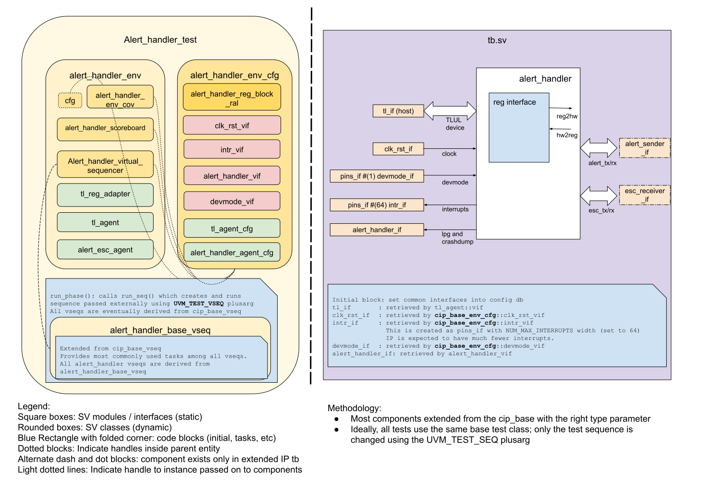

# ALERT_HANDLER DV document

## Goals
* **DV**
  * Verify all ALERT_HANDLER IP features by running dynamic simulations with a SV/UVM based testbench
  * Develop and run all tests based on the [testplan](#testplan) below towards closing code and functional coverage on the IP and all of its sub-modules
  * Verify transmitter and receiver pairs for alert (/hw/ip/prim/dv/prim_alert) and escalation (/hw/ip/prim/dv/prim_esc) via direct stimulus.
* **FPV**
  * Verify TileLink device protocol compliance with an SVA based testbench
  * Verify transmitter and receiver pairs for alert and escalator
  * Verify alert_handler_esc_timer and alert_handler_ping_timer

## Current status
* [Design & verification stage](../../../README.md)
  * [HW development stages](../../../../../doc/project_governance/development_stages.md)
* [Simulation results](https://reports.opentitan.org/hw/top_earlgrey/ip_autogen/alert_handler/dv/latest/report.html)

## Design features
For detailed information on ALERT_HANDLER design features, please see the [ALERT_HANDLER HWIP technical specification](../README.md).

## Testbench architecture
ALERT_HANDLER testbench has been constructed based on the [CIP testbench architecture](../../../../dv/sv/cip_lib/README.md).

### Block diagram


### Top level testbench
Top level testbench is located at `hw/ip/alert_handler/dv/tb/tb.sv`. It instantiates the ALERT_HANDLER DUT module `hw/ip/alert_handler/rtl/alert_handler.sv`.
In addition, it instantiates the following interfaces, connects them to the DUT and sets their handle into `uvm_config_db`:
* [Clock and reset interface](../../../../dv/sv/common_ifs/README.md)
* [TileLink host interface](../../../../dv/sv/tl_agent/README.md)
* ALERT_HANDLER IOs
* Alerts and escalations([`alert_esc_if`](../../../../dv/sv/alert_esc_agent/README.md))
* Interrupts ([`pins_if`](../../../../dv/sv/common_ifs/README.md#pins_if))

The alert_handler testbench environment can be reused in chip level testing.

### Common DV utility components
The following utilities provide generic helper tasks and functions to perform activities that are common across the project:
* [dv_utils_pkg](../../../../dv/sv/dv_utils/README.md)
* [csr_utils_pkg](../../../../dv/sv/csr_utils/README.md)

### Global types & methods
All common types and methods defined at the package level can be found in
`alert_handler_env_pkg`. Some of them in use are:
```systemverilog
  parameter uint NUM_MAX_ESC_SEV = 8;
```

### TL_agent
ALERT_HANDLER testbench instantiates (already handled in CIP base env) [tl_agent](../../../../dv/sv/tl_agent/README.md)
which provides the ability to drive and independently monitor random traffic via
TL host interface into ALERT_HANDLER device.

### ALERT_ESC Agent
[ALERT_ESC agent](../../../../dv/sv/alert_esc_agent/README.md) is used to drive and monitor transmitter and receiver pairs for the alerts and escalators.
Alert_handler DUT includes alert_receivers and esc_senders, so the alert_esc agent will drive output signals of the alert_senders and esc_receivers.

### UVM RAL Model
The ALERT_HANDLER RAL model is created with the [`ralgen`](../../../../dv/tools/ralgen/README.md) FuseSoC generator script automatically when the simulation is at the build stage.

It can be created manually by invoking [`regtool`](../../../../../util/reggen/doc/setup_and_use.md).

### Stimulus strategy
#### Test sequences
All test sequences reside in `hw/ip/alert_handler/dv/env/seq_lib`.
The `alert_handler_base_vseq` virtual sequence is extended from `cip_base_vseq` and serves as a starting point.
All test sequences are extended from `alert_handler_base_vseq`.
It provides commonly used handles, variables, functions and tasks that the test sequences can simple use / call.
Some of the most commonly used tasks / functions are as follows:
* alert_handler_init: Configure alert_handler DUT by writing to `intr_en`, `alert_en_shadowed_*`, `alert_class_shadowed_*`, `loc_alert_en_shadowed_*`, `loc_alert_class_shadowed_*` registers.
* drive_alert: Drive alert_tx signal pairs through `alert_sender_driver`.
* drive_esc_rsp: Drive esc_rx signal pairs through `esc_receiver_driver`.
* read_ecs_status: Readout registers that reflect escalation status, including `classa/b/c/d_accum_cnt`, `classa/b/c/d_esc_cnt`, and `classa/b/c/d_state`.
* wait_alert_handshake_done: Wait for alert_rx/tx handshake to finish. If the alert's low-power-group(LPG) is enabled, immediately return.
* wait_esc_handshake_done: Wait for esc_rx/tx handshake to finish by reading `class*_state` registers and check esc_rx/tx signals.
* set_alert_lpg: Given alert index, find the linked LPG group and enabled the LPG group by driving `lpg_cg_en` or `lpg_rst_en` to Mubi4True.
* run_esc_rsp_seq_nonblocking: A non-blocking sequence to drive `esc_tx` when received escalation or escalation-ping requests.
* run_alert_ping_rsp_seq_nonblocking: A non-blocking sequence to drive `alert_rx` when received alert-ping requests.

#### Functional coverage
To ensure high quality constrained random stimulus, it is necessary to develop a functional coverage model.
The detailed covergroups are documented under alert_handler [testplan](#testplan).

### Self-checking strategy
#### Scoreboard
The `alert_handler_scoreboard` is primarily used for end to end checking.
It creates the following analysis ports to retrieve the data monitored by corresponding interface agents:
* tl_a_chan_fifo: tl address channel
* tl_d_chan_fifo: tl data channel
* alert_fifo:     An array of `alert_fifo` that connects to corresponding alert_monitors
* esc_fifo:       An array of `esc_fifo` that connects to corresponding esc_monitors

Alert_handler scoreboard monitors all valid CSR registers, alert handshakes, and escalation handshakes.
To ensure certain alert, interrupt, or escalation signals are triggered at the expected time, the alert_handler scoreboard implemented a few counters:
* intr_cnter_per_class[NUM_ALERT_HANDLER_CLASSES]: Count number of clock cycles that the interrupt bit stays high.
  If the stored number is larger than the `timeout_cyc` registers, the corresponding escalation is expected to be triggered
* accum_cnter_per_class[NUM_ALERT_HANDLER_CLASSES]: Count number of alerts triggered under the same class.
  If the stored number is larger than the `accum_threshold` registers, the corresponding escalation is expected to be triggered
* esc_cnter_per_signal[NUM_ESC_SIGNALS]: Count number of clock cycles that each escalation signal stays high.
  Compare the counter against `phase_cyc` registers

The alert_handler scoreboard is parameterized to support different number of classes, alert pairs, and escalation pairs.

#### Assertions
* TLUL assertions: The `tb/alert_handler_bind.sv` binds the `tlul_assert` [assertions](../../../../ip/tlul/doc/TlulProtocolChecker.md) to the IP to ensure TileLink interface protocol compliance.
* Unknown checks on DUT outputs: The RTL has assertions to ensure all outputs are initialized to known values after coming out of reset.

## Building and running tests
We are using our in-house developed [regression tool](../../../../../util/dvsim/README.md) for building and running our tests and regressions.
Please take a look at the link for detailed information on the usage, capabilities, features and known issues.
Here's how to run a smoke test:
```console
$ $REPO_TOP/util/dvsim/dvsim.py $REPO_TOP/hw/$CHIP/ip_autogen/alert_handler/dv/alert_handler_sim_cfg.hjson -i alert_handler_smoke
```
In this run command, $CHIP can be top_earlgrey, etc.

## Testplan
[Testplan](../data/alert_handler_testplan.hjson)
