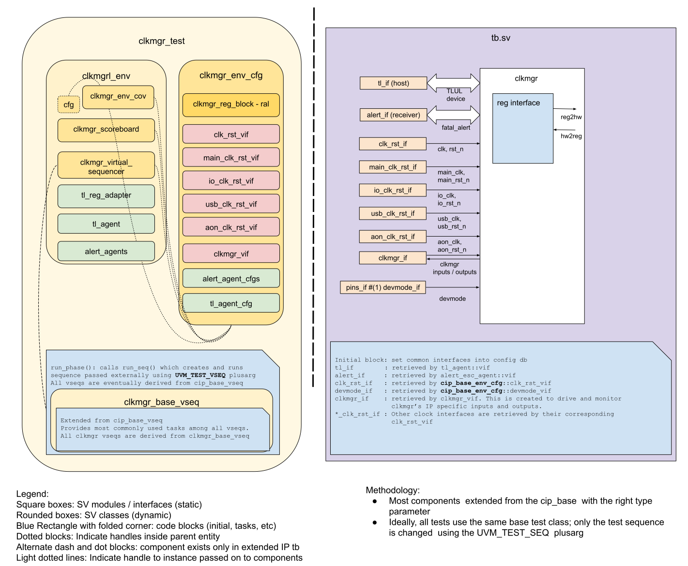

# CLKMGR DV document

## Goals
* **DV**
  * Verify all CLKMGR IP features by running dynamic simulations with a SV/UVM based testbench.
  * Develop and run all tests based on the [testplan](#testplan) below towards closing code and functional coverage on the IP and all of its sub-modules.
* **FPV**
  * Verify TileLink device protocol compliance with an SVA based testbench.
  * Verify clock gating assertions.

## Current status
* [Design & verification stage](../../../../README.md)
  * [HW development stages](../../../../../doc/project_governance/development_stages.md)
* [Simulation results](https://reports.opentitan.org/hw/top_earlgrey/ip_autogen/clkmgr/dv/latest/report.html)

## Design features
The detailed information on CLKMGR design features is at [CLKMGR HWIP technical specification](../README.md).

## Testbench architecture
CLKMGR testbench has been constructed based on the [CIP testbench architecture](../../../../dv/sv/cip_lib/README.md).

### Block diagram


### Top level testbench
Top level testbench is located at `hw/top_earlgrey/ip_autogen/clkmgr/dv/tb.sv`.
It instantiates the CLKMGR DUT module `hw/top_earlgrey/ip_autogen/clkmgr/rtl/clkmgr.sv`.
In addition, it instantiates the following interfaces, connects them to the DUT and sets their handle into `uvm_config_db`:

* [Clock and reset interface](../../../../dv/sv/common_ifs/README.md)
* [TileLink host interface](../../../../dv/sv/tl_agent/README.md)
* CLKMGR IOs: `hw/top_earlgrey/ip_autogen/clkmgr/dv/env/clkmgr_if.sv`

### Common DV utility components
The following utilities provide generic helper tasks and functions to perform activities that are common across the project:

* [dv_utils_pkg](../../../../dv/sv/dv_utils/README.md)
* [csr_utils_pkg](../../../../dv/sv/csr_utils/README.md)

### Global types & methods
All common types and methods defined at the package level can be found in
`clkmgr_env_pkg`. Some of them in use are:

```systemverilog
  localparam int NUM_PERI = 4;
  localparam int NUM_TRANS = 5;
  localparam int NUM_ALERTS = 2;

  typedef logic [NUM_PERI-1:0] peri_enables_t;
  typedef logic [NUM_TRANS-1:0] hintables_t;

  typedef virtual clkmgr_if clkmgr_vif;
  typedef virtual clk_rst_if clk_rst_vif;
  typedef enum int {PeriDiv4, PeriDiv2, PeriIo, PeriUsb} peri_e;
  typedef enum int {TransAes, TransHmac, TransKmac, TransOtbnIoDiv4, TransOtbnMain} trans_e;
```

### TL_agent
CLKMGR testbench instantiates (already handled in CIP base env) [tl_agent](../../../../dv/sv/tl_agent/README.md) which provides the ability to drive and independently monitor random traffic via TL host interface into CLKMGR device.

### UVM RAL Model
The CLKMGR RAL model is created with the [`ralgen`](../../../../dv/tools/ralgen/README.md) FuseSoC generator script automatically when the simulation is at the build stage.

It can be created manually by invoking [`regtool`](../../../../../util/reggen/doc/setup_and_use.md):

## Stimulus strategy
This module is rather simple: the stimulus is just the external pins and the CSR updates.
There are a couple stages for synchronization of the CSR updates for clock gating controls, but scanmode is used asynchronously.
These go to the clock gating latches.
The external pins controlling the external clock selection need no synchronization.
The tests randomize the inputs and issue CSR updates affecting the specific functions being tested.

### Test sequences
All test sequences reside in `hw/top_earlgrey/ip_autogen/clkmgr/dv/env/seq_lib`.
The `clkmgr_base_vseq` virtual sequence is extended from `cip_base_vseq` and serves as a starting point.
It provides commonly used handles, variables, functions and tasks that the test sequences can use or call.
Some of the most commonly used tasks / functions are as follows:
* `clkmgr_init`: Sets the frequencies of the various clocks.
* `control_ip_clocks`: Turns on or off the input clocks based on the various clock enable and status ports to and from the `pwrmgr` IP.

All test sequences are extended from `clkmgr_base_vseq`, and are described below.

#### clkmgr_peri_vseq

The sequence `clkmgr_peri_vseq` randomizes the stimuli that drive the four peripheral clocks.
These clocks are mutually independent so they are tested in parallel.
They depend on
* The `clk_enables` CSR, which has a dedicated enable for each peripheral clock
* The pwrmgr's `<clk>_ip_clk_en` which has a dedicated bit controlling `io`, `main`, and `usb` clocks
* The `scanmode_i` input, which is used asynchronously and also controls all.

The sequence runs a number of iterations, each randomizing the above except for `io_ip_clk_en` since that would imply the processor is disabled.

#### clkmgr_trans_vseq

The sequence `clkmgr_trans_vseq` randomizes the stimuli that drive the five transactional unit clocks.
These are also mutually independent so they are tested in parallel.
They depend on the `clk_hints` CSR, which has a separate bit for each, `main_ip_clk_en` and `scanmode_i`, similar to the peripheral clocks.
They also depend on the `idle_i` input, which also has a separate multi-bit value for each unit.
Units are considered busy when their corresponding `idle_i` value is not `mubi_pkg::MuBi4True`, and this prevents its clock turning off until it becomes idle.

#### clkmgr_extclk_vseq

The sequence `clkmgr_extclk_vseq` randomizes the stimuli that drive the external clock selection.
The selection is controlled by software if the `extclk_ctrl.sel` CSR is `prim_mubi_pkg::MuBi4True`, provided the `lc_hw_debug_en_i` input is also set to `lc_ctrl_pkg::On`.
Alternatively, the external clock is selected by the life cycle controller if the `lc_ctrl_byp_req_i` input is `lc_ctrl_pkg::On`.
When the external clock is selected and `scanmode_i` is not set to `prim_mubi_pkg::MuBi4True`, the clock dividers for the clk_io_div2 and clk_io_div4 output clocks are stepped down:
* If `lc_ctrl_byp_req_i` is on, or
* If `extclk_ctrl.hi_speed_sel` CSR is `prim_mubi_pkg::MuBi4True`, when the selection is enabled by software.

#### clkmgr_frequency_vseq

The sequence `clkmgr_frequency_vseq` randomly programs the frequency measurement for each clock so its measurement is either okay, slow, or fast.
It checks the recoverable alerts trigger as expected when a measurement is not okay.
It also checks the `recov_err_code` CSR sets bits for clocks whose measurement is out of bounds.
It also checks that loss of calibration stops clock measurements and doesn't trigger errors.

#### clkmgr_frequency_timeout_vseq

The sequence `clkmgr_frequency_timeout_vseq` programs the frequency measurement for each clock so its measurement is okay.
It randomly stops one of the clocks, and checks the corresponding bit in the `recov_err_code` show a timeout.
It also checks the recoverable alerts trigger as expected for a timeout.

#### clkmgr_clk_status_vseq

This checks that the `pwr_o.*_status` outputs track the `pwr_i.*_ip_clk_en` inputs.
The inputs are set at random and the outputs are checked via SVA.

### Functional coverage
To ensure high quality constrained random stimulus, it is necessary to develop a functional coverage model.
The following covergroups have been developed to prove that the test intent has been adequately met:

* Covergroups for inputs to each software gated peripheral clock.
  These are wrapped in class `clkmgr_peri_cg_wrap` and instantiated in `clkmgr_env_cov`.
* Covergroups for inputs to each transactional gated unit clock.
  These are wrapped in class `clkmgr_trans_cg_wrap` and instantiated in `clkmgr_env_cov`.
* Covergroups for the outcome of each clock measurement.
  These are wrapped in class `freq_measure_cg_wrap` and instantiated in `clkmgr_env_cov`.
* Covergroup for the external clock selection logic: `extclk_cg` in `clkmgr_env_cov`.

See more detailed description at `hw/top_earlgrey/ip_autogen/clkmgr/data/clkmgr_testplan.hjson`.

## Self-checking strategy

Most of the checking is done using SVA for input to output, or CSR update to output behavior.
Some of the CLKMGR outputs are gated clocks, which are controlled by both synchronous logic and asynchronous enables.
These asynchronous enables become synchronous because of the SVA semantics.
This is fine since the assertions allow some cycles for the expected behavior to occur.

### Scoreboard
The `clkmgr_scoreboard` combines CSR updates and signals from the clkmgr vif to instrument some checks and coverage collection.
The CSR updates are determined using the TLUL analysis port.

The CSR controlled output clocks can be separated into two groups: peripheral ip clocks and transactional unit clocks.
Please refer to the [Test sequences section](#test-sequences) above.
The clock gating logic is pretty similar across units in each group.
For each peripheral and transactional clock the scoreboard samples their coverage based on clocking blocks instantiated in `clkmgr_if`.
Most other other functional coverage groups are also sampled in the scoreboard.

The `jitter_en_o` output is checked to match the `jitter_enable` CSR.

### Assertions
* Pwrmgr enable-status assertions: Interface `clkmgr_pwrmgr_sva_if` contains concurrent SVA that checks that edges of the various ip_clk_en are followed by corresponding edges of their clk_status.
  The clocks checked are `main`, `io`, and `usb`.
* Gated clock assertions: Interface `clkmgr_gated_clock_sva_if` contains concurrent SVA that checks each gated clock is either running or stopped based on their control logic.
  There is one assertion for each of the four peripheral clock and four hintable clocks.
* Transactional clock assertions: Interface `clkmgr_trans_sva_if` contains concurrent SVA that checks each transactional clock is either running or stopped based on their control logic.
  There is one assertion for each of the four hintable clocks.
* Clock divider assertions: Interface `clkmgr_div_sva_if` contains concurrent SVA that checks the `io_div2` and `io_div4` clocks are running at nominal frequency, or are divided by two each in response to the `extclk` logic.
* External clock assertions: Interface `clkmgr_extclk_sva_if` contains concurrent SVA that checks the external control outputs respond correctly to the various CSR or inputs that control them.
* Clock gating assertions: Interface `clkmgr_cg_en_sva_if` contains concurrent assertions that check a clock's cg_en output is active when the clock is disabled, and viceversa.
  As a special case, interface `clkmgr_aon_cg_en_sva_if` checks cg_en is never active for an aon clock.
* Lost calibration assertions: Interfaces `clkmgr_lost_calib_ctrl_en_sva_if` and `clkmgr_lost_calib_regwen_sva_if` check that losing calibration turns off clock measurements and re-enables measure control writes.
* TLUL assertions: `clkmgr_bind.sv` binds the `tlul_assert` [assertions](../../../../ip/tlul/doc/TlulProtocolChecker.md) to the IP to ensure TileLink interface protocol compliance.
* Unknown checks on DUT outputs: The RTL has assertions to ensure all outputs are initialized to known values after coming out of reset.

## Building and running tests
We are using our in-house developed [regression tool](../../../../../util/dvsim/README.md) for building and running our tests and regressions.
Please take a look at the link for detailed information on the usage, capabilities, features and known issues.
Here's how to run a smoke test:

```console
$ $REPO_TOP/util/dvsim/dvsim.py $REPO_TOP/hw/top_earlgrey/ip_autogen/clkmgr/dv/clkmgr_sim_cfg.hjson -i clkmgr_smoke
```

## Testplan
[Testplan](../data/clkmgr_testplan.hjson)
