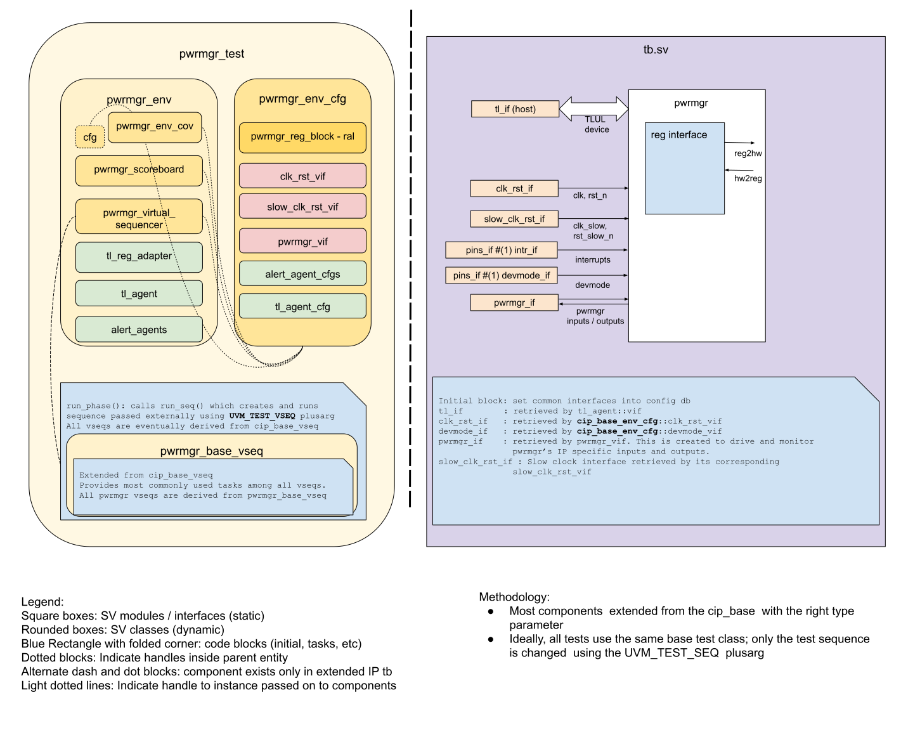

# PWRMGR DV document

## Goals
* **DV**
  * Verify all PWRMGR IP features by running dynamic simulations with a SV/UVM based testbench.
  * Develop and run all tests based on the [testplan](#testplan) below towards closing code and functional coverage on the IP and all of its sub-modules.
* **FPV**
  * Verify TileLink device protocol compliance with an SVA based testbench.

## Current status
* [Design & verification stage](../doc/checklist.md)
  * [HW development stages](../../../../../doc/project_governance/development_stages.md)
* [Simulation results](https://reports.opentitan.org/hw/top_earlgrey/ip_autogen/pwrmgr/dv/latest/report.html)

## Design features
For detailed information on PWRMGR design features, please see the [PWRMGR HWIP technical specification](../README.md).

## Testbench architecture
PWRMGR testbench has been constructed based on the [CIP testbench architecture](../../../../dv/sv/cip_lib/README.md).

### Block diagram


### Top level testbench
Top level testbench is located at [`hw/top_earlgrey/ip_autogen/pwrmgr/dv/tb.sv`](https://github.com/lowRISC/opentitan/blob/master/hw/top_earlgrey/ip_autogen/pwrmgr/dv/tb.sv).
It instantiates the PWRMGR DUT module [`hw/top_earlgrey/ip_autogen/pwrmgr/rtl/pwrmgr.sv`](https://github.com/lowRISC/opentitan/blob/master/hw/top_earlgrey/ip_autogen/pwrmgr/rtl/pwrmgr.sv).
In addition, it instantiates the following interfaces, connects them to the DUT and sets their handle into `uvm_config_db`:
* [Clock and reset interface](../../../../dv/sv/common_ifs/README.md)
* [TileLink host interface](../../../../dv/sv/tl_agent/README.md)
* PWRMGR interface [`hw/top_earlgrey/ip_autogen/pwrmgr/dv/env/pwrmgr_if.sv`](https://github.com/lowRISC/opentitan/blob/master/hw/top_earlgrey/ip_autogen/pwrmgr/dv/env/pwrmgr_if.sv).
* Interrupts ([`pins_if`](../../../../dv/sv/common_ifs/README.md))
* Alerts ([`alert_esc_if`](../../../../dv/sv/alert_esc_agent/README.md))
* Devmode ([`pins_if`](../../../../dv/sv/common_ifs/README.md))

### Common DV utility components
The following utilities provide generic helper tasks and functions to perform activities that are common across the project:
* [dv_utils_pkg](../../../../dv/sv/dv_utils/README.md)
* [csr_utils_pkg](../../../../dv/sv/csr_utils/README.md)

### Global types & methods
All common types and methods defined at the package level can be found in
[`pwrmgr_env_pkg`](https://github.com/lowRISC/opentitan/blob/master/hw/top_earlgrey/ip_autogen/pwrmgr/dv/env/pwrmgr_env_pkg.sv).
Some of them in use are:
```systemverilog
  typedef enum int {
    WakeupSysrst,
    WakeupDbgCable,
    WakeupPin,
    WakeupUsb,
    WakeupAonTimer,
    WakeupSensorCtrl
  } wakeup_e;

  typedef struct packed {
    logic main_pd_n;
    logic usb_clk_en_active;
    logic usb_clk_en_lp;
    logic io_clk_en;
    logic core_clk_en;
  } control_enables_t;

  typedef bit [pwrmgr_reg_pkg::NumWkups-1:0] wakeups_t;
  typedef bit [pwrmgr_reg_pkg::NumRstReqs-1:0] resets_t;

  // This is used to send all resets to rstmgr.
  typedef bit [pwrmgr_pkg::HwResetWidth-1:0] resets_out_t;
```
### TL_agent
PWRMGR testbench instantiates (already handled in CIP base env) [tl_agent](../../../../dv/sv/tl_agent/README.md) which provides the ability to drive and independently monitor random traffic via TL host interface into PWRMGR device.

### UVM RAL Model
The PWRMGR RAL model is created with the [`ralgen`](../../../../dv/tools/ralgen/README.md) FuseSoC generator script automatically when the simulation is at the build stage.

It can be created manually by invoking [`regtool`](../../../../../util/reggen/doc/setup_and_use.md).

### Stimulus strategy
The sequences are closely related to the testplan's testpoints.
Testpoints and coverage are described in more detail in the [testplan](#testplan).
All test sequences reside in [`hw/top_earlgrey/ip_autogen/pwrmgr/dv/env/seq_lib`](https://github.com/lowRISC/opentitan/blob/master/hw/top_earlgrey/ip_autogen/pwrmgr/dv/env/seq_lib), and extend `pwrmgr_base_vseq`.
The `pwrmgr_base_vseq` virtual sequence is extended from `cip_base_vseq` and serves as a starting point.
It provides commonly used handles, variables, functions and tasks used by the test sequences.
Some of the most commonly used tasks and functions are as follows:
* task `wait_for_fast_fsm_active`:
  Waits for the `fetch_en_o` output to become 1, indicating the fast fsm is active and the CPU can fetch instructions.
  We wait for this before the tests can start, since any CSR accesses require the CPU to be running.
  Due to complexities in the UVM sequences this task is called in the virtual post_apply_reset task of dv_base_vseq.
* task `wait_for_csr_to_propagate_to_slow_domain`:
  Waits for `cfg_cdc_sync` CSR to be clear, indicating the CDC to the slow clock has completed.
* task `wait_for_reset_cause`:
  Waits for the `pwr_rst_req.reset_cause` output to match an expected cause.
* task `check_wait_info`:
  Checks the wake_info CSR matches expectations.
* task `check_reset_status`:
  Checks the reset_status CSR matches expectations.
* task `check_and_clear_interrupt`:
  Checks the interrupt enable, status, and output pin.

In addition, the base sequence provides two tasks that provide expected inputs based on the pwrmgr outputs.
In the absence of these inputs the pwrmgr will be stuck waiting forever.
Being based on outputs means the inputs are in accordance to the implicit protocol.
The tasks in question are:
* task `slow_responder`:
  Handles required input changes from AST for the slow state machine.
  For the various `<clk>_en` outputs it changes the `<clk>_val` as required, for `core`, `io`, `main`, and `usb` clocks.
* task `fast_responder`:
  Handles input changes for the fast state machine.
  * Completes the handshake with rstmgr for lc and sys resets: some random cycles after an output reset is requested the corresponding reset src input must go low.
  * Completes the handshake with clkmgr: the various `<clk>_status` inputs need to match the corresponding `<clk>_ip_clk_en` output after some cycles, for `io`, `main`, and `usb` clocks.
  * Completes the handshake with lc and otp: both *_done inputs must match the corresponding *_init outputs after some cycles.

These tasks are started by the parent sequence's `pre_start` task, and terminated gracefully in the parent sequence's `post_start` task.
### Test sequences
The test sequences besides the base are as follows:
* `pwrmgr_smoke_vseq` tests the pwrmgr through POR, entry and exit from software initiated low power and reset.
* `pwrmgr_wakeup_vseq` checks the transitions to low power and the wakeup settings.
  It randomizes wakeup inputs, wakeup enables, the wakeup info capture enable, and the interrupt enable.
* `pwrmgr_aborted_low_power_vseq` creates scenarios that lead to aborting a low power transition.
  The abort can be due to the processor waking up very soon, or otp, lc, or flash being busy.
* `pwrmgr_reset_vseq` checks the pwrmgr response to conditional resets and reset enables, and unconditional escalation and main power glitch resets.
* `pwrmgr_wakeup_reset_vseq` aligns reset and wakeup from low power.
* `pwrmgr_lowpower_wakeup_race_vseq` aligns a wakeup event coming in proximity to low power entry.
  Notice the wakeup is not expected to impact low power entry, since it is not sampled at this time.

### Functional coverage
To ensure high quality constrained random stimulus, it is necessary to develop a functional coverage model.
The following covergroups have been developed to prove that the test intent has been adequately met:
* `wakeup_ctrl_cg` covers wakeup and capture control.
* `wakeup_intr_cg` covers control of the interrupt due to a wakeup.
* `control_cg` covers clock controls.
* `hw_reset_0_cg` covers external reset via `rstreqs_i[0]`.
* `hw_reset_1_cg` covers external reset via `rstreqs_i[1]`.
* `rstmgr_sw_reset_cg` covers software initiated resets via rstmgr CSR.
* `main_power_reset_cg` covers resets due to a main power glitch.
* `esc_reset_cg` covers resets due to an incoming escalation.
* `reset_wakeup_distance_cg` covers the distance in clock cycles between a wakeup and a reset request.

More details about these sequences and covergroups can be found at [testplan](#testplan).

### Self-checking strategy
Many of the checks are performed via SVA, and are enabled for all test sequences.
Refer to the [assertions](#assertions) section below for details.

#### Scoreboard
The `pwrmgr_scoreboard` is primarily used for end to end checking.

Many inputs must have specific transitions to prevent the pwrmgr fsms from wait forever.
When possible the transitions are triggered by pwrmgr output changes.
These are described according to the unit that originates or is the recipient of the ports.
See also the test plan for specific ways these are driven to trigger different testpoints.

##### AST
- Output `slow_clk_en` is always on.
- Input `slow_clk_val` is unused.
- Outputs `core_clk_en`, `io_clk_en`, and `usb_clk_en` reset low, and go high prior to the slow fsm requesting the fast fsm to wakeup.
  Notice the usb clock can be programmed to stay low on wakeup via the `control` CSR.
  These clock enables are cleared on reset, and should match their corresponding enables in the `control` CSR on low power transitions.
  These clock enables are checked via SVAs in [`hw/top_earlgrey/ip_autogen/pwrmgr/dv/sva/pwrmgr_clock_enables_sva_if.sv`](https://github.com/lowRISC/opentitan/blob/master/hw/top_earlgrey/ip_autogen/pwrmgr/dv/sva/pwrmgr_clock_enables_sva_if.sv).
  When slow fsm transitions to `SlowPwrStateReqPwrUp` the clock enables should be on (except usb should match `control.usb_clk_en_active`).
  When slow fsm transitions to `SlowPwrStatePwrClampOn` the clock enables should match their bits in the `control` CSR.
- Inputs `core_clk_val`, `io_clk_val`, and `usb_clk_val` track the corresponding enables.
  They are driven by `slow_responder`, which turn them off when their enables go off, and turn them back on a few random slow clock cycles after their enables go on.
  Slow fsm waits for them to go high prior to requesting fast fsm wakeup.
  Lack of a high transition when needed is detected via timeout.
  Such timeout would be due to the corresponding enables being set incorrectly.
  These inputs are checked via SVAs in [`hw/top_earlgrey/ip_autogen/pwrmgr/dv/sva/pwrmgr_ast_sva_if.sv`](https://github.com/lowRISC/opentitan/blob/master/hw/top_earlgrey/ip_autogen/pwrmgr/dv/sva/pwrmgr_ast_sva_if.sv).
- Output `main_pd_n` should go high when slow fsm transitions to `SlowPwrStateMainPowerOn`, and should match `control.main_pd_n` CSR when slow fsm transitions to `SlowPwrStateMainPowerOff`.
- Input `main_pok` should turn on for the slow fsm to start power up sequence.
  This is also driven by `slow_responder`, which turn this off in response to `main_pd_n` going low, and turn it back on after a few random slow clock cycles from `main_pd_n` going high.
  Lack of a high transition causes a timeout, and would point to `main_pd_n` being set incorrectly.
- Output transitions of `pwr_clamp_env` must always precede transitions of
  `pwr_clamp` output.
  Output transitions of `pwr_clamp` to active must always precede transitions
  of `main_pd_n` output to active.
  Output transitions of `pwr_clamp` to inactive must always follow transitions
  of `main_pd_n` output to inactive.

##### RSTMGR
- Output `rst_lc_req` resets to 1, also set on reset transition, and on low power transitions that turn off main clock.
  Cleared early on during the steps to fast fsm active.
- Input `rst_lc_src_n` go low in response to `rst_lc_req` high, go high when `rst_lc_req` clears (and lc is reset).
  Driven by `fast_responder` in response to `rst_lc_req`, waiting a few random cycles prior to transitions.
  Fast fsm waits for it to go low before deactivating, and for it to go high before activating.
  Checked implicitly by lack of timeout: a timeout would be due to `rst_lc_req` being set incorrectly, and by SVA as described below.
- Output `rst_sys_req` resets to 1, also set to on reset, and on low power transitions that turn off main clock.
  Cleared right before the fast fsm goes active.
- Input `rst_sys_src_n` go low in response to `rst_sys_req` high.
  Transitions go high when `rst_sysd_req` clears (and lc is reset).
  Fast fsm waits for it to go low before deactivating.
  Also driver by `fast_responder`.
  Checked implicitly by lack of timeout, and by SVA.
- Output `rstreqs` correspond to the enabled pwrmgr rstreqs inputs plus main power glitch, escalation reset, and software reset request from RSTMGR.
  Checked in scoreboard and SVA.
- Output `reset_cause` indicates a reset is due to low power entry or a reset request.
  Checked in scoreboard.

##### CLKMGR
- Outputs `pwr_clk_o.<clk>_ip_clk_en` reset low, are driven high by fast fsm when going active, and driven low when going inactive.
  The `<clk>` correspond to `io`, `main`, and `usb`.
- Inputs `pwr_clk_i.<clk>_status` are expected to track `pwr_clk_o.<clk>_ip_clk_en`.
  Fast fsm waits for them going high prior to going active, and going low prior to deactivating.
  These are controlled by the `control` CSR.
  Driven by `fast_responder`, which turns them off when `<clk>_ip_clk_en` goes low, and turns them back on a few random cycles after `<clk>_ip_clk_en` goes high.
  Checked by lack of a timeout: such timeout would be due to `ip_clk_en` being set incorrectly.
  Also checked by SVA.

##### OTP
- Output `otp_init` resets low, goes high when the fast fsm is going active, and low after the `otp_done` input goes high.
- Input `otp_done` is driven by `fast_responder`.
  It is initialized low, and goes high some random cycles after `otp_init` goes high.
  The sequencer will timeout if `otp_init` is not driven high.
- Input `otp_idle` normally set high, but is set low by the `pwrmgr_aborted_low_power_vseq` sequence.

##### LC
The pins connecting to LC behave pretty much the same way as those to OTP.

##### FLASH
- Input `flash_idle` is handled much like `lc_idle` and `otp_idle`.

##### CPU
- Input `core_sleeping` is driven by sequences.
  It is driven low to enable a transition to low power.
  After the transition is under way it is a don't care.
  The `pwrmgr_aborted_low_power_vseq` sequence sets it carefully to abort a low power entry soon after the attempt because the processor wakes up.

##### Wakeups and Resets
There are a number of wakeup and reset requests.
They are driven by sequences as they need to.

#### Assertions
The [`hw/top_earlgrey/ip_autogen/pwrmgr/dv/sva/pwrmgr_bind.sv`](https://github.com/lowRISC/opentitan/blob/master/hw/top_earlgrey/ip_autogen/pwrmgr/dv/sva/pwrmgr_bind.sv) module binds a few modules containing assertions to the IP as follows:
* TLUL assertions: the `tlul_assert` [assertions](../../../../ip/tlul/doc/TlulProtocolChecker.md) ensures TileLink interface protocol compliance.
* Clock enables assertions:
  The `pwrmgr_clock_enables_sva_if` module contains assertions checking that the various clk_en outputs correspond to the settings in the `control` CSR.
* CLKMGR clk_en to status handshake assertions:
  The `clkmgr_pwrmgr_sva_if` contains assertions checking the various `<clk>_status` inputs track the corresponding `<clk>_ip_clk_en` outputs.
* AST input/output handshake assertions:
  The `pwrmgr_ast_sva_if` module contains assertions checking that the inputs from the AST respond to the pwrmgr outputs.
* RSTMGR input/output handshake assertions:
  The `pwrmgr_rstmgr_sva_if` module contains assertions checking the following:
  * The `rst_lc_src_n` input from RSTMGR respond to the `rst_lc_req` pwrmgr output.
  * The `rst_sys_src_n` input from RSTMGR respond to the `rst_sys_req` pwrmgr output.
  * The different `pwr_rst_o.rstreqs` output bits track the corresponding reset causes.
    These include hardware, power glitch, escalation, and software resets.

In addition, the RTL has assertions to ensure all outputs are initialized to known values after coming out of reset.

## Building and running tests
We are using our in-house developed [regression tool](../../../../../util/dvsim/README.md) for building and running our tests and regressions.
Please take a look at the link for detailed information on the usage, capabilities, features and known issues.
Here's how to run a smoke test:
```console
$ $REPO_TOP/util/dvsim/dvsim.py $REPO_TOP/hw/top_earlgrey/ip_autogen/pwrmgr/dv/pwrmgr_sim_cfg.hjson -i pwrmgr_smoke
```

## Testplan
[Testplan](../data/pwrmgr_testplan.hjson)
