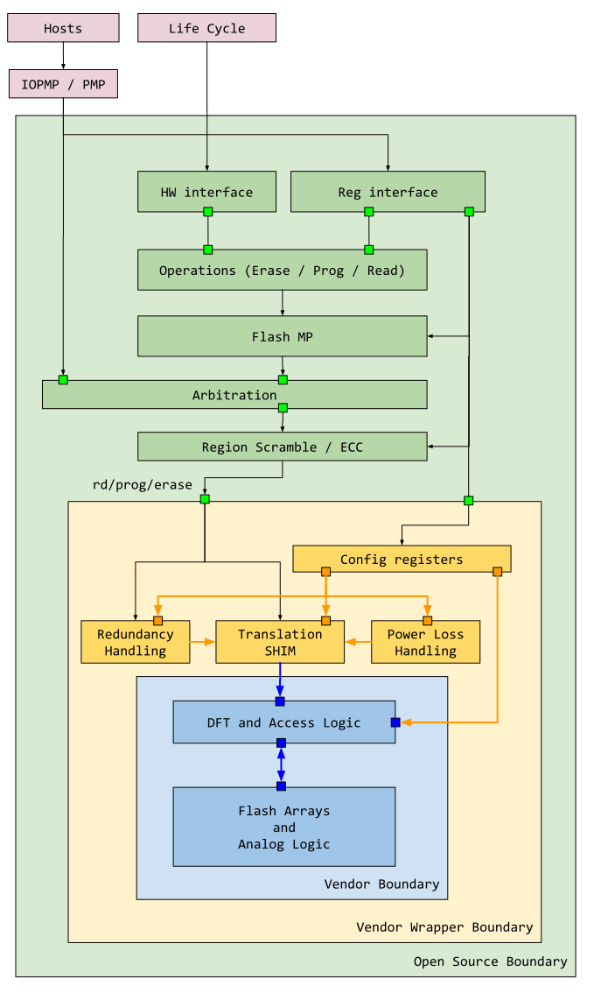
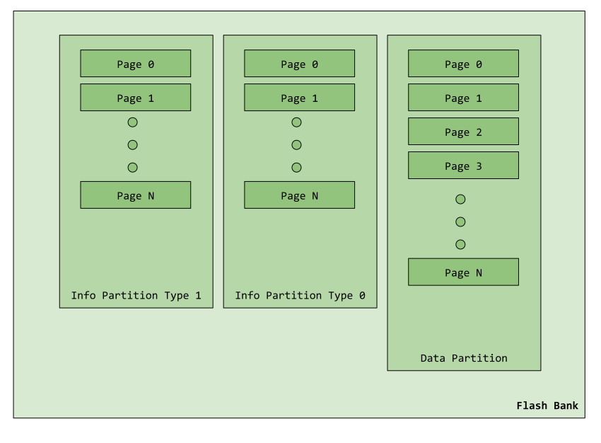

# Flash Controller HWIP Technical Specification

[`flash_ctrl`](https://reports.opentitan.org/hw/top_englishbreakfast/ip_autogen/flash_ctrl/dv/latest/report.html):

# Overview

This document describes the flash controller functionality.
The flash controller is broken down into 3 major components
* Open source flash controller
* Closed source vendor flash wrapper
* Closed source vendor flash module

A breakdown of the 3 can be seen below

This open source flash controller is divided into two partitions.

* Flash protocol controller
* Flash physical controller

The remaining document focuses primarily on the function of these blocks.

This module conforms to the [Comportable guideline for peripheral functionality](https://opentitan.org/book/doc/contributing/hw/comportability).
See that document for integration overview within the broader top level system.

## Features

### Flash Protocol Controller Features
The flash protocol controller interfaces with software and other hardware components in the system (such as life cycle, key manager and OTP).
Regardless of the flash size underneath, the flash controller maintains the same data resolution as the bus and processor (default 4B).
The flash physical controller (see section below) is then responsible for bridging that size gap between the default data resolution and the actual flash memory.

The protocol controller currently supports the following features:

*  Controller initiated read, program and erase of flash.
   *  Erase can be either of a page, or an entire bank.
*  Support for differentiation between informational and data flash partitions.
*  Support for accessing multiple types of information partition.
   *  Some flash storage support multiple types of information storage for each information partition.
*  Parameterized support for burst program / read, up to 64B.
   *  Longer programs / reads are supported, however the protocol controller will directly back-pressure the bus if software supplies more data than can be consumed, or if software reads more than there is data available.
   *  Software can also choose to operate by polling the current state of the FIFO or through FIFO interrupts (empty / full / level).
*  Flash memory protection at page boundaries.
*  Life cycle RMA entry.
*  Key manager secret seeds that are inaccessible to software.
*  Support vendor flash module [erase suspend](./doc/theory_of_operation.md#erase-suspend).
*  Provisioning of flash specific attributes:
   * High endurance.
*  Idle indication to external power managers.
*  Software control of flash code fetch.

### Flash Physical Controller Features

The flash physical controller wraps the actual flash memory and translates both host and controller initiated requests into low level flash transactions.

The physical controller supports the following features
*  Multiple banks of flash memory.
*  For each flash bank, parameterized support for number of flash pages (default to 256).
*  For each flash page, parameterized support for number of words and word size (default to 256 words of 8-bytes each).
*  Data and informational partitions within each bank of flash memory.
*  Arbitration between host requests and controller requests at the bank level.
   *  Host requests are always favored, however the controller priority can escalate if it repeatedly loses arbitration.
   *  Since banks are arbitrated independently and transactions may take different amounts of times to complete, the physical controller is also responsible for ensuring in-order response to both the controller and host.
*  Flash read stage.
   *  Each bank maintains a parameterizable number of read buffers in front of the flash memory (default to 4).
   *  The read buffers behave as miniature read-only-caches to store flash data when flash words are greater than bus words.
   *  When a program or erase collides with an entry already stored in the read buffer, the buffer contents are invalidated.
      * This situation may arise if a read is followed by a program or erase.
*  Flash program stage
   *  Flash data word packing when flash word size is an integer multiple of bus word size.
*  Flash scrambling
   * Flash supports XEX scrambling using the PRINCE cipher.
   * Scrambling is optional based on page boundaries and is configurable by software.
*  Two types of Flash ECC support.
   * A pre-scramble ICV (integrity check value) used for integrity verification implemented as ECC.
   * A post-scramble ECC used for reliability detection, this is configurable on a page boundary.
*  Life cycle modulated JTAG connection to the vendor flash module.

### Flash Memory Overview

Unlike sram, flash memory is not typically organized as a contiguous block of generic storage.
Instead it is organized into data partitions and information partitions.

The data partition holds generic data like a generic memory would.
The information partition holds metadata about the data partition as well as design specific secret data.
This includes but is not limited to:
*  Redundancy information.
*  Manufacturer specific information.
*  Manufacturer flash timing information.
*  Design specific unique seeds.
*  The redundancy pages themselves, which are not accessible directly as data partitions.

Note, there **can** be more than one information partition, and none of them are required to be the same size as the data partition.
See the diagram below for an illustrative example.

Which type of partition is accessed is controlled through the [`CONTROL.PARTITION_SEL`](data/flash_ctrl.hjson#control) field.
The current flash controller implements one type of information partition and thus is controlled by 1 bit only.
This may change in the future.

Lastly, while the different partitions may be identical in some attributes, they are different in others.
*  All types of partitions must have the same page size and word size; however they are not required to have the same number of pages, thus some partitions may be larger and others smaller.
*  All types of partitions obey the same program and erase rules :
   * A bit cannot be programmed back to 1 once it has been programmed to 0.
   * Only erase can restore a bit to 1 under normal circumstances.
*  All partitions (data and information) can be read, programmed and erased by the flash protocol controller, subject to [memory protection](./doc/theory_of_operation.md#memory-protection) and [life cycle qualification](./doc/theory_of_operation.md#memory-protection-for-key-manager-and-life-cycle) .
*  System hosts (processor and other entities) can only directly read the data partition, they do not have any kind of access to information partitions.
   * System hosts are also not subject to memory protection rules, as those apply to the flash protocol controller only.

For default assumptions of the design, see the [default configuration](./doc/theory_of_operation.md#flash-default-configuration).

#### Addresses Map

##### Bank Address
The flash address map is built upon the bank base address.
The bank size is based upon the number of pages in the data partition.
The first bank's address is always `0x0`.
The second bank's address is `0x0 + size_of_bank_in_bytes`.

For example:
Assume each bank is 512KB in size.
The address of bank 0 is `0x0`.
The address of bank 1 is `0x80000`

##### Page Address
The address of a particular page is calculated based on the page size and the index number of the page.

For example:
Assume each page is 2KB in size.

To access page 0 in bank 1, the address would be the base address of bank 1 plus the base address of page 0.
This would still be `0x80000` in this case.

To access page 4 in bank 1, the address would then be `0x80000 + 2KB * 4 = 0x82000`.

##### Partition Access
All partitions share the same addressing scheme.
For example, the page 0 address of any kind of partition is always the same.

To distinguish which partition is accessed, use the configuration in [`CONTROL.PARTITION_SEL`](data/flash_ctrl.hjson#control) and [`CONTROL.INFO_SEL`](data/flash_ctrl.hjson#control)
Note however, the system host is only able to access the [data partitions](./doc/theory_of_operation.md#host-and-protocol-controller-handling).

##### Default Address Map
Based on the [default configuration](./doc/theory_of_operation.md#flash-default-configuration), the following would be the default address map for each partition / page.

Location        | Address      |
----------------|------------- |
Bank 0 Page 0   | 0x0          |
Bank 0 Page 1   | 0x800        |
Bank 0 Page 2   | 0x1000       |
...             | ...          |
Bank 0 Page 255 | 0x7F800      |
Bank 1 Page 0   | 0x80000      |
Bank 1 Page 1   | 0x80800      |
Bank 1 Page 2   | 0x81000      |
...             | ...          |
Bank 1 Page 255 | 0xFF800      |

Note when accessing from host, the system memory address for flash should be added to this offset.

#### Secret Information Partitions

Two information partition pages (one for creator and one for owner) in the design hold secret seeds for the key manager.
These pages, when enabled by life cycle and OTP, are read upon flash controller initialization (no software configuration is required).
The read values are then fed to the key manager for later processing.
There is a page for creator and a page for the owner.

The seed pages can be programmed/erased/read by software when the following are set:
* `lc_creator_seed_sw_rw_en` - allows software access to creator seed partition.
* `lc_owner_seed_sw_rw_en` - allows software access to owner seed partition.

The seed pages are read under the following initialization conditions:
*  life cycle sets provision enable - `lc_seed_hw_rd_en` is set.

See [life cycle](../../../ip/lc_ctrl/README.md#creator_seed_sw_rw_en-and-owner_seed_sw_rw_en) for more details on when this partition is allowed to be populated.

#### Isolated Information Partitions

One information partition page in the design is used for manufacturing time authentication.
The accessibility of this page is controlled by life cycle and OTP.

During TEST states, the isolated page is only programmable.
* `lc_iso_part_sw_wr_en` is set, but `lc_iso_part_sw_rd_en` is not.

During production and RMA states, the isolated page is also readable.
* Both `lc_iso_part_sw_wr_en` and `lc_iso_part_sw_rd_en` are set.

See [life cycle](../../../ip/lc_ctrl/README.md#iso_part_sw_rd_en-and-iso_part_sw_wr_en) for more details
