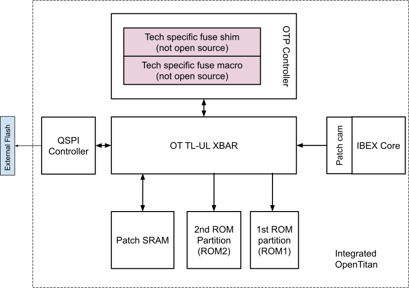
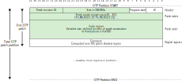
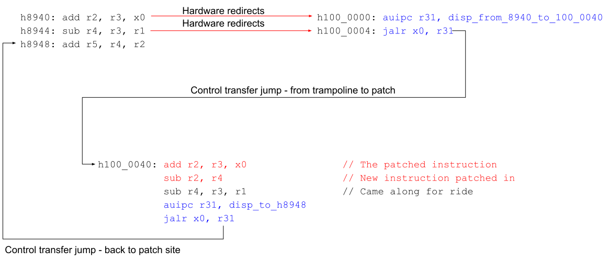
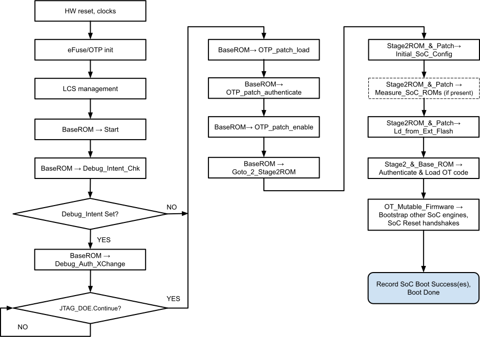

# Boot, ROM execution and Patching

## Glossary

| Term  | Description                         |
|-------|-------------------------------------|
| SoC   | System On Chip                      |
| DFx   | Design for Test and Debug           |
| DFT   | Design for Test                     |

## Scope

This document covers the boot mechanism for Integrated OpenTitan.
This includes the execution of the OpenTitan ROM, associated patch support in efuses / OTP for survivability and the code fetch from external flash.

## Overview

The integrated Open Titan is a root of trust for measurement, integrated within the SoC.
It provides the framework necessary to bootstrap the SoC computing elements in a secure and trusted fashion.
This document covers the changes necessary for the OpenTitan to boot first while also allowing an SoC with integrated OpenTitan to add small customizations to the boot path configuration that fit with the SoC topology.
A few examples are voltage ramp up sequence, clock settings etc.
Such customizations are expected to

- Be non-proprietary such that they can be made available in the open source environment for audit.
- Only require minimal flow to enable a path to external flash that is under OpenTitan control.

Flows involving reset and bring up for the rest of the SoC, which may be potentially more complex and involve proprietary code, are expected to be handled by other computing element(s) that are bootstrapped by the integrated OpenTitan and running authenticated / measured code.

This proposal introduces a second OpenTitan boot ROM partition with efuse/OTP based patching mechanism that enables each SoC to add such small customizations and provide critical survivability hooks while also removing the dependency on the integrated flash component.
Integrated flash technology may not be available for SoCs built using advanced process nodes.

Two models for OpenTitan based ROM patch deployment are envisioned:

- **Factory patching** - here the ROM patches are programmed into the eFuses in the factory.
  This may be to accommodate post-silicon bug fixes without needing a new step of the silicon.
  Performed through the secure manufacturing flow.
- **In-field patching** - The capability may be used to recover parts in the field but that requires an ability to burn eFuses in the field.

Note that patch structure for both deployment models is the same.
An infield patch can be viewed as a new revision of the OTP patch.
The patch in eFuses will be signed using an appropriate PK signing algorithm

### Programming method:

- If prior to the PROD lifecycle stage: Using the manufacturing efuse programming interface.
- In PROD lifecycle stage: Secure, verified patch update programming managed by secure application running on OpenTitan Ibex core (e.g., update patch revision in factory after provisioning, backup in-field patching mechanism).

The factory provisioning model is expected to be the mainstream deployment model that covers bugs found throughout the product development lifecycle until product deployment phase.
The in-field patching capability is primarily a backup mechanism used only in very rare cases to patch a critical ROM bug escape in the field, especially some hard to catch security or functional bugs.
**It is advised to avoid reliance on the in-field ROM patch as much as possible.**

This document also contains a detailed specification for the OpenTitan ROM patching architecture, the programming interfaces, and example sequences for patching ROM firmware.

## ROM Boot & Patching Building Blocks



Following changes are envisioned to allow OpenTitan based boot customizations for an SoC to configure the access path to the external flash:

### OpenTitan base ROM (first ROM partition)

- Base ROM design is common across all integrated OpenTitan instances.

- Supports security hardened functions such as signature verification, verification & loading of second ROM partition patch, other hardened crypto functions required at boot etc.
  Integrated OpenTitan reuses the majority of current base ROM implementation.

- Base ROM is not patchable.
  Guaranteed to be fully verified and to be free of bugs.
  To achieve this goal, it is kept simple by design.

- Following is a summary of a few additional changes required (detailed out in later sections)

  - Identify latest patch in OTP space.

  - Signature verification of OTP patch.

  - Load & enable patch prior to second ROM partition execution.

### Second ROM partition

- Separate ROM structure to house SoC specific boot customizations.

- Late binding security functionality to be tested & hardened prior to incorporating in base ROM.

- Second ROM partition is patchable through efuse / OTP based code patches for survivability.
  Provides hooks to fix critical functional (e.g. early reset sequence) and / or security bugs.

- ROM Patching requirements are as follows:

  - Must be able to patch at least 32 locations in the ROM with a granularity of 4B, 8B, 16B, or 32B per patched location.

  - At reset no patches must be active.

  - The patch contents must be authenticated before being consumed by the ROM code.

    - Authenticated using RSA3072 or ECC384, SHA-384.[^pqc]

[^pqc]: Later revisions of this document may specify opt-in support for PQC signatures.
  This revision does not include it due to OTP space and time-to-solution constraints.

  - The ROM code should have the ability to lock out further patching capability prior to transferring control to execute out of RAM.

  - Patch code update must be authenticated prior to updating the patch section.

    - Authenticated using RSA3072 or ECC384, SHA-384.

**Note:** This ROM implements potentially new logic for each SoC and thus chances of having bug escapes is higher.
An SoC built using an advanced node may not support an integrated flash.
Discrete OpenTitan with integrated flash could support the SoC customizations within the ROM extension code in integrated flash, which can be refreshed multiple times by design.
The second ROM partition with patching capability is added to the architecture definition to fill this gap.

### Efuse / OTP patch

- A separate OTP patch partition is defined within the OTP controller map.

  - Size of the OTP partition is configurable at design time.

  - May be configured to hold ***one or more*** revisions of an OTP patch.

- Each OTP patch consists of a patch header, patch table, patch body and a digital signature.

  

- Patch Header of 1 DWORD includes

  - **Patch size**: Total *size* of the patch in number of DWORDS encompassing the patch header, patch table, patch body and the digital signature.

  - **Patch Revision**: Specifies the major and minor version of the OTP patch code.
    A later version has a higher revision number.

  - **Program Start**: The Program Start MuBi tracks whether the programming of a patch has been attempted but not successfully completed.
    This bit can be used to resume the programming flow in case the update was not completed for some reason e.g. surprise power loss.
    In case such a scenario occurs, upon reboot, the patch loader applies the last known good patch that was programmed successfully and continues to boot to a stable environment prior to reprogramming the unsuccessful patch.

  - **Lock Valid**: The Lock Valid MuBi is set only after the entire patch code is successfully programmed and passes full signature verification after programming.
    Indicates whether to spend time verifying the signature of the patch during boot.

- **The patch table** includes:

  - Contents for 32 [*patch match register pairs*](#patch-match--redirect-logic), each register 1 DWORD in size.

  - Total size of patch table = 2 DWORDS x 32 = 64 DWORDS.

- **Code region**:

  - Replacement code to potentially faulty instruction(s) is ROM.

  - Variable size - few bytes to few KB.
    A small segment of ROM code (up to 32 bytes) can be overwritten using instructions in the code region.
    If the replacement is longer than that, the code region can be short and contain just a branch to some other code.
    This code must be loaded from the OTP ROM patch partition into [patch SRAM](#patch-sram) together with the replacement code.

- **Signature**:

  - Patch stored in each region is fully signed with an appropriate cryptographic signature algorithm - RSA3072 or ECC384.
    (**OPEN**: Choose algorithm).
    The patch will be written and signed by the Silicon Creator.
    Keys will be owned by the Silicon Creator.

  - Signature size depends on the algorithm picked.

### Patch SRAM:

- Used to hold the patch code to be executed upon redirection.
  This can either be a dedicated SRAM or part of the main SRAM (Darjeeling currently implements the latter).

If a dedicated SRAM is used, this should be lockable by writing to an appropriate CSR in its controller.
In this case, the dedicated SRAM can be locked after being loaded so that the patches cannot be changed until the next reset.

### Patch Match / Redirect logic:

A patch is a short sequence of instructions that replace some from the original code.
The replacement is performed by re-routing instruction fetches to fetch from alternative addresses.
This re-routing is handled by a logic block that sits between the Ibex core and TL-UL crossbar.
The block is configured by 32 sets of 4 memory-mapped registers:
- [`IBUS_ADDR_MATCHING`](../data/rv_core_ibex.hjson#ibus_addr_matching_0)
- [`IBUS_ADDR_EN`](../data/rv_core_ibex.hjson#ibus_addr_en_0)
- [`IBUS_REMAP_ADDR`](../data/rv_core_ibex.hjson#ibus_remap_addr_0).
- [`IBUS_REGWEN`](../data/rv_core_ibex.hjson#ibus_regwen_0).

The patch loader is responsible for configuring those registers for each patch in the patch table.
Each entry in the OTP ROM patch table is composed of two 32 bit words with the following layout:


| `M_BASE`            | Size /bytes |
|---------------------|-------------|
| `yy yyyy yyyy yy01` | 4           |
| `yy yyyy yyyy y011` | 8           |
| `yy yyyy yyyy 0111` | 16          |
| `yy yyyy yyy0 1111` | 32          |

When applying ROM patches, the patch loader configures the Ibex instruction re-routing logic for each patch region, as follows:

1. `IBUS_ADDR_MATCHING` is set to `(M_BASE & ~(P_SIZE - 1)) | ((P_SIZE - 1) >> 1)` in order for the Ibex remapping logic to form the ROM patch matching mask for that region.
   See next section for more details.
1. `IBUS_REMAP_ADDR` is set to `R_BASE`.
1. `IBUS_ADDR_EN` is set to 1 if the patch loader evaluates the patch to be a valid one.
1. `IBUS_REGWEN` is set to 0 if `L` is set to 1.

#### Patch Match Logic Details

As described in the previous section, the `IBUS_ADDR_MATCHING` register is configured by the patch loader with a value that aggregates both the ROM patch region base address and the region size.

- If `M_BASE` value for the first entry in the OTP patch table is `yyy...yyy`, then the `IBUS_ADDR_MATCHING` register is configured as follows:

| `IBUS_ADDR_MATCHING`| Code region size (in bytes) | `P_SIZE` |
|---------------------|-----------------------------| ---------|
| `yy yyyy yyyy yy01` | 4                           | 1        |
| `yy yyyy yyyy y011` | 8                           | 2        |
| `yy yyyy yyyy 0111` | 16                          | 4        |
| `yy yyyy yyy0 1111` | 32                          | 8        |


- A bitmask can be derived from this pattern as `mask = (IBUS_ADDR_MATCHING ^ (IBUS_ADDR_MATCHING + 1));`.
  This mask will be `1` in all the positions with a `y` in the table.
  Then the redirection is defined by saying that it applies to an address `addr` if

```
   (addr & mask) == (IBUS_ADDR_MATCHING & mask)
```

- If a redirection applies, the redirected address can be computed by adding the bottom bits of `addr` to ``IBUS_REMAP_ADDR``.
  These bits are those that are zero in `mask`, so the redirected address is:

```
   raddr = {IBUS_REMAP_ADDR} | (addr & ~mask);
```

Using these patches implies the following system-level considerations:

- To avoid problems with cached instructions, Ibex's instruction cache must be disabled while any instructions that may get patched are executed.

  ```
    mask = ~({M_BASE, 1} ^ ({M_BASE, 1} +1));
    raddr= (R_BASE,2'b00} | (addr & ~mask))
    addr = ((addr & mask) == ({M_BASE,1'b0} & mask)) && (E == 1) ?
           raddr : addr
  ```
- The L bit when set to 1, prevents any further writes to the register pair - pa_mb_rx and pa_rb_rx
- Thus a load from ROM may be redirected to an alternate location, expected to be in SRAM, by this mechanism.
- The integrity of the patch register fields should be protected by hardware countermeasures (e.g., shadowed registers, ECC, MuBi).
  The specific countermeasures are implementation-defined.
- If a redirection covers a part of the instruction stream that should not be patched, one needs to maintain that behavior in the target redirection.
  In particular, as the minimum granularity of a patch is 4 B but the minimum alignment of instructions in ROM is 2 B when compressed instructions are enabled, 2 B of an instruction that lies on the boundary of a patch but functionally is not part of the patch need to be replicated in the patch.

***Note:** (From RISC-V privileged ISA specification document) WPRI: Reserved Writes Preserve Values, Reads Ignore Values.
Some whole read/write fields are reserved for future use.
Software should ignore the values read from these fields, and should preserve the values held in these fields when writing values to other fields of the same register.
These fields are labeled WPRI in the register descriptions.*

### ROM patching examples

**Example 1: Replace one instruction with a different instruction**

Consider the following code sequence at address `h8940` in the ROM that needs to be patched and the instruction at address `h8940` that needs be replaced with an alternate instruction.

```
h8940: addi r2, r3, 10
h8944: sub r4, r3, r1
h8948: add r5, r4, r2
```

Let's allocate a SRAM location, say `h0100_0040` and place the patched sequence:

```
h100_0040: addi r2, r3, 11 // The patched instruction
```

Let's use patch match register 0 for this patch.

```
// 4 byte patch; right shifted to drop low bit
// OR 1 to specify 4 byte size aligned
pa_mb_r0.m_base = ((h8940>>1)|1) = h44a1
pa_mb_r0.E = 1

//drop low 2 bits in r_base field
pa_rb_r0.r_base = (h1000_0040>>2) = h4000010
```

The instruction fetch from `h8940` will now get instruction bytes from `h1000_0040`.

This is illustrated further below:


**Example 2: Replace one instruction with a sequence instruction**

Consider the following code sequence at address `h8940` in the ROM that needs to be patched and the instruction at address `h8940` be replaced with an alternate 2 instruction sequence.

```
h8940: add r2, r3, x0
h8944: sub r4, r3, r1
h8948: add r5, r4, r2
```

The instruction `add r2, r3, x0` needs to be replaced with the sequence `add r2, r3, x0; sub r2, r4`.
Because the new sequence is more than one instruction we have to redirect the execution flow.
Let's allocate a SRAM location, say `h0100_0040` and place the patched sequence:

```
h100_0040: add r2, r3, x0     // The patched instruction
           sub r2, r4         // New instruction patched in
           sub r4, r3, r1     // Orig instruction at h8944
           auipc r31, disp_h100004c_to_h8948
           jalr x0, r31
```

Let's allocate a trampoline location at say `h100_0000` for this patch.

```
h100_0000: auipc r31, disp_from_8940_to_100_0040
           jalr x0, r31       // Jump to the patch
```

Let's use patch match register 0 for this patch.

```
pa_mb_r0.m_base = h8943       // 8 byte patch
pa_mb_r0.E = 1
pa_rb_r0.r_base = h1000_0000
```

Now a fetch from `h8940` will get the code bytes from `h100_000`.
The AUIPC will execute and compute the address to the patch location `h100_0040`.
The next fetch from `8944` will get the code bytes from `h100_0004` which is `JALR R31`.
Now the instructions at `100_0040` execute - the first is the patched instruction and second is the new inserted instruction.
Since we had to patch two instructions to create the jump to patch, we brought the instruction at `8944` along for the ride.

Note that here r31 is assumed to be usable as a scratchpad.
So the ROM code must ensure it never uses r31 so that it can be used for patching purposes.
The r31 is just an example. ROM code may reserve any other register for use as a scratchpad.

Another alternative way is for ROM to not use the mscratch i.e. assume that mscratch can always be trashed and use a CSRRW to save the `r` register to mscratch and restore it before completing.
If mscratch is used then the assumption is that depending on the patched block there is at least one `r` register that is available to do the final JALR back to the patch site.
This may be a concern if some parts of the ROM end up using all `r` registers.
Hence the recommendation to reserve a register.
This may be achieved through compiler switches, for GCC for example, `-ffixed-reg` may be used.

This is further illustrated below:



# OpenTitan ROM Boot Flow



The flowchart above illustrates the high level steps involved in the OpenTitan boot process and later extension to the SoC boot process.
These steps do not provide the low level details involved in each step.
These are covered in the respective components specifications.
Some details regarding the boot ROM and patching are covered in this document.
The steps involved are as follows:

- Reset is deasserted to the SoC.
  OpenTitan is the first entity within the SoC to come out of reset and coordinates the release of reset & boot of other hardware blocks and programmable engines in the right order to expand the boot chain of trust.
- This document assumes that the voltages and clocks are stable and available prior to the OpenTitan host boot.
  Associated requirements / mechanisms to protect against fault attacks are covered separately.
  This document assumes that a stable fault protected environment is available to boot.
- efuse/OTP technology specific initialization, if any is completed by AST hardware state machines.
- Lifecycle state management functions are completed as [*defined in the lc_ctrl manual*](../../../../ip/lc_ctrl/README.md).
- Ibex core is released out of reset at the appropriate time; Base ROM execution starts.
  As previously noted, the base ROM is not patchable.
  Extreme care must be taken to verify correctness for the code in these sections.
  And since complexity is a fountain of bugs, it is recommended that the complexity of this code be minimal.
- Coming out of reset, base ROM performs any required hardware initialization and health check.

  - Patch match registers are initialized to reset state.

- OpenTitan base ROM performs the check to see if there is an intent to debug the SoC.

  - More details on this subflow are outlined in the *integrated OpenTitan DFX specification* (TODO: Not currently linked).

  - If debug intent strap is not set, goto "OTP Patch Load" (the next top-level bullet point in this document).

  - If debug intent strap is set, then the base ROM creates a pause point in the bring-up sequence to allow *debug authentication flow* (TODO: Not currently linked).

  - In advanced lifecycle (PROD), the base ROM shall perform an authenticated exchange with the debug host via the JTAG DOE mailbox as outlined in the above linked DFX specification.

  - In early lifecycle stages (prior to PROD), DFX access shall be available based on lifecycle controller settings.
    The debug / DFT user may use this pause point to configure some aspects of the SoC.
    User may also configure additional pause points to allow further DFx configuration at a later stage, leveraging the second ROM partition.

  - Base ROM waits for the continue indication via the JTAG DOE mailbox.

- OTP Patch load

  - Base ROM probes the [*OTP patch regions*](#efuse--otp-patch) to identify the latest enabled patch section.

  - Base ROM configures the patch SRAM region based on implementation choice (*OPEN: choices*).

    - *Separate patch SRAM or*
    - *Carved out region from private SRAM as patch SRAM (preferred)*

  - Base ROM performs the signature verification of the patch in the latest region.

    - If signature verification fails, then it moves to the previous region ID to check for a valid patch.
    - If signature verification passes, it stores the hash in a secure location for later check.

  - Once signature verification passes, base ROM reads out the patch code section, row by row and places it into the patch SRAM region.

    - Bus errors if any during this time are handled by the base ROM appropriately (may be retry).

  - Base ROM reads out the patch match table and places them in the patch match registers.

  - Base ROM computes the hash of the patch code in SRAM and the patch match register configuration following the same order as used for digital signature computation.
    It then compares the computed hash with the value stored after verification passed.

  - If the hash check passes, the patch is ready to be enabled.
    Base ROM sets the enable bits for the patch match registers and locks them from further modification.

  - At this point, the patch for the second ROM partition is enabled and it is ready for its execution.
    Second ROM partition contains SoC specific initialization / configuration routines.

- Second ROM partition execution starts (covered by OTP based patch code survivability mechanism).

  - Primary goal is to access the external flash to fetch mutable code with minimum possible SoC custom configuration steps based on SoC physical topology, power plane structure, clock domains etc.

  - If no additional configuration steps are required, goto "Load From external flash" (the next top-level bullet point in this document).

  - If additional configuration is required, these steps are completed prior to accessing flash.
    In some SoCs, this may involve reset release of downstream programmable engines that execute ROM code to configure the boot path to the flash.
    *A few points to note in this regard*:

    - Integrated OpenTitan is the root of trust for measurement.
      It is responsible for the measurement of the full environment that the SoC boots with (including the debug state of the SoC).

      - It includes such a measurement as part of the attestation record.

      - It also manages the SoC key management functions appropriately based on the boot environment.

    - If additional ROM(s) are involved, this document assumes[^multi-roms] that it (/they) are measured by OpenTitan second ROM partition to execution.

    - The external flash, if requiring additional boot path configuration by measured SoC agents, is under exclusive control of the OpenTitan once initial boot path configuration is complete.
      If other SoC agents require access to the external flash, it is provided by OpenTitan via the *DOE mailbox mechanism* (TODO: Not currently linked) and associated DOE objects.[^ext-flash]

[^multi-roms]: This document does not *mandate* that all additional ROMs / FW images are measured by OpenTitan.
  Whether or not that is the case is outside the scope of this document.

[^ext-flash]: This is aligned with the *first admissible architecture for OpenTitan Integrated* (TODO: Not currently linked), which has a dedicated flash controller that is exclusively under OpenTitan's control.
  If/when other admissible architectures get defined (which is outside the scope of this document), this document should be updated to take them into account.

- Load From external flash

  - The second ROM partition accesses the OpenTitan QSPI controller to load code in external flash and assumes presence of artifacts required by the OpenTitan for boot & code fetch.

  - Each SoC / product may have a custom QSPI flash layout.

    - The second ROM partition can be leveraged to finetune the flash layout per SoC / product including location of OpenTitan boot artifacts.

    - A separate document shall outline the various use cases and requirements around the QSPI flash layout.
      To give some guidelines on splitting code between ROMs and external flash (not hard rules):

      - The first ROM partition is standardized over all OpenTitan implementations.

      - The second ROM partition may be vendor-specific, but OpenTitan will provide an open-source reference implementation.
        Even vendor-specific second ROM partitions should be open-source for transparency and auditability.
        Vendor-specific code should not go into the second ROM partition unless it absolutely has to (e.g. to activate access paths to external flash).

      - Vendor-specific code should go into external flash unless it absolutely has to be part of the second ROM partition.

  - The second ROM partition, in conjunction with the base ROM, fetches OpenTitan mutable firmware, authenticates the firmware and sets up the provided SRAM for code execution.
    The code that measures and authenticates ROMs can be part of the first ROM partition, the second ROM partition, or a combination of both ROM partitions -- e.g., some crypto library functions may be implemented in the first ROM partition and get called by the second ROM partition.

  - Just prior to starting RAM execution, disable the patch matches by programming a global patch cam disable bit (write once).
    Program a PMP register to disable execution from the second ROM partition anymore.
    If any logic implementation from the second ROM partition is required during runtime, it is assumed to be included within the mutable firmware code as well.
    As such ROM execution can be disabled.

- Once OpenTitan firmware is set up, it shall boot strap downstream SoC agents with authenticated & measured code setup and reset release.

- Reset of the SoC reset release and more complex & potentially some proprietary bring up mechanism shall be the responsibility of other SoC programmable agents (called as the SoC reset controller from here on) running OpenTitan verified code.

  - SoC reset controller may leverage OpenTitan's help to fetch, verify and load additional firmware packages for various programmable engines at different stages of the SoC specific reset release process.

  - OpenTitan and the SoC reset controller may use the DOE mailbox mechanism to coordinate the reset handshakes.
