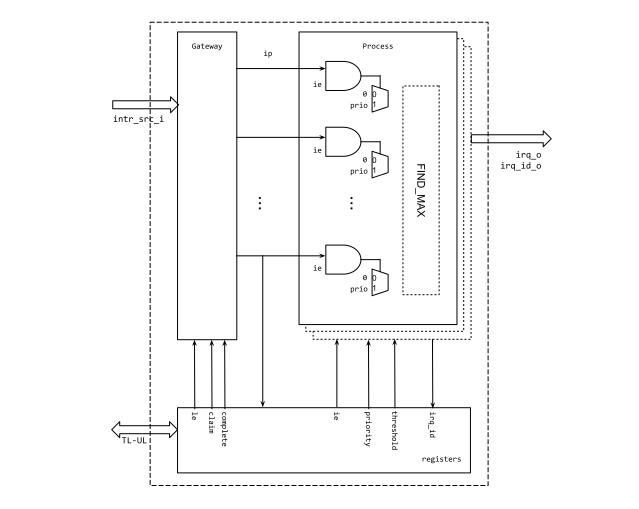

# Theory of Operation

## Block Diagram



## Hardware Interfaces

* [Interface Tables](../data/rv_plic.hjson#interfaces)

## Design Details

### Identifier

Each interrupt source has a unique ID assigned based upon its bit position
within the input `intr_src_i`. ID ranges from 0 to N, the number of interrupt
sources. ID 0 is reserved and represents no interrupt. The bit 0 of
`intr_src_i` shall be tied to 0 from the outside of RV_PLIC. The
`intr_src_i[i]` bit has an ID of `i`. This ID is used when targets "claim" the
interrupt and to "complete" the interrupt event.

### Priority and Threshold

Interrupt sources have configurable priority values. The maximum value of the
priority is configurable through the localparam `MAX_PRIO` in the rv_plic
top-level module. For each target there is a threshold value ([`THRESHOLD0`](../data/rv_plic.hjson#threshold0) for
target 0). RV_PLIC notifies a target of an interrupt only if it's priority is
strictly greater than the target's threshold. Note this means an interrupt with
a priority is 0 is effectively prevented from causing an interrupt at any target
and a target can suppress all interrupts by setting it's threshold to the max
priority value.

`MAX_PRIO` parameter is most area contributing option in RV_PLIC. If `MAX_PRIO`
is big, then finding the highest priority in Process module may consume a lot of
logic gates.

### Interrupt Gateways

The Gateway observes incoming interrupt sources and converts them to a common
interrupt format used internally by RV_PLIC. It can be parameterized to detect
interrupts events on an edge (when the signal changes from **0** to **1**) or
level basis (where the signal remains at **1**).
The choice is a system-integration decision and can be configured via the design parameter `LevelEdgeTrig` for each interrupt request.

When the gateway detects an interrupt event it raises the interrupt pending bit
([`IP`](../data/rv_plic.hjson#ip)) for that interrupt source. When an interrupt is claimed by a target the
relevant bit of [`IP`](../data/rv_plic.hjson#ip) is cleared. A bit in [`IP`](../data/rv_plic.hjson#ip) will not be reasserted until the
target signals completion of the interrupt. Any new interrupt event between a
bit in [`IP`](../data/rv_plic.hjson#ip) asserting and completing that interrupt is ignored. In particular
this means that for edge triggered interrupts if a new edge is seen after the
source's [`IP`](../data/rv_plic.hjson#ip) bit is asserted but before completion, that edge will be ignored
(counting missed edges as discussed in the RISC-V PLIC specification is not
supported).

Note that there is no ability for a level triggered interrupt to be cancelled.
If the interrupt drops after the gateway has set a bit in [`IP`](../data/rv_plic.hjson#ip), the bit will
remain set until the interrupt is completed. The SW handler should be conscious
of this and check the interrupt still requires handling in the handler if this
behaviour is possible.

### Interrupt Enables

Each target has a set of Interrupt Enable ([`IE0`](../data/rv_plic.hjson#ie0) for target 0) registers. Each
bit in the [`IE0`](../data/rv_plic.hjson#ie0) registers controls the corresponding interrupt source. If an
interrupt source is disabled for a target, then interrupt events from that
source won't trigger an interrupt at the target. RV_PLIC doesn't have a global
interrupt disable feature.

### Interrupt Claims

"Claiming" an interrupt is done by a target reading the associated
Claim/Completion register for the target ([`CC0`](../data/rv_plic.hjson#cc0) for target 0). The return value
of the [`CC0`](../data/rv_plic.hjson#cc0) read represents the ID of the pending interrupt that has the
highest priority.  If two or more pending interrupts have the same priority,
RV_PLIC chooses the one with lowest ID. Only interrupts that are enabled
for the target can be claimed. The target priority threshold doesn't matter
(this only factors into whether an interrupt is signalled to the target) so
lower priority interrupt IDs can be returned on a read from [`CC0`](../data/rv_plic.hjson#cc0). If no
interrupt is pending (or all pending interrupts are disabled for the target) a
read of [`CC0`](../data/rv_plic.hjson#cc0) returns an ID of 0.

### Interrupt Completion

After an interrupt is claimed, the relevant bit of interrupt pending ([`IP`](../data/rv_plic.hjson#ip)) is
cleared, regardless of the status of the `intr_src_i` input value.  Until a
target "completes" the interrupt, it won't be re-asserted if a new event for the
interrupt occurs. A target completes the interrupt by writing the ID of the
interrupt to the Claim/Complete register ([`CC0`](../data/rv_plic.hjson#cc0) for target 0). The write event
is forwarded to the Gateway logic, which resets the interrupt status to accept a
new interrupt event. The assumption is that the processor has cleaned up the
originating interrupt event during the time between claim and complete such that
`intr_src_i[ID]` will have de-asserted (unless a new interrupt has occurred).

```wavejson
{ signal: [
  { name: 'clk',           wave: 'p...........' },
  { name: 'intr_src_i[i]', wave: '01....0.1...', node:'.a....e.f...'},
  { name: 'irq_o',         wave: '0.1.0......1', node:'..b.d......h'},
  { name: 'irq_id_o',      wave: '=.=.=......=',
                           data: ["0","i","0","i"] },
  { name: 'claim',         wave: '0..10.......', node:'...c........'},
  { name: 'complete',      wave: '0.........10', node:'..........g.'},
  ],
  head:{
    text: 'Interrupt Flow',
    tick: 0,
  },
}
```

In the example above an interrupt for source ID `i` is configured as a level
interrupt and is raised at a, this results in the target being notified of the
interrupt at b. The target claims the interrupt at c (reading `i` from it's
Claim/Complete register) so `irq_o` deasserts though `intr_src_i[i]` remains
raised.  The SW handles the interrupt and it drops at e. However a new interrupt
quickly occurs at f. As complete hasn't been signaled yet `irq_o` isn't
asserted. At g the interrupt is completed (by writing `i` to it's
Claim/Complete register) so at h `irq_o` is asserted due to the new interrupt.
