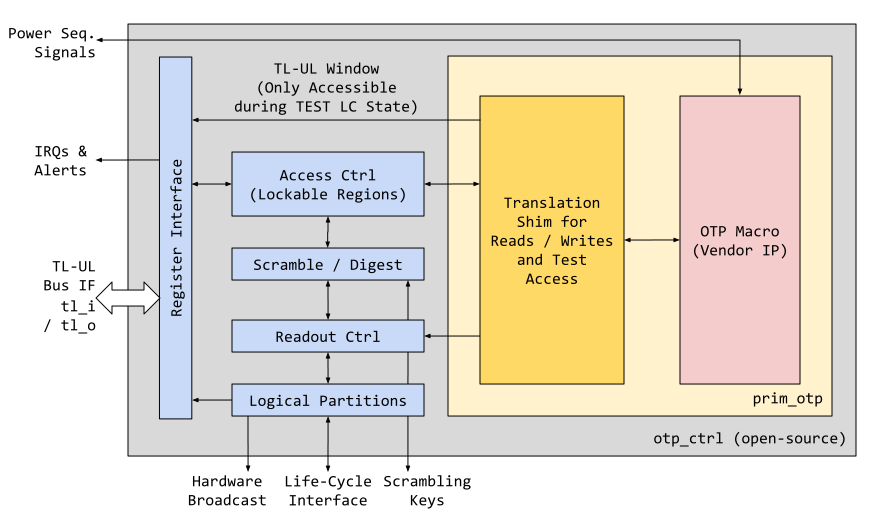

# OTP Controller Technical Specification

[`otp_ctrl`](https://reports.opentitan.org/hw/top_verbano/ip_autogen/otp_ctrl/dv/latest/report.html):

# Overview

This document specifies the functionality of the one time programmable (OTP) memory controller.
The OTP controller is a module that is a peripheral on the chip interconnect bus, and thus follows the [Comportability Specification](../../../../doc/contributing/hw/comportability/README.md).

The OTP is a module that provides a device with one-time-programming functionality.
The result of this programming is non-volatile, and unlike flash, cannot be reversed.
The OTP functionality is constructed through an open-source OTP controller and a proprietary OTP IP.

The OTP controller provides:
- An open-source abstraction interface that software can use to interact with a proprietary OTP block underneath.
- An open-source abstraction interface that hardware components (for example [life cycle controller](../../../ip/lc_ctrl/README.md) and [key manager](../../../ip/keymgr/README.md)) can use to interact with a proprietary OTP block underneath.
- High level logical security protection, such as integrity checks and scrambling of sensitive content.
- Software isolation for when OTP contents are readable and programmable.

The proprietary OTP IP provides:
- Reliable, non-volatile storage.
- Technology-specific redundancy or error correction mechanisms.
- Physical defensive features such as SCA and FI resistance.
- Visual and electrical probing resistance.

Together, the OTP controller and IP provide secure one-time-programming functionality that is used throughout the life cycle (LC) of a device.

## Features

- Multiple logical partitions of the underlying OTP IP
  - Each partition is lockable and integrity checked
  - Integrity digests are stored alongside each logical bank
- Periodic / persistent checks of OTP values
  - Periodic checks of shadowed content vs digests
  - Periodic checks of OTP stored content and shadowed content
  - Persistent checks for immediate errors
- Separate life cycle partition and interface to life cycle controller
  - Supports life cycle functions, but cannot be integrity locked
- Lightweight scrambling of secret OTP partition using a global netlist constant
- Lightweight ephemeral key derivation function for RAM scrambling mechanisms
- Lightweight key derivation function for FLASH scrambling mechanism

## OTP Controller Overview

The functionality of OTP is split into an open-source and a closed-source part, with a clearly defined boundary in between, as illustrated in the simplified high-level block diagram below.

It is the task of the open-source controller to provide a common, non-technology specific interface to OTP users with a common register interface and a clearly defined I/O interface to hardware.
The open-source controller implements logical isolation and partitioning of OTP storage that enables users to separate different functions of the OTP into "partitions" with different properties.
Finally, the open-source controller provides a high level of security for specific partitions by provisioning integrity digests for each partition, and scrambling of partitions where required.

The proprietary IP on the other hand translates a common access interface to the technology-specific OTP interface, both for functional and debug accesses (for example register accesses to the macro-internal control structure).

This split implies that every proprietary OTP IP must implement a translation layer from a standardized OpenTitan interface to the module underneath.
It also implies that no matter how the OTP storage or word size may change underneath, the open-source controller must present a consistent and coherent software and hardware interface.
This standardized interface is defined further below, and the wrapper leverages the same [technology primitive mechanism](../../../ip/prim/README.md) that is employed in other parts of OpenTitan in order to wrap and abstract technology-specific macros (such as memories and clocking cells) that are potentially closed-source.

In order to enable simulation and FPGA emulation of the OTP controller even without access to the proprietary OTP IP, a generalized and synthesizable model of the OTP IP is provided in the form of a [OTP MACRO hardware IP](https://github.com/lowRISC/opentitan/blob/master/hw/ip/otp_macro/rtl/otp_macro.sv).
