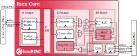

# Ibex RISC-V Core

Ibex is a small and efficient, 32-bit, in-order RISC-V core with a 2-stage pipeline that implements
the RV32IMC instruction set architecture.

Ibex offers several configuration parameters to meet the needs of various application scenarios.
The options include two different choices for the architecture of the multiplier and divider unit,
as well as the possibility to drop the support for the "M" extension completely. In addition, the
"E" extension can be enabled when opting for a minimum-area configuration.

This core was initially developed as part of the [PULP platform](https://www.pulp-platform.org)
under the name "Zero-riscy" \[[1](https://doi.org/10.1109/PATMOS.2017.8106976)\], and has been
contributed to [lowRISC](https://www.lowrisc.org) who maintains it and develops it further. It is
under active development, with further code cleanups, feature additions, and test and verification
planned for the future.

## Documentation

The Ibex user manual can be
[read online at ReadTheDocs](https://ibex-core.readthedocs.io/en/latest/). It is also contained in
the `doc` folder of this repository.

## Contributing

We highly appreciate community contributions. To ease our work of reviewing your contributions,
please:

* Create your own branch to commit your changes and then open a Pull Request.
* Split large contributions into smaller commits addressing individual changes or bug fixes. Do not
  mix unrelated changes into the same commit!
* Write meaningful commit messages. For more information, please check out the [contribution
  guide](https://github.com/lowrisc/ibex/blob/master/CONTRIBUTING.md).
* If asked to modify your changes, do fixup your commits and rebase your branch to maintain a
  clean history.

When contributing SystemVerilog source code, please try to be consistent and adhere to [our Verilog
coding style guide](https://github.com/lowRISC/style-guides/blob/master/VerilogCodingStyle.md).

When contributing C or C++ source code, please try to adhere to [the OpenTitan C++ coding style
guide](https://docs.opentitan.org/doc/rm/c_cpp_coding_style/).
All C and C++ code should be formatted with clang-format before committing.
Either run `clang-format -i filename.cc` or `git clang-format` on added files.

To get started, please check out the ["Good First Issue"
 list](https://github.com/lowrisc/ibex/issues?q=is%3Aissue+is%3Aopen+label%3A%22Good+First+Issue%22).

## Issues and Troubleshooting

If you find any problems or issues with Ibex or the documentation, please check out the [issue
 tracker](https://github.com/lowrisc/ibex/issues) and create a new issue if your problem is
not yet tracked.

## Questions?

Do not hesitate to contact us, e.g., on our public [Ibex channel on
Zulip](https://lowrisc.zulipchat.com/#narrow/stream/198227-ibex)!

## License

Unless otherwise noted, everything in this repository is covered by the Apache
License, Version 2.0 (see LICENSE for full text).

## Credits

Many people have contributed to Ibex through the years. Please have a look at
the [credits file](CREDITS.md) and the commit history for more information.

## References
1. [Schiavone, Pasquale Davide, et al. "Slow and steady wins the race? A comparison of
 ultra-low-power RISC-V cores for Internet-of-Things applications."
 _27th International Symposium on Power and Timing Modeling, Optimization and Simulation
 (PATMOS 2017)_](https://doi.org/10.1109/PATMOS.2017.8106976)
