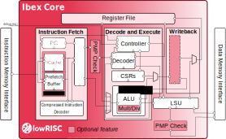

# Ibex RISC-V Core

Ibex is a production-quality open source 32-bit RISC-V CPU core written in
SystemVerilog. The CPU core is heavily parametrizable and well suited for
embedded control applications. Ibex is being extensively verified and has
seen multiple tape-outs. Ibex supports the Integer (I) or Embedded (E),
Integer Multiplication and Division (M), Compressed (C), and B (Bit
Manipulation) extensions.

The block diagram below shows the *small* parametrization with a 2-stage
pipeline.

Ibex was initially developed as part of the [PULP platform](https://www.pulp-platform.org)
under the name ["Zero-riscy"](https://doi.org/10.1109/PATMOS.2017.8106976), and has been
contributed to [lowRISC](https://www.lowrisc.org) who maintains it and develops it further. It is
under active development.

## Configuration

Ibex offers several configuration parameters to meet the needs of various application scenarios.
The options include different choices for the architecture of the multiplier unit, as well as a range of performance and security features.
The table below indicates performance, area and verification status for a few selected configurations.
These are configurations on which lowRISC is focusing for performance evaluation and design verification (see [supported configs](ibex_configs.yaml)).

| Config | "micro" | "small" | "maxperf" | "maxperf-pmp-bmfull" |
| ------ | ------- | --------| ----------| -------------------- |
| Features | RV32EC | RV32IMC, 3 cycle mult | RV32IMC, 1 cycle mult, Branch target ALU, Writeback stage | RV32IMCB, 1 cycle mult, Branch target ALU, Writeback stage, 16 PMP regions |
| Performance (CoreMark/MHz) | 0.904 | 2.47 | 3.13 | 3.05 |
| Area - Yosys (kGE) | 17.44 | 26.06 | 35.64 | 58.74 |
| Area - Commercial (estimated kGE) | ~16 | ~24 | ~33 | ~54 |
| Verification status | Red | Green | Amber | Amber |

Notes:

* Performance numbers are based on CoreMark running on the Ibex Simple System [platform](examples/simple_system/README.md).
  Note that different ISAs (use of B and C extensions) give the best results for different configurations.
  See the [Benchmarks README](examples/sw/benchmarks/README.md) for more information.
  The "maxperf-pmp-bmfull" configuration sets a `SpecBranch` parameter in `ibex_core.sv`; this helps timing but has a small negative performance impact.
* Yosys synthesis area numbers are based on the Ibex basic synthesis [flow](syn/README.md) using the latch-based register file.
* Commercial synthesis area numbers are a rough estimate of what might be achievable with a commercial synthesis flow and technology library.
* For comparison, the original "Zero-riscy" core yields an area of 23.14kGE using our Yosys synthesis flow.
* Verification status is a rough guide to the overall maturity of a particular configuration.
  Green indicates that verification is close to complete.
  Amber indicates that some verification has been performed, but the configuration is still experimental.
  Red indicates a configuration with minimal/no verification.
  Users must make their own assessment of verification readiness for any tapeout.
* v0.92 of the RISC-V Bit Manipulation Extension is supported.
  This is *not ratified* and there may be changes for the v1.0 ratified version.
  See [Standards Compliance](https://ibex-core.readthedocs.io/en/latest/01_overview/compliance.html) in the Ibex documentation for more information.

## Documentation

The Ibex user manual can be
[read online at ReadTheDocs](https://ibex-core.readthedocs.io/en/latest/). It is also contained in
the `doc` folder of this repository.

## Contributing

We highly appreciate community contributions. To ease our work of reviewing your contributions,
please:

* Create your own branch to commit your changes and then open a Pull Request.
* Split large contributions into smaller commits addressing individual changes or bug fixes. Do not
  mix unrelated changes into the same commit!
* Write meaningful commit messages. For more information, please check out the [contribution
  guide](https://github.com/lowrisc/ibex/blob/master/CONTRIBUTING.md).
* If asked to modify your changes, do fixup your commits and rebase your branch to maintain a
  clean history.

When contributing SystemVerilog source code, please try to be consistent and adhere to [our Verilog
coding style guide](https://github.com/lowRISC/style-guides/blob/master/VerilogCodingStyle.md).

When contributing C or C++ source code, please try to adhere to [the OpenTitan C++ coding style
guide](https://docs.opentitan.org/doc/rm/c_cpp_coding_style/).
All C and C++ code should be formatted with clang-format before committing.
Either run `clang-format -i filename.cc` or `git clang-format` on added files.

To get started, please check out the ["Good First Issue"
 list](https://github.com/lowrisc/ibex/issues?q=is%3Aissue+is%3Aopen+label%3A%22Good+First+Issue%22).

## Issues and Troubleshooting

If you find any problems or issues with Ibex or the documentation, please check out the [issue
 tracker](https://github.com/lowrisc/ibex/issues) and create a new issue if your problem is
not yet tracked.

## Questions?

Do not hesitate to contact us, e.g., on our public [Ibex channel on
Zulip](https://lowrisc.zulipchat.com/#narrow/stream/198227-ibex)!

## License

Unless otherwise noted, everything in this repository is covered by the Apache
License, Version 2.0 (see LICENSE for full text).

## Credits

Many people have contributed to Ibex through the years. Please have a look at
the [credits file](CREDITS.md) and the commit history for more information.
