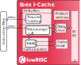
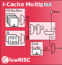

.. _icache:

Instruction Cache
=================
:file:`rtl/ibex_icache.sv.`

NOTE - This module is currently DRAFT

The optional Instruction Cache (I$) is designed to improve CPU performance in systems with high instruction memory latency.
The I$ integrates into the CPU by replacing the prefetch buffer, interfacing directly between the bus and IF stage.

High-level operation
--------------------

The I$ passes instructions to the core using a ready / valid interface.
Inside the cache is an address counter, which increments for every instruction fetched (by 2 or 4 bytes, depending on whether the instruction contents show it to be compressed).
When the core takes a branch, it resets the counter to a new address by raising the ``branch_i`` signal and supplying the new address on ``addr_i``.
The next instruction returned by the cache will be the instruction at this new address.

The I$ communicates with instruction memory using an interface that matches the IF stage (allowing the cache to be enabled or disabled without needing to change the Ibex toplevel's interface). For more details of this interface, see :ref:`instruction-fetch`.

To avoid the cache fetching needlessly when the core is asleep (after a ``wfi`` instruction), it has a ``req_i`` input. Shortly after this goes low, the cache will stop making memory transactions.

If the ``icache_enable_i`` input is low, the cache operates in pass-through mode, where every requested instruction is fetched from memory and no results are cached.

In order to invalidate the cache, the core can raise the ``icache_inval_i`` line for one or more cycles, which will start an internal cache invalidation.
No fetches are cached while the invalidation is taking place (behaving as if ``icache_enable_i`` is low).

While the I$ is busy, either (pre)fetching data or invalidating its memory, it raises the ``busy_o`` signal.
This can be used to avoid the cache's clock being gated when it is doing something.

Configuration options
---------------------

The following table describes the available configuration parameters.

+-------------------------+-----------+-----------------------------------------------+
| Parameter               | Default   | Description                                   |
+=========================+===========+===============================================+
| ``BusWidth``            | ``32``    | Width of instruction bus. Note, this is fixed |
|                         |           | at 32 for Ibex at the moment.                 |
+-------------------------+-----------+-----------------------------------------------+
| ``CacheSizeBytes``      | ``4kB``   | Size of cache in bytes.                       |
+-------------------------+-----------+-----------------------------------------------+
| ``CacheECC``            | ``1'b0``  | Enable SECDED ECC protection in tag and data  |
|                         |           | RAMs.                                         |
+-------------------------+-----------+-----------------------------------------------+
| ``LineSize``            | ``64``    | The width of one cache line in bits.          |
|                         |           | Line sizes smaller than 64 bits may give      |
|                         |           | compilation errors.                           |
+-------------------------+-----------+-----------------------------------------------+
| ``NumWays``             | ``2``     | The number of ways.                           |
+-------------------------+-----------+-----------------------------------------------+
| ``BranchCache``         | ``1'b0``  | When set, the cache will only allocate the    |
|                         |           | targets of branches + two subsequent cache    |
|                         |           | lines. This gives improved performance in     |
|                         |           | systems with moderate latency by not          |
|                         |           | polluting the cache with data that can be     |
|                         |           | prefetched instead.                           |
|                         |           | When not set, all misses are allocated.       |
+-------------------------+-----------+-----------------------------------------------+

Performance notes
-----------------

Note that although larger cache line sizes allow for better area efficiency (lower tagram area overhead), there is a performance penalty.
When the core branches to an address that is not aligned to the bottom of a cache line (and the request misses in the cache), the I$ will attempt to fetch this address first from the bus.
The I$ will then fetch the rest of the remaining beats of data in wrapping address order to complete the cache line (in order to allocate it to the cache).
While these lower addresses are being fetched, the core is starved of data.
Based on current experimental results, a line size of 64 bits gives the best performance.

In cases where the core branches to addresses currently being prefetched, the same line can end up allocated to the cache in multiple ways.
This causes a minor performance inefficiency, but should not happen often in practice.

RAM Arrangement
---------------

The data RAMs are arranged as ``NumWays`` banks of ``LineSize`` width.
If ECC is configured, the tag and data banks will be wider to accomodate the extra checkbits.

Indicative RAM sizes for common configurations are given in the table below:

+------------------------------+-----------------+------------------+
| Cache config                 | Tag RAMs        | Data RAMs        |
+==============================+=================+==================+
| 4kB, 2 way, 64bit line       | 2 x 256 x 22bit | 2 x 256 x 64bit  |
+------------------------------+-----------------+------------------+
| 4kB, 2 way, 64bit line w/ECC | 2 x 256 x 28bit | 2 x 256 x 72bit  |
+------------------------------+-----------------+------------------+
| 4kB, 2 way, 128bit line      | 2 x 128 x 22bit | 2 x 128 x 128bit |
+------------------------------+-----------------+------------------+
| 4kB, 4 way, 64bit line       | 4 x 128 x 22bit | 4 x 128 x 64bit  |
+------------------------------+-----------------+------------------+

Sub Unit Description
--------------------

   Instruction Cache Block Diagram

Prefetch Address
^^^^^^^^^^^^^^^^

The prefetch address is updated to the branch target on every branch.
This address is then updated in cache-line increments each time a cache lookup is issued to the cache pipeline.

Cache Pipeline
^^^^^^^^^^^^^^

The cache pipeline consists of two stages, IC0 and IC1.

In IC0, lookup requests are arbitrated against cache allocation requests.
Lookup requests have highest priority since they naturally throttle themselves as fill buffer resources run out.
The arbitrated request is made to the RAMs in IC0.

In IC1, data from the RAMs are available and the cache hit status is determined.
Hit data is multiplexed from the data RAMs based on the hitting way.
If there was a cache miss, the victim way is chosen pseudo-randomly using a counter.

Fill buffers
^^^^^^^^^^^^

The fill buffers perform several functions in the I$ and constitute most of it's complexity.

* Since external requests can be made speculatively in parallel with the cache lookup, a fill buffer must be allocated in IC0 to track the request.
* The fill buffers are used as data storage for hitting requests as well as for miss tracking so all lookup requests require a fill buffer.
* A fill buffer makes multiple external requests to memory to fetch the required data to fill a cache line (tracked via ``fill_ext_cnt_q``).
* Returning data is tracked via ``fill_rvd_cnt_q``.
  Not all requests will fetch all their data, since requests can be cancelled due to a cache hit or an intervening branch.
* If a fill buffer has not made any external requests it will be cancelled by an intervening branch, if it has made requests then the requests will be completed and the line allocated.
* Beats of data are supplied to the IF stage, tracked via ``fill_out_cnt_q``.
* If the line is due to be allocated into the cache, it will request for arbitration once all data has been received.
* Once all required actions are complete, the fill buffer releases and becomes available for a new request.

Since requests can perform actions out of order (cache hit in the shadow of an outstanding miss), and multiple requests can complete at the same time, the fill buffers are not a simple FIFO.
Each fill buffer maintains a matrix of which requests are older than it, and this is used for arbitrating between the fill buffers.

Data output
^^^^^^^^^^^

   Instruction Cache Data Multiplexing

Data supplied to the IF stage are multiplexed between cache-hit data, fill buffer data, and incoming memory data.
The fill buffers track which request should supply data, and where that data should come from.
Data from the cache and the fill buffers are of cache line width, which is multiplexed down to 32 bits and then multiplexed against data from the bus.

The fill buffers attempt to supply the relevant word of data to the IF stage as soon as possible.
Hitting requests will supply the first word directly from the RAMs in IC1 while demand misses will supply data directly from the bus.
The remaining data from hits is buffered in the fill buffer data storage and supplied to the IF stage as-required.

To deal with misalignment caused by compressed instructions, there is a 16bit skid buffer to store the upper halfword.

Cache ECC protection
^^^^^^^^^^^^^^^^^^^^

When ECC protection is enabled, extra checkbits are appended to the top of the tag and data RAM write data as follows:

For the Tag RAMs (4kB cache):

+---------------+-----------+--------+
| ECC checkbits | Valid bit | Tag    |
+---------------+-----------+--------+
| [27:22]       | [21]      | [20:0] |
+---------------+-----------+--------+

For the Data RAMs (64bit line):

+---------------+--------+
| ECC checkbits | Data   |
+---------------+--------+
| [71:64]       | [63:0] |
+---------------+--------+

The checkbits are generated by dedicated modules in IC0 before the RAMs are written.
In IC1, the RAM read data and checkbits are fed into dedicated modules which output whether there was an error.
Although the modules used have the required outputs to allow inline correction of single bit errors, the I$ does not make use of them since it never performs corrections.

Any error (single or double bit) in any RAM will effectively cancel a cache hit in IC1.
The request which observed an error will fetch it's data from the main instruction memory as normal for a cache miss.
The cache index and way (or ways) with errors are stored in IC1, and a cache write is forced the next cycle to invalidate that line.
Lookup requests will be blocked in IC0 while the invalidation write is performed.

Cache invalidation
^^^^^^^^^^^^^^^^^^

After reset, and when requested by the core (due to a FENCE.I instruction), the whole cache is invalidated.
Requests are inserted to invalidate the tag RAM for all ways in each cache line in sequence.
While the invalidation is in-progress, lookups and instruction fetches can proceed, but nothing will be allocated to the cache.

Detailed behaviour
^^^^^^^^^^^^^^^^^^

This section describes the expected behaviour of the cache, in order to allow functional verification.
This isn't an attempt to describe the cache's performance characteristics.

The I$ has a single clock (``clk_i``) and asynchronous reset (``rst_ni``).

Data is requested from the instruction memory with the ports prefixed by ``instr_``. These work as described in :ref:`instruction-fetch`.
Note that there's one extra port on the I$, which doesn't appear at the ``ibex_core`` top-level.
This is ``instr_pmp_err_i``.
If the PMP block disallows a fetch for a certain address, it will squash the outgoing memory request entirely and set ``instr_pmp_err_i``.
If that happens, the cache drops ``instr_req_o`` and stops making any further requests for that cache line.
Note that it is possible for ``instr_gnt_i`` and ``instr_pmp_err_i`` to be high on the same cycle.
In that case, the error signal takes precedence.

Fetched instructions are returned to the core using ports ``ready_i``, ``valid_o``, ``rdata_o``, ``addr_o``, ``err_o`` and ``err_plus2_o``.
This interface uses a form of ready/valid handshaking.
A transaction is signalled by ready and valid being high.
If valid goes high, it will remain high and the other output signals will remain stable until the transaction goes through or is cancelled by ``branch_i`` being asserted.
The only exception is after an error is passed to the core. Once that has happened, there is no constraint on the values of ``valid_o``, ``rdata_o``, ``addr_o``, ``err_o`` and ``err_plus2_o`` until the next time ``branch_i`` is asserted.
There is no constraint on the behaviour of ``ready_i``.

The 32-bit wide ``rdata_o`` signal contains instruction data fetched from ``addr_o``.
An instruction is either 16 or 32 bits wide (called *compressed* or *uncompressed*, respectively).
The width of an instruction can be calculated from its bottom two bits: an instruction is uncompressed if they equal ``2'b11`` and compressed otherwise.
If there is a compressed instruction in the lower 16 bits, the upper 16 bits are unconstrained (and may change even after valid has been asserted).
The ``err_o`` signal will be high if the instruction fetch failed (either with ``instr_pmp_err_i`` or ``instr_err_i``); in this case ``rdata_o`` is not specified.

The ``req_i`` signal tells the cache that the core is awake and will start requesting instructions soon.
As well as the main cache memory, the I$ contains a prefetch buffer.
The cache fills this buffer by issuing fetches when ``req_i`` is high.
If ``req_i`` becomes false, the cache may do a few more instruction fetches to fill a cache line, but will stop fetching when that is done.
The cache will not do any instruction fetches after this until ``req_i`` goes high again.
A correctly behaving core should not not assert ``ready_i`` when ``req_i`` is low.

Inside the cache is an address counter.
If ``branch_i`` is asserted then the address counter will be set to ``addr_i`` and the next instruction that is passed to the core will be the one fetched from that address.
The address is required to be halfword aligned, so ``addr_i[0]`` must be zero.
The cache will also start reading into a new prefetch buffer, storing the current contents into the main cache memory or discarding it (see ``icache_enable_i`` below).
On cycles where ``branch_i`` is not asserted, the address counter will be incremented when an instruction is passed to the core.
This increment depends on the instruction data (visible at ``rdata_o``): it will be 2 if the instruction is compressed and 4 otherwise.
Since the contents of ``rdata_o`` are not specified if an instruction fetch has caused an error, the core must signal a branch before accepting another instruction after it sees ``err_o``.

There is an additional branch signal ``branch_spec_i`` which is a speculative version of the actual branch signal.
Internally, ``branch_spec_i`` is used to setup address multiplexing as it is available earlier in the cycle.
In cases where ``branch_spec_i`` is high, but ``branch_i`` is low, any lookup that might have been made that cycle is suppressed.
Note that if ``branch_i`` is high, ``branch_spec_i`` must also be high.

Because a single instruction can span two 32bit memory addresses, an extra signal (``err_plus2_o``) indicates when an error is caused by the second half of an unaligned uncompressed instruction.
This signal is only valid when ``valid_o`` and ``err_o`` are set, and will only be set for uncompressed instructions.
The core uses this signal to record the correct address in the ``mtval`` CSR upon an error.

Since the address counter is not initialised on reset, the behaviour of the I$ is unspecified unless ``branch_i`` is asserted on or before the first cycle that ``req_i`` is asserted after reset.
If that is not true, there's nothing to stop the cache fetching from random addresses.

The ``icache_enable_i`` signal controls whether the cache copies fetched data from the prefetch buffer to the main cache memory.
If the signal is false, fetched data will be discarded on a branch or after enough instructions have been consumed by the core.
On reset, or whenever ``icache_inval_i`` goes high, the cache will invalidate its stored data.
While doing this, the cache behaves as if ``icache_enable_i`` is false and will not store any fetched data.

.. note::
   The rules for ``icache_enable_i`` and ``icache_inval_i`` mean that, in order to be completely sure of executing newly fetched code, the core should raise the ``icache_inval_i`` line for at least a cycle and then should branch. The Ibex core does this in response to a ``FENCE.I`` instruction, branching explicitly to the next PC.

The ``busy_o`` signal is guaranteed to be high while the cache is invalidating its internal memories or whenever it has a pending fetch on the instruction bus.
When the ``busy_o`` signal is low, it is safe to clock gate the cache.

The cache doesn't have circuitry to avoid inconsistent multi-way hits.
As such, the core must never fetch from an address with the cache enabled after modifying the data at that address, without first starting a cache invalidation.

.. note::
   This is a constraint on *software*, not just on the core.
