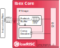

.. _instruction-fetch:

Instruction Fetch
=================
:file:`rtl/ibex_if_stage.sv.`

   Instruction Fetch (IF) stage

The Instruction Fetch (IF) stage of the core is able to supply one instruction to the Instruction-Decode (ID) stage per cycle if the instruction cache or the instruction memory is able to serve one instruction per cycle.

Instructions are fetched into a prefetch buffer (:file:`rtl/ibex_prefetch_buffer.sv`) for optimal performance and timing closure reasons.
This buffer simply fetches instructions linearly until it is full.
The instructions themselves are stored along with the Program Counter (PC) they came from in the fetch FIFO (:file:`rtl/ibex_fetch_fifo.sv`).
The fetch FIFO has a feedthrough path so when empty a new instruction entering the FIFO is immediately made available on the FIFO output.
A localparam ``DEPTH`` gives a configurable depth which is set to 3 by default.

The top-level of the instruction fetch controls the prefetch buffer (in particular flushing it on branches/jumps/exception and beginning prefetching from the appropriate new PC) and supplies new instructions to the ID/EX stage along with their PC.
Compressed instructions are expanded by the IF stage so the decoder can always deal with uncompressed instructions (the ID stage still receives the compressed instruction for placing into ``mtval`` on an illegal instruction exception).

If Ibex has been configured with an instruction cache (parameter ICache == 1), then the prefetch buffer is replaced by the icache module (:ref:`icache`).
The interfaces of the icache module are the same as the prefetch buffer with two additions.
Firstly, a signal to enable the cache which is driven from a custom CSR.
Secondly a signal to the flush the cache which is set every time a ``fence.i`` instruction is executed.

Branch Prediction
-----------------

Ibex can be configured to use static branch prediction by setting the ``BranchPrediction`` parameter to 1.
This improves performance by predicting that any branch with a negative offset is taken and that any branch with a positive offset is not.
When successful, the prediction removes a stall cycle from a taken branch.
However, there is a mis-predict penalty if a branch is wrongly predicted to be taken.
This penalty is at least one cycle, or at least two cycles if the instruction following the branch is uncompressed and not aligned.
This feature is *EXPERIMENTAL* and its effects are not yet fully documented.

Instruction-Side Memory Interface
---------------------------------

The following table describes the signals that are used to fetch instructions.
This interface is a simplified version of the interface used on the data interface as described in :ref:`load-store-unit`.
The main difference is that the instruction interface does not allow for write transactions and thus needs less signals.

.. tabularcolumns:: |p{4cm}|l|p{9cm}|

+-----------------------------+-----------+-----------------------------------------------+
| Signal                      | Direction | Description                                   |
+=============================+===========+===============================================+
| ``instr_req_o``             | output    | Request valid, must stay high until           |
|                             |           | ``instr_gnt_i`` is high for one cycle         |
+-----------------------------+-----------+-----------------------------------------------+
| ``instr_addr_o[31:0]``      | output    | Address, word aligned                         |
+-----------------------------+-----------+-----------------------------------------------+
| ``instr_gnt_i``             | input     | The other side accepted the request.          |
|                             |           | ``instr_req_o`` may be deasserted in the next |
|                             |           | cycle.                                        |
+-----------------------------+-----------+-----------------------------------------------+
| ``instr_rvalid_i``          | input     | ``instr_rdata_i`` holds valid data when       |
|                             |           | ``instr_rvalid_i`` is high. This signal will  |
|                             |           | be high for exactly one cycle per request.    |
+-----------------------------+-----------+-----------------------------------------------+
| ``instr_rdata_i[31:0]``     | input     | Data read from memory                         |
+-----------------------------+-----------+-----------------------------------------------+
| ``instr_rdata_intg_i[6:0]`` | input     | Data integrity bits from memory               |
+-----------------------------+-----------+-----------------------------------------------+
| ``instr_err_i``             | input     | Memory access error                           |
+-----------------------------+-----------+-----------------------------------------------+

Misaligned Accesses
-------------------

Externally, the IF interface performs word-aligned instruction fetches only.
Misaligned instruction fetches are handled by performing two separate word-aligned instruction fetches.
Internally, the core can deal with both word- and half-word-aligned instruction addresses to support compressed instructions.
The LSB of the instruction address is ignored internally.

Protocol
--------

The protocol used to communicate with the instruction cache or the instruction memory is very similar to the protocol used by the LSU on the data interface of Ibex.
See the description of the LSU in :ref:`LSU Protocol<lsu-protocol>` for details about this protocol.

