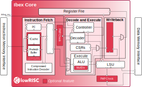

.. _pipeline-details:

   Ibex Pipeline

Pipeline Details
================
Ibex has a 2-stage pipeline, the 2 stages are:

Instruction Fetch (IF)
  Fetches instructions from memory via a prefetch buffer, capable of fetching 1 instruction per cycle if the instruction side memory system allows. See :ref:`instruction-fetch` for details.

Instruction Decode and Execute (ID/EX)
  Decodes fetched instruction and immediately executes it, register read and write all occurs in this stage.
  Multi-cycle instructions will stall this stage until they are complete See :ref:`instruction-decode-execute` for details.

All instructions require two cycles minimum to pass down the pipeline.
One cycle in the IF stage and one in the ID/EX stage.
Not all instructions can complete in the ID/EX stage in one cycle so will stall there until they complete.
This means the maximum IPC (Instructions per Cycle) Ibex can achieve is 1 when multi-cycle instructions aren't used.
See Multi- and Single-Cycle Instructions below for the details.

Third Pipeline Stage
--------------------
Ibex can be configured to have a third pipeline stage (Writeback) which has major effects on performance and instruction behaviour.
This feature is *EXPERIMENTAL* and the details of its impact are not yet documented here.
All of the information presented below applies only to the two stage pipeline provided in the default configurations.

Multi- and Single-Cycle Instructions
------------------------------------

In the table below when an instruction stalls for X cycles X + 1 cycles pass before a new instruction enters the ID/EX stage.
Some instructions stall for a variable time, this is indicated as a range e.g. 1 - N means the instruction stalls a minimum of 1 cycle with an indeterminate maximum cycles.
Read the description for more information.

+-----------------------+--------------------------------------+-------------------------------------------------------------+
|   Instruction Type    |             Stall Cycles             |                         Description                         |
+=======================+======================================+=============================================================+
| Integer Computational | 0                                    | Integer Computational Instructions are defined in the       |
|                       |                                      | RISCV-V RV32I Base Integer Instruction Set.                 |
+-----------------------+--------------------------------------+-------------------------------------------------------------+
| CSR Access            | 0                                    | CSR Access Instruction are defined in 'Zicsr' of the        |
|                       |                                      | RISC-V specification.                                       |
+-----------------------+--------------------------------------+-------------------------------------------------------------+
| Load/Store            | 1 - N                                | Both loads and stores stall for at least one cycle to await |
|                       |                                      | a response.  For loads this response is the load data       |
|                       |                                      | (which is written directly to the register file the same    |
|                       |                                      | cycle it is received).  For stores this is whether an error |
|                       |                                      | was seen or not.  The longer the data side memory interface |
|                       |                                      | takes to receive a response the longer loads and stores     |
|                       |                                      | will stall.                                                 |
+-----------------------+--------------------------------------+-------------------------------------------------------------+
| Multiplication        | 0/1 (Single-Cycle Multiplier)        | 0 for MUL, 1 for MULH.                                      |
|                       |                                      |                                                             |
|                       | 2/3 (Fast Multi-Cycle Multiplier)    | 2 for MUL, 3 for MULH.                                      |
|                       |                                      |                                                             |
|                       | clog2(``op_b``)/32 (Slow Multi-Cycle | clog2(``op_b``) for MUL, 32 for MULH.                       |
|                       | Multiplier)                          | See details in :ref:`mult-div`.                             |
+-----------------------+--------------------------------------+-------------------------------------------------------------+
| Division              | 1 or 37                              | 1 stall cycle if divide by 0, otherwise full long division. |
|                       |                                      | See details in :ref:`mult-div`                              |
| Remainder             |                                      |                                                             |
+-----------------------+--------------------------------------+-------------------------------------------------------------+
| Jump                  | 1 - N                                | Minimum one cycle stall to flush the prefetch counter and   |
|                       |                                      | begin fetching from the new Program Counter (PC).  The new  |
|                       |                                      | PC request will appear on the instruction-side memory       |
|                       |                                      | interface the same cycle the jump instruction enters ID/EX. |
|                       |                                      | The longer the instruction-side memory interface takes to   |
|                       |                                      | receive data the longer the jump will stall.                |
+-----------------------+--------------------------------------+-------------------------------------------------------------+
| Branch (Not-Taken)    | 0                                    | Any branch where the condition is not met will              |
|                       |                                      | not stall.                                                  |
+-----------------------+--------------------------------------+-------------------------------------------------------------+
| Branch (Taken)        | 2 - N                                | Any branch where the condition is met will stall for 2      |
|                       |                                      | cycles as in the first cycle the branch is in ID/EX the ALU |
|                       | 1 - N (Branch Target                 | is used to calculate the branch condition.  The following   |
|                       | ALU enabled)                         | cycle the ALU is used again to calculate the branch target  |
|                       |                                      | where it proceeds as Jump does above (Flush IF stage and    |
|                       |                                      | prefetch buffer, new PC on instruction-side memory          |
|                       |                                      | interface the same cycle it is calculated).  The longer the |
|                       |                                      | instruction-side memory interface takes to receive data the |
|                       |                                      | longer the branch will stall. With the parameter            |
|                       |                                      | ``BranchTargetALU`` set to ``1`` a separate ALU calculates  |
|                       |                                      | the branch target simultaneously to calculating the branch  |
|                       |                                      | condition with the main ALU so 1 less stall cycle is        |
|                       |                                      | required.                                                   |
+-----------------------+--------------------------------------+-------------------------------------------------------------+
| Instruction Fence     | 1 - N                                | The FENCE.I instruction as defined in 'Zifencei' of the     |
|                       |                                      | RISC-V specification. Internally it is implemented as a     |
|                       |                                      | jump (which does the required flushing) so it has the same  |
|                       |                                      | stall characteristics (see above).                          |
+-----------------------+--------------------------------------+-------------------------------------------------------------+
