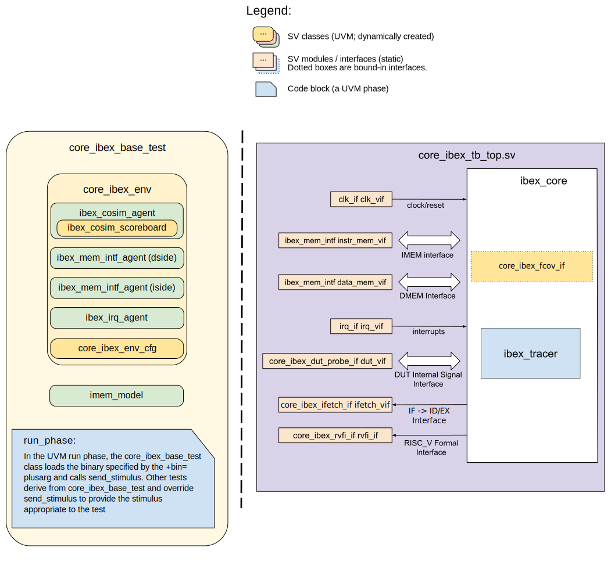

.. _testplan:

.. todo::

  Add detail about security hardening verification.

.. note::

  This testplan is a work in progress still being implemented so this document may not match the implemented verification in the repository.

Test Plan
=========

Goals
-----

* Verify compliance with all the RISC-V specifications Ibex supports.
* Verify Ibex's security hardening features.
* Ensure correct functionality is maintained across all possible behaviours of external interfaces (interrupts, memory responses, debug requests etc).
* Hit all functional coverage points, described in :ref:`coverage-plan`.

Testbench Architecture
----------------------

    Architecture of the UVM testbench for Ibex core

Ibex utilises a co-simulation checking approach described in detail in :ref:`cosim`.
With the co-simulation system all instructions Ibex executes and all external events such as an interrupts or memory errors are fed to a golden model.
The results of every instruction execution and every memory access are crossed checked against the golden model with any mismatches resulting in a test failure.
The aim is to check all possible externally observable behaviours of ``ibex_top`` against the golden model.
The golden model used is the `Spike RISC-V ISS <https://github.com/riscv-software-src/riscv-isa-sim>`_.

The testbench uses UVM.
It consists of 3 agents:

Co-simulation Agent:
  This has multiple monitors.
  One monitors the RVFI interface which provides details of retired instructions.
  The other monitors relate to fetched instructions and instruction memory errors; more details are provided in :ref:`coverage-plan`.
  Additionally it connects to the monitor of the Memory Interface Agent for the instruction and data side via analysis ports.
  The monitored transactions are used by a scoreboard to provide information to the co-simulation system allowing it to step the golden model and check its execution and memory activity against Ibex's behaviour.

Memory Interface Agent
  This provides a driver and a monitor for the :ref:`Ibex Memory Interface Protocol<lsu-protocol>`.
  The driver provides fully randomised and configurable timings for responses and randomisation of error responses.
  Two agents are instantiated; one for the data memory interface the other for the instruction memory interface.
  Read data for memory responses is provided from a backing memory; write requests update the contents of the backing memory.
  This is separate from the memory used by the golden model in the co-simulation agent.
  The contents of these two memories will be identical unless there is a mismatch resulting in a failure.
  The backing memory is held in a memory model as a separate UVM component.
  The two agents use the same backing memory so they have a coherent view of memory.

IRQ Agent
  This provides a driver and a monitor for the IRQ interface.
  It provides randomised interrupt stimulus to Ibex when a test requests it.
  Constraints can be used to control types of interrupts generated (e.g. NMI or not) and whether multiple interrupts should be raised together.

Debug and reset signals are a single wire each so do not have a dedicated agent.
Instead any sequence that wishes to use them will directly manipulate them via a virtual interface

The testbench instantiates the agents described above along with the memory model used by both the data and instruction side memory agents.
A test consists of executing a pre-built binary (which is loaded into the memory model at the start of the test via backdoor accesses) along with configuring agents to provide appropriate stimulus for the test.
Some tests may use the agents to generate stimulus at particular times (e.g.  interrupts).
A test may perform additional checking on top of the co-simulation golden model comparison where appropriate (e.g. ensuring a raised interrupt has caused an exception).

Stimulus Strategy
-----------------

Stimulus falls into two categories:

* Instructions to execute: These are generated by the `RISC-V DV random instruction <https://github.com/google/riscv-dv>`_ generator and provided to the testbench via a raw binary file.
* Activity on external interfaces.

Instructions are generated ahead of time so the test has no control over them at run time.
All external interfaces have their stimulus generated at run time so can be controlled by the test.
It is the responsibility of the regression run environment to ensure generated instructions are matched with appropriate tests (e.g. ensuring an exception handler is present where interrupts are expected).

Stimulus generation will use a coverage based approach.
Stimulus is developed based upon the :ref:`coverage-plan`.
Where coverage is not being hit stimulus will be added to hit it.

Tests
-----

As with stimulus, test sequence development uses a coverage based approach.
Tests will be added such that all coverage in the :ref:`coverage-plan` can be hit.
Not all the details of specific tests will be documented here.
The test list (`dv/uvm/core_ibex/riscv_dv_extension/testlist.yaml <https://github.com/lowRISC/ibex/blob/master/dv/uvm/core_ibex/riscv_dv_extension/testlist.yaml>`_), provides an exhaustive list of all tests along with a brief description of what the test does.

A test will execute a binary whilst running zero or more sequences that provide stimulus to external interfaces of ``ibex_top``.
As the memory interfaces are all driven by Ibex, with any testbench generated activity in response to a request from Ibex, they do not require explicit sequences run by the test.
Instead the test can configure the randomisation of memory delays as it wishes.
Memory errors can be configured to always occur in statically defined areas of the memory map or a sequence can be used to inject them via the memory interface agent.

The following sequences are available for tests to use.
Each sequence is derived from a base sequence which provides controls to repeat the sequence at fixed or random internals, forever or after a random number of repeats.
Full details can be found in `dv/uvm/core_ibex/tests/core_ibex_seq_lib.sv <https://github.com/lowRISC/ibex/blob/master/dv/uvm/core_ibex/tests/core_ibex_seq_lib.sv>`_.

* ``irq_raise_seq`` - Raises one or more interrupts.
  The testbench binary can write to a special memory location to acknowledge the interrupt and cause it to drop.
  Alternatively the testbench can drop it after a given amount of time.
* ``debug_seq`` - Raises the external debug request.
  The testbench binary can write to a special memory location to acknowledge the request and cause it to drop.
  Alternatively the testbench can drop it after a given amount of time.
* ``mem_error_seq`` - Injects a memory error in either the instruction side or data side, so the next access results in an error response.
* ``reset_seq`` - Resets the core.
