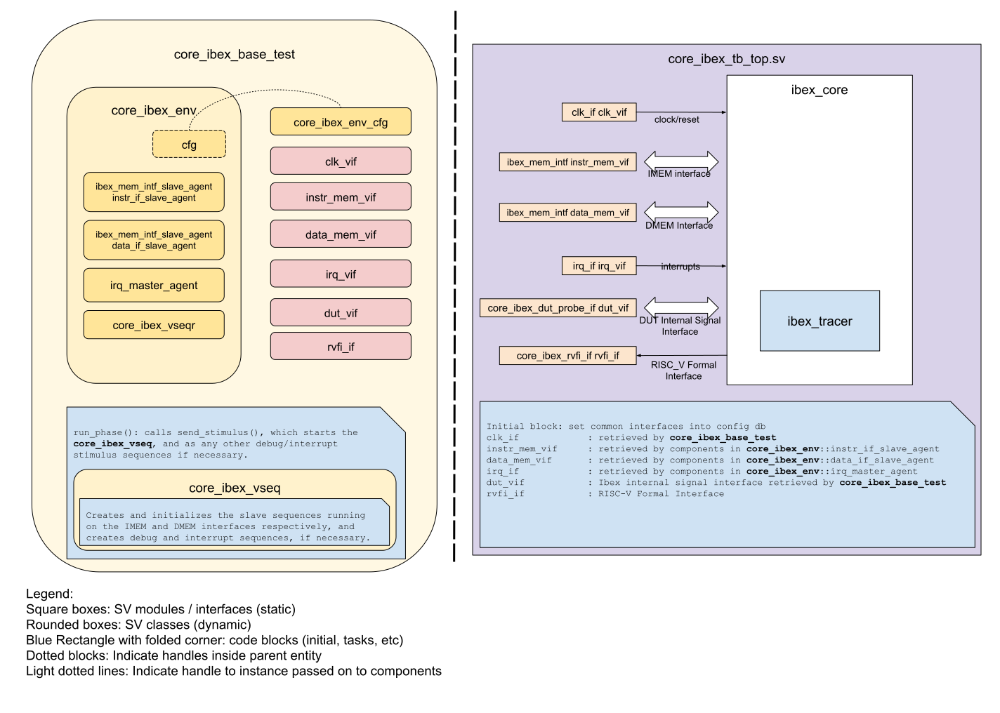
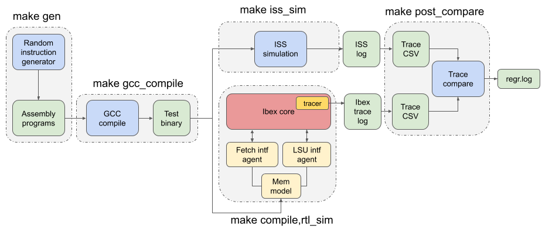

Verification
============

.. todo::

  This section needs to be split into a HOWTO-style user/developer guide, and reference information on the testbench structure.

Ibex Core
---------

Overview
^^^^^^^^

This is a SV/UVM testbench for verification of the Ibex core, located in `dv/uvm/core_ibex`.
At a high level, this testbench uses the open source `RISCV-DV random instruction generator
<https://github.com/google/riscv-dv>`_ to generate compiled instruction binaries, loads them into a
simple memory model, stimulates the Ibex core to run this program in memory, and then compares the
core trace log against a golden model ISS trace log to check for correctness of execution.

Testbench Architecture
^^^^^^^^^^^^^^^^^^^^^^

As previously mentioned, this testbench has been constructed based on its usage of the RISCV-DV
random instruction generator developed by Google.
A block diagram of the testbench is below.

    Architecture of the UVM testbench for Ibex core

Memory Interface Agents
"""""""""""""""""""""""

The code can be found in the `dv/uvm/core_ibex/common/ibex_mem_intf_agent
<https://github.com/lowRISC/ibex/tree/master/dv/uvm/core_ibex/common/ibex_mem_intf_agent>`_ directory.
Two of these agents are instantiated within the testbench, one for the instruction fetch interface,
and the second for the LSU interface.
These agents run slave sequences that wait for memory requests from the core, and then grant the
requests for instructions or for data.

Interrupt Interface Agent
"""""""""""""""""""""""""

The code can be found in the
`dv/uvm/core_ibex/common/irq_agent <https://github.com/lowRISC/ibex/tree/master/dv/uvm/core_ibex/common/irq_agent>`_ directory.
This agent is used to drive stimulus onto the Ibex core's interrupt pins randomly during test
execution.

Memory Model
""""""""""""

The code is vendored from OpenTitan and can be found in the
`vendor/lowrisc_ip/dv/sv/mem_model <https://github.com/lowRISC/ibex/tree/master/vendor/lowrisc_ip/dv/sv/mem_model>`_
directory.
The testbench instantiates a single instance of this memory model that it loads the compiled
assembly test program into at the beginning of each test.
This acts as a unified instruction/data memory that serves all requests from both of the
memory interface agents.

Test and Sequence Library
"""""""""""""""""""""""""

The code can be found in the
`dv/uvm/core_ibex/tests <https://github.com/lowRISC/ibex/tree/master/dv/uvm/core_ibex/tests>`_ directory.
The tests here are the main sources of external stimulus generation and checking for this testbench,
as the memory interface slave sequences simply serve the core's memory requests.
The tests here are all extended from ``core_ibex_base_test``, and coordinate the entire flow for a
single test, from loading the compiled assembly binary program into the testbench memory model, to
checking the Ibex core status during the test and dealing with test timeouts.
The sequences here are used to drive interrupt and debug stimulus into the core.

Testplan
""""""""

The goal of this bench is to fully verify the Ibex core with 100%
coverage. This includes testing all RV32IMCB instructions, privileged
spec compliance, exception and interrupt testing, Debug Mode operation etc.
The complete test list can be found in the file `dv/uvm/core_ibex/riscv_dv_extension/testlist.yaml
<https://github.com/lowRISC/ibex/blob/master/dv/uvm/core_ibex/riscv_dv_extension/testlist.yaml>`_.

Please note that verification is still a work in progress.

Getting Started
^^^^^^^^^^^^^^^

Prerequisites & Environment Setup
"""""""""""""""""""""""""""""""""

In order to run the co-simulation flow, you'll need:

- A SystemVerilog simulator that supports UVM.

  The flow is currently tested with VCS.

- A RISC-V instruction set simulator, such as Spike or OVPsim.

  Ibex is tested using Spike.

  To use Spike_, it must be built with the ``--enable-commitlog`` and ``--enable-misaligned`` options.
  ``--enable-commitlog`` is needed to produce log output to track the instructions that were executed.
  ``--enable-misaligned`` tells Spike to simulate a core that handles misaligned accesses in hardware (rather than jumping to a trap handler).

  Ibex supports version 0.92 of the draft Bitmanip specification.
  The ``master`` branch of Spike may support a different version.
  lowRISC maintains a `lowRISC-specific branch of Spike <LRSpike_>`_ that matches the supported Bitmanip specification.
  This branch must also be used in order to to simulate the core with the Icache enabled.

  OVPsim_ is a commercial instruction set simulator with RISC-V support.
  To specify the v0.92 Bitmanip specification, you need "riscvOVPsimPlus", which can be downloaded free of charge with registration.

- A working RISC-V toolchain (to compile / assemble the generated programs before simulating them).

  Either download a `pre-built toolchain <riscv-toolchain-releases_>`_ (quicker) or download and build the `RISC-V GNU compiler toolchain <riscv-toolchain-source_>`_.
  For the latter, the Bitmanip patches have to be manually installed to enable support for the Bitmanip draft extension.
  For further information, checkout the `Bitmanip Extension on GitHub <bitmanip_>`_ and `how we create the pre-built toolchains <bitmanip-patches_>`_.

Once these are installed, you need to set some environment variables
to tell the RISCV-DV code where to find them:

::

    export RISCV_TOOLCHAIN=/path/to/riscv
    export RISCV_GCC="$RISCV_TOOLCHAIN/bin/riscv32-unknown-elf-gcc"
    export RISCV_OBJCOPY="$RISCV_TOOLCHAIN/bin/riscv32-unknown-elf-objcopy"
    export SPIKE_PATH=/path/to/spike/bin
    export OVPSIM_PATH=/path/to/ovpsim/bin

(Obviously, you only need to set ``SPIKE_PATH`` or ``OVPSIM_PATH`` if
you have installed the corresponding instruction set simulator)

.. _Spike: https://github.com/riscv/riscv-isa-sim
.. _LRSpike: https://github.com/lowRISC/riscv-isa-sim/tree/ibex
.. _OVPsim: https://www.ovpworld.org/riscvOVPsimPlus/
.. _riscv-toolchain-source: https://github.com/riscv/riscv-gnu-toolchain
.. _riscv-toolchain-releases: https://github.com/lowRISC/lowrisc-toolchains/releases
.. _bitmanip-patches: https://github.com/lowRISC/lowrisc-toolchains#how-to-generate-the-bitmanip-patches
.. _bitmanip: https://github.com/riscv/riscv-bitmanip

End-to-end RTL/ISS co-simulation flow
"""""""""""""""""""""""""""""""""""""

   RTL/ISS co-simulation flow chart

The last stage in this flow handles log comparisons to determine correctness of a given simulation.
To do this, both the trace log produced by the core and the trace log produced by the chosen golden
model ISS are parsed to collect information about all register writebacks that occur.
These two sets of register writeback data are then compared to verify that the core is writing the
correct data to the correct registers in the correct order.

However, this checking model quickly falls apart once situations involving external stimulus (such
as interrupts and debug requests) start being tested, as while ISS models can simulate traps due to
exceptions, they cannot model traps due to external stimulus.
In order to provide support for these sorts of scenarios to verify if the core has entered the
proper interrupt handler, entered Debug Mode properly, updated any CSRs correctly, and so on, the
handshaking mechanism provided by the RISCV-DV instruction generator is heavily used, which
effectively allows the core to send status information to the testbench during program execution for
any analysis that is required to increase verification effectiveness.
This mechanism is explained in detail at https://github.com/google/riscv-dv/blob/master/HANDSHAKE.md.
As a sidenote, the signature address that this testbench uses for the handshaking is ``0x8ffffffc``.
Additionally, as is mentioned in the RISCV-DV documentation of this handshake, a small set of API
tasks are provided in `dv/uvm/core_ibex/tests/core_ibex_base_test.sv
<https://github.com/lowRISC/ibex/blob/master/dv/uvm/core_ibex/tests/core_ibex_base_tests.sv>`_ to enable easy
and efficient integration and usage of this mechanism in this test environment.
To see how this handshake is used during real simulations, look in
`dv/uvm/core_ibex/tests/core_ibex_test_lib.sv
<https://github.com/lowRISC/ibex/blob/master/dv/uvm/core_ibex/tests/core_ibex_test_lib.sv>`_.
As can be seen, this mechanism is extensively used to provide runtime verification for situations involving external debug
requests, interrupt assertions, and memory faults.
To add another layer of correctness checking to the checking already provided by the handshake
mechanism, a modified version of the trace log comparison is used, as comparing every register write
performed during the entire simulation will lead to an incorrect result since the ISS trace log will
not contain any execution information in the debug ROM or in any interrupt handler code.
As a result, only the final values contained in every register at the end of the test are compared
against each other, since any code executed in the debug ROM and trap handlers should not corrupt
register state in the rest of the program.

The entirety of this flow is controlled by the Makefile found at
`dv/uvm/core_ibex/Makefile <https://github.com/lowRISC/ibex/blob/master/dv/uvm/core_ibex/Makefile>`_; here is a list of frequently used commands:

.. code-block:: bash

   cd dv/uvm/core_ibex

   # Run a full regression
   make

   # Run a full regression, redirect the output directory
   make OUT=xxx

   # Run a single test
   make TEST=riscv_machine_mode_rand_test ITERATIONS=1

   # Run a test with a specific seed, dump waveform
   make TEST=riscv_machine_mode_rand_test ITERATIONS=1 SEED=123 WAVES=1

   # Verbose logging
   make ... VERBOSE=1

   # Run multiple tests in parallel through LSF
   make ... LSF_CMD="bsub -Is"

   # Get command reference of the simulation script
   python3 sim.py --help

   # Generate the assembly tests only
   make gen

   # Pass addtional options to the generator
   make GEN_OPTS="xxxx"  ...

   # Compile and run RTL simulation
   make TEST=xxx compile,rtl_sim

   # Use a different ISS (default is spike)
   make ... ISS=ovpsim

   # Run a full regression with coverage
   make COV=1

Run with a different RTL simulator
""""""""""""""""""""""""""""""""""

You can add any compile/runtime options in `dv/uvm/core_ibex/yaml/simulator.yaml
<https://github.com/lowRISC/ibex/blob/master/dv/uvm/core_ibex/yaml/rtl_simulation.yaml>`_.

.. code-block:: bash

   # Use the new RTL simulator to run
   make ... SIMULATOR=xxx

Instruction Cache
-----------------

Overview
^^^^^^^^

Due to the complexity of the instruction cache, a separate testbench is used to
ensure that full verification and coverage closure is performed on this module.
This testbench is located at `dv/uvm/icache/dv
<https://github.com/lowRISC/ibex/blob/master/dv/uvm/icache/dv>`_.

As Icache verification is being carried out as part of the OpenTitan open-source
project, the testbench derives from the `dv_lib UVM class library
<https://github.com/lowRISC/opentitan/tree/master/hw/dv/sv/dv_lib>`_, which is a set of extended UVM
classes that provides basic UVM testbench functionality and components.

This DV environment will be compiled and simulated using the `dvsim simulation tool
<https://github.com/lowRISC/opentitan/tree/master/util/dvsim>`_.
The master ``.hjson`` file that controls simulation with ``dvsim`` can be found
at `dv/uvm/icache/dv/ibex_icache_sim_cfg.hjson
<https://github.com/lowRISC/ibex/blob/master/dv/uvm/icache/dv/ibex_icache_sim_cfg.hjson>`_.
The associated testplan ``.hjson`` file is located at `dv/uvm/icache/data/ibex_icache_testplan.hjson
<https://github.com/lowRISC/ibex/blob/master/dv/uvm/icache/data/ibex_icache_testplan.hjson>`_.
As this testbench is still in its infancy, it is currently only able to be compiled, as no tests or
sequences are implemented, nor are there any entries in the testplan file.
To build the testbench locally using the VCS simulator, run the following command from the root of
the Ibex repository:

.. code-block:: bash

   ./vendor/lowrisc_ip/util/dvsim/dvsim.py dv/uvm/icache/dv/ibex_icache_sim_cfg.hjson --build-only
   --skip-ral --purge --sr sim_out

Specify the intended output directory using either the ``--sr`` or ``-scratch-root`` option.
The ``--skip-ral`` option is mandatory for building/simulating the Icache testbench, as it does not
have any CSRs, excluding this option will lead to build errors.
``--purge`` directs the tool to ``rm -rf`` the output directory before running the tool, this can be
removed if not desired.
