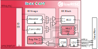

.. _instruction-decode-execute:

Instruction Decode and Execute
==============================

   Instruction Decode and Execute

The Instruction Decode and Execute stage takes instruction data from the instruction fetch stage (which has been converted to the uncompressed representation in the compressed instruction case).
The instructions are decoded and executed all within one cycle including the register read and write.
The stage is made up of multiple sub-blocks which are described below.

Instruction Decode Block (ID)
-----------------------------
Source File: :file:`rtl/ibex_id_stage.sv`

The Instruction Decode (ID) controls the overall decode/execution process.
It contains the muxes to choose what is sent to the ALU inputs and where the write data for the register file comes from.
A small state machine is used to control multi-cycle instructions (see :ref:`pipeline-details` for more details), which stalls the whole stage whilst a multi-cycle instruction is executing.

Controller
----------
Source File: :file:`rtl/ibex_controller.sv`

The Controller contains the state machine that controls the overall execution of the processor.
It is responsible for:

* Handling core startup from reset
* Setting the PC for the IF stage on jump/branch
* Dealing with exceptions/interrupts (jump to appropriate PC, set relevant CSR values)
* Controlling sleep/wakeup on WFI
* Debugging control

Decoder
-------
Source File: :file:`rtl/ibex_decoder.sv`

The decoder takes uncompressed instruction data and issues appropriate control signals to the other blocks to execute the instruction.

Register File
-------------
Source Files: :file:`rtl/ibex_register_file_ff.sv` :file:`rtl/ibex_register_file_latch.sv`

See :ref:`register-file` for more details.

Execute Block
-------------
Source File: :file:`rtl/ibex_ex_block.sv`

The execute block contains the ALU and the multiplier/divider blocks, it does little beyond wiring and instantiating these blocks.

Arithmetic Logic Unit (ALU)
---------------------------
Source File: :file:`rtl/ibex_alu.sv`

The Arithmetic Logic Logic (ALU) is a purely combinational block that implements operations required for the Integer Computational Instructions and the comparison operations required for the Control Transfer Instructions in the RV32I RISC-V Specification.
Other blocks use the ALU for the following tasks:

* Mult/Div uses it to perform addition as part of the multiplication and division algorithms
* It computes branch targets with a PC + Imm calculation
* It computes memory addresses for loads and stores with a Reg + Imm calculation
* The LSU uses it to increment addresses when performing two accesses to handle an unaligned access

.. _mult-div:

Multiplier/Divider Block (MULT/DIV)
-----------------------------------
Source Files: :file:`rtl/ibex_multdiv_slow.sv` :file:`rtl/ibex_multdiv_fast.sv`

The Multiplier/Divider (MULT/DIV) is a state machine driven block to perform multiplication and division.
The fast and slow versions differ in multiplier only, both implement the same form of long division algorithm.
The ALU block is used by the long division algorithm in both the fast and slow blocks.

Fast Multiplier
  - Completes multiply in 3-4 cycles using a MAC (multiply accumulate) which is capable of a 17-bit x 17-bit multiplication with a 34-bit accumulator.
  - A MUL instruction takes 3 cycles, MULH takes 4.
  - This MAC is internal to the mult/div block (no external ALU use).
  - Beware it is simply implemented with the ``*`` and ``+`` operators so results heavily depend upon the synthesis tool used.
  - In some cases it may be desirable to replace this with a specific implementation (such as a hard macro in an FPGA or an explicit gate level implementation).

Slow Multiplier
  - Completes multiply in 33 cycles using a Baugh-Wooley multiplier (for both MUL and MULH).
  - The ALU block is used to compute additions.

Divider
  Both the fast and slow blocks use the same long division algorithm, it takes 37 cycles to compute (though only requires 2 cycles when there is a divide by 0) and proceeds as follows:

    - Cycle 0: Check for divide by 0
    - Cycle 1: Compute absolute value of operand A (or return result on divide by 0)
    - Cycle 2: Compute absolute value of operand B
    - Cycles 4 - 36: Perform long division as described here: https://en.wikipedia.org/wiki/Division_algorithm#Integer_division_(unsigned)_with_remainder.

Control and Status Register Block (CSR)
---------------------------------------
Source File: :file:`rtl/ibex_cs_registers.sv`

The CSR contains all of the CSRs (control/status registers).
Any CSR read/write is handled through this block.
Performance counters are held in this block and incremented when appropriate (this includes ``mcycle`` and ``minstret``).
Read data from a CSR is available the same cycle it is requested.
Further detail on the implemented CSRs can be found in :ref:`cs-registers`

Load-Store Unit (LSU)
---------------------
Source File: :file:`rtl/ibex_load_store_unit.sv`

The Load-Store Unit (LSU) interfaces with main memory to perform load and store operations.
See :ref:`load-store-unit` for more details.
