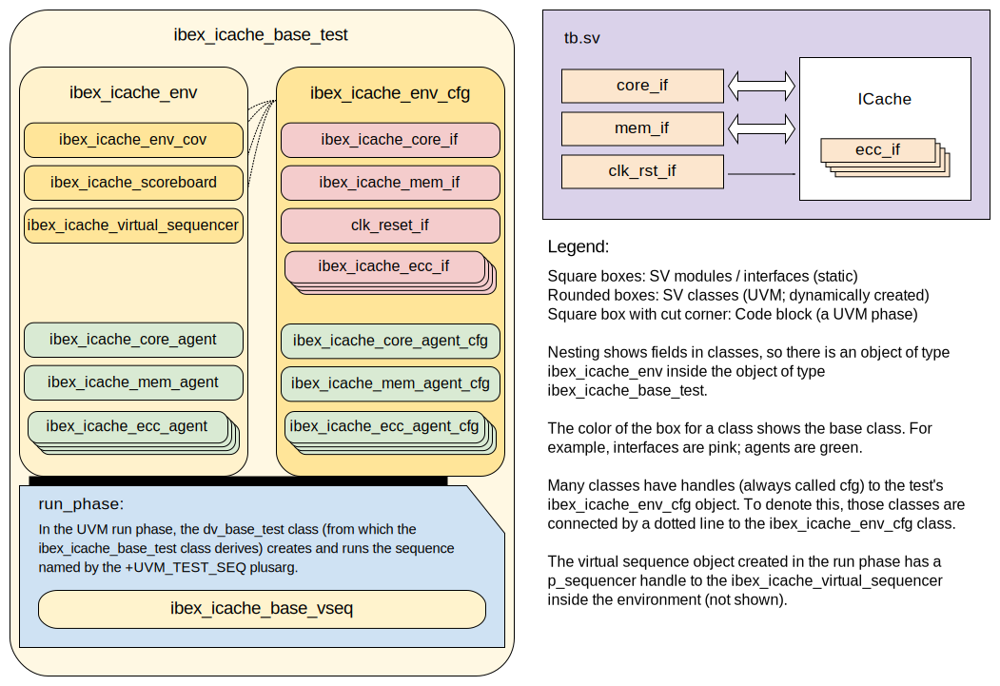

## Goals
* **DV**
  * Verify all IBEX_ICACHE IP features by running dynamic simulations with a SV/UVM based testbench
  * Develop and run all tests based on the [testplan](#testplan) below towards closing code and functional coverage on the IP and all of its sub-modules
* **FPV**

## Current status
<!-- TODO for now -->
* [Design & verification stage]()
  * [HW development stages]()
* [Simulation results](https://reports.opentitan.org/hw/ip/ibex_icache/dv/latest/results.html)

## Design features
For detailed information on IBEX_ICACHE design features, please see the [IBEX_ICACHE technical specification]().

## Testbench architecture
IBEX_ICACHE testbench has been constructed based on the [DV_LIB testbench architecture]().

### Block diagram


### Top level testbench
Top level testbench is located at `dv/uvm/icache/dv/tb/tb.sv`. It instantiates the IBEX_ICACHE DUT module `rtl/ibex_icache.sv`.
In addition, it instantiates the following interfaces, connects them to the DUT and sets their handle into `uvm_config_db`:
* [Clock and reset interface]()
<!-- TODO -->
* IBEX_ICACHE IOs

### Common DV utility components
The following utilities provide generic helper tasks and functions to perform activities that are common across the project:
* [dv_utils_pkg]()

### Compile-time configurations
[list compile time configurations, if any and what are they used for]

### Global types & methods
All common types and methods defined at the package level can be found in
`ibex_icache_env_pkg`. Some of them in use are:
```systemverilog
[list a few parameters, types & methods; no need to mention all]
```

###  IBEX_ICACHE Agent
[Describe here or add link to its README]
###  IBEX_MEM_INTF_SLAVE Agent
[Describe here or add link to its README]

### UVC/agent 1
[Describe here or add link to its README]

### UVC/agent 2
[Describe here or add link to its README]


### Reference models
[Describe reference models in use if applicable, example: SHA256/HMAC]

### Stimulus strategy
#### Test sequences
All test sequences reside in `dv/uvm/icache/dv/env/seq_lib`.
The `ibex_icache_base_vseq` virtual sequence is extended from `cip_base_vseq` and serves as a starting point.
All test sequences are extended from `ibex_icache_base_vseq`.
It provides commonly used handles, variables, functions and tasks that the test sequences can simple use / call.
Some of the most commonly used tasks / functions are as follows:
* task 1:
* task 2:

#### Functional coverage
To ensure high quality constrained random stimulus, it is necessary to develop a functional coverage model.
The following covergroups have been developed to prove that the test intent has been adequately met:
* cg1:
* cg2:

### Self-checking strategy
#### Scoreboard
The `ibex_icache_scoreboard` is primarily used for end to end checking.
It creates the following analysis ports to retrieve the data monitored by corresponding interface agents:
* analysis port1:
* analysis port2:
<!-- explain inputs monitored, flow of data and outputs checked -->

#### Assertions
<!-- only keep this section if any FPV is done on icache -->

## Building and running tests
We are using our in-house developed [regression tool]() for building and running our tests and regressions.
Please take a look at the link for detailed information on the usage, capabilities, features and known issues.
Here's how to run a basic sanity test:
```console
$ cd hw/ip/ibex_icache/dv
$ make TEST_NAME=ibex_icache_sanity
```

## Testplan

