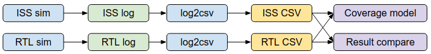

Appendix
========

Trace CSV format
----------------

A standard CSV format is defined for the instruction execution trace. It's used for co-simulation result comparison and functional coverage collection.

**The CSV format includes the following fields:**

- pc : Program counter (instruction memory address)
- instr: Instruction name
- gpr: General purpose register updated by the instruction (rd, fd, vd etc.)

  - Format: <GPR name>:<Value>
  - GPR can be any integer/floating point/vector register
  - If more than one general purpose registers are updated, separate them with semicolon
- csr: Privileged CSR updated by the instruction

  - The same format as the GPR field
- binary: Instruction binary
- instr_str: Instruction in assembly format
- operand: Instruction operands
- pad: Unused

**Here's a sample of the CSV trace file:**

.. code-block:: verilog

    pc,instr,gpr,csr,binary,mode,instr_str,operand,pad
    ffffffff8000000c,c.addi,ra:daab700e,,000000b9,3,"c.addi  ra, 14","ra,14",
    ffffffff8000000e,lui,sp:ff8e6000,,ff8e6137,3,"lui     sp, 0xff8e6","sp,0xff8e6",
    ffffffff80000012,addi,sp:ff8e6541,,54110113,3,"addi    sp, sp, 1345","sp,sp,1345",
    ffffffff80000016,c.li,gp:00000000,,00004181,3,"c.li    gp, 0","gp,0",
    ffffffff80000018,lui,tp:80000000,,80000237,3,"lui     tp, 0x80000","tp,0x80000",
    ffffffff8000001c,lui,t0:f999d000,,f999d2b7,3,"lui     t0, 0xf999d","t0,0xf999d",
    ffffffff80000020,addi,t0:f999cbf0,,bf028293,3,"addi    t0, t0, -1040","t0,t0,-1040",
    ffffffff80000024,lui,t1:0416b000,,0416b337,3,"lui     t1, 0x416b","t1,0x416b",
    ffffffff80000028,addi,t1:0416b6ee,,6ee30313,3,"addi    t1, t1, 1774","t1,t1,1774",
    ffffffff8000002c,lui,t2:e6420000,,e64203b7,3,"lui     t2, 0xe6420","t2,0xe6420",
    ...

To integrate a new ISS or processor with the co-simualtion or coverage flow, user must implement a
python script to convert the custom trace log format to this CSV format. You can find a sample
script `here`_.

.. _here: https://github.com/google/riscv-dv/blob/master/scripts/spike_log_to_trace_csv.py
