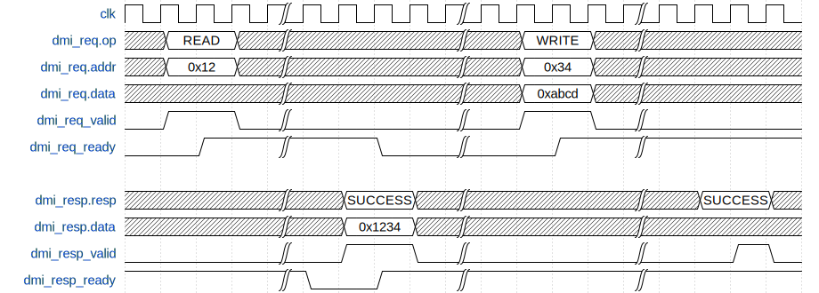

# Overview

This document specifies the processor debug system. The debug system implements run-control debug and bus access functionality according to the [RISC-V Debug Specification 0.13.2](https://github.com/riscv/riscv-debug-spec/raw/4e0bb0fc2d843473db2356623792c6b7603b94d4/riscv-debug-release.pdf). It can be accessed over JTAG (IEEE Std 1149.1-2013).

## Features

- Run-control debug functionality according to the [RISC-V Debug Specification version 0.13.2](https://github.com/riscv/riscv-debug-spec/raw/4e0bb0fc2d843473db2356623792c6b7603b94d4/riscv-debug-release.pdf), which includes all standard debug features: breakpoints, stepping, access to the CPU's GPRs and arbitrary memory locations.
- Implementation following the Execution Based method as outlined in Section A.2 of the RISC-V Debug Specification. This allows the execution of arbitrary instructions on the core and requires minimal changes to the core.
- JTAG Debug Transport Module (DTM) according to the RISC-V Debug Specification.
- System Bus Access with generic 32 or 64 bit bus interface.
- Support for up to 2^20 harts through one Debug Module
- Support for arbitrary memory location of DM
- Support for one debug scratch register if the DM is located at the zero page.

## Description

The debug system described in this document consists of two modules, which are implemented according to the RISC-V Debug Specification: The Debug Module (DM) implemented with a Program Buffer, and a JTAG Debug Transport Module (DTM).

## Compatibility

The debug system is compatible with the RISC-V Debug Specification 0.13.2.
The specification marks some features as optional.
The status of these features is visible from the table below.

**Feature**                            | **Support**
-------------------------------------- | --------------------------------------------------------------------------------------
External triggers (Section 3.6)        | Not supported at this time.
Halt groups (Section 3.6)              | Not supported at this time.
Hardware triggers                      | Not supported at this time. Triggers read 0 according to the specification.
System Bus Access (SBA) (Section 3.10) | Supported with generic 32 or 64 bit wide interface.
Authentication                         | Not supported at this time.
Non-intrusive access to core registers | Not supported at this time. All registers must be accessed through the program buffer.

# Theory of Operations

The functionality of the debug system is implemented according to the RISC-V Debug Specification.
Refer to this document for more information.

## Block Diagram


## Debug Module Registers

An external debugger performs all interaction with the Debug Module through a register interface, accessed over a dedicated bus, the Debug Module Interface (DMI).
The registers are called "Debug Module Registers" and defined in the RISC-V Debug Specification, Section 3.14.
Our implementation only provides a single Debug Module on the DMI bus mapped to base address 0, hence all addresses below can be considered absolute.

**Address** | **Name**                                     | **Implementation Notes**
----------- | -------------------------------------------- | ------------------------
0x04        | Abstract Data 0 (data0)
0x0f        | Abstract Data 11 (data11)
0x10        | Debug Module Control (dmcontrol)             | see table below
0x11        | Debug Module Status (dmstatus)               | see table below
0x12        | Hart Info (hartinfo)
0x13        | Halt Summary 1 (haltsum1)
0x14        | Hart Array Window Select (hawindowsel)       | Not implemented
0x15        | Hart Array Window (hawindow)                 | Not implemented
0x16        | Abstract Control and Status (abstractcs)
0x17        | Abstract Command (command)
0x18        | Abstract Command Autoexec (abstractauto)
0x19        | Configuration String Pointer 0 (confstrptr0) | Not implemented
0x1a        | Configuration String Pointer 1 (confstrptr1) | Not implemented
0x1b        | Configuration String Pointer 2 (confstrptr2) | Not implemented
0x1c        | Configuration String Pointer 3 (confstrptr3) | Not implemented
0x1d        | Next Debug Module (nextdm)                   | Not implemented
0x1f        | Custom Features (custom)                     | Not implemented
0x20        | Program Buffer 0 (progbuf0)
0x2f        | Program Buffer 15 (progbuf15)
0x30        | Authentication Data (authdata)               | Not implemented
0x32        | Debug Module Control and Status 2 (dmcs2)    | Not implemented
0x34        | Halt Summary 2 (haltsum2)
0x35        | Halt Summary 3 (haltsum3)
0x37        | System Bus Address 127:96 (sbaddress3).      | Not implemented
0x38        | System Bus Access Control and Status (sbcs)
0x39        | System Bus Address 31:0 (sbaddress0)
0x3a        | System Bus Address 63:32 (sbaddress1)
0x3b        | System Bus Address 95:64 (sbaddress2)
0x3c        | System Bus Data 31:0 (sbdata0)
0x3d        | System Bus Data 63:32 (sbdata1)
0x3e        | System Bus Data 95:64 (sbdata2)
0x3f        | System Bus Data 127:96 (sbdata3).            | Not implemented
0x40        | Halt Summary 0 (haltsum0)

Accessing a non-implemented register will return `0`.

### dmcontrol (0x10)

**Field**       | **Access** | **(Reset) Value** | **Comment**
--------------- | ---------- | ----------------- | -------------------------------------------------------------------------------------------------------------
haltreq         | WARZ
resumereq       | W1
hartreset       | WARL       | 0                 | Not implemented, reads constant 0
ackhavereset    | W1
hasel           | WARL       | 0                 | Hart array masks are not supported
hartsello       | R/W
hartselhi       | R/W
setresethaltreq | W1         | -                 | Writing this register is a no-op. Halt-on-reset is not implemented, as indicated by dmstatus.hasresethaltreq.
clrresethaltreq | W1         | -                 | Writing this register is a no-op. Halt-on-reset is not implemented, as indicated by dmstatus.hasresethaltreq.
ndmreset        | R/W
dmactive        | R/W

### dmstatus (0x11)

**Field**       | **Access** | **(Reset) Value** | **Comment**
--------------- | ---------- | ----------------- | ---------------------------------------------------------------
impebreak       | R          | 0                 | No implicit ebreak is inserted after the Program Buffer.
allhavereset    | R          |                   | Hart array masks are not supported; identical to anyhavereset.
anyhavereset    | R          |                   | Hart array masks are not supported; identical to allhavereset.
allresumeack    | R          |                   | Hart array masks are not supported; identical to anyresumeack.
anyresumeack    | R          |                   | Hart array masks are not supported; identical to allresumeack.
allnonexistent  | R          |                   | Hart array masks are not supported; identical to anynonexistent
anynonexistent  | R          |                   | Hart array masks are not supported; identical to allnonexistent
allunavail      | R          |                   | Hart array masks are not supported; identical to anyunavail.
anyunavail      | R          |                   | Hart array masks are not supported; identical to allunavail.
allrunning      | R          |                   | Hart array masks are not supported; identical to anyrunning.
anyrunning      | R          |                   | Hart array masks are not supported; identical to allrunning.
allhalted       | R          |                   | Hart array masks are not supported; identical to anyhalted.
anyhalted       | R          |                   | Hart array masks are not supported; identical to allhalted.
authenticated   | R          | 1                 | Authentication is not implemented, reads always 1.
authbusy        | R          | 0                 | Authentication is not implemented, reads always 0.
hasresethaltreq | R          | 0                 | Halt-on-reset is not implemented, reads always 0.
confstrptrvalid | R          | 0                 | Configuration strings are not supported.
version         | R          | 2                 | Specification version 0.13

## Customization

The debug system can be configured at synthesis time through parameters.

**Parameter Name** | **Valid values** | **Default** | **Description**
------------------ | ---------------- | ----------- | -------------------------------------------------------------------------------------------------------------
NrHarts            | 1..2^20          | 1           | Number of connected harts
BusWidth           | 32, 64           | 32          | Bus width (for debug memory and SBA busses)
SelectableHarts    |                  | 1           | Bitmask to select physically available harts for systems that don't use hart numbers in a contiguous fashion.

In addition to these parameters, additional configuration is provided through top-level signals, which are expected to be set to a fixed value at synthesis time.

Signal Name | Data Type  | Width   | Description
----------- | ---------- | ------- | -------------------------------------------------------------------------------------------------------------------------------------------------------------------------------------------------------------------------------------------------------------------------------------------------------------------------------------------------------------------------
hartinfo    | hartinfo_t | NrHarts | Value of the hartinfo DM register, see the RISC-V Debug Specification v0.13, Section 3.14.2 for details. **nscratch**: Number of debug scratch registers. Must be set to 2. **dataaccess**: Must be set to 1. (The data register are shadowed in the hart's memory.) **datasize**: Must be set to `dm::DataCount`. **dataaddr**: Must be set to `dm::DataAddr` (0x380).

**SystemVerilog definition of the hartinfo_t structure**

```verilog
typedef struct packed {
  logic [31:24] zero1;
  logic [23:20] nscratch;
  logic [19:17] zero0;
  logic         dataaccess;
  logic [15:12] datasize;
  logic [11:0]  dataaddr;
} hartinfo_t;
```

## Hardware Interfaces

The debug system interacts with multiple components, which are described in this section.
The Debug Module interacts the debugged hart(s) through the core interface, with the system bus through its bus host and device, and with system management and reset functionality, and with the Debug Transport Module through the Debug Module Interface (DMI).

The JTAG Debug Transport Module interacts with the host PC through JTAG, and with the Debug Module through the Debug Module Interface (DMI).

### System Interface

**Signal** | **Direction** | **Description**
---------- | ------------- | ----------------------------------------------------------------------------------------------------------------------------------------------------------------------------------------------------------------------------------------------------------
clk_i      | input         | clock. All components of the debug module and the DMI are synchronous to this clock, except for the JTAG components, which are clocked with the external TCLK.
rst_ni     | input         | asynchronous, active low reset.
testmode_i | input         | not used currently
ndmreset_o | output        | Non-Debug Mode reset (ndmreset). ndmreset is triggered externally through JTAG, e.g. by a debugger, and should reset the whole system except for the debug system. See the RISC-V Debug Specification v0.13, Section 3.2 (Reset Control) for more details.
dmactive_o | output        | debug module is active

**SystemVerilog interface definition**

```verilog
input  logic                  clk_i,
input  logic                  rst_ni,
input  logic                  testmode_i,
output logic                  ndmreset_o,
output logic                  dmactive_o
```

### Core Interface

The debug system is compatible with any RISC-V compliant CPU core, given that it support execution based debugging according to the RISC-V Debug Specification, Section A.2.

#### Debug Request Interrupt

The debug request interrupt is a level-sensitive interrupt. It is issued by the Debug Module to the hart(s).

**Signal**               | **Direction** | **Description**
------------------------ | ------------- | ---------------------------------------
debug_req_o[NrHarts-1:0] | output        | Level-sensitive debug request interrupt

The Debug Module issues the debug request to request the core to enter its debug mode.
In consequence, the core is expected to

- jump to the halt address in the Debug ROM,
- save pc in dpc,
- update dcsr.

#### Auxiliary Signalling

**Signal**               | **Direction** | **Description**
------------------------ | ------------- | ------------------------------------------------------------------------------------------------------------------------------------------------------------------------------
unavailable_i[NrHarts-1] | input         | Set to 0 to mark the hart has unavailable (e.g.: power down). This information is made available to the debugger through the dmstatus.allunavail and dmstatus.anyavail fields.

#### Debug Control and Status Register (CSRs)

Four debug-specific CSRs must be supported by the core, as described in the Debug Specification Section 4.8.

**Address** | **Name**  | **Access**                    | **Description**
----------- | --------- | ----------------------------- | ----------------------------------------------------------------------------
0x7b0       | dcsr      | _field-dependent; check spec_ | Debug Control and Status
0x7b1       | dpc       | RW from Debug Mode only       | Debug PC
0x7b2       | dscratch0 | RW from Debug Mode only       | Debug Scratch Register 0
0x7b3       | dscratch1 | RW from Debug Mode only       | Debug Scratch Register 1 (only required if DM is not located at address 0x0)

#### DRET Instruction

To return from debug mode the DRET instruction must be supported by the core according to the Debug Specification Section 4.7.

### JTAG

The JTAG Debug Transport Module (JTAG DTM) provides a standard IEEE 1149.1 JTAG connection.

**Signal** | **Direction** | **Description**
---------- | ------------- | -----------------------------------------------------------------------------------------------------
tck_i      | input         | Test Clock
tms_i      | input         | Test Mode Select
td_i       | input         | Test Data In (host to debug system)
td_o       | output        | Test Data Out (debug system to host)
tdo_oe_o   | output        | TDO output enable
trst_ni    | input         | Test Reset (active low). Usage of TRST is optional, but recommended for reliable reset functionality.

### Bus Interface
The Debug Module connects to the system bus as device, exposing the debug memory (the Program Buffer and the Debug ROM), and as host for the System Bus Access (SBA) functionality.
The same generic bus interface is used in both cases.
The bus width is configurable to be 32 or 64 bit using the `BusWidth` parameter.

#### Host (Master) Interface

The bus host interface is compatible to the [instruction and data interfaces of Ibex](https://ibex-core.readthedocs.io/en/latest/load_store_unit.html).

**Signal** | **Width (bit)** | **Direction** | **Description**
---------- | --------------- | ------------- | ---------------------------------------------------------------------------------------------------------
req        | 1               | output        | Request valid, must stay high until gnt is high for one cycle
add        | BusWidth        | output        | Address, word aligned
we         | BusWidth        | output        | Write Enable, high for writes, low for reads. Sent together with req
be         | 1               | output        | Byte Enable. Is set for the bytes to write/read, sent together with req
wdata      | BusWidth        | output        | Data to be written to device, sent together with req
gnt        | 1               | input         | The device accepted the request. Host outputs may change in the next cycle.
r_valid    | 1               | input         | r_rdata hold valid data when r_valid is high. This signal will be high for exactly one cycle per request.
r_rdata    | BusWidth        | input         | Data read from the device

No error response is currently implemented.

**SystemVerilog interface definition (host side)**

```verilog
output logic                  req_o,
output logic [BusWidth-1:0]   add_o,
output logic                  we_o,
output logic [BusWidth-1:0]   wdata_o,
output logic [BusWidth/8-1:0] be_o,
input  logic                  gnt_i,
input  logic                  r_valid_i,
input  logic [BusWidth-1:0]   r_rdata_i
```

**SystemVerilog interface definition (device side)**

```verilog
input  logic                  slave_req_i,
input  logic                  slave_we_i,
input  logic [BusWidth-1:0]   slave_addr_i,
input  logic [BusWidth/8-1:0] slave_be_i,
input  logic [BusWidth-1:0]   slave_wdata_i,
output logic [BusWidth-1:0]   slave_rdata_o
```
### OBI Bus Interface (optional)

A wrapper (called dm_obi_top) is provided which wraps the Debug Module (dm_top) and makes it OBI compliant. This wrapper
can be ignored (and dm_top can be used directly instead) in case of non OBI compatible systems.

The OBI (Open Bus Interface) specification is at https://github.com/openhwgroup/core-v-docs/blob/master/cores/cv32e40p/.

The Debug Module connects to the system bus as device, exposing the debug memory (the Program Buffer and the Debug ROM),
and as host for the System Bus Access (SBA) functionality. The bus interface is according to the OBI specification in both cases.
The bus width is configurable to be 32 or 64 bit using the `BusWidth` parameter. The transfer identifier width is configurable
using the `IdWidth` parameter.

#### Host (Master) OBI Interface

Compared to dm_top the slave interface of dm_obi_top has the following additional signals: slave_gnt_o, slave_rvalid_o, slave_aid_i,
slave_rid_o. Compared to dm_top the master interface of dm_obi_top has some renamed signals (master_addr_o, master_rvalid_i, master_rdata_i
instead of master_add_o, master_r_valid_i, master_r_rdata_i).

Both interfaces are OBI compliant.

**Signal** | **Width (bit)** | **Direction** | **Description**
---------- | --------------- | ------------- | ---------------------------------------------------------------------------------------------------------
req        | 1               | output        | Request valid, must stay high until gnt is high for one cycle
addr       | BusWidth        | output        | Address, word aligned
we         | BusWidth        | output        | Write Enable, high for writes, low for reads. Sent together with req
be         | 1               | output        | Byte Enable. Is set for the bytes to write/read, sent together with req
wdata      | BusWidth        | output        | Data to be written to device, sent together with req
gnt        | 1               | input         | The device accepted the request. Host outputs may change in the next cycle.
rvalid     | 1               | input         | r_rdata hold valid data when r_valid is high. This signal will be high for exactly one cycle per request.
rdata      | BusWidth        | input         | Data read from the device

No error response is currently implemented.

**SystemVerilog interface definition (host side)**

```verilog
output logic                  master_req_o,
output logic [BusWidth-1:0]   master_addr_o,
output logic                  master_we_o,
output logic [BusWidth-1:0]   master_wdata_o,
output logic [BusWidth/8-1:0] master_be_o,
input  logic                  master_gnt_i,
input  logic                  master_rvalid_i,
input  logic [BusWidth-1:0]   master_rdata_i
```

**SystemVerilog interface definition (device side)**

```verilog
input  logic                  slave_req_i,
output logic                  slave_gnt_o,
input  logic                  slave_we_i,
input  logic [BusWidth-1:0]   slave_addr_i,
input  logic [BusWidth/8-1:0] slave_be_i,
input  logic [BusWidth-1:0]   slave_wdata_i,
input  logic [IdWidth-1:0]    slave_aid_i,
output logic                  slave_rvalid_o,
output logic [BusWidth-1:0]   slave_rdata_o,
output logic [IdWidth-1:0]    slave_rid_o
```

### The Debug Module Interface (DMI)

The Debug Module Interface is a bus connecting the JTAG Debug Transport Module (DTM) with the Debug Module (DM).
The Debug Specification does not require a specific implementation or hardware interface of the DMI bus.
Our implementation is inspired by the implementation used by the Rocket Chip Generator.

Transfers on the DMI are performed on two channels, a request and a response channel.
A valid and a ready signal on each channel is used for handshaking.

#### DMI Request Channel

A DMI request is issued from a DMI host to a DMI device.

**Signal** | **Width (bit)** | **Direction**  | **Description**
---------- | --------------- | -------------- | ----------------------------------------------------------------------------------------
addr       | 7               | host -> device | Address of a debug module register (c.f. Section 3.14 of the RISC-V Debug Specification)
op         | 2               | host -> device | Performed operation: DTM_NOP = 2'h0, DTM_READ = 2'h1, DTM_WRITE = 2'h2
data       | 32              | host -> device | write data
valid      | 1               | host -> device | handshaking: request is valid
ready      | 1               | device -> host | handshaking: transaction processed

**SystemVerilog interface definition (host side)**

```verilog
typedef enum logic [1:0] {
  DTM_NOP   = 2'h0,
  DTM_READ  = 2'h1,
  DTM_WRITE = 2'h2
} dtm_op_e;

typedef struct packed {
  logic [6:0]  addr;
  dtm_op_e     op;
  logic [31:0] data;
} dmi_req_t;

output logic     dmi_req_valid_o,
input  logic     dmi_req_ready_i,
output dmi_req_t dmi_req_o
```

#### DMI Response Channel

**Signal** | **Width (bit)** | **Direction**  | **Description**
---------- | --------------- | -------------- | -------------------------------------------
resp       | 2               | device -> host | Result of the operation. DTM_SUCCESS = 2'h0
data       | 32              | device -> host | requested read data
valid      | 1               | device -> host | handshaking: response is valid
ready      | 1               | host -> device | handshaking: transaction processed

**SystemVerilog interface definition (host side)**

```verilog
typedef struct packed  {
  logic [31:0] data;
  logic [1:0]  resp;
} dmi_resp_t;

input  dmi_resp_t dmi_resp_i,
output logic      dmi_resp_ready_o,
input  logic      dmi_resp_valid_i
```

#### Protocol

A DMI transaction consists of a request and a response.
 A DMI host issues a request on the request channel.
 The request is transmitted as soon as both ready and valid are high.
 After some time, the device sends the answers the request on the response channel.
 The response is considered sent as soon as ready and valid of the response channel are both high.
 A transaction is completed as soon as the response is received by the host.
 Only one transaction may be active at any given time.

The following timing diagram shows two DMI transactions.

A READ transaction, reading address 0x12 successfully, the value 0x1234 is returned.
A WRITE transaction, writing the value 0xabcd to address 0x34 successfully.



## System Bus Access

The system bus and all attached peripherals, including the memories, can be accessed from the host system through the System Bus Access (SBA) component.
A typical use case is writing the program memory through this interface, or verifying its contents.
The implementation conforms to the [RISC-V Debug Specification v0.13](https://github.com/riscv/riscv-debug-spec/raw/4e0bb0fc2d843473db2356623792c6b7603b94d4/riscv-debug-release.pdf), refer to this document for further information.

## Debug Memory

The Debug Module exposes a 16 kB memory over its device bus interface.
This memory is called the Debug Memory.
It consists of a ROM portion, containing the Debug ROM, multiple memory-mapped control and status registers, and a RAM portion, the Program Buffer.
The Debug Memory should only be accessible from the CPU if it is in debug mode.

### Debug Memory Map

The memory map is an implementation detail of the Debug Module and should not be relied on when using the Debug Module.

Address         | Description
--------------- | ------------------------------------------------------------------------------------------------------------------------------------------
0x0 to 0x0ff    | _unused_
0x100           | Halted. Write to this address to acknowledge that the core is halted.
0x108           | Going. Write to this address to acknowledge that the core is executing.
0x110           | Resuming. Write to this address to acknowledge that the core is resuming non-debug operation.
0x118           | Exception. An exception was triggered while the core was in debug mode.
0x300           | WhereTo
0x338 to 0x35f  | AbstractCmd
0x360 to 0x37f  | Program Buffer (8 words)
0x380 to 0x388  | DataAddr
0x400 to 0x7ff  | Flags
0x800 to 0x1000 | Debug ROM
0x800           | HaltAddress. Entry point into the Debug Module. The core must jump to this address when it was requested to halt.
0x808           | ResumeAddress. Entry point into the Debug Module. Jumping to this address instructs the debug module to bring the core out of debug mode and back into normal operation mode.
0x810           | ExceptionAddress. Entry point into the Debug Module. The core must jump to this address when it receives an exception while being in debug mode.

(Note: The debug memory addressing scheme is adopted from the Rocket Chip Generator.)


## JTAG Debug Transport Module

The RISC-V specification does not mandate a specific transport mode for the
debug module. While theoratially debug could be facilitate over any
memory-mapped protocol the debug specification standardizes the access via a
IEEE 1149.1 JTAG TAP (Test Access Port) - see [debug spec 0.13 chapter
6](https://riscv.org/wp-content/uploads/2019/03/riscv-debug-release.pdf).

The JTAG DTM takes care of translating JTAG signals into the custom DMI protocol
on the debug module's
[interface](https://github.com/pulp-platform/riscv-dbg/blob/master/doc/debug-system.md#the-debug-module-interface-dmi).

The JTAG DMI TAP contains four registers (so called instruction registers), by
default the IR register is 5 bits long, but the implementation is parameterized.

- `BYPASS`: TAP is in BYPASS mode.
- `IDCODE`: Default after reset. Vendor specific ID. The LSB must be `1`, the
  exact value can be set during implementation via a parameter:
  ```systemverilog
  module dmi_jtag_tap #(
  parameter int unsigned IrLength = 5,
  // JTAG IDCODE Value
  parameter logic [31:0] IdcodeValue = 32'h00000001
  // xxxx             version
  // xxxxxxxxxxxxxxxx part number
  // xxxxxxxxxxx      manufacturer id
  // 1                required by standard
  ) (
  ```
- `DTMCSR`: RISC-V specific control and status register of the JTAG DMI.
- `DMIACCESS`: Access the debug module's register.
    - `abits+33:34`: Address
    - `33:2`: Data
    - `1:0`: Operation (0 = NOP, 1 = Read from address, 2 = Write data to
      address)

The implementation is split between:

- `dmi_jtag_tap.sv` which contains the JTAG TAP logic. This implementation can
  generally be used for any implementation target. Any IEEE 1149.1 compliant
  device can be attached.
- `dmi_jtag.sv` which contains the TAP agnostic logic, `IDCODE`, `DTMCSR`, and
  `DMIACCESS` registers.

### Xilinx Implementation

For Xilinx FPGA implementation which do not have a dedicated user JTAG pins
exposed, we provide an alternative implementation using `BSCANE2` primitives.
Those primitives hook into the existing FPGA scan chain (normally used to
program bitstreams or debug Arm cores) and provide instruction registers which
are user programmable. The implementation uses three of those user registers to
make the `IDCODE`, `DTMCSR`, and `DMIACCESS` registers accessible.

- `IDCODE` is mapped to the FPGA ID Code register
- `DTMCSR` is mapped to user IR 3
- `DMIACCESS` is mapped to user IR 4

OpenOCD can remap the registers using the config script.

```
riscv set_ir idcode 0x09
riscv set_ir dtmcs 0x22
riscv set_ir dmi 0x23
```

To find a suitable (or similar) configuration for your adapter you can have a look at OpenOCD's [interface](https://github.com/ntfreak/openocd/tree/master/tcl/interface) configuration snippets.

#### FPGA IR Lengths

The IR length is different between FPGA families. Here is a non exhaustive list should be up-to-date (April 2021):


| Device                                                                                                                                                            | IR Length | `IDCODE`   | `DTMCS`    | `DMI`      |
| ----------------------------------------------------------------------------------------------------------------------------------------------------------------- | --------- | ---------- | ---------- | ---------- |
| `xcku3p`, `xcku9p`, `xcku11p`, `xcku13eg`, `xcku15p`, `xcku5p`, `xcvu3p`, `ku025`, `ku035`, `ku040`, `ku060`, `ku095`, `vu065`, `vu080`, `vu095`                  | 6         | `0x9`      | `0x22`     | `0x23`     |
| `7a15t`, `7a25t`, `7s15`, `7s100, `, `7a35t`, `7a50t`, `7a75t`, `7a100t`, `7a200t`, `7k70t`, `7k160t`, `7k325t`, `7k355t`, `7k410t`, `7k420t`, `7k480t`, `7v585t` | 6         | `0x9`      | `0x22`     | `0x23`     |
| `7vx330t`, `7vx415t`, `7vx485t`, `7vx550t`, `7vx690t`, `7vx980t`, `7z010`, `7z015`, `7z020`, `7z030`, `7z035`, `7z045`, `7z007s`, `7z012s`, `7z014s`, `7z100`     | 6         | `0x9`      | `0x22`     | `0x23`     |
| `xczu9eg`, `xcvu5p`, `xcvu7p`, `ku085`, `ku115`, `vu125`                                                                                                          | 12        | `0x249`    | `0x8a4`    | `0x8e4`    |
| `xczu3eg`, `xczu4eg`, `xczu5eg`, `xczu7eg`, `xczu2cg`, `xczu3cg`, `xczu4cg`, `xczu5cg`, `xczu6cg`, `xczu7cg`, `xczu9cg`, `xczu5ev`, `xczu11eg`                    | 16        | `0x2492`   | `0x8a49`   | `0x8e49`   |
| `xczu15eg`, `xczu19eg`, `xczu7ev`, `xczu2eg`, `xczu4ev`, `xczu6eg`, `xczu17eg`                                                                                    | 16        | `0x2492`   | `0x8a49`   | `0x8e49`   |
| `7vh580t`                                                                                                                                                         | 22        | `0x92492`  | `0x229249` | `0x239249` |
| `xcvu13p`, `7v2000t`, `7vx1140t`, `xcvu9p`, `xcvu11p`, `vu160`, `vu190`, `vu440`                                                                                  | 24        | `0x249249` | `0x8a4924` | `0x8e4924` |
| `7vh870t`                                                                                                                                                         | 38        | ?          | ?          | ?          |

#### FPGA `IDCODES`

The four MSBs additional encodes the version of the FPGA. So for `7a15t` version `1` you would get an `IDCODE` of `32'h1362E093` and for version `2` you would get `32'h2362E093` etc.

| Part Nr.   | FPGA ID Code   |     | Part Nr.   | FPGA ID Code   |
| ---------- | -------------- | --- | ---------- | -------------- |
| `7a15t`    | `32'h0362E093` |     | `ku095`    | `32'h03844093` |
| `7a25t`    | `32'h037C2093` |     | `ku115`    | `32'h0390D093` |
| `7a35t`    | `32'h0362D093` |     | `vu065`    | `32'h03939093` |
| `7a50t`    | `32'h0362C093` |     | `vu080`    | `32'h03843093` |
| `7a75t`    | `32'h03632093` |     | `vu095`    | `32'h03842093` |
| `7a100t`   | `32'h03631093` |     | `vu125`    | `32'h0392D093` |
| `7a200t`   | `32'h03636093` |     | `vu160`    | `32'h03933093` |
| `7k70t`    | `32'h03647093` |     | `vu190`    | `32'h03931093` |
| `7k160t`   | `32'h0364C093` |     | `vu440`    | `32'h0396D093` |
| `7k325t`   | `32'h03651093` |     | `xcku3p`   | `32'h04A46093` |
| `7k355t`   | `32'h03747093` |     | `xcku9p`   | `32'h0484A093` |
| `7k410t`   | `32'h03656093` |     | `xcku11p`  | `32'h04A4E093` |
| `7k420t`   | `32'h03752093` |     | `xcku13eg` | `32'h04A52093` |
| `7k480t`   | `32'h03751093` |     | `xcku15p`  | `32'h04A56093` |
| `7s15`     | `32'h03620093` |     | `xcku5p`   | `32'h04A62093` |
| `7s100`    | `32'h037C7093` |     | `xcvu3p`   | `32'h04B39093` |
| `7v585t`   | `32'h03671093` |     | `xczu9eg`  | `32'h04738093` |
| `7v2000t`  | `32'h036B3093` |     | `xcvu5p`   | `32'h04B2B093` |
| `7vh580t`  | `32'h036D9093` |     | `xcvu7p`   | `32'h04B29093` |
| `7vh870t`  | `32'h036DB093` |     | `xczu3eg`  | `32'h04710093` |
| `7vx330t`  | `32'h03667093` |     | `xczu4eg`  | `32'h04A47093` |
| `7vx415t`  | `32'h03682093` |     | `xczu5eg`  | `32'h04A46093` |
| `7vx485t`  | `32'h03687093` |     | `xczu7eg`  | `32'h04A5A093` |
| `7vx550t`  | `32'h03692093` |     | `xczu2cg`  | `32'h04A43093` |
| `7vx690t`  | `32'h03691093` |     | `xczu3cg`  | `32'h04A42093` |
| `7vx980t`  | `32'h03696093` |     | `xczu4cg`  | `32'h04A47093` |
| `7vx1140t` | `32'h036D5093` |     | `xczu5cg`  | `32'h04A46093` |
| `7z010`    | `32'h03722093` |     | `xczu6cg`  | `32'h0484B093` |
| `7z015`    | `32'h0373B093` |     | `xczu7cg`  | `32'h04A5A093` |
| `7z020`    | `32'h03727093` |     | `xczu9cg`  | `32'h0484A093` |
| `7z030`    | `32'h0372C093` |     | `xczu5ev`  | `32'h04720093` |
| `7z035`    | `32'h03732093` |     | `xczu11eg` | `32'h04740093` |
| `7z045`    | `32'h03731093` |     | `xczu15eg` | `32'h04750093` |
| `7z100`    | `32'h03736093` |     | `xczu19eg` | `32'h04758093` |
| `7z007s`   | `32'h03723093` |     | `xczu7ev`  | `32'h04730093` |
| `7z012s`   | `32'h0373C093` |     | `xczu2eg`  | `32'h04A43093` |
| `7z014s`   | `32'h03728093` |     | `xczu4ev`  | `32'h04A47093` |
| `ku025`    | `32'h03824093` |     | `xczu6eg`  | `32'h04A4B093` |
| `ku035`    | `32'h03823093` |     | `xczu17eg` | `32'h04A57093` |
| `ku040`    | `32'h03822093` |     | `xcvu9p`   | `32'h04B31093` |
| `ku060`    | `32'h03919093` |     | `xcvu11p`  | `32'h04B42093` |
| `ku085`    | `32'h0390F093` |     | `xcvu13p`  | `32'h04B51093` |

#### Example OpenOCD Configuration

##### Zedboard

The Zedboard uses a custom [Digilent SMT2 USB-JTAG](https://github.com/ntfreak/openocd/blob/master/tcl/interface/ftdi/digilent_jtag_smt2.cfg) module. Additionally it contains a second TAP containing the Arm core, the tap can be configured as well to avoid warning related to the undetected TAP.

The FPGA contains a second version Xilinx device `7z020`, hence `IDCODE` (`0x23727093` see list above). Finally, IR Length is 6, mapping the `IDCODE` to `0x09`, `DTMCS` to `0x22` and `DMI` to `0x23` (see list above).

```tcl
interface ftdi
transport select jtag

ftdi_vid_pid 0x0403 0x6014

ftdi_layout_init 0x2088 0x3f8b
ftdi_layout_signal nSRST -data 0x2000
ftdi_layout_signal GPIO2 -data 0x2000
ftdi_layout_signal GPIO1 -data 0x0200
ftdi_layout_signal GPIO0 -data 0x0100

set _CHIPNAME riscv
jtag newtap $_CHIPNAME cpu -irlen 6 -expected-id 0x23727093

# just to avoid a warning about the auto-detected arm core
jtag newtap arm_unused tap -irlen 4 -expected-id 0x4ba00477

set _TARGETNAME $_CHIPNAME.cpu
target create $_TARGETNAME riscv -chain-position $_TARGETNAME -coreid 0x3e0

riscv set_ir idcode 0x09
riscv set_ir dtmcs 0x22
riscv set_ir dmi 0x23

adapter_khz     1000
```
