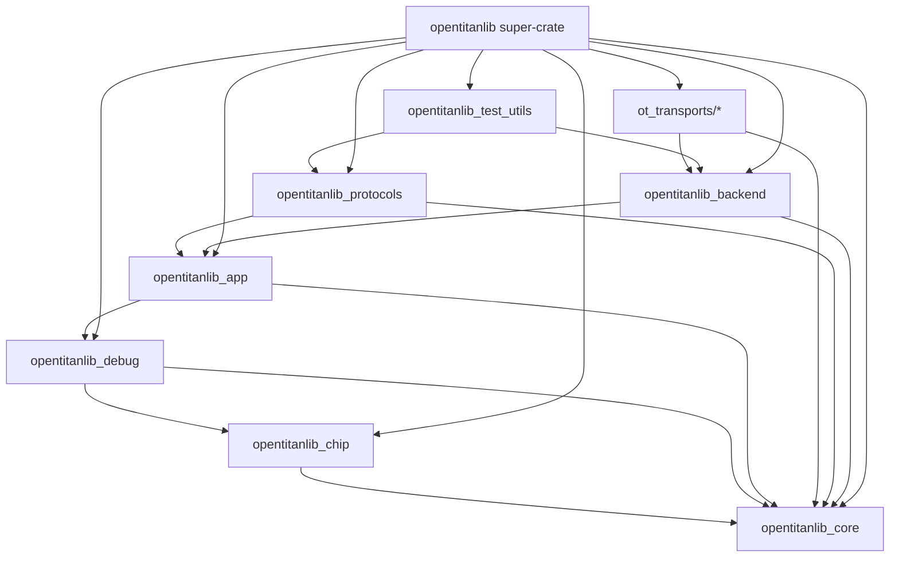

# Implementation Plan: Refactoring `opentitanlib` Monolith

This document outlines the plan to refactor the large Rust crate `//sw/host/opentitanlib` into smaller, logical crates, maintain backward compatibility via a super-crate, and feature-gate hardware transports.

## Goal
1.  **Modularization**: Break down `opentitanlib` into smaller crates with clear responsibilities.
2.  **Cycle Resolution**: Resolve existing circular dependencies (e.g., between `transport`, `bootstrap`, `app`, and `io`).
3.  **Feature Gating**: Allow compiling `opentitanlib` with a subset of hardware transports (e.g., to reduce dependencies and binary size).
4.  **Backward Compatibility**: Keep `opentitanlib` as a "super-crate" that re-exports all public items from the sub-crates, ensuring no breakage for existing tools and tests.
5.  **Testability**: Ensure tests can be run and pass at each step.

---

## Current Architecture & Dependency Analysis

The monolithic `opentitanlib` crate currently has the following internal structure:
-   `util`: Low-level utilities (file, status, presentation, vmem, etc.).
-   `crypto`: Cryptographic helpers.
-   `io`: Hardware Abstraction Layer (HAL) interfaces (`GpioPin`, `Uart`, `Spi`, `I2c`, `JtagChain`, etc.) and command-line parameters (`UartParams`, `SpiParams`, etc.).
-   `transport`: Core `Transport` traits and capabilities (concrete transports like `ftdi`, `hyperdebug`, etc. are already split into separate crates under `//sw/host/ot_transports/...`).
-   `chip` / `dif`: Chip register definitions and interface wrappers.
-   `debug`: Debugging utilities (DMI, OpenOCD interface).
-   `bootstrap` / `rescue` / `spiflash` / `otp` / `ownership` / `tpm`: Protocol implementations.
-   `app`: Top-level application context, config file parsing, and `TransportWrapper`.
-   `backend`: Factory to instantiate concrete transports based on CLI options.
-   `test_utils`: Helpers for system-level testing.

### Identified Cycles (Circular Dependencies)

1.  **`io` <-> `app` (via `Params::create`)**
    -   `io/uart/mod.rs` defines `UartParams` which has a `create` method taking `&TransportWrapper` (defined in `app`).
    -   Similarly, `SpiParams`, `I2cParams`, and `JtagParams` in `io` have `create` methods taking `&TransportWrapper`.
    -   `app` naturally depends on `io` because `TransportWrapper` exposes and wraps `io` traits.

2.  **`transport` <-> `bootstrap` (via `ProxyOps::bootstrap`)**
    -   `transport` core defines `ProxyOps` trait (used by proxy client transport).
    -   `ProxyOps::bootstrap` takes `&BootstrapOptions` (defined in `bootstrap`).
    -   `bootstrap` depends on `transport` core (for `Capability`, `ProgressIndicator`, etc.) and `app` (`TransportWrapper`).

3.  **`debug` -> `test_utils` -> `backend` -> `debug`**
    -   `debug/dmi.rs` uses `test_utils::poll::poll_until`.
    -   `test_utils/init.rs` uses `backend::create` to initialize target under test.
    -   `backend` depends on all transports, some of which might use `debug` (though currently transports seem clean, but this is a potential issue).
    -   Specifically, `debug/openocd.rs` uses `dif/lc_ctrl` and `io/jtag`.

---

## Target Architecture (DAG)

We propose splitting the monolith into the following sub-crates, forming a clean Directed Acyclic Graph (DAG). Note that concrete hardware transports are already externalized under `//sw/host/ot_transports/...` and register themselves via `inventory`, so they are not part of `opentitanlib` source tree but are linked by the super-crate.



### Crate Responsibilities

1.  **`opentitanlib_core`**:
    *   `util/**` (excluding `test_utils` candidates, move `poll_until` here).
    *   `crypto/**`.
    *   `io/**` (Interfaces only: `GpioPin`, `Uart`, `Spi`, etc., and `io/ioexpander.rs` interface).
    *   `io/capabilities.rs` (Moved from `transport/mod.rs`).
    *   `io/errors.rs` (Moved from `transport/errors.rs`).
    *   `io/bootstrap_types.rs` (Data structures: `BootstrapOptions`, `BootstrapProtocol`).
    *   `transport/mod.rs` (Core `Transport`, `FpgaOps`, `ProxyOps` and `ProgressIndicator` traits only).
    *   `transport/common/usb.rs` (`RusbContext` implementation, as it is a common USB utility).
2.  **`opentitanlib_chip`**:
    *   `chip/**`.
    *   `dif/**`.
3.  **`opentitanlib_debug`**:
    *   `debug/**` (DMI, OpenOCD, ELF debugger).
4.  **`opentitanlib_app`**:
    *   `app/**` (`TransportWrapper`, Config parsing).
    *   `app/params.rs` (New: implementation of `create` methods for `Params` structs).
    *   `transport/ioexpander/**` (sx1503 concrete implementation, as it depends on `TransportWrapper`).
    *   `transport/common/fpga.rs` (`FpgaProgram` helper, as it depends on `TransportWrapper`).
5.  **`ot_transports/*` (Existing external crates)**:
    *   `sw/host/ot_transports/ftdi`, `sw/host/ot_transports/hyperdebug`, etc.
    *   These depend on `opentitanlib_core` for traits and `opentitanlib_backend` for registration.
6.  **`opentitanlib_protocols`**:
    *   `bootstrap/**`, `rescue/**`, `spiflash/**`, `otp/**`, `ownership/**`, `tpm/**`.
7.  **`opentitanlib_backend`**:
    *   `backend/**` (Registry definition and factory to instantiate transports via `inventory`).
8.  **`opentitanlib_test_utils`**:
    *   `test_utils/**` (excluding `poll_until` which moves to `core`).
9.  **`opentitanlib` (Super-crate)**:
    *   No local logic. Re-exports all public items from the sub-crates and forces linking of enabled `ot_transports` to maintain 100% backward compatibility.

---

## Detailed Refactoring Steps

### Phase 1: Cycle Resolution (In-Place)
Perform all refactorings within the current monolithic crate to ensure it compiles and passes tests at each step.

#### Step 1.1: Move `poll_until` to `util`
-   Create [src/util/poll.rs](file:///usr/local/google/home/cfrantz/opentitan/ottool/sw/host/opentitanlib/src/util/poll.rs) and move `poll_until` from [src/test_utils/poll.rs](file:///usr/local/google/home/cfrantz/opentitan/ottool/sw/host/opentitanlib/src/test_utils/poll.rs) to it.
-   Update `src/debug/dmi.rs` to import from `crate::util::poll::poll_until`.
-   Update `test_utils` submodules to import from `crate::util::poll::poll_until`.
-   *Verification*: `blaze test //sw/host/opentitanlib:opentitanlib_test`

#### Step 1.2: Move `Capability` and `Capabilities` to `io`
-   Create [src/io/capabilities.rs](file:///usr/local/google/home/cfrantz/opentitan/ottool/sw/host/opentitanlib/src/io/capabilities.rs).
-   Move `Capability`, `Capabilities`, and `NeededCapabilities` from [src/transport/mod.rs](file:///usr/local/google/home/cfrantz/opentitan/ottool/sw/host/opentitanlib/src/transport/mod.rs) to it.
-   Re-export them in `src/io/mod.rs`.
-   Re-export them in `src/transport/mod.rs` (for backward compatibility).
-   Update internal imports to use `crate::io::capabilities::Capability` (or `crate::io::Capability`).
-   *Verification*: `blaze test //sw/host/opentitanlib:opentitanlib_test`

#### Step 1.3: Move `TransportError` and `TransportInterfaceType` to `io`
-   Create [src/io/errors.rs](file:///usr/local/google/home/cfrantz/opentitan/ottool/sw/host/opentitanlib/src/io/errors.rs).
-   Move contents of [src/transport/errors.rs](file:///usr/local/google/home/cfrantz/opentitan/ottool/sw/host/opentitanlib/src/transport/errors.rs) to it.
-   Update it to import `Capability` from `crate::io::capabilities::Capability`.
-   Delete `src/transport/errors.rs`.
-   Re-export `TransportError` and `TransportInterfaceType` in `src/io/mod.rs`.
-   Re-export them in `src/transport/mod.rs` (for backward compatibility).
-   Update imports in `src/io/*.rs` and other files to use local errors (or `crate::io::TransportError`).
-   *Verification*: `blaze test //sw/host/opentitanlib:opentitanlib_test`

#### Step 1.4: Move `BootstrapOptions` and `BootstrapProtocol` to `io`
-   Create [src/io/bootstrap_types.rs](file:///usr/local/google/home/cfrantz/opentitan/ottool/sw/host/opentitanlib/src/io/bootstrap_types.rs).
-   Move `BootstrapOptions` and `BootstrapProtocol` from [src/bootstrap/mod.rs](file:///usr/local/google/home/cfrantz/opentitan/ottool/sw/host/opentitanlib/src/bootstrap/mod.rs) to it.
-   Re-export them in `src/io/mod.rs`.
-   Re-export them in `src/bootstrap/mod.rs` (for backward compatibility).
-   Update `ProxyOps` in `src/transport/mod.rs` to import `BootstrapOptions` from `crate::io`.
-   *Verification*: `blaze test //sw/host/opentitanlib:opentitanlib_test`

#### Step 1.5: Refactor `Params` instantiation to `TransportWrapper`
-   Remove `create` methods from:
    -   `UartParams` in [src/io/uart.rs](file:///usr/local/google/home/cfrantz/opentitan/ottool/sw/host/opentitanlib/src/io/uart.rs)
    -   `SpiParams` in [src/io/spi.rs](file:///usr/local/google/home/cfrantz/opentitan/ottool/sw/host/opentitanlib/src/io/spi.rs)
    -   `I2cParams` in [src/io/i2c.rs](file:///usr/local/google/home/cfrantz/opentitan/ottool/sw/host/opentitanlib/src/io/i2c.rs)
    -   `JtagParams` in [src/io/jtag.rs](file:///usr/local/google/home/cfrantz/opentitan/ottool/sw/host/opentitanlib/src/io/jtag.rs)
-   Remove `use crate::app::TransportWrapper;` from these files.
-   In [src/app/mod.rs](file:///usr/local/google/home/cfrantz/opentitan/ottool/sw/host/opentitanlib/src/app/mod.rs), implement these methods on `TransportWrapper`:
    ```rust
    impl TransportWrapper {
        pub fn create_uart(&self, params: &UartParams) -> Result<Rc<dyn Uart>> { ... }
        pub fn create_spi(&self, params: &SpiParams, default_instance: &str) -> Result<Rc<dyn Target>> { ... }
        pub fn create_i2c(&self, params: &I2cParams, default_instance: &str) -> Result<Rc<dyn Bus>> { ... }
        pub fn create_jtag<'t>(&'t self, params: &JtagParams) -> Result<Box<dyn JtagChain + 't>> { ... }
    }
    ```
-   Update callers:
    -   `src/bootstrap/primitive.rs`: `container.spi_params.create(transport, "BOOTSTRAP")?` -> `transport.create_spi(&container.spi_params, "BOOTSTRAP")?`
    -   `src/bootstrap/eeprom.rs`: same.
    -   `src/bootstrap/legacy.rs`: same.
    -   `src/bootstrap/legacy_rescue.rs`: `container.uart_params.create(transport)?` -> `transport.create_uart(&container.uart_params)?`
    -   `src/test_utils/init.rs`: `self.bootstrap.options.uart_params.create(&transport)?` -> `transport.create_uart(&self.bootstrap.options.uart_params)?`
-   *Verification*: `blaze test //sw/host/opentitanlib:opentitanlib_test` and `blaze build //sw/host/opentitantool`.

At this point, `src/io` should have **ZERO** internal dependencies on `src/app` or `src/transport`!

---

### Phase 2: Define Sub-Crates (In-Place)
Before moving files, we can define separate `rust_library` targets in `sw/host/opentitanlib/BUILD` to ensure boundaries are correct and dependencies are properly declared.

We will define:
1.  `opentitanlib_core` (sources under `src/{util, crypto, io}`, core parts of `src/transport/mod.rs`, and `src/transport/common/usb.rs`)
2.  `opentitanlib_chip` (sources under `src/{chip, dif}`)
3.  `opentitanlib_debug` (sources under `src/debug`)
4.  `opentitanlib_app` (sources under `src/app`, `src/transport/ioexpander/**`, and `src/transport/common/fpga.rs`)
5.  `opentitanlib_protocols` (sources under `src/{bootstrap, rescue, ...}`)
6.  `opentitanlib_backend` (sources under `src/backend`)
7.  `opentitanlib_test_utils` (sources under `src/test_utils`)

#### Step 2.1: Re-exporting modules in Super-Crate
-   To maintain backward compatibility in `opentitanlib` (super-crate), we will update `sw/host/opentitanlib/src/reexport.rs` (or `lib.rs`) to re-export all public items from the new sub-crates:
    ```rust
    pub use opentitanlib_core::*;
    pub use opentitanlib_chip::*;
    pub use opentitanlib_debug::*;
    pub use opentitanlib_app::*;
    pub use opentitanlib_protocols::*;
    pub use opentitanlib_backend::*;
    ```
-   The `reexport.rs` will also continue to force linking of the `ot_transports` crates.

#### Step 2.2: Define Bazel targets and compile them
-   Update `sw/host/opentitanlib/BUILD` to define the sub-libraries.
-   We will need to change `crate::` imports inside the sub-crates to use the correct external crate names (e.g., in `src/app/mod.rs`, change `use crate::io::...` to `use opentitanlib_core::io::...`).
-   This will be done systematically:
    -   `core` can use `crate::` for `util`, `crypto`, `io`, `transport` (core), `transport/common/usb`.
    -   `chip` must use `opentitanlib_core::` for core imports.
    -   `debug` must use `opentitanlib_core::` and `opentitanlib_chip::`.
    -   `app` must use `opentitanlib_core::`, `opentitanlib_chip::`, `opentitanlib_debug::`.
    -   `ot_transports` (external) must use `opentitanlib_core::` and `opentitanlib_backend::`.
    -   `protocols` must use `opentitanlib_core::`, `opentitanlib_app::`.
    -   `backend` must use `opentitanlib_core::`, `opentitanlib_app::`.
    -   `test_utils` must use `opentitanlib_core::`, `opentitanlib_app::`, `opentitanlib_protocols::`, `opentitanlib_backend::`.
-   *Verification*: Build each sub-library individually.

---

### Phase 3: File Organization (Discarded)
We decided against moving files into separate subdirectories (like `core/src/...`, `app/src/...`) to avoid unnecessary churn, as most moves wouldn't have a meaningful change on the file organization. Files will remain in their current location under `sw/host/opentitanlib/src/...`, and the new sub-crate targets in `sw/host/opentitanlib/BUILD` will reference them there. Only targeted single-file moves defined in Phase 1 (like `poll.rs`) will be performed.

---

### Phase 4: Feature Gating Transports
Implement conditional compilation of hardware transports using Bazel configuration settings and Rust features in the super-crate.

-   In the super-crate `opentitanlib` (`sw/host/opentitanlib/BUILD`):
    -   Define features/flags for each transport (e.g., `ftdi`, `hyperdebug`).
    -   Use `select` to conditionally include the corresponding `//sw/host/ot_transports/...` dependency.
    -   Pass matching features to the rustc invocation (using `crate_features` attribute).
-   In `sw/host/opentitanlib/reexport.rs`:
    -   Feature-gate the `extern crate` statements:
        ```rust
        #[cfg(feature = "ftdi")]
        extern crate ot_transport_ftdi;
        #[cfg(feature = "hyperdebug")]
        extern crate ot_transport_hyperdebug;
        // ...
        ```
-   This ensures that if a transport is disabled via Bazel configuration, it is neither compiled nor linked into the final binary, reducing size and dependencies, while `backend` continues to work transparently via `inventory` for the enabled transports.

---

## Quality Rules & Style Guidelines

To ensure the refactored code maintains the project's quality standards, the following rules must be followed:

1.  **License Headers**: Every new file must start with the standard Apache-2.0 license header:
    ```rust
    // Copyright lowRISC contributors (OpenTitan project).
    // Licensed under the Apache License, Version 2.0, see LICENSE for details.
    // SPDX-License-Identifier: Apache-2.0
    ```
2.  **Formatting**: All modified and new files must be formatted.
    *   For Rust files: Run `bazel run //quality:rustfmt_fix` or format using `rustfmt` directly.
    *   For Bazel files (`BUILD`, `.bzl`): Run `bazel run //quality:buildifier_fix`.
    *   Alternatively, run `bazel run //quality:format` to format all modified files.
3.  **Verification**: Before completing any step, verify quality checks pass:
    *   License check: `bazel test //quality:license_check`
    *   Format check: `bazel test //quality:format_check`

---

## Testing & Verification Plan

At each step, we must ensure that the codebase remains buildable and all tests pass.

### Unit Tests
Run unit tests of `opentitanlib`:
```bash
bazel test //sw/host/opentitanlib:opentitanlib_test
```
When split, we will have separate tests:
```bash
bazel test //sw/host/opentitanlib/core:core_test
bazel test //sw/host/opentitanlib/app:app_test
# ...
```

### Integration Tests
Verify that external tools (like `opentitantool`) still compile and run correctly:
```bash
bazel build //sw/host/opentitantool
```
Run `opentitantool` tests:
```bash
bazel test //sw/host/opentitantool:opentitantool_test
```
Run system end-to-end tests (which use `test_utils` extensively):
```bash
bazel test //sw/host/tests/chip/gpio:gpio_intr
bazel test //sw/host/tests/chip/flash_ctrl:flash_ctrl
# (and other tests listed in dependency analysis)
```
