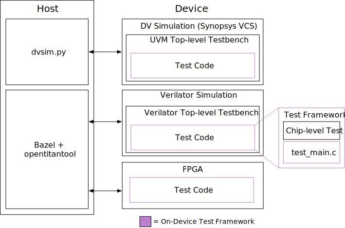

# On-Device Test Framework

# Overview



[Chip-level tests](../../../tests/README.md) are designed to be executed across all OpenTitan verification targets DV simulation, Verilator simulation, FPGA, and (eventually) silicon, using host-side test initiation tools, and an on-device test framework, as shown in the figure above.
On the _host_ side, two main tools are used to initiate tests on the device. For the DV simulation target, the [dvsim.py](https://github.com/lowRISC/opentitan/blob/master/util/dvsim/dvsim.py) tool is used, while for Verilator and FPGA targets, Bazel (and `opentitantool`) is used.
Focusing on the _device_ side, for all three targets, the [on-device test framework](https://github.com/lowRISC/opentitan/blob/master/sw/device/lib/testing/test_framework/ottf_main.c) is used to provide a uniform execution environment for chip-level tests.
The [on-device test framework](https://github.com/lowRISC/opentitan/blob/master/sw/device/lib/testing/test_framework/ottf_main.c) provides boilerplate setup code that configures the UART for communicating messages and test results back to the host.

# Writing a Chip-Level Test
To write a chip-level test that uses this framework, one must create a new C file for the test (see [Chip-Level Tests](../../../tests/README.md) for where to place this test) and follow the steps below.

## Test Setup
Each chip-level test must contain the following boilerplate setup code:

```
#include "sw/device/lib/testing/test_framework/test_main.h"
#include "sw/device/lib/testing/check_.h" // if calls to CHECK() are made
#include "sw/device/lib/runtime/log.h"  // if calls to LOG_INFO() are made

OTTF_DEFINE_TEST_CONFIG();

bool test_main() {
  // Test program entry point.
  return true;
}
```

Check out the [rv\_timer smoke test](https://github.com/lowRISC/opentitan/blob/master/sw/device/tests/rv_timer_smoketest.c) for an example chip-level test that contains this boilerplate code.

## Signaling the end of test and self-checking mechanism
It is mandatory to invoke the target-agnostic API `test_status_set()` to explicitly signal the end of the test based on whether it passed or failed.
When invoked, the API calls `abort()` at the end to stop the core from executing any further.
Please see [`sw/device/lib/testing/test_framework/status.h`](https://github.com/lowRISC/opentitan/blob/master/sw/device/lib/testing/test_framework/status.h) for documentation and usage.

### Non-DV Targets
In non-DV targets (Verilator simulation, FPGA, or silicon), the signal is a message written to the console.
It will output `PASS!\r\n` when the tests pass and `FAIL!\r\n` when they fail.
How these console messages are captured differs based on the testing target.
On FPGA / silicon, they will feed directly to a host machine through a physical UART connection, where the host can decipher the message correctness.
On Verilator, they will feed to a virtual UART terminal where the host can do the same.

In DV simulation, the test status is written to a known location in the memory, which is monitored by the UVM testbench.
Based on the captured value, the testbench monitor invokes UVM methods to pass or fail the test.
