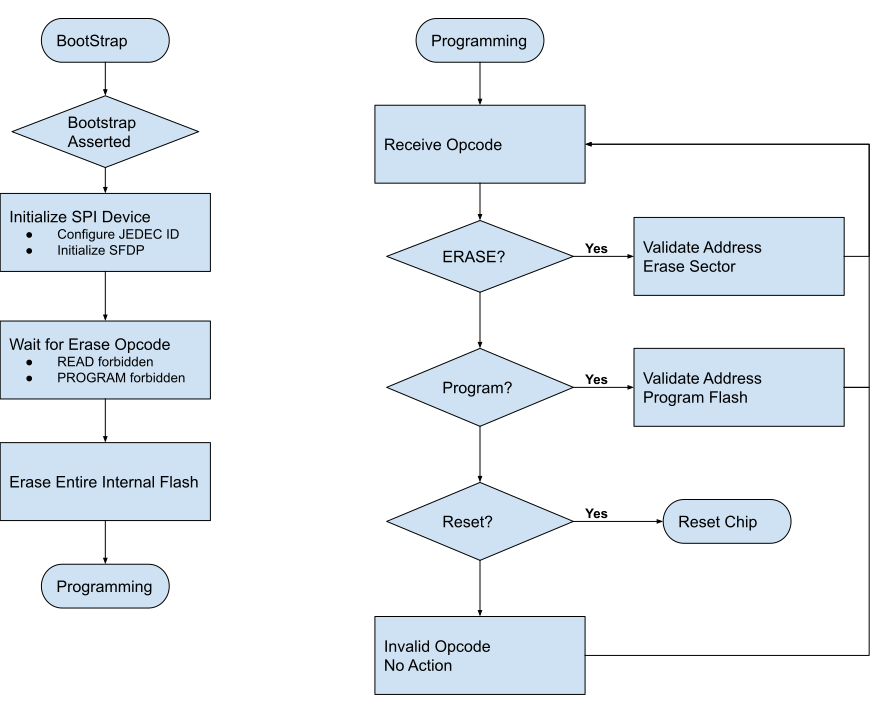

# Bootstrap Protocol

## Introduction

The OpenTitan bootstrap protocol should conform to well-known standards which can be driven by commonly available equipment.
Given the available I/O interfaces on the OpenTitan chip, we can choose between protocols implemented on TTL-level serial (e.g. XMODEM or parsing of S-records), SPI (e.g. the SPI EEPROM protocol), I2C (e.g. the I2C EEPROM protocol) or USB (e.g. choose a standard USB protocol).

## Requirements

Assumptions:
*   Bootstrap is for initial programming at chip manufacturing.
*   Bootstrap may be used for development and debug of DEV chips by the silicon owner.
*   Bootstrap may be used in disaster recovery situations by the silicon owner.
*   Bootstrap may be used in failure analysis situations by the silicon owner.
*   Bootstrap _is not_ a mechanism by which an ownership transfer may be performed.

The OpenTitan bootstrap protocol should:
*   Be implemented via the typical SPI flash EEPROM command set.
*   Be driven by commonly available SPI flash programmers (e.g. the [Dediprog SF100](https://www.dediprog.com/product/SF100))
*   Require no custom modifications to the SPI flash programmer's client software.
*   Have deterministic timing bounds on long-running operations (such as ERASE and PROGRAM) so unidirectional programmers can be used (e.g. ATE testers during chip manufacturing).

Furthermore, the bootstrap protocol should make discovery and diagnostic information available via standard SPI flash mechanisms.


## Threat Model

The bootstrap mechanism discussed in this document does not require authentication to enter bootstrap mode, nor does it perform any validation on the loaded data contents.
It is assumed that the Mask ROM will validate the flash contents during its secure boot process and will not permit execution of unauthorized code.

The bootstrap mechanism may only be activated by asserting the correct strapping configuration on the strapping pins.
Without access to the strapping pins, the bootstrap mechanism cannot be activated.

Although an attacker with physical access to the chip cannot use the bootstrap mechanism to run unauthorized code, the bootstrap mechanism does allow for a denial of service attack: an attacker may erase the chip and then abort the bootstrap protocol.
Recovery from this attack also requires physical access: initiate bootstrap again with a valid payload.

## Dependencies

Hardware:
*   SPI Device
*   GPIO
*   Flash
*   Reset Manager

Software:
*   SPI device driver
*   GPIO driver
*   Flash controller driver.
*   Bootstrap mode detection


## Design Ideas

*   Implement a simple SPI flash command handler to perform the bootstrapping procedure.
*   Define and enforce an order of operations to prevent using the bootstrap flow as an attack vector.
*   Permit disabling the bootstrap protocol via OTP.

Note: the following description does not include a description of complete opcode sequences for a given operation (e.g. an ERASE normally requires WRITE\_ENABLE, ERASE and then a READ\_STATUS until the BUSY bit clears).

*   Upon entering bootstrap mode, the ROM will initialize EEPROM discovery mechanisms, such as the JEDEC ID and Serial Flash Discovery Parameters (SFDP) Table.
*   Bootstrap will wait for an ERASE opcode; all other operations will be forbidden.
    *   READs will return a static buffer of 0xFF.
    *   PROGRAM operations will do nothing.
*   Upon receiving an ERASE opcode, bootstrap will erase the internal flash data partitions and then enter a generic SPI flash opcode dispatch loop.
The erase operation will not affect any of the flash info partitions.
*   Within the generic opcode dispatch loop:
    *   An ERASE opcode will validate the supplied address and erase the target sector.
    *   A PAGE\_PROGRAM opcode will validate the supplied address and program the target page.
    *   A RESET opcode will exit the dispatch loop and reset the chip.



**Figure 1: Simplified EEPROM-mode Bootstrap Flow**

## Implementation

### Public API

```c
// Determine whether or not bootstrap mode has been requested by
// examining the strapping pins configuration.
bool bootstrap_mode_check(void);

// Enter into bootstrap mode and perform the update protocol.
// - Initialize the SPI Device
// - Configure SPI JEDEC ID and SFDP tables.
// - Listen and act on SPI transactions
rom_error_t bootstrap_mode_enter(void);
```

### Internal API & Pseudo Code

```c
// Set the jedec ID in the SPI device
void bootstrap_jedecid_set(uint8_t *id, size_t len);

// Set the SFDP table in the SPI device.
// TODO: define sfdp_t.
void bootstrap_sfdp_set(sfdp_t *sfdp);

// Perform the initial bootstrap phase:
// Wait for an ERASE opcode, and silently ack all others.
// Perform the ERASE when received.
// Returns OK after the ERASE completes.
rom_error_t bootstrap_phase1(void)

// Perform the main bootstrap phase
// Implement ERASE, PROGRAM and RESET opcodes, and silently ack all others.
// We expect proper termination of the bootstrap protocol to include
// a RESET opcode.
// Returns OK after receiving the RESET opcode.
rom_error_t bootstrap_phase2(void);

// Ask reset manager to reset the chip.
void noreturn bootstrap_reset(void);


// Pseudocode for implementing the public API
bool  bootstrap_mode_check(void) {
  uint8_t strap = gpio_straps_read();
  return strap == BOOTSTRAP_STRAP_VALUE;
}

rom_error_t bootstrap_mode_enter(void) {
  const uint8_t jedec_id[] = { ... };
  bootstrap_jedecid_set(jedec_id);

  sfdp_t sfdp = {
    // Configure SFDP values according to our internal flash properties.
  };
  bootstrap_sfdp_set(&sfdp);

  RETURN_IF_ERROR(bootstrap_phase1());
  RETURN_IF_ERROR(bootstrap_phase2());
  bootstrap_reset();

  /* notreached */
  return kErrorBootstrapImpossibleState;
}
```

### Difficulties Anticipated

#### Violation of SPI Expectations

We may not be able to implement the READ opcode due to design limitations in the SPI device or due to code confidentiality requirements for certification.
In such a scenario, the SPI programmer must be configured to issue the programming sequence without performing a READ/VERIFY sequence.
This is usually a normal programmer configuration option.

The SPI RESET opcode normally requires a sequence of RSTEN followed by RESET.
Normally RSTEN followed by any other opcode cancels the reset enable.
I’m not expecting to be able to implement enforcement of this sequencing because intercepting RSTEN in software will create latency for handling the next command.

#### Debug and Upstreaming patches for Dediprog Software

The open source Dediprog SF-100 software is very low-quality code.
Although it is a goal to work with the Dediprog (and other commodity SPI programmer) devices without modifying the software, we must anticipate that the software will require modifications.

At a minimum, I expect that we’ll need to upstream a fragment of XML configuration for the Dediprog “chipdb” which is used to inform the software about the properties of the target device.

## Test Plan

The bootstrap module will use unit tests to validate the proper operation at the module boundaries.

The bootstrap module will also have functional tests which use verilator to simulate the bootstrap flows via the SPI device interface.
These tests will check for valid operation of the bootstrap flows and will check that the properties of each bootstrap phase perform their intended functions and correctly abort when the protocol sequence is violated.

Because the bootstrap module implements the real-world programming interface, testing flows must be developed which verify bootstrap functionality on FPGA devices paired with real programmer devices such as the Dediprog SF100.
Any difficulties encountered with the physical devices should result in enhanced tests performed in the unit tests or function tests.

## Alternatives Considered

The pre-existing bootstrap protocol used on current Google Titan-Class chips is well known (at least within Google) and has existing library support both in Google's codebase and in Open Source repositories (i.e.: the `spiflash` utility).

Although this protocol is well known and has existing support, this protocol requires the device driving the bootstrap sequence support SPI in generic mode and be a full-duplex SPI transceiver.

The author has on very rare occasions observed peculiar problems with the exiting bootstrap protocol which usually present as corrupted SHA checksums (usually in the form of a dropped bit).
These can normally be worked around by ignoring the checksums.

There are also reports of occasional synchronization issues with the full-duplex protocol.
