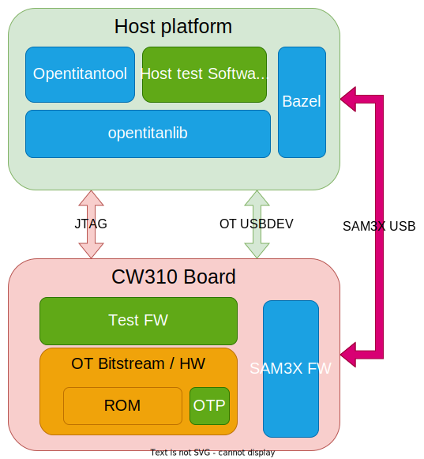
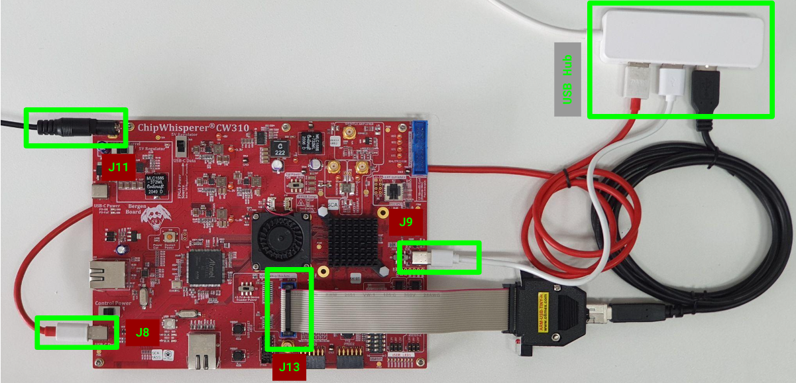

# ROM E2E Regressions setup
This guide will help you to setup an environment to run the ROM E2E tests in an Ubuntu 20.04 machine.

## Introduction
The [ROM](../README.md) is the first boot stage of secure boot flow and by nature, it cannot be updated after manufacturing.
The ROM E2E (End-to-End) tests validates the ROM features and can be used for regression tests.
Each test is divided into components:
 - **ROM Image**, a C program built by `bazel` and spliced with the bitstream. The ROM is the DUT (Device Under Test) of the ROM E2E tests.
 - **OTP image**, contains HW and SW configurations, some of which control execution paths in the ROM, such as the lifecycle stage. As a result, we run some of tests with several different OTP images to increase coverage of ROM execution paths. Please refers to [OTP layout](https://opentitan.org/book/hw/ip/otp_ctrl/index.html?highlight=CREATOR_SW_CFG_AST_INIT_EN#direct-access-memory-map) for more details.
 - **FPGA bitstream**, Opentitan Hardware implementation synthesized for the FPGA built by `bazel` and `vivado`.
 - **Device test firmware**, a C program (built by bazel to run on an OpenTitan device) that is loaded into flash, and booted by the ROM stage. It checks the HW registers and/or memory configurations performed by the ROM and relays information to the Host test software.
 - **opentitantool**, a Rust program that provides a common interface to interact with an OpenTitan device. `opentitantool` uses `opentitanlib` which provides the abstractions to communicate with an OpenTitan device.
 - **Host test software**, any Rust program (built by `bazel` to run on the host platform , e.g. a x86 binary, and linked with `opentitanlib`) that actively interacts with an OpenTitan device over any hardware interface (e.x., UART, SPI or JTAG) to perform the test functions and check their results.



All the existing tests are documented in the [ROM E2E Testplan](https://github.com/lowRISC/OpenTitan/blob/master/sw/device/silicon_creator/rom/data/rom_e2e_testplan.hjson).
## Hardware setup
### FPGA
The E2E ROM tests run on the CW310 FPGA board with the following configuration:
 - The power supply connected to the J11 connector.
 - A USB cable connecting the Host PC to the USB-C Data (J8) connector which is connected to the SAM3U microcontroller on the CW310 FPGA board.
 - The USRDIP#0 (SW4 header) is set to 0.
 - The rest of the USRDIPs are set to 1.
 - The S3 switch (next to USB connector J9) is set to USB.
 - The S2 switch (next to JTAG header) is set to +3.3V.
 - Optionally for future tests, a USB cable connecting the host PC to the USB-C J9 connector, which is connected to the OpenTitan `usbdev` IP block.

### JTAG adapter
Some tests will use the JTAG interface to interact with OpenTitan, as the CW310 doesn't have a embedded JTAG adapter, we can use an external adapter (Olimex ARM-USB-TINY-H JTAG) connected to the J13 header in the CW310.

### Full hardware setup


## Software setup
The software dependencies are covered by other guides in this book and are linked below.
- Clone the OpenTitan repository and install the software dependencies: [Get started](../../../../../doc/getting_started/README.md).
- Setup the FPGA: [FPGA guide](../../../../../doc/getting_started/setup_fpga.md).
- Install Vivado to be able to splice bitstreams: [Installing Vivado](../../../../../doc/getting_started/install_vivado).

**Note**: Make sure that you added the udev rules for the [FPGA](../../../../../doc/getting_started/install_vivado#device-permissions-udev-rules) board and the [JTAG](../../../../../doc/getting_started/setup_fpga.md#device-permissions-udev-rules) adapter.

## Running the ROM E2E tests
The ROM E2E tests are listed in the bazel [BUILD file](https://github.com/lowRISC/OpenTitan/blob/master/sw/device/silicon_creator/rom/e2e/BUILD), alternatively they can be listed with the command:
```sh
bazel query 'attr(tags, cw310, tests(//sw/device/silicon_creator/rom/e2e/...))'
```
Once the hardware setup is done and the FPGA is connected to the USB, the full suite of ROM E2E tests can be executed with the command `bazel test` with the wildcard `sw/device/silicon_creator/rom/e2e`.
```sh
cd ${REPO_TOP}
bazel test --define DISABLE_VERILATOR_BUILD=true --define bitstream=gcp_splice --test_tag_filters=-verilator,-dv,-broken --build_tests_only //sw/device/silicon_creator/rom/e2e/...
```
This bazel command will download a bitstream associated with the HEAD commit of the repository, splice it with the different OTP configurations (RMA, DEV, PROD*, TEST*), load the FPGA and run all the tests suites under `sw/device/silicon_creator/rom/e2e`.

**Note**: If you have hardware changes then you can build the bitstream locally by changing the tag `bitstream=` from `gcp_splice` to `vivado`. Although this will take much longer.
