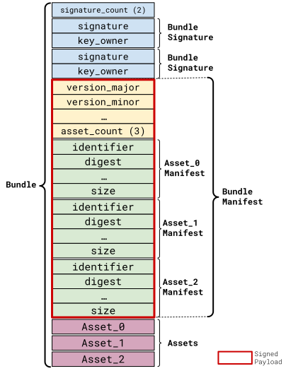
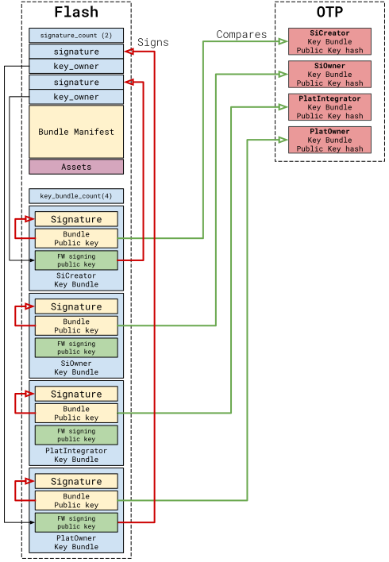
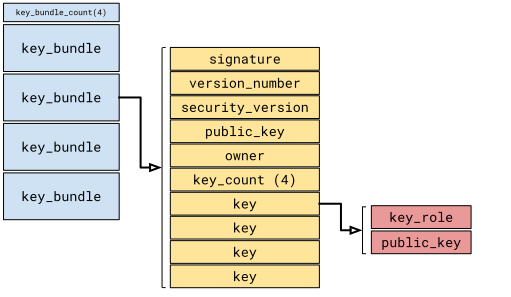

# OpenTitan External Flash

## Version

This is version `0.1` of the OpenTitan external flash specification:

* `MAJOR` version: `0`
* `MINOR` version: `1`

### Version Policy

Similar to the [Semantic Versioning](https://semver.org/) scheme, the `MAJOR` version must be incremented when adding backward incompatible API or structural changes.
The `MINOR` version must be incremented for backward compatible functional changes and bug fixes.

Many structures described in this document are versioned with `major` and `minor` version fields.
This versioning scheme refers to this specification [version](#version).
When parsing those structures, implementations of this specification must verify that the parsed structure `major` field matches the implemented `MAJOR` version.
The `minor` field must be greater than or equal to the implemented `MINOR` version.

# Overview

This document describes the OpenTitan Integrated external flash content layout.
It also defines the format for storing firmwares in that flash.

OpenTitan integrated [secure boot](https://opentitan.org/book/doc/security/specs/secure_boot/index.html), at a minimum, consists of four boot stages: `ROM`, `ROM 2nd stage`, `ROM_EXT`, and the first Silicon Owner boot stage, e.g. `BL0`.

The base and second-stage `ROM`s are are stored in their respective ROMs while the remaining stages firmwares are stored in external flash.

OpenTitan Integrated's secure boot implementation is anchored in the silicon base `ROM`.

The base `ROM` may load and apply a set of code patches before loading the second `ROM`.
Those patches are verified with an OTP-stored public key (`ROT_CREATOR_AUTH_ROM2_PATCH_SIGVERIFY_KEY`).

The second `ROM` verifies the first mutable, flash-stored firmware with a key manifest.
As this key manifest is stored in flash as well, the second `ROM` must verify its signature first, with the corresponding OTP-stored public key (`ROT_CREATOR_AUTH_KEYMANIFEST_KEY`).

At a high level, the OpenTitan integrated logical security model is composed of the following entities:

* The Silicon Creator manufactures, packages, tests and provisions the Integrated OpenTitan chip with its first device identity.
* The Silicon Owner takes ownership of the Integrated OpenTitan chip and is responsible for two functions: Silicon ownership assignment and functional provisioning/updates.
* The Platform Integrator performs the integration of platform components and Application-Processor (AP) firmware that operates on the SoC.
* The Platform Owner performs configuration management of the platform (including SoC, components and firmware). The Platform Owner is the operator of the platform, such as cloud provider, enterprise IT administrators, appliance operators, etc.

OpenTitan Integrated is the Root of Trust for the SoC.
It is responsible for loading, verifying and starting multiple platform firmwares.

The Platform Owner may want to enforce that only firmware authorized by the Platform Owner runs before the Platform-Owner-installed SW runs.
Hence, any mutable, flash-stored firmwares (`ROM Extension`, `BL0`,  platform firmwares, etc.) which are signed by the Silicon Owner/Creator or the Platform Integrator, may be additionally signed by the Platform Owner.

At the end of the OpenTitan Integrated secure boot, the base ROM patches and loads the second stage `ROM`.
The second stage `ROM` must then verify that the first mutable firmware, e.g. the `ROM Extension` one, is doubly signed.
Then the `ROM Extension` verifies, loads and starts the OpenTitan Integrated `BL0` firmware, which is also dual-signed by both the Silicon Owner or Creator and the Platform Owner.

The RoT runtime firmware (`BL0`) supports the overall platform secure boot sequence by verifying, loading and in some cases starting other platform firmwares.
All of those firmwares may be dual-signed as well, and it is the `BL0` responsibility to verify those dual signatures.

This collection of multi-signed firmwares is stored in OpenTitan Integrated's external flash, and this document describes the flash storage layout and partitions.
As some firmwares may be logically bound together, this document also defines a flexible bundle format for storing multiple firmwares in the same external flash partition.

As each of those bundles may be signed by one or more of the OpenTitan Integrated defined entities, this document also specifies a Key Manifest format for each of those entities to provide its set of identities.
Before loading a firmware, the OpenTitan Integrated firmware selects the right Key Bundle in the Key Manifest in order to verify the bundle first.

> **Note**: Unless specified, all multi-bytes field are encoded in little endian.

# Partition table

For storage efficiency and flexibility purposes, the external flash is divided into physically separated, independent storage units called partitions.
A partition size is not fixed but must be a multiple of the physical medium sector size. Each partition stores one specific kind of data, like e.g. a `Key Manifest` or a `Firmware Bundle`.

A partition table describes the size, data type and the physical address for each partition stored in the external flash.
The partition table itself must be stored at the beginning of the flash (i.e. at address `0x0`), with the following format:

## Partition table format

| Field            | Size (bytes)                         | Offset (bytes) | C Data Type               |
| ---------------- | ------------------------------------ | -------------- | ------------------------- |
| `magic_number`   | 4                                    | 0              | `uint32_t`                |
| `version_major`  | 2                                    | 4              | `uint16_t`                |
| `version_minor`  | 2                                    | 6              | `uint16_t`                |
| `part_count`     | 4                                    | 8              | `uint32_t`                |
| `part_descs`     | sizeof(`part_desc_t`) * `part_count` | 12             | `part_desc_t[part_count]` |

### Field Description

- `magic_number`: Magic number (`0x5450544F`: 'OTPT'). Verifying the magic number guarantees that a partition table is present.
- `version_major`: Partition table [major version](#version).
- `version_minor`: Partition table [minor version](#version).
- `part_count`: Number of partitions in the table.
- `part_descs`: Array of [partition descriptions](#partition-description-part_desc_t).

## Partition Description `part_desc_t`

| Field           | Size (bytes) | Offset (bytes) | C Data Type   |
| --------------- | ------------ | -------------- | ------------- |
| `identifier`    | 4            | 0              | `uint32_t`    |
| `type`          | 2            | 4              | `part_type_t` |
| `slot_number`   | 2            | 6              | `uint16_t`    |
| `start_address` | 4            | 8              | `uint32_t`    |
| `size`          | 4            | 12             | `uint32_t`    |

### Field Description

- `identifier`: Partition identifier. Identifiers containing `0x544f` (starting with 'OT' in little endian) are reserved for OpenTitan usage.
- `type`: [Partition type](#partition-type-part_type_t).
- `slot_number`: Slot number (0 if this partition type does not supports slots). Slots allow installing and testing a new update without overriding the functional bundle. There is always a workable booting bundle.
- `start_address`: Start address of the partition (from the start of the flash).
- `size`: Size of the partition (Bytes).

## Partition Type `part_type_t`

The partition type values are defined below:

| type                            | Value    |
| ------------------------------- | -------- |
| [`Bundle`](#bundle)             | 0x0      |
| [`Key Manifest`](#key-manifest) | 0x1      |

Partition types from `0x0` to `0x7FFF` included are reserved for OpenTitan usage.
Partition types from `0x8000` to `0xFFFF` are available for defining custom partition types.

## Example

Below is an example of an OpenTitan Integrated flash layout (with 64K flash sector sizes).

| Region content        |  Start     | Size      |
| --------------------- |  --------- | --------- |
| partition table       |  0x0       | 0x10000   |
| romext - slot A       |  0x10000   | 0x10000   |
| romext - slot B       |  0x20000   | 0x10000   |
| platform FWs - slot A |  0x30000   | 0x400000  |
| platform FWs - slot B |  0x430000  | 0x400000  |
| key manifest          |  0x1000000 | 0x10000   |
| filesystem            |  0x8000000 | 0x8000000 |

In this case the partition table would look like:

| Identifier | Type                     | Slot | Start     | Size      |
| ---------- | ------------------------ | ---- | --------- | --------- |
| 'OTRE'     | Bundle (0x0)             |  0   | 0x10000   | 0x10000   |
| 'OTRE'     | Bundle (0x0)             |  1   | 0x20000   | 0x10000   |
| 'OTPF'     | Bundle (0x0)             |  0   | 0x30000   | 0x400000  |
| 'OTPF'     | Bundle (0x0)             |  1   | 0x430000  | 0x400000  |
| 'OTKM'     | Key Manifest (0x1)       |  0   | 0x1000000 | 0x10000   |
| 'RVFS'     | Rivos-Filesystem(0x8000) |  0   | 0x8000000 | 0x8000000 |

# Bundle

An OpenTitan external flash bundle contains one or more assets that are all provisioned or updated together.
Bundling assets together allows for enforcing version compatibility between different assets that logically depend on each others.
Each bundle asset is described by an [Asset Manifest](#asset-manifest-asset_manifest_t).

A partition of type `Bundle` contains one and only one bundle.
A bundle starts at the beginning of the `Bundle` partition and may not fill the entire partition.

A bundle contains at least one [Bundle Signature](#bundle-signature-bundle_signature_t) followed by at least one [Bundle Manifest](#bundle-manifest-bundle_manifest_t).
There can be multiple bundle signature, one per signer of the bundle.
Each bundle signature contains a signature of the bundle manifest.

A bundle manifest contains an asset manifest for each of its associated assets, which includes a digest of the corresponding asset.

A bundle asset's integrity must be verified prior to being loaded or used, by going through the following sequence:
1. [Verify the bundle](#bundle-verification).
2. Verify that the asset's computed digest matches its asset manifest `digest` field.

| Field               | Size (bytes)                                     | Offset (bytes) | C Data Type                            |
| ------------------- | ------------------------------------------------ | -------------- | -------------------------------------- |
| `signature_count`   | 4                                                | 0              | `uint32_t`                             |
| `bundle_signatures` | `signature_count` * sizeof(`bundle_signature_t`) | 4              | `bundle_signature_t [signature_count]` |
| `bundle_manifest`   | sizeof(`bundle_manifest_t`)                      | variable       | `bundle_manifest_t`                    |
| `asset_data`        | variable                                         | variable       | `uint32_t[xx]`                         |

## Field Descriptions
- `signature_count`: Number of `bundle_signatures`.
- `bundle_signatures`: See [here](#bundle-key-signature-bundle_signature_t)
- `bundle_manifest`: See [here](#bundle-manifest-bundle_manifest_t-bundle_manifest_t)
- `asset_data`: Asset data (indexed by [Asset Manifest](#asset-manifest-asset_manifest_t) in the [Bundle Manifest](#bundle-manifest-bundle_manifest_t)).

## Bundle Signature `bundle_signature_t`

| Field       | Size (bytes) | Offset (bytes) | C Data Type    |
| ----------- | ------------ | -------------- | -------------- |
| `signature` | 48           | 0              | `uint8_t[48]`  |
| `key_owner` | 4            | 48             | `key_owner_t`  |

### Field Descriptions
- `signature`: [ECDSA](https://csrc.nist.gov/pubs/fips/186-5/final) signature of the [Bundle Manifest](#bundle-manifest-bundle_manifest_t) generated using a [Curve P-384](https://csrc.nist.gov/pubs/sp/800/186/final) ECDSA private key and the SHAKE256 hash function.
- `key_owner`: Owner of the key used for the signature, [see here](#key-owner-key_owner_t).

## Bundle Verification

Before using an asset, the OpenTitan Integrated ROMs or firmware must verify the bundle it belongs to.

Each bundle can be signed by one or more key owner, each one of those signatures is located in its own Bundle Signature at the bottom of the bundle.

Each Bundle Signature is signed by its key owner, and the public key to verify that signature is stored in the owner's key bundle (Inside the Key Manifest partition).

Finally, each owner Key Bundle is signed as well, and the public key to verify that signature is embedded in the owner Key Bundle. For each Key Bundle, a digest of the public key is securely stored in a dedicated OTP partition.

The bundle (including the Bundle Signature) and the owner Key Bundle are signed and stored in external flash. Key Bundle signature public keys digests are stored in OTP.

A bundle verification process must go through the following steps:

-  **Key Manifest Verification**: Each Key Bundle stored in external flash must be verified:
   - A Key Bundle signature public key must be compared against its digest stored in OTP. Each entity owns a dedicated OTP partition to store those digests in OTP.
   - A Bundle Signature must then be verified with the Key Bundle public key from the Key Bundle itself.
- **Bundle Signature Verification**: Each bundle signature must be verified:
   - Find the Key Bundle for the owner defined in the Bundle Signature.
   - Use the Key Bundle `Firmware Signing` public key to verify the Bundle Signature signature against the signed payload.

Once a bundle is verified, each asset digest must be computed before loading it. The computed digest must then be compared with the Asset Manifest stored digest this asset.

> **Note**: A bundle signature policy describing which key owners must sign a bundle is not included in the bundle manifest.
> For the first mutable firmware (e.g. `ROM_EXT`), the policy should be stored in OTP, for example as a bitfield of required key signers.
> For the following firmwares in the secure boot sequence, the signature policy should be defined by the loading firmware.

## Bundle Manifest `bundle_manifest_t`

This header describes the whole bundle and contains information on each asset.

| Field              | Size (bytes)                               | Offset (bytes) | C Data Type                     |
| ------------------ | ------------------------------------------ | -------------- | ------------------------------- |
| `version_major`    | 2                                          | 0              | `uint16_t`                      |
| `version_minor`    | 2                                          | 2              | `uint16_t`                      |
| `usage_contraints` | 48                                         | 4              | `usage_constraints_t`           |
| `security_version` | 4                                          | 52             | `uint32_t`                      |
| `timestamp`        | 8                                          | 56             | `uint64_t`                      |
| `binding_value`    | 32                                         | 64             | `uint32_t[8]`                   |
| `max_key_version`  | 4                                          | 96             | `uint32_t`                      |
| `asset_count`      | 4                                          | 100            | `uint32_t`                      |
| `asset_manifests`  | sizeof(`asset_manifest_t`) * `asset_count` | 104            | `asset_manifest_t[asset_count]` |

This header is directly followed by the bundle assets binary data.

### Field Descriptions

- `version_major`/`version_minor`:  Bundle Manifest structure major/minor version (see [version](#version)). In any case the Bundle Manifest version must be compatible with the Partiton Table version (major `=`, minor `>=`).
- `usage_contraints`: contrains the bundle to a set of devices.
- `security_version`: Security version of the bundle used for anti-rollback protection. Must be a monotonically increasing integer.
- `timestamp`: Unix timestamp that gives the creation time of the bundle, seconds since 00:00:00 on January 1, 1970 UTC (the Unix Epoch).
- `max_key_version`: Maximum allowed version for keys generated by the key manager at the next boot stage (doc [here](https://opentitan.org/book/doc/security/specs/identities_and_root_keys/index.html#key-versioning)).
- `asset_count`: number of assets in the bundle.
- `asset_manifests`: asset manifest (see [here](#asset-manifest-asset_manifest_t)).

## Usage Constraints `usage_constraints_t`

This header is used to constrain a bundle to a set of devices based on their device IDs, creator and/or owner manufacturing states, and life cycle states.

| Field                 | Size (bytes) | Offset (bytes) | C Data Type   |
| --------------------- | ------------ | -------------- | ------------- |
| `selector_bits`       | 4            | 0              | `uint32_t`    |
| `device_id`           | 32           | 4              | `uint32_t[8]` |
| `manuf_state_creator` | 4            | 36             | `uint32_t`    |
| `manuf_state_owner`   | 4            | 40             | `uint32_t`    |
| `life_cycle_state`    | 4            | 44             | `uint32_t`    |

### Field Descriptions

- `selector_bits`: This field, along with the following four fields, is used to constrain a boot stage image to a set of devices based on their device IDs, creator and/or manufacturing states and life cycle states. Bits of this field determine which fields (or individual words of a field as in the case of `device_id`) must be read from the hardware during verification. Unselected fields must be set to `MANIFEST_USAGE_CONSTRAINT_UNSELECTED_WORD_VAL` (`0xA5A5A5A5`) to be able to generate a consistent value during verification. Bits 0-7 are mapped to words 0-7 of `device_id` and bits 8-10 are mapped to `manuf_state_creator`, `manuf_state_owner`, and `life_cycle_state`, respectively.
- `device_id`: [Device identifier](https://opentitan.org/book/doc/security/specs/identities_and_root_keys/index.html#device-identifier) value which is compared against the `DEVICE_ID` value stored in the `HW_CFG` partition in OTP. Mapped to bits 0-7 of `selector_bits`.
- `manuf_state_creator`: Device Silicon Creator manufacturing status compared against the `CREATOR_SW_MANUF_STATUS` value stored in the `CREATOR_SW_CFG` partition in OTP. Mapped to bit 8 of `selector_bits`.
- `manuf_state_owner`: Device Silicon Owner manufacturing status compared against the `OWNER_SW_MANUF_STATUS` value stored in the `OWNER_SW_CFG` partition in OTP. Mapped to bit 9 of `selector_bits`.
- `life_cycle_state`: Device life cycle state compared against the state reported by the life cycle controller. Mapped to bit 10 of `selector_bits`.

## Asset Manifest `asset_manifest_t`

| Field        | Size (bytes) | Offset (bytes) | C Data Type    |
| ------------ | ------------ | -------------- | -------------- |
| `identifier` | 4            | 0              | `uint32_t`     |
| `digest`     | 32           | 4              | `uint32_t[8]`  |
| `reserved`   | 2            | 36             | `uint16_t`     |
| `asset_type` | 2            | 38             | `asset_type_t` |
| `start`      | 4            | 40             | `uint32_t`     |
| `size`       | 4            | 44             | `uint32_t`     |

### Field Descriptions

- `identifier`: Asset identifier used to identify the asset.
- `digest`: hash (SHA256) of the asset.
- `reserved`: reserved for later use.
- `asset_type`: Defines the [asset type](#asset-type-asset_type_t). For `Firmware` assets, an additional `firmware_desc_t` [header](#firmware-description-firmware_desc_t) must be included at the beginning of the asset.
- `start`: Offset of the start of the asset from the start of the Bundle Manifest structure in bytes. Must be 4-byte word aligned.
- `size`: Size of the asset. Must be 4-byte word aligned.

## Asset type `asset_type_t`

The key owner values are defined below:

| Indentifiant | Value |
| ------------ | ----- |
| `Raw data`   | 0x0   |
| `Firmware`   | 0x1   |

Asset types from `0x0` to `0x7FFF` included are reserved for OpenTitan usage.
Asset types from `0x8000` to `0xFFFF` are available for defining custom asset types.

> **Note** In case of `Firmware` type, a `firmware_desc_t` [header](#firmware-description-firmware_desc_t) is expected at the beginning of the asset.

## Firmware Description `firmware_desc_t`

| Field             | Size (bytes) | Offset (bytes) | C Data Type |
| ----------------- | ------------ | -------------- | ----------- |
| `load_address`    | 4            | 0              | `uint32_t`  |
| `virtual_address` | 4            | 4              | `uint32_t`  |
| `entry_point`     | 4            | 8              | `uint32_t`  |
| `code_start`      | 4            | 12             | `uint32_t`  |
| `code_end`        | 4            | 16             | `uint32_t`  |

> **Note** The actual firmware asset payload starts after the `firmware_desc_t` header, and its size is the Asset size minus the `firmware_desc_t` header size.
> **Note** Firmware loaders should only load the firmware asset payload bytes, without the `firmware_desc_t` header, at the load or virtual address.

### Field Descriptions

- `load_address`: Absolute address at which the firmware must be loaded. Must be 4-byte word aligned.
- `virtual_address`: Absolute address at which the load address must be remapped. If virtual addressing is used, virtual address must be equal to load address. Must be 4-byte word aligned.
- `entry_point`: Absolute address of the first instruction to execute in the firmware in bytes. Must be 4-byte word aligned.
- `code_start`: Absolute address of the start of the executable region of the firmware in bytes. Must be 4-byte word aligned.
- `code_end`: Absolute address of the end of the executable region of the firmware (exclusive) in bytes. Note that the range from `code_start` to `code_end` must cover all machine instructions, i.e. .vectors, .crt, and .text, in the firmware. Must be 4-byte word aligned.

## Key Owner `key_owner_t`

The key owner values are defined below:

| Indentifiant            | Value    |
| ----------------------- | -------- |
| `Silicon Creator`       | 0x0      |
| `Silicon Owner`         | 0x1      |
| `Platform Integrator`   | 0x2      |
| `Platform Owner`        | 0x3      |

# Key Manifest

Bundles must be signed by one or more OpenTitan key owners and thus need to be verified with each owner's public key.

In order to support this multiple (typically dual) bundle signing scheme while minimizing OTP programming, this document defines a `Key Manifest` format for storing public keys in OpenTitan external flash.

All key bundles are stored in a dedicated flash partition (Partition type `0x1` for `Key Manifest`), that is formatted as follows:

{height=500px}

Detailed structures can be found below:

## Format

| Field              | Size (bytes)                         | Offset (bytes) | C Data Type               |
| ------------------ | ------------------------------------ | -------------- | ------------------------- |
| `key_bundle_count` | 4                                    | 4              | `uint32_t`                |
| `key_bundles`      | sizeof(`key_bundle_t`) * `key_count` | 8              | `key_bundle_t[key_count]` |

### Field Descriptions

- `key_bundle_count`: Number of key bundles.
- `key_bundles`: Array of [key bundles](#key-bundle-key_bundle_t).

## Key Bundle `key_bundle_t`

| Field              | Size (bytes)                  | Offset (bytes) | C Data Type        |
| ------------------ | ----------------------------- | -------------- | ------------------ |
| `signature`        | 48                            | 0              | `uint8_t[48] `     |
| `version_major`    | 2                             | 48             | `uint16_t`         |
| `version_minor`    | 2                             | 50             | `uint16_t`         |
| `security_version` | 4                             | 52             | `uint32_t`         |
| `public_key`       | 48                            | 56             | `uint8_t[48]`      |
| `owner`            | 4                             | 104            | `key_owner_t`      |
| `key_count`        | 4                             | 108            | `uint32_t`         |
| `keys`             | sizeof(`key_t`) * `key_count` | 112            | `key_t[key_count]` |

### Field Descriptions

- `signature`: [ECDSA](https://csrc.nist.gov/pubs/fips/186-5/final) signature of the Key Bundle generated using a [Curve P-384](https://csrc.nist.gov/pubs/sp/800/186/final) ECDSA private key and the SHAKE256 hash function. The signed region of a Key Bundle starts immediately after this field and extends to the end of the bundle.
- `version_major`/`version_minor`: Key Manifest structure major/minor version (see [version](#version)). In any case the Key Manifest version must be compatible with the Partiton Table version (major `=`, minor `>=`).
- `security_version`: Security version of the key bundle used for anti-rollback protection. Must be a monotonically increasing integer.
- `owner`: [Owner](#key-owner-key_owner_t) for the keys present in the bundle.
- `public_key `: [Curve P-384](https://csrc.nist.gov/pubs/sp/800/186/final) [ECDSA](https://csrc.nist.gov/pubs/fips/186-5/final) public key used to sign the current bundle. This field must be verified against its OTP-stored digest.
- `key_count`: Number of [keys](#key-key_t) in the bundle.
- `keys`: Array of [keys](#key-key_t).

## Key `key_t`

| Field        | Size (bytes) | Offset (bytes) | C Data Type    |
| ------------ | ------------ | -------------- | -------------- |
| `key_role`   | 4            | 0              | `key_role_t`   |
| `public_key` | 48           | 4              | `uint8_t[48]`  |

### Field Descriptions

- `key_role`: [Key role](#key-role-key_role_t).
- `public_key `: [Curve P-384](https://csrc.nist.gov/pubs/sp/800/186/final) [ECDSA](https://csrc.nist.gov/pubs/fips/186-5/final) public key.

## Key Role `key_role_t`

The `Key Role` values are defined below:

| Role                                  | Value |
| ------------------------------------- | ----- |
| `Firmware Signing`                    | 0x0   |
| `Relinquish Platform Owner Ownership` | 0x1   |
| `Debug Authorization`                 | 0x2   |
