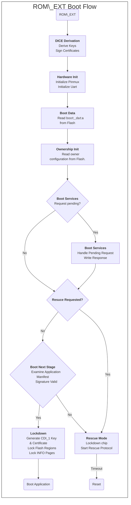

# ROM\_EXT Overview

## Introduction

This document is an overview of the OpenTitan ROM\_EXT.
This document  covers the main features of the ROM\_EXT: Secure Boot, DICE Attestation, Boot Services, Ownership, Rescue and Lockdown.

## ROM\_EXT Boot Flow

The ROM\_EXT begins execution immediately after the handoff from the ROM.
The ROM\_EXT begins executing assembly code and then jumps to C code for the remainer of its execution.



## Secure Boot

The ROM\_EXT will only boot verified application payloads signed by owner application keys.
Failure to boot an application payload will cause the ROM\_EXT to either enter rescue mode or go to shutdown and reset the chip.

### Handling A / B images in flash

Whereas the ROM selects which ROM\_EXT image to boot based on the security version number, the ROM\_EXT maintains state in the `boot_data` structure and prefers to boot a certain slot based on the `primary_bl0_slot` member.
For historical reasons, we often refer to the application firmware as the "BL0 firmware" or "owner firmware".

Should the application firmware in the primary slot be deemed unacceptable (e.g. if the signature verification fails or the minimum BL0 version number is not satisfied), the ROM\_EXT will examine the non-primary slot and attempt to boot that firmware image instead.

As a normal part of the firmware update process, the owner can request that the ROM\_EXT boot the non-primary slot once or request that the ROM\_EXT change the primary slot to a new value (e.g. change from SlotA to SlotB).

Upon successful first boot, the updated firmware can issue a command to update the primary slot to the new one.

As a best practice, it is recommended to mirror an updated firmware image into both slots of the flash.

### Verification

In a manner similar to the ROM, the ROM\_EXT verifies the signature on the owner payload.
- Load the manifest for the owner application payload, which includes the start and end addresses of the code and data, a cryptographic signature, a public key and selector bits for hardware information.
  - The manifest's public key identifies which of the owner application keys should be used to perform the verification.
    If there is no matching owner application key, then the verification fails.
- Read usage constraints from hardware according to the selector bits in the manifest.
  - The selector bits can choose all or a portion of the device ID and manufacturing state information.
    Because the selected constraints are included in the digest, this means the signer of an application image can restrict their application to only certain devices/states.
- Check the `security_version` in the manifest against the `boot_data::min_security_version_bl0`.
  If the value in the manifest is less than the value in `boot_data`, then verification fails.
- Compute the SHA2-256 digest over the selected usage constraints concatenated with the contents of memory between the application payload start and end addresses.
- Check the signature from the manifest against the digest and selected application public key.

### Boot

If the owner firmware passes verification, the ROM\_EXT prepares to boot the firmware.
- Details about how the chip booted are recorded in the `boot_log`.
- The keymgr is diversified according to the diversification value associated with the public key that validates the owner stage.
- A dice CDI\_1 key is derived and a CDI\_1 certificate is created and signed.
- The ePMP is configured to allow execution of the owner firmware.
- `silicon\_creator` owned flash INFO pages are locked (some read-only, some fully inaccessible).
- Ownership INFO pages are locked.
- Access to OTP configuration is locked out.
- The owner's flash configuration for DATA and INFO pages is locked.
- Execution jumps to the owner stage entry point.

## Boot Log

The `boot_log` is a 128-byte structure stored in Retention-RAM that records details about how the chip booted.
These details include chip information, ROM\_EXT information, and information about the current state of the chip.

On the **Earlgrey** chip, the retention RAM is located at address `0x4060_0000`.
For retention RAM layout `RR04`, the `boot_log` is located at offset `0x0778`.

These details are recorded in the following structure:
```c
struct boot_log {
  /**
   * Digest to indicate validity of the boot_log.
   * This digest is stored in byte-reversed order.
   */
  hmac_digest_t digest;
  /** Identifier (`BLOG`). */
  uint32_t identifier;
  /**
   * Chip version (from the ROM).
   * This is 64-bit truncated hash representing the git commit of the ROM build.
   */
  chip_info_scm_revision_t chip_version;
  /** Which ROM_EXT slot booted (boot_slot_t). */
  uint32_t rom_ext_slot;
  /** ROM_EXT major version number. */
  uint32_t rom_ext_major;
  /** ROM_EXT minor version number. */
  uint32_t rom_ext_minor;
  /** ROM_EXT size in flash. Typically, this will be 65536 bytes. */
  uint32_t rom_ext_size;
  /**
   * ROM_EXT nonce for challenge/response boot_svc commands.
   * This is a 64-bit random value.  Updated each time a signed command
   * is successfully processed.
   */
  nonce_t rom_ext_nonce;
  /** Which BL0 slot booted (boot_slot_t). */
  uint32_t bl0_slot;
  /** Chip ownership state (ownership_state_t). */
  uint32_t ownership_state;
  /** Number of ownership transfers this chip has had. */
  uint32_t ownership_transfers;
  /** Minimum security version permitted for ROM_EXT payloads. */
  uint32_t rom_ext_min_sec_ver;
  /** Minimum security version permitted for application payloads. */
  uint32_t bl0_min_sec_ver;
  /** Primary BL0 slot. */
  uint32_t primary_bl0_slot;
  /** Whether the RET-RAM was initialized on this boot (hardened_bool_t). */
  uint32_t retention_ram_initialized;
  /** Pad to 128 bytes. */
  uint32_t reserved[8];
};
```

## DICE Attestation

TBD

## Boot Services

Boot Services allow the owner application firmware to request certain state changes in the ROM\_EXT.
Boot Service requests and responses are communicated between the ROM\_EXT and owner code by placing requests or reading responses from a 256-byte region of the Retention-RAM.

A request is made by writing a request message into the Retention-RAM and then requesting a software reset via the rstmgr peripheral.
During the ROM\_EXT boot process, it will check the Retention-RAM for a valid message, perform the request and write back a response message to the same region of Retention-RAM.
When owner firmware begins execution, it can check the region of Retention-RAM for a response message.

On the **Earlgrey** chip, the retention RAM is located at address `0x4060_0000`.
For retention RAM layout `RR04`, the boot services area is located at offset `0x0004`.

The following request types are supported:
- Empty: a no-operation message.
- Enter Rescue: a software initiated request for the ROM\_EXT to enter rescue mode.
- Next BL0 Slot: a request to either:
  - One-time boot a particular slot (typically the slot opposite the primary slot)
  - Set the primary slot to a particular slot (e.g. from SlotA to SlotB).
- Set the Minimum BL0 Security Version
  - Update the minimum security version permitted for BL0 firmware.
    Cannot set to a value greater than the minimum of valid firmware in either slot to prevent DoS.
- Ownership Unlock: prepare the chip for ownership transfer or a configuration update.
  - This command must be signed with the ownership unlock key to be considered valid.
- Ownership Activate: finalize an ownership transfer or a configuration update.
  - This command must be signed with the ownership activate key to be considered valid.

### The Boot Services Header

All boot services messages have a common header that identifies the type of the boot services request.
The header also encodes the length of the message (maximum 256 bytes) and a SHA256 digest which is used to check the validity of the message payload.
The digest covers the entire message except for the digest region itself.

```c
struct boot_svc_header {
  /**
   * SHA256 digest of the message.
   *
   * Digest region starts at `identifier` and extends until the end of the
   * message.
   */
  hmac_digest_t digest;
  /**
   * Identifier.
   *
   * This field must be `kBootSvcIdentifier` (`BSVC`) for boot service messages
   * that use this header format.
   */
  uint32_t identifier;
  /**
   * Type of the message.
   */
  uint32_t type;
  /**
   * Total length of the message in bytes.
   */
  uint32_t length;
};
```

#### Empty Message

The empty boot services message performs no action.
The ROM\_EXT will process the emtpy message by converting the empty request to an empty response.

##### Request & Response Message
```c
struct boot_svc_empty {
  /**
   * Boot services message header.
   * Request header.type = `EMPT`.
   * Response header.type = `TPME`.
   */
  boot_svc_header_t header;
  /**
   * An arbitrary payload.
   */
  uint32_t payload[53];
};
```

#### Enter Rescue Message

The enter rescue boot services message allows application firmware to request that the ROM\_EXT enter rescue mode on the next boot.
This can be used (for example) to allow for a DFU-style firmware update manged by the ROM\_EXT.

The ROM\_EXT can also send itself this message if it needs to skip entering rescue mode (skipping is used to allow firmware to boot in case the rescue hardware trigger is jammed).

##### Request
```c
struct boot_svc_enter_rescue_req {
  /**
   * Boot services message header.
   * Request header.type = `ERSQ`.
   */
  boot_svc_header_t header;
  /**
   * Command rescue to ignore the rescue trigger one time (hardened_bool_t).
   */
  uint32_t skip_once;
};
```

##### Response
```c
struct boot_svc_enter_rescue_req {
  /**
   * Boot services message header.
   * Response header.type = `QSRE`.
   */
  boot_svc_header_t header;
  /**
   * Response status from the ROM_EXT (rom_error_t).
   */
  uint32_t status;
};
```

#### Next Boot BL0 Slot

The next boot BL0 slot message allows the application firmware to request that the ROM\_EXT either temporarily or permanently change which flash slot is the primary BL0 slot.
This can be used by application firmware to manage which slot is the preferred boot slot.
The application firmware can also use this message to tentatively boot a new firmware and fall back to the old firmware should the boot fail.

When creating the request message, the `next_bl0_slot` or `primary_bl0_slot` fields may be set to `BootSlot::SlotA` or `BootSlot::SlotB` to set the corresponding value on the next boot.
To not set one of the values (e.g to update `next_bl0_slot` _without_ affecting the primary slot), set the value to `BootSlot::Unspecified`.

##### Request
```c
struct boot_svc_next_boot_bl0_slot_req {
  /**
   * Boot services message header.
   * Request header.type = `NEXT`.
   */
  boot_svc_header_t header;
  /**
   * BL0 slot to boot on next reboot.
   */
  uint32_t next_bl0_slot;
  /**
   * BL0 slot to set as the primary boot slot.
   */
  uint32_t primary_bl0_slot;
};

```

##### Response
```c
struct boot_svc_next_boot_bl0_slot_res {
  /**
   * Boot services message header.
   * Response header.type = `TXEN`.
   */
  boot_svc_header_t header;
  /**
   * Response status from the ROM_EXT (rom_error_t).
   */
  uint32_t status;
  /**
   * Which slot is primary (boot_slot_t).
   */
  uint32_t primary_bl0_slot;
}
```

#### Minimum BL0 Security Version

The minimum BL0 security version message allows the application firmware to request that the ROM\_EXT advance the minimum BL0 security version forward and disqualify older firmware from running.
The ROM\_EXT will check the security versions of the firmware in each flash slot and will permit the value to be advanced no more than the minium of the present and valid application firmware in each slot.

##### Request
```c
struct boot_svc_min_bl0_sec_ver_req {
  /**
   * Boot services message header.
   * Request header.type = `MSEC`.
   */
  boot_svc_header_t header;
  /**
   * Minimum security version to set.
   */
  uint32_t min_bl0_sec_ver;
};
```

##### Response
```c
struct boot_svc_min_bl0_sec_ver_res {
  /**
   * Boot services message header.
   * Request header.type = `CESM`.
   */
  boot_svc_header_t header;
  /**
   * Minimum security version read from flash.
   */
  uint32_t min_bl0_sec_ver;
  /**
   * Status response from ROM_EXT (rom_error_t).
   */
  uint32_t status;
};
```
#### Ownership Unlock

The ownership unlock command prepares the chip for ownership transfer.
The unlock command must include the 64-bit device identification number and the ROM\_EXT nonce and must be signed by the owner's unlock key.
The unlock command supports transitioning the chip to any one of the unlocked states (`UnlockedAny`, `UnlockedEndorsed` or `UnlockedUpdate`) or aborting the current unlocked state and returning to `LockedOwner`. 

The signature must be over bytes `44..192` of the unlock request command.

When the owner is using PQC algorithms for the ownership keys, the signature field should be all zeros and a detached signature structure should be placed somewhere in flash.

##### Request
```c
struct boot_svc_ownership_unlock_req {
  /**
   * Boot services message header.
   * Request header.type = `UNLK`.
   */
  boot_svc_header_t header;
  /**
   * Unlock mode: Any, Endorsed, Update or Abort.
   */
  uint32_t unlock_mode;
  /**
   * The 64-bit ID subfield of the full 256-bit device ID.
   * (e.g. device_id words [1..2])
   */
  uint32_t din[2];
  /**
   * Reserved for future use.
   */
  uint32_t reserved[8];
  /**
   * The current ownership nonce.
   */
  nonce_t nonce;
  /**
   * The public key of the next owner (for endorsed mode).
   */
  owner_keydata_t next_owner_key;
  /**
   * Signature over [unlock_mode..next_owner_key]
   */
  owner_signature_t signature;
};
```

##### Response
```c
struct boot_svc_ownership_unlock_res {
  /**
   * Boot services message header.
   * Request header.type = `KLNU`.
   */
  boot_svc_header_t header;
  /**
   * Response status from the ROM_EXT (rom_error_t).
   */
  uint32_t status;
};
```

#### Ownership Activate

The ownership activate command activates an ownership configuration, finalizing an ownership transfer or configuration update.
The activate command must include the 64-bit device identification number and the ROM\_EXT nonce and must be signed by the owner's activate key.

The signature must be over bytes `44..192` of the unlock request command.

When the owner is using PQC algorithms for the ownership keys, the signature field should be all zeros and a detached signature structure should be placed somewhere in flash.

##### Request
```c
struct boot_svc_ownership_activate_req {
  /**
   * Boot services message header.
   * Request header.type = `ACTV`.
   */
  boot_svc_header_t header;
  /**
   * Which side of the flash is primary after activation.
   */
  uint32_t primary_bl0_slot;
  /**
   * The 64-bit ID subfield of the full 256-bit device ID.
   * (e.g. device_id words [1..2])
   */
  uint32_t din[2];
  /**
   * Erase previous owner's flash (hardened_bool_t).
   */
  uint32_t erase_previous;
  /**
   * Reserved for future use.
   */
  uint32_t reserved[31];
  /**
   * The current ownership nonce.
   */
  nonce_t nonce;
  /**
   * Signature over [primary_bl0_slot..nonce]
   */
  owner_signature_t signature;
}
```

##### Response
```c
struct boot_svc_ownership_activate_res {
  /**
   * Boot services message header.
   * Request header.type = `VTCA`.
   */
  boot_svc_header_t header;
  /**
   * Response status from the ROM_EXT (rom_error_t).
   */
  uint32_t status;
}
```

## Ownership
## Rescue
