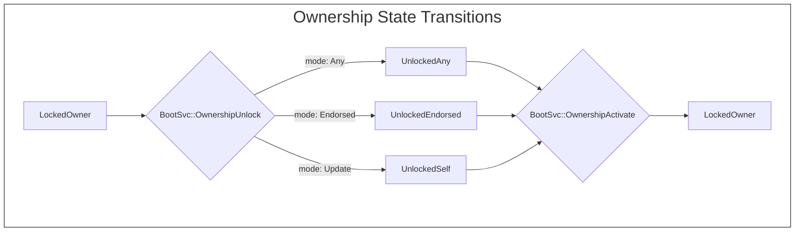
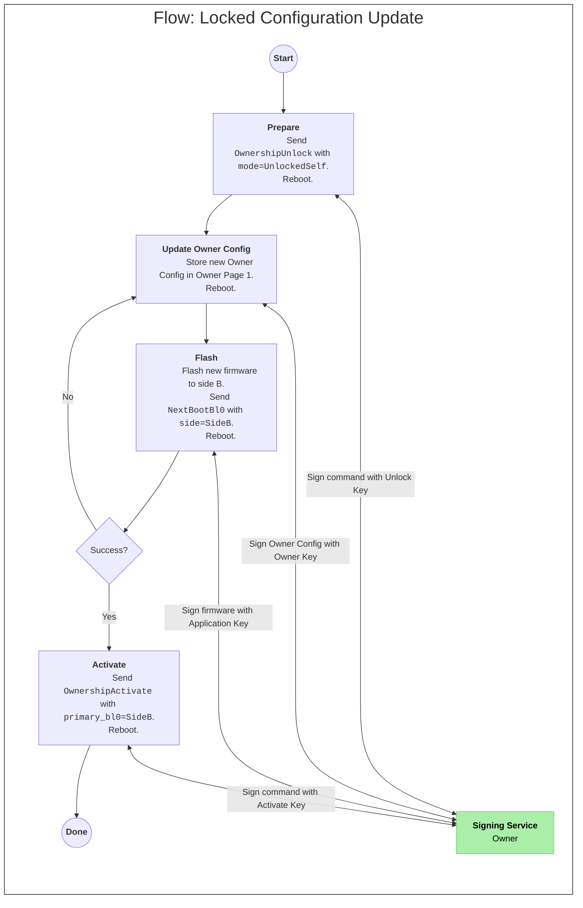
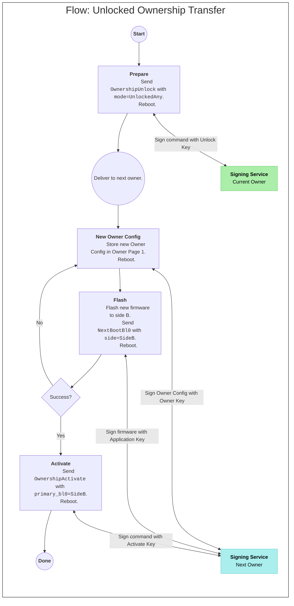
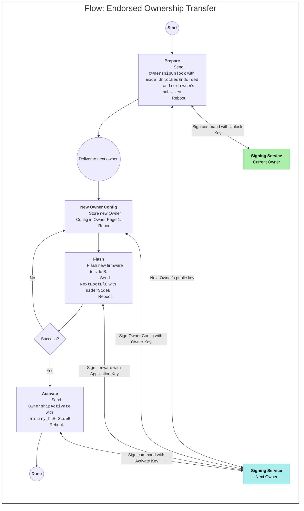

# OpenTitan Ownership Transfer

> [!NOTE]
> This document is a draft.

## Introduction

This document discusses the OpenTitan Ownership Transfer protocol, including the commands, operations, data and data structures needed for ownership transfer.
Ownership Transfer allows the owner of the chip to securely root an OpenTitan chip to their own public key infrastructure and to transfer the chip to a new owner when they no longer want or need to be the owner of the chip (e.g. reselling used equipment or transferring equipment among different security domains within the same organization).

### Definitions

- Owner Configuration: a data structure encoding the ownership information for a given owner.
  The owner configuration includes an owner key, one or more application keys and various owner configuration data.
- Owner Key: an ECDSA P-256 public/private key-pair used to authenticate the ownership block.
- Activate Key: an ECDSA P-256 public/private key-pair used to authenticate an Activate Owner command.
  This key is endorsed by the Owner key by virtue of being present in the owner configuration.
- Unlock Key: an ECDSA P-256 public/private key-pair used to authenticate an Unlock Owner command.
  This key is endorsed by the Owner key by virtue of being present in the owner configuration.
- Ownership State: The state of a chip with respect to ownership transfer.
  A chip may be in one of the following states: `LockedOwner`, `UnlockedSelf`, `UnlockedAny`, `UnlockedEndorsed`, `Recovery`.
- Ownership Nonce: A 64-bit random integer used as a validation challenge for all ownership-related boot services requests.
- Owner Page 0 & 1: The Owner Configuration is stored by the chip in a pair of flash INFO pages.
  Normally the two pages are identical and serve as redundant backups.
  During an update or transfer, page 0 is the current configuration and page 1 is the next configuration.
- Application Key: an ECDSA public/private key-pair used to authenticate the owner’s application firmware payload.
- Tag/Length/Value (TLV): A structure encoding scheme for encoding heterogenious and variable-length data structures.

## Ownership Transfer

Ownership Transfer allows owners of OpenTitan chips to securely transfer chips and OpenTitan devices between different public key infrastructures (PKIs) without assistance (or interference) from the manufacturer of the chip.

Ownership Transfer gives each owner of a chip the ability to specify their own application firmware keys, key domains and chip configurations.

### Ownership State

The ownership state is a non-volatile chip state that controls the ownership transfer mechanism.
A chip may be in one of the following states:
- `LockedOwner`: The chip is currently owned and will not accept new owner configurations.
- `UnlockedSelf`: The chip is currently owned and is expecting an ownership block update for the same owner (ie: config change or key rotation).
- `UnlockedAny`: The chip is currently owned but will accept an ownership block for any new owner.
- `UnlockedEndorsed`: The chip is currently owned but will accept an ownership block only from a new owner endorsed by the current owner.
- `Recovery` The chip doesn’t have an owner and is unable to accept a new owner.
  This is a nearly-fatal error state and requires intervention by *sku\_creator* to recover the chip.

When the chip is in one of the `Unlocked` states, the ROM\_EXT will unlock Owner Page 1 allowing firmware to write a new owner configuration into that location.

The ownership state is stored in the `boot_data` record.



### Owner Configuration

The owner configuration (sometimes called "owner block") allows an owner to tailor the configuration of the chip to their use case.
The configuration allows the owner to control the flash configuration, application verification keys, rescue mode configuration and miscellaneous configuration of the chip.

- The flash configuration allows the owner to set access control (read, program, erase) and storage policy (ECC, scrambling, high endurance) of various regions and INFO pages of flash.
- The owner may add a number of application verification keys that permit code execution.
  The application key configuration includes an execution domain (e.g. `prod`, `dev` or `test`) and a key diversifier constant allowing the owner to control the derivation of sealing keys by the OpenTitan key manager.
- The rescue configuration allows the owner to configure the operation of the rescue mode.
  The configuration allows protecting flash regions from erasure during rescue and designating the allowed set of rescue commands (an owner may want to disable certain rescue commands if they feel those commands represent an attack or denial of service vector in their use case).
- The miscellaneous configuration contains configuration for features that aren't well categorized into one of the above configurations:
  - Enable or disable SRAM execution.
  - Reset the BL0 minimum security version.

#### Update Mode

There are several allowed update modes for the ownership configuration.
These update modes are motivated by two scenarios:

- The Unlock Key is a very powerful key and owners may want to attenuate the power of the unlock key to mitigate the risk of the key leaking.
- An owner may want to provide a configuration update for devices in the field that does not require the unlock and activate procedure.

The update mode provides for three types of owner configuration update procedures:

- `Open` mode allows the unlock key to unlock the device into any of the unlocked states.
- `Self` mode allows the unlock key to unlock the device into only the `UnlockedSelf` state.
- `NewVersion` mode forbids the unlock key from unlocking the device.
  Instead, the device may accept an ownership configuration update at any time _if and only if_ the new configuration is signed by the self-same owner _and_ the configuration has a newer `config_version` number.

When the update mode is either `Self` or `NewVersion`, the power of the unlock key is reduced to only allow ownership operations that do not change the owner.

### Ownership Nonce

The ownership nonce is a random 64-bit integer value used as a challenge for ownership transfer operations
All ownership-related boot services commands include the nonce and a signature by either the current owner or the next owner.

Each successful ownership-related boot services request (ie: `OwnershipUnlock` and `OwnershipActivate`) will cause a new nonce to be generated
Any subsequent ownership-related request must use the new nonce value.

The ownership nonce is stored in the `boot_data` record.

### Owner Key

The Owner key represents the identify of the device owner.
The Owner key signs the ownership configuration and endorses the other keys contained within the configuration.

The Owner key is considered to be the highest value key among all of the ownership keys and it should have the highest level of protection.
For example, an owner may choose to store the owner key in an offline HSM and require a multi-party quorum to use the key.

### Activate Key

The Activate key is used to authenticate the Activate Owner boot services command
This key is separate from the Owner Key to allow owners to have different security policies for the Owner and Activate keys
For example, this permits the Owner private key to be stored in an offline system and the Activate key to be stored in an online system.

The Activate Owner key is endorsed by the Owner key via the Ownership Configuration data structure.

### Unlock Key

The Unlock key is used to authenticate the Unlock Ownership boot services command
This key is separate from the Owner Key to allow owners to have different security policies for the Owner and Unlock keys.

The Unlock key is endorsed by the Owner key via the Ownership Configuration data structure.

## Ownership Transfer Operations

The following flows support ownership transfer operations
Each of the flows assumes the owner currently has `primary_bl0` set to SideA (the flows will also work with the `primary_bl0` set to SideB, but any reference to SideB in the flows would need to be changed to SideA).

#### Next Owner Key

The next owner key is the public ECDSA key of the next owner when performing an endorsed ownership transfer operation.
The next owner’s public key fingerprint (ie: sha256 of the public key material) is stored in the `boot_data` record.

### Self Update of Owner Configuration

A self update allows an owner to update their Owner Configuration without transferring ownership to a new owner.

1. The owner prepares for the update by staging a signed boot services `OwnershipUnlock` command with the current ownership nonce and the mode set to `UnlockedSelf`.
   - After staging the command, the chip is rebooted.
   - Upon booting, the ROM\_EXT will move the chip into the `UnlockedSelf` state and will unlock Owner Page 1 to accept an Owner Configuration update.
2. The owner updates the Owner Configuration in Owner Page 1 to the new preferred settings (e.g. key rotation or configuration change).  The owner configuration must be signed with the owner key.
   - After updating the page, the chip is rebooted.
   - Upon booting, the ROM\_EXT will inspect the new configuration block.  If and only if the new owner configuration is valid, the ROM\_EXT will configure the non-primary half of the flash (i.e. Side B) as requested in the new owner configuration.
3. The owner will stage a firmware update on the non-primary half of the flash. This firmware must be signed with a valid owner application key.  The owner will stage a Boot Services `next_boot_bl0` message requesting a boot to the non-primary partition (i.e. Side B).
   - After staging the firmware and boot services request, the chip will be rebooted.
   - Upon booting, the ROM\_EXT will configure the non-primary half of the flash (i.e. Side B) as requested in the new owner configuration and then attempt to find and validate a firmware payload located in the non-primary half of the flash.
      - If there is a valid firmware in the non-primary half, it will be booted.
      - If there is no valid firmware in the non-primary half, the primary half will be booted according to the settings of the current (non-updated) Owner Configuration.
4. If the boot -
   - Succeeds:
      - The owner will stage a signed boot services `activate_owner` command with the current ownership nonce to finalize the update.  The activate owner command must be signed with the Activate key.
      - After staging the command the chip is rebooted.
      - Upon booting, the ROM\_EXT will move the chip into the `LockedOwner` state and update Owner Page 0 with the new Owner Configuration located in page 1.
   - Fails:
      - The owner can retry the update from step 2.



### Unlocked Ownership Transfer

An unlocked ownership transfer allows the current owner to unlock the chip so that it will accept any new owner.

1. The current owner prepares for the transfer by staging a signed boot services `OwnershipUnlock` command with the current ownership nonce and the mode set to `UnlockedAny`.
   After staging the command, the chip is rebooted.
   - Upon booting, the ROM\_EXT will move the chip into the `UnlockedAny` state and will unlock Owner Page 1 to accept an Owner Configuration update.
2. The current owner will deliver the chip (device) to the next owner.
3. The next owner updates the Owner Configuration in Owner Page 1 giving the chip the next owner’s public key material and preferred configuration settings.
   - After updating the page, the chip is rebooted.
   - Upon booting, the ROM\_EXT will inspect the next owner configuration.
     If and only if the next Owner Configuration is valid, the ROM\_EXT will configure the non-primary half of the flash (i.e. Side B) as requested in the new owner configuration.
4. The next owner will stage a firmware update on the non-primary half of the flash.
   This firmware must be signed with a valid (next) owner application key.
   The owner will stage a Boot Services `next_boot_bl0` message requesting a boot to the non-primary partition (i.e. Side B).
   - After staging the firmware and boot services request, the chip will be rebooted.
   - Upon booting, the ROM\_EXT will configure the non-primary half of the flash (i.e. Side B) as requested in the next owner configuration and then attempt to find and validate a firmware payload located in the non-primary half of the flash.
      - If there is a valid firmware in the non-primary half, it will be booted.
      - If there is no valid firmware in the non-primary half, the primary half will be booted according to the settings of the previous Owner Configuration.
5. If the boot -
   - Succeeds:
      - The next owner will stage a signed boot services `OwnershipActivate` command with the current ownership nonce to finalize the update.
The activate owner command must be signed with the Activate key.
      - After staging the command the chip is rebooted.
      - Upon booting, the ROM\_EXT will move the chip into the `LockedOwner` state and update Owner Page 0 with the new Owner Configuration located in page 1.
   - Fails:
      - The next owner can retry the update from step 3.



### Endorsed Ownership Transfer

An endorsed ownership transfer allows the current owner to transfer ownership to a specific new owner.

1. The current owner prepares for the transfer by staging a signed boot services `OwnershipUnlock` command with the current ownership nonce, the next owner’s public key and the mode set to `UnlockedEndorsed`.  After staging the command, the chip is rebooted.
   - Upon booting, the ROM\_EXT will move the chip into the `UnlockedEndorsed` state and will unlock Owner Page 1 to accept an Owner Configuration update.
2. The current owner will deliver the chip (device) to the next owner.
3. The next owner updates the Owner Configuration in Owner Page 1 giving the chip the next owner’s public key material and preferred configuration settings.
   - After updating the page, the chip is rebooted.
   - Upon booting, the ROM\_EXT will inspect the next owner configuration.  If and only if the next Owner Configuration is valid, the ROM\_EXT will configure the non-primary half of the flash (i.e. Side B) as requested in the new owner configuration.
4. The next owner will stage a firmware update on the non-primary half of the flash.  This firmware must be signed with a valid (next) owner application key.  The owner will stage a Boot Services `next_boot_bl0` message requesting a boot to the non-primary partition (i.e. Side B).
   - After staging the firmware and boot services request, the chip will be rebooted.
   - Upon booting, the ROM\_EXT will configure the non-primary half of the flash (i.e. Side B) as requested in the next owner configuration and then attempt to find and validate a firmware payload located in the non-primary half of the flash.
      - If there is a valid firmware in the non-primary half, it will be booted.
      - If there is no valid firmware in the non-primary half, the primary half will be booted according to the settings of the previous Owner Configuration.
5. If the boot -
   - Succeeds:
      - The next owner will stage a signed boot services `OwnershipActivate` command with the current ownership nonce to finalize the update.  The activate owner command must be signed with the Activate key.
      - After staging the command the chip is rebooted.
      - Upon booting, the ROM\_EXT will move the chip into the `LockedOwner` state and update Owner Page 0 with the new Owner Configuration located in page 1.
   - Fails:
      - The next owner can retry the update from step 3.



## Boot Services Commands

All ownership operations are facilitated by boot services commands to the ROM\_EXT.
The following boot services commands are supported.

### Ownership Unlock

The ownership unlock command prepares the chip for an ownership transfer or a non-transferring owner configuration update.
The ownership unlock command must include the current ROM\_EXT nonce and a signature with the current owner's unlock key.

```c
typedef struct boot_svc_ownership_unlock_req {
  /** Boot services message header.  */
  boot_svc_header_t header;
  /** Unlock mode: Any, Endorsed, Update or Abort.  */
  uint32_t unlock_mode;
  /** The 64-bit DIN subfield of the full 256-bit device ID.  */
  uint32_t din[2];
  /** Reserved for future use.  */
  uint32_t reserved[8];
  /** The current ownership nonce.  */
  nonce_t nonce;
  /** The public key of the next owner (for endorsed mode).  */
  owner_key_t next_owner_key;
  /** Signature over [unlock_mode..next_owner_key] */
  owner_signature_t signature;
} boot_svc_ownership_unlock_req_t;
```
See the definition in [boot_svc_ownership_unlock.h](../../lib/boot_svc/boot_svc_ownership_unlock.h).

A valid ownership unlock command will prepare the chip for an ownership transfer.

When the mode is `UnlockedAny`, `UnlockedEndorsed` or `UnlockedSelf`, the ROM\_EXT will:
- Rotate the ROM\_EXT nonce value.
- Update the ownership state.
- If endorsed mode, save the next owner key into `boot_data`.

When the mode is `Abort`, the ROM\_EXT will:
- Rotate the ROM\_EXT nonce value.
- Update the ownership state to `LockedOwner`.
- Copy the owner configuration from owner page 0 to owner page 1.

### Ownership Activate

The ownership activate command completes an ownership transfer or update and moves the chip into the `LockedOwner` state.
The ownership activate command must include the current ROM\_EXT nonce and a signature with the next owner's activate key (or the current owner's activate key in the case of a non-transferring update).

```c
typedef struct boot_svc_ownership_activate_req {
  /** Boot services message header.  */
  boot_svc_header_t header;
  /** Which side of the flash is primary after activation.  */
  uint32_t primary_bl0_slot;
  /** The 64-bit DIN subfield of the full 256-bit device ID.  */
  uint32_t din[2];
  /** Erase previous owner's flash (hardened_bool_t).  */
  uint32_t erase_previous;
  /** Reserved for future use.  */
  uint32_t reserved[31];
  /** The current ownership nonce.  */
  nonce_t nonce;
  /** Signature over [primary_bl0_slot..nonce] */
  owner_signature_t signature;
} boot_svc_ownership_activate_req_t;

```
See the definition in [boot_svc_ownership_activate.h](../../lib/boot_svc/boot_svc_ownership_activate.h).

A valid ownership activate request will:
- Rotate the ROM\_EXT nonce value.
- Update the ownership state to `LockedOwner`.
- Set the primary BL0 slot.
- Erase the previous owner's flash slot (ie: the non-primary slot).
- Copy the owner configuration from owner page 1 into owner page 0.

## Owner Configuration

### Contents

The owner configuration contains the following items:
- Owner Key:  This key is the owner's identity and is used to endorse the keys used for application verification and future owner configuration updates or transfer request.
- Activation Key:  This key is used to authenticate an `OwnershipActivate` command.
- Unlock Key:  This key is used to authenticate an `OwnershipUnlock` command.
- Owner Application Keys:  These keys are used to authenticate the owner's firmware payload.
   The keys also carry some additional metadata used to configure the OpenTitan key manager.
- EFLASH configuration.
  The EFLASH configuration sets the desired properties on ranges of flash data pages (such as access permissions and error correction properties).
- EFLASH-INFO configuration: The EFLASH-INFO configuration sets the desired properties on flash info pages.
  Some info pages are reserved for use by the `silicon_creator` and have restricted access.
  The remaining info pages are available to the owner and the owner can set specific access permissions.
- Miscellaneous settings:
   - SRAM execution: depending on the application, the owner may want to allow or forbid code execution from SRAM.
   - Rescue configuration: The ROM\_EXT supports a rescue protocol for recovering from an internal flash corruption event and querying data about the chip.
     The rescue configuration allows the owner to control interactions with the rescue protocol.

Because the Owner Configuration is composed of several sections of varying size and count (e.g. perhaps several different keys), the owner configuration utilizes tag-length-value (TLV) encoded structures.

```c
struct TLVHeader {
    uint32_t tag;
    uint32_t length;
};
```
See the definition in [datatypes.h](../../lib/ownership/datatypes.h).

## Data Structures

### Owner Configuration

The Owner Configuration struct carries the required owner key materials and validation information and is a container for all of the TLV structs specifying the configuration.
- The `owner_key` Key is an ECDSA P-256 key used to authenticate the owner configuration and endorse the other keys.
- The `signature` is an ECDSA signature over the struct, excluding the `signature` and `seal` members (ie: the first 1952 bytes).
- The `seal` is a KMAC over the owner configuration binding the configuration to a particular chip.
   - During secure boot, the `seal` is used to confirm the validity of the owner configuration.
   - During ownership transfer, the `seal` is computed by the chip.

```c
typedef struct owner_block {
  /**
   * Header identifying this struct.
   * tag: `OWNR`.
   * length: 2048.
   */
  tlv_header_t header;
  /** Version of the owner struct.  Currently `0`. */
  uint32_t struct_version;
  /** SRAM execution configuration (DisabledLocked, Disabled, Enabled). */
  uint32_t sram_exec_mode;
  /** Ownership key algorithm (currently, only ECDSA is supported). */
  uint32_t ownership_key_alg;
  /** Configuration version (monotonically increasing per owner) */
  uint32_t config_version;
  /** Set the minimum security version to this value (UINT32_MAX: no change) */
  uint32_t min_security_version_bl0;
  /** Ownership update mode (one of Open, Self, NewVersion) */
  uint32_t update_mode;
  /** Reserved space for future use. */
  uint32_t reserved[24];
  /** Owner public key. */
  owner_key_t owner_key;
  /** Owner's Activate public key. */
  owner_key_t activate_key;
  /** Owner's Unlock public key. */
  owner_key_t unlock_key;
  /** Data region to hold the other configuration structs. */
  uint8_t data[1536];
  /** Signature over [tag..data] with the owner private key. */
  owner_signature_t signature;
  /** A sealing value to seal the owner block to a specific chip. */
  uint32_t seal[8];
} owner_block_t;
```
See the definition in [datatypes.h](../../lib/ownership/datatypes.h).

### Application Keys

The Application Keys verify owner firmware payloads during the secure boot process.
- The `key_algorithm` refers to the key algorithm to be used with this key (ECDSA, SPX or SPXq20).
- The `key_domain` refers to the application-level key domain: `prod`, `dev` or `test`.
  These values have no relationship with the chip's lifecycle state.
  This value is used to diversify the key manager's key derivations.
- The `key_diversifier` is an arbitrary owner-selected value to further diversify key derivation.
  This allows the owner to create additional key domains within each of the `prod`, `dev` or `test` categories.
  The 8 words of `key_domain || key_diversifier` are programmed into the key manager sealing binding registers.
- The `usage_constraint` is a bitmask that is combined (bitwise OR-ed) with the firmware manifest's `usage_constraint.selector` bits.
  This can be used to create application keys that required class- or node-locked firmware.
- The `data` field contains the key material itself.

```c
typedef struct owner_application_key {
  /**
   * Header identifying this struct.
   * tag: `APPK`.
   * length: 48 + sizeof(key).
   */
  tlv_header_t header;
  /** Key algorithm.  One of ECDSA, SPX+ or SPXq20. */
  uint32_t key_alg;
  /** Key domain.  Recognized values: PROD, DEV, TEST */
  uint32_t key_domain;
  /** Key diversifier.
   *
   * This value is concatenated to key_domain to create an 8 word
   * diversification constant to be programmed into the keymgr.
   */
  uint32_t key_diversifier[7];
  /** Usage constraint must match manifest header's constraint */
  uint32_t usage_constraint;
  /** Key material.  Varies by algorithm type. */
  union {
    uint32_t id;
    sigverify_rsa_key_t rsa;
    sigverify_spx_key_t spx;
    sigverify_ecdsa_p256_buffer_t ecdsa;
  } data;
} owner_application_key_t;
```
See the definition in [datatypes.h](../../lib/ownership/datatypes.h).

### EFLASH Configuration

The EFLASH configuration describes the owner's desired flash configuration.
- The flash region `start` and `size` are expressed in pages.
- No flash region should span over the A and B halves of the flash.
  This is to allow configuring the A and B havles differently during an ownership transfer operation.

```c
typedef struct owner_flash_region {
  /** The start of the region, in flash pages. */
  uint16_t start;
  /** The size of the region, in flash pages. */
  uint16_t size;
  /**
   * The access properties of the flash region.
   * The 32-bit word is a packed set of multi-bit bools.
   * +------+---------+----+----+----+-------+---------+------+
   * | Lock | Protect |    |    |    | Erase | Program | Read |
   * +------+---------+----+----+----+-------+---------+------+
   */
  uint32_t access;
  /**
   * The flash properties of the flash region.
   * The 32-bit word is a packed set of multi-bit bools.
   * +----+----+----+----+----+----+-----+----------+
   * |    |    |    |    |    | HE | ECC | Scramble |
   * +----+----+----+----+----+----+-----+----------+
   */
  uint32_t properties;
} owner_flash_region_t;

typedef struct owner_flash_config {
  /**
   * Header identifiying this struct.
   * tag: `FLSH`.
   * length: 8 + 12 * length(config).
   */
  tlv_header_t header;
  /**
   * A list of flash region configurations.
   * In each `config` item, the `access` and `properties` fields are xor-ed
   * with the region index in each nibble (ie: index 1 == 0x11111111).
   */
  owner_flash_region_t config[];
} owner_flash_config_t;

```
See the definition in [datatypes.h](../../lib/ownership/datatypes.h).


### FLASH\_INFO Configuration

The FLASH-INFO configuration describes the owner's desired configuration for flash info pages.

Info page configurations apply only to pages accessible to the owner.
Upon ingestion of a new owner configuration, the ROM\_EXT will reject a configuration that attempts to use info pages reserved for `silicon_creator`.

```c
typedef struct owner_info_page {
  /** The bank where the info page is located. */
  uint8_t bank;
  /** The info page number. */
  uint8_t page;
  uint16_t _pad;
  /**
   * The access properties of the flash region.
   * The 32-bit word is a packed set of multi-bit bools.
   * +------+-----+----+----+----+-------+---------+------+
   * | Lock |     |    |    |    | Erase | Program | Read |
   * +------+-----+----+----+----+-------+---------+------+
   */
  uint32_t access;
  /**
   * The flash properties of the flash region.
   * The 32-bit word is a packed set of multi-bit bools.
   * +----+----+----+----+----+----+-----+----------+
   * |    |    |    |    |    | HE | ECC | Scramble |
   * +----+----+----+----+----+----+-----+----------+
   */
  uint32_t properties;
} owner_info_page_t;

typedef struct owner_flash_info_config {
  /**
   * Header identifiying this struct.
   * tag: `INFO`.
   * length: 8 + 12 * length(config).
   */
  tlv_header_t header;
  /**
   * A list of flash info page configurations.
   * In each `config` item, the `access` and `properties` fields are xor-ed
   * with the region index in each nibble (ie: index 1 == 0x11111111).
   */
  owner_info_page_t config[];
} owner_flash_info_config_t;

```
See the definition in [datatypes.h](../../lib/ownership/datatypes.h).

### Rescue Configuration

The rescue configuration describes the owner's desired configuration of the ROM\_EXT rescue protocol.
- The owner may configure the region of flash to be erased and reprogrammed during firmware rescue.
- The owner may configure the allowed interactions with the rescue protocol.
   - Allowed rescue modes permit whether the rescue client can upload firmware or interact with the boot log and boot services.
   - Allowed boot services commands determine whether or not a boot services request from the rescue protocol will be accepted or rejected.

```c
typedef struct owner_rescue_config {
  /**
   * Header identifiying this struct.
   * tag: `RSCU`.
   * length: 16 + sizeof(command_allow).
   */
  tlv_header_t header;
  /** The rescue type.  Currently, only `XMDM` is supported. */
  uint32_t rescue_type;
  /** The start offset of the rescue region in flash (in pages). */
  uint16_t start;
  /** The size of the rescue region in flash (in pages). */
  uint16_t size;
  /**
   * An allowlist of rescue and boot_svc commands that may be invoked by the
   * rescue protocol.  The commands are identified by their 4-byte tags (tag
   * identifiers between rescue commands and boot_svc commands are unique).
   */
  uint32_t command_allow[];
} owner_rescue_config_t;
```
