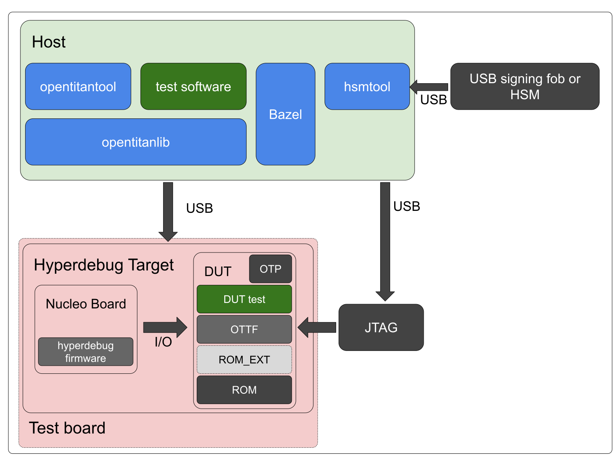

# Earlgrey Silicon Validation (SiVal)

## Overview

### Test Setup



The following section describes the components used in the silicon test
environment.

#### Host

*   **[opentitantool](https://github.com/lowRISC/opentitan/tree/master/sw/host/opentitantool)**:
    provides a common interface to interact with an OpenTitan Device Under Test
    (DUT). Leverages opentitanlib to expose DUT common functionality such as SPI
    bootstrap, reset, and general DUT I/O interfaces. Written in Rust.
*   **[opentitanlib](https://github.com/lowRISC/opentitan/tree/master/sw/host/opentitantool)**
    ([documentation](https://opentitan.org/gen/rustdoc/opentitanlib/index.html)):
    implements interfaces to access DUT functionality through various backend
    interfaces. Backed interfaces are used to abstract various target
    configurations (e.g. FPGA vs Verilator vs Silicon). Written in Rust.
*   **[test software](https://github.com/lowRISC/opentitan/tree/master/sw/host/tests)**:
    implement DUT test sequences. The most basic test program loads a binary
    into the DUT using the spi bootstrap protocol and polls the UART interface
    for results. All test cases are written in Rust.
*   **Bazel**: OpenTitan software build system. Used to build host and device
    (DUT) software and trigger unit tests as well as tests requiring an
    OpenTitan target. FPGA, Verilator and Silicon targets are supported. DV test
    targets are integrated using
    [dvsim](https://opentitan.org/book/util/dvsim/index.html).
*   **[hsmtool](https://github.com/lowRISC/opentitan/tree/master/sw/host/hsmtool)**:
    utility used to interface with hardware used to manage signing keys. The
    tool uses PKCS#11 to access HSM and USB tokens. Only NitroKey HSM2 is
    supported at the moment.

#### Device Test Harness

*   **hyperdebug**: standard OpenTitan test board interface. Implements a DUT
    hardware abstraction layer (*hyperdebug firmware*) used to drive DUT
    peripheral interfaces. *opentitantool* supports a hyperdebug backend
    implementation.
*   **test board**: Additional test boards are going to be used to support
    silicon validation, pentesting and integration activities. It is strongly
    recommended that all test boards support *hyperdebug* to simplify DUT
    management. Boards without *hyperdebug* support will require a custom
    backend in *opentitantool*.

#### Device Under Test (DUT)

*   **OTP**: One-Time-Programmable memory. Defines the DUT lifecycle and various
    hardware and software configuration settings.
*   **ROM**: Read-Only Memory (ROM) boot firmware. As its name suggests, this
    component is non-mutable and fixed at tape-out time. The code is not signed
    but is physically and logically protected by the DUT hardware, hence it is
    used as the Root of Trust in the DUT secure boot implementation.
*   **ROM\_EXT**: ROM extensions stored in mutable memory. Depending on the
    lifecycle of the device and mode of execution, this boot component may be
    required to support signature verification and execution of DUT test
    programs.
*   **OpenTitan Test Framework (OTTF)**:
    [On-Device Test Framework](https://opentitan.org/book/sw/device/lib/testing/test_framework/index.html)
    used to instrument test programs.

#### Additional Components

*   **HSM/Signing Fob**: Hardware backed storage for signing keys.
*   **JTAG**: JTAG interface to OpenTitan rv\_dm and lc\_ctrl TAP interfaces.

#### Relevant references

1.  [On-Device Test Framework](https://opentitan.org/book/sw/device/lib/testing/test_framework/index.html)
2.  [ROM E2E Regression Setup](https://opentitan.org/book/sw/device/silicon_creator/rom/doc/e2e_tests.html)

### Test Environments

1.  **Secure**
    1.  Common Criteria certified test lab; or,
    2.  Test lab meeting MSSR guidelines and that is in the process of being
        certified as a site or as part of the certification of an OpenTitan
        device
2.  **Non-Secure**
    1.  Any testing performed outside a secure environment.

### Execution Modes

There are various modes of firmware execution aiming to provide flexible DUT and
code signing configurations. The following sections describe the available modes
of execution for Silicon Validation.

#### Bare Metal

Covers any of the following:

1.  DUT test binaries signed with ROM keys. Binary is loaded into DUT via
    bootstrap. The ROM verifies the binary signature before starting execution.
    Code signing requires access to TEST or DEV signing keys, which can be
    loaded into USB signing fobs.
2.  DUT binaries loaded into SRAM or flash via JTAG in TEST\_UNLOCKED, DEV or
    RMA stages. In this case binaries don't necessarily need to be signed
    depending on how the device is configured via JTAG.

Bare metal execution provides a high level of configurability, potentially
leaving the DUTs exposed to potential vulnerability identification. For this
reason, this mode of execution is restricted to secure environments.

ROM\_EXT developers without access to secure environments will be required to
perform most of the development using an FPGA target.

#### Node Locked

Represents custom ROM\_EXT binaries supporting a special configuration not
available in a production signed ROM\_EXT binary. The ROM\_EXT is signed with a
usage constraints manifest allowing it to run only on a DUT with a matching
device identifier. This is done to mitigate the exposure of any potential
vulnerabilities released in the custom configuration.

Another potential use case is to implement sample management policies backed by
the signing configuration. For example, if there is a requirement to distribute
individual signing fobs per DUT.

The ROM\_EXT itself may opt to only support node-locked binary payloads. This is
useful in cases in which it is required to enforce node-locked policies for
later boot stages.

#### Prod ROM\_EXT

Represents ROM\_EXT binaries signed with production keys. These binaries are
expected to be of production quality from a functional and security perspective.
DUTs distributed with production ROM\_EXT will be required to support test
programs signed with keys known to the ROM\_EXT. This can be supported via
ownership transfer and/or by a ROM\_EXT with embedded verification keys.

Notes:

1.  For test chips, it is expected that some vulnerabilities will be detected
    during the penetration test phase. It is then important to discontinue PROD
    signing keys used to sign ROM\_EXT binaries with exposed critical
    vulnerabilities.
2.  Due to the previous point, it is also important to rotate all ROM keys
    between tape-outs.

### Execution Modes per Lifecycle Stage

#### Secure Environment

**Lifecycle**   | **Bare Metal** | **Node Locked** | **PROD ROM\_EXT**
:-------------- | :------------: | :-------------: | :---------------:
TEST\_UNLOCKED  | Y              | Y               | Y
RMA             | Y              | Y               | Y
DEV             | Y              | Y               | Y
PROD, PROD\_END | N              | Y               | Y

#### Non-Secure Environment

**Lifecycle**   | **Bare Metal** | **Node Locked** | **PROD ROM\_EXT**
:-------------- | :------------: | :-------------: | :---------------:
PROD, PROD\_END | N              | Y               | Y

## Running Test Suites

### FPGA example

The following command runs the `SV1` test suite on `fpga_cw310_sival` and
`fpga_cw310_sival_rom_ext` execution environments.

```console
bazel test   --define DISABLE_VERILATOR_BUILD=true   \
    --test_tag_filters=cw310_sival,cw310_sival_rom_ext   \
    --test_output=streamed   \
    --define bitstream=gcp_splice   \
    --cache_test_results=no \
    //sw/device/tests/sival:sv1_tests
```

## Read More

*  [SiVal Developer Guide](./devguide.md)
*  [On-Device Test Framework](../../../lib/testing/test_framework/README.md)
*  [Build & Test Rules](../../../../../rules/opentitan/README.md)
*  [OTP Build and Test Infrastructure](../../../../../hw/ip/otp_ctrl/data/README.md)
*  [FPGA Bitstreams](../../../../../hw/bitstream/README.md)
