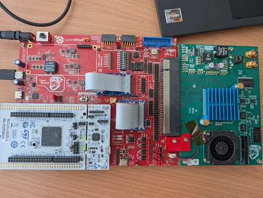

# Penetration Testing Framework

The purpose of this framework is to perform side-channel analysis (SCA) and fault injection (FI) attacks on the FPGA as well as on the chip.


As shown in the block diagram, the pentest framework runs on the target and receives configuration commands by the SCA and FI [ot-sca](https://github.com/lowRISC/ot-sca) framework.

## Usage

To run the penetration tests either on the FPGA or the chip, please follow the instructions in the [ot-sca](https://github.com/lowRISC/ot-sca) repository.
You can also find the files to communicate to the pentest framework via Python scripts in //sw/host/penetrationtests/python.

## Contributing

When contributing to the pentest framework, run the automated testing as explained below.

### Building Images

Due to code size memory limitations, the firmware for the chip and the FPGA is split into a SCA, general FI, IBEX FI, and OTBN FI binary. To build these binaries for the chip, run:
```console
cd $REPO_TOP
./bazelisk.sh build \
  --//signing:token=//signing/tokens:cloud_kms_sival \
  //sw/device/tests/penetrationtests/firmware:pen_test_sca_silicon_owner_sival_rom_ext

./bazelisk.sh build \
  --//signing:token=//signing/tokens:cloud_kms_sival \
  //sw/device/tests/penetrationtests/firmware:pen_test_fi_silicon_owner_sival_rom_ext

./bazelisk.sh build \
  --//signing:token=//signing/tokens:cloud_kms_sival \
  //sw/device/tests/penetrationtests/firmware:pen_test_fi_ibex_silicon_owner_sival_rom_ext

./bazelisk.sh build \
  --//signing:token=//signing/tokens:cloud_kms_sival \
  //sw/device/tests/penetrationtests/firmware:pen_test_fi_otbn_silicon_owner_sival_rom_ext

./bazelisk.sh build \
  --//signing:token=//signing/tokens:cloud_kms_sival \
  //sw/device/tests/penetrationtests/firmware:pen_test_cryptolib_sym_fi_silicon_owner_sival_rom_ext

./bazelisk.sh build \
  --//signing:token=//signing/tokens:cloud_kms_sival \
  //sw/device/tests/penetrationtests/firmware:pen_test_cryptolib_asym_fi_silicon_owner_sival_rom_ext

./bazelisk.sh build \
  --//signing:token=//signing/tokens:cloud_kms_sival \
  //sw/device/tests/penetrationtests/firmware:pen_test_cryptolib_sym_sca_silicon_owner_sival_rom_ext

./bazelisk.sh build \
  --//signing:token=//signing/tokens:cloud_kms_sival \
  //sw/device/tests/penetrationtests/firmware:pen_test_cryptolib_asym_sca_silicon_owner_sival_rom_ext
```

The binaries are located in `bazel-bin/sw/device/tests/penetrationtests/firmware/`.

## Automated Testing

To automatically test whether the pentest framework works, an automatic testing framework is provided.
This framework compares the responses of the pentest frameworks with reference testvectors.

Use the following command to automatically test the Ibex FI tests on the CW340 FPGA board:

```console
cd $REPO_TOP
./bazelisk.sh run //sw/device/tests/penetrationtests:fi_ibex_fpga_cw340_sival_rom_ext
```

In addition, we have Python scripts to use the pentest framework in `//sw/host/penetrationtests/python`.
These scripts are also tested.
Use the following command to automatically test the Ibex FI tests on the CW340 FPGA board:

```console
cd $REPO_TOP
./bazelisk.sh run //sw/device/tests/penetrationtests:fi_ibex_python_test_fpga_cw340_sival_rom_ext
```

## GDB Testing (FiSim)

The crypto library is tested on a debug enabled CW340 FPGA by tracing several relevant cryptographic calls and apply instruction skips or other fault models to their execution. In order to use this testing, the CW340 FPGA has to be adapted. We provide a picture on its setup as reference:



In order to run a GDB test, find the "gdb_test" targets in the BUILD file in `//sw/device/tests/penetrationtests`. For example,
```console
./bazelisk.sh run //sw/device/tests/penetrationtests:fi_sym_cryptolib_python_gdb_test_fpga_cw340_rom_ext

./bazelisk.sh run //sw/device/tests/penetrationtests:fi_asym_cryptolib_python_gdb_test_fpga_cw340_rom_ext
```

These tests specifically run in the rom_ext environment since this is a ROM version in the RMA lifecycle which enables debug. The test then builds and runs openocd in the background which opens the default port 3333 to GDB. The files in //sw/host/penetrationtests/python/util contain classes in order to communicate with the FPGA, OpenOCD, and GDB.

The testing is performed on the flashed pentest framework in this directory which provides the interface to the crypto library in `//sw/device/lib/crypto`. The targeted functions are found parsing the dis file. The parser is also found in `//sw/host/penetrationtests/python/util`.

All test outputs are saved in the `bazel-testlogs/sw/device/tests/penetrationtests` folder in opentitan. Take note that the output to the terminal is piped to the campaign file in that directory, please consult this file for the test output. This is done since each subtest can take 2-12h.

## Versioning

In `//sw/device/tests/penetrationtests/firmware/lib/pentest_lib.h`, a value PENTEST_VERSION is found with the current version of the pentest framework.

The versioning has the syntax: vx.y.z (epoch.major.minor).

The version number signifies the release of the pentest framework.
- New releases providing minor changes such as patches, bugfixes, adapted functionality increase z.
- New releases providing major breaking changes increase y.
- x is kept for the epoch of the hardware.
