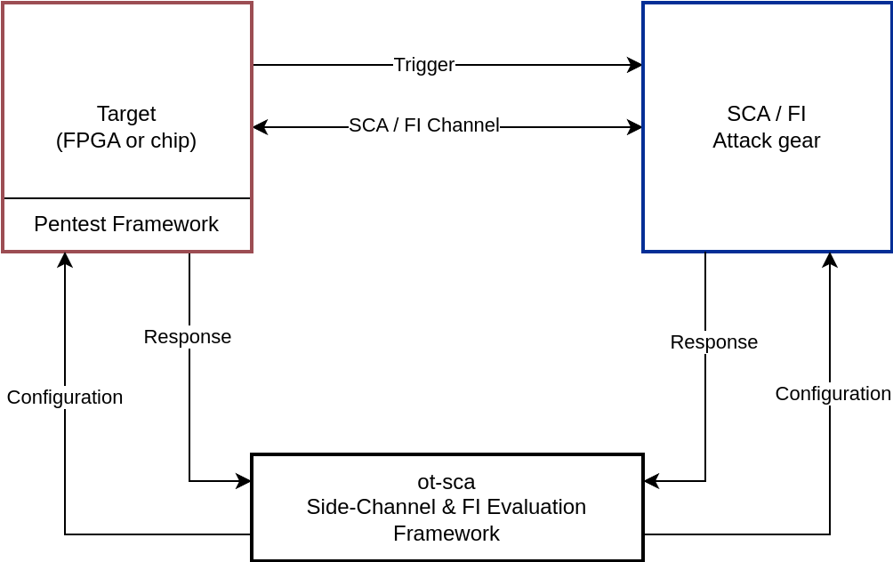

# Penetration Testing Framework

The purpose of this framework is to perform side-channel analysis (SCA) and fault injection (FI) attacks on the FPGA as well as on the chip.



As shown in the block diagram, the pentest framework runs on the target and receives configuration commands by the SCA and FI [ot-sca](https://github.com/lowRISC/ot-sca) framework.

## Usage

To run the penetration tests either on the FPGA or the chip, please follow the instructions in the [ot-sca](https://github.com/lowRISC/ot-sca) repository.

### Building Images

Due to code size memory limitations, the firmware for the chip and the FPGA is split into a SCA, general FI, and OTBN FI binary. To build these binaries for the chip, run:
```console
cd $REPO_TOP
./bazelisk.sh build \
  --//signing:token=//signing/tokens:cloud_kms_sival \
  //sw/device/tests/penetrationtests/firmware:pen_test_sca_silicon_owner_sival_rom_ext

./bazelisk.sh build \
  --//signing:token=//signing/tokens:cloud_kms_sival \
  //sw/device/tests/penetrationtests/firmware:pen_test_fi_silicon_owner_sival_rom_ext

./bazelisk.sh build \
  --//signing:token=//signing/tokens:cloud_kms_sival \
  //sw/device/tests/penetrationtests/firmware:pen_test_fi_otbn_silicon_owner_sival_rom_ext
```

The binaries are located in `bazel-bin/sw/device/tests/penetrationtests/firmware/`.

## Automated Testing

To automatically test whether the pentest framework works, an automatic testing framework is provided.
This framework compares the responses of the pentest frameworks with reference testvectors.

Use the following command to automatically test the Ibex FI tests on the CW310 FPGA board:

```console
cd $REPO_TOP
./bazelisk.sh run //sw/device/tests/penetrationtests:fi_ibex_fpga_cw310_sival_rom_ext
```
