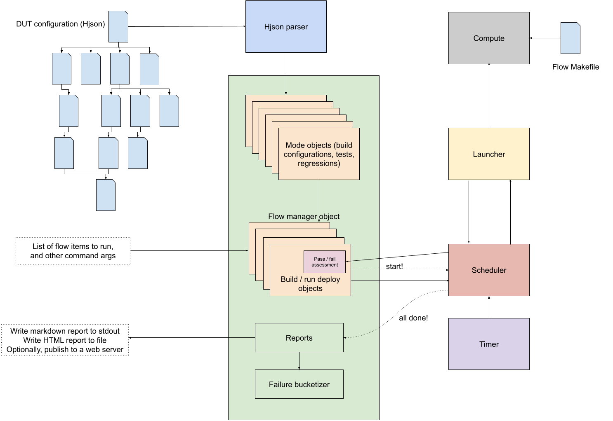

An industry-grade EDA tool flow manager / build and run system that strives to achieve a bug-free Silicon on the first-pass must support several [usecases](#goals).
The terminologies used in this document below are explained in the [glossary]().

# Context

Hardware companies often invest in engineering resources to build and maintain custom tooling to manage EDA tool flows.
It enables them to deploy and scale EDA workloads efficiently across their projects onto their compute infrastructure, monitor their execution, assess success and generate and publish queryable report to track the overall health and progress of their projects.
These are often proprietary in nature, which makes them unsuitable for the development of open source projects such as OpenTitan.

DVSim is thus an attempt to make such a tool open and freely available with OpenTitan.
It enables us to transcend organizational borders and collaborate effectively with a number of industry partners.
It gives us the confidence to take our designs to production tape out, and transparency to potential new adopters of OpenTitan, by giving them the ability to immediately get started, run our flows, and validate our advertised levels of quality.

# Goals

Some of the goals / usecases listed below are specific to an EDA tool flow (such as simulations), while the rest are general ones that apply to all of them.

- Execution
  - Adapt easily to a partner organization's compute infrastructure to which jobs could be launched to and monitored.
  - Set the maximum number of jobs that can execute in parallel at a time.
    The pending jobs will remain in the queue, waiting to be dispatched, when the number of ongoing parallel jobs has reached the maximum limit.
    This necessitates building a scheduler.
  - EDA tool flows tend to be incredibly resource intensive and time-consuming.
    Provide a way to measure the wall clock time and simulated time for each simulation.
    Provide a way to set wall clock time and simulated-time limits before killing the invocation.
    Indicate the actual wall clock time and simulated time consumed per test in the final report.
  - Enable EDA tools to be run in various operating modes:
    - Batch / GUI / interactive mode
    - With / without wave dumps
    - Enable wave dump format choices
    - With / without [coverage]() instrumentation
    - Run the same tests in RTL, gate level and power aware simulations
    - Varying levels of EDA tool logging (to debug EDA tool issues)
    - Varying levels of EDA tool flow logging (to debug design / verification code)
    - Varying levels of tool flow manager logging (to debug the DVSim tool itself)
    - With / without profiling (time-based or memory-based)
    - With / without additional debug flags that enable greater observability into various SystemVerilog code regions
  - Enable the invocation to be killed cleanly via CTRL-C, while preserving the current status of the flow to the maximum extent possible.

- Flexibility
  - Enable output artifacts to be generated at an arbitrary location.
  - Enable
  - Enable arbitrary variables to be added to the DUT configuration files to represent configuration settings.
  - Provide ability to recursively substitute variables with their values to help reduce repetition.
  - Provide ability to override variable values, which will take the highest precedence.
  - Provide ability to evaluate a variable's value by executing a shell command snippet.
  - Have a clean separation between code and data, so that it can be adapted and used for any ASIC project, not just OpenTitan.

- Readability
  - Describe testplans, tool configurations, build modes, run modes, test specifications, testplans and regressions in a human readable, but machine parsable format.

- Scalablility
  - Enable launching jobs into each new partner's unique compute infrastructure.
  - Provide a method to easily add support for more new EDA tool flows.
  - Support a wide variety of open / commercial EDA tools for each flow (i.e. run the same simulation with Synopsys VCS, Cadence Xcelium or Mentor Graphics Questa etc.).
  - Enable an ASIC tool flow to be composed of an arbitrary number of steps, where each step is an invocation of a number of sub-tools and utility scripts.
  - Enable multiple build configurations for each DUT.
    Allow tests to pick and choose a specific build configuration to use.
  - Enable each test to be independently reseeded.
  - Be able to scale the number of simulations that can be launched with a single invocation.
  - Be able to scale the number of DUTs on which the [standard regression targets]() can be run with a single invocation.

- Extensibility
  - Enable testplans to be extended in external environments (i.e. add new testplan items to an existing list, and be able to track everything).
  - Enable test specifications to be reused and modified via additional runtime options in external environments.
  - Enable modification of the build configuration as well as specification of runtime parameters to modify the behavior of the simulations over the command line.

- Reproducibility
  - Enable simulation failures to be reproducible\*, even across various partner organizations.
  - Generate artifacts in unique directories across runs, i.e. preserve artifacts from previous invocations to aid debug.

- Modularity
  - Allow each step within a tool flow to be swapped with some other tool / utility script.
  - Enable the tool flow to be run partially, such as stopping at the build, or running the simulation directly without building, etc.
  - Allow DUT configuration settings to be partitioned appropriately (i.e., split into a tree-like hierarchy of files).

- Reporting
  - Display the progression of job(s) on the console after invocation, which updates every few seconds, indicating how many are queued, running, passed, failed and killed.
  - EDA tools typically exit with a zero exit-code when they complete successfully and non-zero exit code when the tool itself encounters an error (for example, it could not write artifacts to the output location).
    For example, simulations may complete successfully, but they may have failed our verification checks.
    The pass / fail state is then assessed by looking for patterns in the EDA tool's output log.
    - Enable specification of common passing and failing patterns.
    - Enable specification of failing patterns that are specific to the EDA tool itself.
    - Assess pass / fail by parsing the EDA tool flow's log i.e., none of the failing patterns must be seen AND all passing patterns must be seen.
  - Enable common failure signatures to be bucketized for the ease of readablility of the report.
  - Provide ability to publish the reports to a web server (as a command line option).
  - Report the wall-clock time and simulated time (the worst case, if the test is multiply seeded) for each test.
  - For simulations, enable mapping the results of the regression (i.e., the status of the set of tests run) to the testplan entries to indicate the testpoints that have been successfully completed.
  - Enable common failure signatures to be bucketized for the ease of readablility of the report.

- Debuggability
  - Provide logging at multiple levels (normal, verbose and debug) to help debug / triage tool / infrastructure issues.
  - Generate a dump of all environment variables for each step.
  - Support a "dry run" mode where the job's output logs only contains the sequence of command invocations for each step, without them actually run.

- Simulation-specific features
  - Enable each test to be independently reseeded (i.e., multiple iterations of the test with a different initial random seed).
  - Enable running a test with a specific seed.
  - Enable reseed count to be overridden on the command-line.
  - Add support for a multiplicative factor for the pre-set reseed.
  - Enable testplans to be maintained as separate document, different from the list of test specifications.
  - Enable each testpoint entry to be mapped to one or more test specifications that adequately satisfy it.
  - Enable the same test to be mapped to multiple testpoints.

# Non-goals

The individual tool-specific setup (such as setting the environment variables such as `$PATH`, `$LD_LIBRARY_PATH`, `$LM_LICENSE_FILE`, etc, that allow the tool to be discoverable and runnable on the console is assumed to have been completed externally.

# Architecture

### EDA tool flow steps

The simulation tool flow progresses through the following *steps*:
- **build** (build the design / testbench database)
- **run** (run the test as a simulation)
- **coverage merge** (if coverage is enabled)
- **Coverage report** (if coverage is enabled)

All other EDA tools flows stop at the **build** step, because they build the design and run the flow on the same invocation, unlike simulations where the EDA tool is invoked separately for the build and run steps.
Each of these steps is executed as a single job that is launched to a compute machine.
They are hence, also referred to as "jobs".

### Flow-specific Makefile

Each of these steps may contain sub-steps, which are sequenced by a **flow-specific Makefile** ([example](https://github.com/lowRISC/opentitan/blob/master/hw/dv/tools/dvsim/sim.mk)).
This Makefile is very lean, and has targets for each of the flow-specific steps.
It is a project-specific source, not maintained within the DVSim codebase, which allows a greater degree of flexibility for adoption.

The recipe for executing the targets is represented with generic variables, which are set to the values extracted from the DUT configuration Hjson.
The Makefile also sequences housekeeping actions, such as constructing the paths for the output artifacts, dumping the environment variables for ease of debug, etc.
When the job is launched, a make command is executed, with the Make variables set to the values required to correctly run the job, using the flow-specific Makefile.
Thus, all Make variables must be defined in the DUT configuration file and differentiated as needed for the jobs.

### DUT configuration

The **DUT configuration** is expressed in Hjson, split into a tree of files.
The root DUT configuration file indicates the [flow]() and the EDA tool used to execute the flow, among several other things.
It may recursively import auxiliary Hjson files containing additional EDA tool flow configuration data, such as test specifications that are common to multiple DUTs.

### Parser stage

The **parser stage** parses all Hjson files in the tree and constructs a **flow manager object**.
The flow manager object first, **recursively substitutes all variables** so that they are fully resolved.
The resolution of some variables is deferred to a later stage, because additional information is needed to process them.

### Mode object creation stage

The flow manager object then creates **objects representing the various settings** reflected in the DUT configuration data.
For the simulation flow, these are:
- **Build modes** (encapsulates TB build time options)
- **Run modes** (encapsulates simulation runtime options)
- **Tests** (runtime options that represent the test being run on the built TB database, typically a UVM test or a sequence)
- **Regressions** (a list of tests that are grouped together, and may contain additional runtime settings that are different from the test specifications)

The build modes can recursively enable other build modes, and likewise, the run modes.
The tests may also enable one or more run modes, in addition to specifying runtime options.
Build modes, build time options, run modes, and runtime options can be specified over the command line as well.
The flow manager resolves this by recursively merging the child mode with the parent mode, subsequently discarding the unused child objects.

### Deployable object creation stage

The list of tests or regressions to be run in the current invocation is provided as a command line argument.
Both, test and regression targets can be provided.
The flow manager object then looks up the list of regression and test objects created in the previous step, and constructs the actual list of tests to run.
With the list of tests to run known, it starts creating **deployable objects for each test**, which encapsulate the runtime settings.

If the tests are **reseeded**, the deployable object associated with it is duplicated (as many times as the reseeds), such that each iteration of each test is a unique instance, differentiated by the chosen simulation seed and the name, which is prepended with an integer index.
The simulation seed for each instance is a unique randomly picked 32-bit unsigned integer, unless it is overridden over the command-line.
Each test can optionally pick a specific **build configuration** (i.e., a build mode) to use if the test requires the design / testbench to be altered at compile time in a specific way.

The flow manager object then creates the minimum list of builds based on what the tests being run need, and creates deployable objects representing them.
The deployable objects for the builds are indicated as **dependencies** of the tests that use them.

If coverage is enabled, it creates additional deployable objects for merging the coverage and generating the coverage report.
The deployable objects representing the tests are added as dependencies of the coverage object, so that the coverage merge job is run only after all tests finish.
Thus, all [jobs](#eda-tool-flow-steps) have an associated deployable object, which manages it.

### Scheduler stage

Once a dependency-encoded list of deployable objects is constructed, the entire list is passed onto the **scheduler**.
Each deployable object internally also creates a **launcher** instance, which implements a generic interface to dispatch the job to the compute infrastructure, poll the status, monitor the duration, and clean up on exit.
The launcher object thus, manages the execution of the job on the compute infrastructure.
Keeping the scheduler and the launcher semantically separate enables us to support different types of compute infrastructures and load balancing software in a streamlined manner.

The flow manager object indicates to the scheduler how many jobs can run in parallel, how often to poll, and how many jobs to poll in a single round.
These settings are also tunable via the command-line.
The scheduler starts executing jobs starting at the root of the dependency tree (typically, builds) of deployable objects it was provided with.
At each dependency level, **it dispatches jobs in the same order** as determined by the flow manager object.
If the dispatch slots are full, the remaining jobs are put on hold (queued).
The scheduler periodically polls the status of the dispatched jobs using the launcher instance.

If the job successfully completes, it determines whether the job passed or failed by looking for pass / fail patterns in the output log.
If the job exceeds the pre-set wall clock time, the scheduler sends the terminate signal to the job to kill it.
When the jobs finally retire, the status (passed, failed, or killed) is recorded in the deployable object.
If the job failed or got killed, the corresponding error message is also recorded.

### Report stage

When all jobs are done, the flow manager object starts constructing the final report, capturing all the relevant information to depict the overall status of the invocation.
In case of simulations, it also bucketizes the list of failures by similarity of error signatures.
A version of the generated report (in Markdown format) is logged to the console.
A slightly longer version of the generated report is written to an HTML file.
The HTML report is optionally published to the report server.

# Design

Please see the [reference manual]() for detailed information on how DVSim is designed based on the architecture above, and the [user guide]() to learn about how to use DVSim.

## Language

Python3 was chosen as the preferred language to design this tool due to its versatility and the vastness of open source third-party libraries.

## Configuration data

Hjson was chosen as the de facto standard for maintaining configuration data for all tools and utilities developed in OpenTitan.
DVSim, hence, also uses Hjson as the language for storing data.

## Other considerations

### Makefile based approach

RTL simulations were the first to be developed at the commencement of the OpenTitan project.
The initial setup used a [Makefile-based approach](https://github.com/lowRISC/stwg-base/blob/master/hw/dv/tools/README.md), which sequenced the various steps that are required to be invoked to successfully run a simulation.
As the number of DUTs and the number of tests for each DUT grew, and as the list of our requirements grew, the Makefile-based approach became harder to read and follow and maintain.
It became clear that a better system was needed, one that scaled well with our growing list of requirements.

### FuseSoC

[FuseSoC](https://fusesoc.readthedocs.io/en/stable/) is primarily designed to be a package management system.
It lacked the necessary smarts to operate as a regression system capable of building once and running a large number of simulations at a time.
In OpenTitan, FuseSoC is still in use, but only to generate the dependency-resolved [filelist]() of SystemVerilog sources.
The filelist is then consumed as input by the EDA tools.

### Bazel

EDA workloads are resource intensive, and often need to be deployed to a HPC system (such as LSF).
The approach used to manage the EDA tool flows needs to be flexible enough to support the disparate, proprietary HPC environments at various partner organizations, given the open source nature of the project.

[Bazel's](https://bazel.build/) design language is well documented and robust, but also stricter.
It has a programming paradigm with [Starlark](https://bazel.build/rules/language), a reduced subset of Python, to develop build rules.
However, as far as we could tell, it did not understand or support external (remote) execution environments to which EDA work loads may need to be launched to.
It was not clear at the time if our ever growing list of [usecases](#goals) could be met with Bazel.
The general consensus was to develop custom tooling, with a more loosely structured database language, such as Hjson, so that we have a greater degree of flexibility to support our usecases.
In the future, we may revisit this decision.
