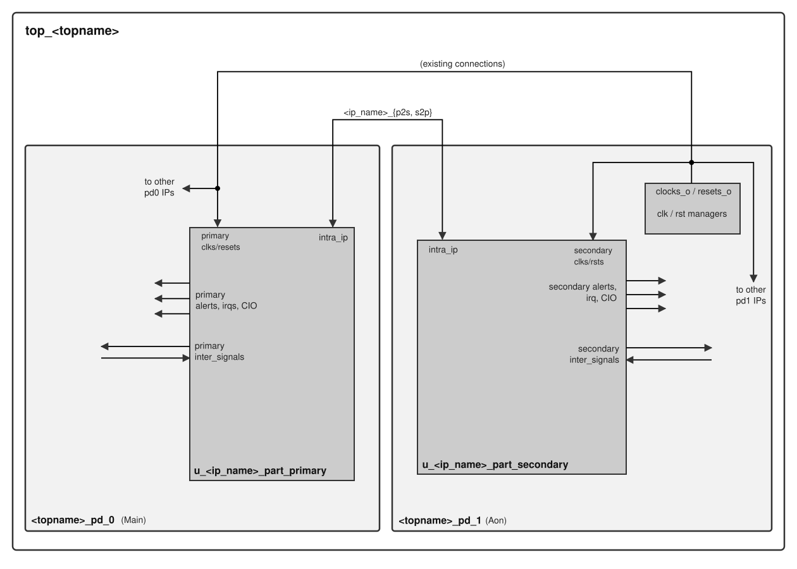

# Concept for splitting up IPs across two power domains using `topgen`

## General Idea
Each split IP will be broken up into two partitions, one for each power domain (PD). There will be a primary and secondary partition, with the idea that the primary partition hosts the majority of the design and the TLUL bus connection and will go into the PD that the respective IP currently belongs to. As is now done for the full IP, the HDL implementation for both partitions is provided by a designer, either as fully manually created and maintained System Verilog files, or (partially) templated.



Proposal for instance and module names:

```
<ip_name>_part_primary #(
  <parameter overrides>
) u_<ip_name>[<inst_idx>]_part_primary (
  <port map>
);
```
```
<ip_name>_part_secondary #(
  <parameter overrides>
) u_<ip_name>[<inst_idx>]_part_secondary (
  <port map>
);
```

Note that `[<inst_idx>]` above is **not** SystemVerilog array indexing or a generate construct. It merely denotes the optional index that is already part of the user-chosen instance `name` in `top_<top_name>.hjson` (e.g. `uart0` … `uart3`). The emitted instance names are therefore simply `u_<instance_name>_part_primary` and `u_<instance_name>_part_secondary`, where `<instance_name>` is that top-level instance name verbatim.

## Intra-IP (Inter-Partition) Signalling
Every IP is responsible for defining two struct data types in its respective `<ip_name>_pkg`:
- `<ip_name>_p2s_t` (primary-to-secondary)
- `<ip_name>_s2p_t` (secondary-to-primary)
These structures shall then host all signals required for communication between the two partitions, with some exceptions that are outlined below.

Expose members of the `inter_signal_list` in the domain where their respective driver/consumer within the IP is. Avoid routing them through the intra-IP structs: They could connect to any foreign IP instance in any PD. This could then lead to situations where such a signal crossed a PD boundary via the intra-IP structs and then back through the same PD crossing via an auto generated inter-PD connection to the aforementioned foreign IP.

### Wiring the intra-IP structs and the per-partition uniqueness requirement
The `p2s`/`s2p` structs are the one class of inter-partition signal that *does* cross between the two partitions of the same IP. They are modelled as inter-module signals and connected by `topgen` between the primary and secondary partition instances (using the same multi-PD machinery that already handles cross-PD inter-module connections; the two partitions live in different PDs, so a chip-level crossing is generated automatically).

For `topgen` to wire such a struct it must know its **direction**, i.e. which partition drives it and which receives it. This exposes a limitation of the current inter-module model, where a signal name is unique per *IP*: a single entry cannot express "driven by primary, received by secondary". The target model is therefore that inter-module signal names are unique per *partition* rather than per IP — the same logical signal appears once in each partition, as a driver (`act: "req"`/`"rcv"`) in the partition that sources it and as a receiver in the partition that sinks it, and `topgen` infers the intra-IP connection (and its direction) from the two partitions. Consequently, tagging a single inter-module signal with `partition: "both"` is **not** meaningful for a directional inter-partition signal (it carries no direction information); `"both"` remains meaningful only for `param_list`.

Until per-partition uniqueness is implemented, a split IP bootstraps this by declaring the two directions as separate, uniquely-named inter-module signals (e.g. a `p2s` driver in the primary partition plus a matching receiver entry in the secondary partition, and vice-versa for `s2p`) and letting the existing inter-module connection mechanism wire them across the PD boundary.

## HJSON Implications
The hjson description of OpenTitan IPs (`<ip_name>.hjson`) must feature an optional Boolean key/property called `is_split_ip` (or similar), which all affected tools/scripts must assume to have `"false"` as default value if an IP does not specify it (backwards compatibility).
Each IP which specifies `is_split_ip: "true"` will then get the power domain specified in the `domain` key in `top_<top_name>.hjson` (as part of its instantiation in `<top_name>`) assigned as the PD for its **primary** partition. Furthermore, the instantiation of each such IP **must** include a `domain_secondary` key, which naturally specifies where the secondary partition shall get emitted to.

Some notes on this:
- The `domain` key already exists; note that it can be omitted, in which case the value defaults to the PD specified in `/power/default` (usually `"Main"`)
- `domain` and `domain_secondary` may specify either different PDs or the *same* PD. When they differ, the intra-IP / inter-partition connections cross a PD boundary (chip-level signals are generated automatically). When they are equal, both partitions are instantiated in that single PD's wrapper and the intra-IP connections stay internal to it - this falls out of the existing inter-module machinery (`elab_intermodule` takes its same-domain path when both endpoints resolve to the same PD), so no special handling is required beyond emitting both partitions in the same power-domain pass.

Furthermore, the per-instance connection keys `reset_connections`, `clock_srcs` and `clock_group` in `top_<top_name>.hjson` must be able to describe both partitions for split IPs. Instead of adding parallel `*_secondary` keys, these keys could also be extended by one nesting level with `primary` and `secondary` sub-keys, e.g.:

```
reset_connections: {
  primary:   {rst_ni: "rst_aon_ni"},
  secondary: {rst_ni: "rst_main_ni"},
},
clock_srcs: {
  primary:   {clk_i: "aon"},
  secondary: {clk_i: "main"},
},
clock_group: {primary: "secure", secondary: "peri"},
```

For backwards compatibility, the flat (non-nested) form used by all non-split instances would then get normalized to `{primary: <flat_value>}` during the toplevel merge, so that downstream code can always index these keys by partition and existing hjson descriptions require no changes.

The entries of the following lists in IP hjson descriptions must feature the optional `partition` key for IPs that specify `is_split_ip: "true"`. It shall have `primary` and `secondary` as legal values and default to `primary`:
- `available_input_list` and `available_output_list` (CIO)
- `interrupt_list`
- `alert_list`
- `inter_signal_list`
- `param_list`: additionally accepts `partition: "both"`, which emits the parameter into *both* partition module headers. This is intended for parameters (e.g. widths, address maps) that both partitions need. Note that the way parameter overrides are handled at the PD-wrapper level needs to be reworked from the current manual approach regardless; that work is orthogonal to the IP split and out of scope here.

The following keys shall not feature the `partition` key:
- `bus_interfaces`: For now, lets try to keep them in the primary partition
- `clocking`: Instead, use a separate, mandatory `clocking_secondary` list, that, however, may be empty in case the secondary partition does not need to be clocked. Just like the primary partition's `clocking` list, each entry also carries its associated `reset`, so `clocking_secondary` fully describes both the clocks *and* resets available to the secondary partition — no separate reset list is required.
- `registers`: For now, lets keep the auto-generated `<ip_name>_reg_top` block in the primary partition, and instantiate the actual storage for all registers that need to go into the secondary partition manually there, then connect them to `<ip_name>_reg_top` via the intra-IP connections (and use the `hwext` property for the registers in question). This may need to be re-visited, but it would cause significant added complexity to `reggen`. Two consequences of this arrangement are intended and must be kept in mind by the IP designer:
  - Every access to a secondary-partition register crosses the PD boundary (write path `reg_top` → `p2s` → secondary storage, read path secondary storage → `s2p` → `reg_top`), so such registers are only reachable while the secondary partition's PD is powered.
  - The state of secondary-partition register storage is not retained when the secondary partition's PD is power-gated. Consequently, only registers that are irrelevant while the secondary PD is off (or that are explicitly re-initialized on secondary power-up) may be placed in the secondary partition; any register requiring retention across a secondary power-down must stay in the primary partition.

## `topgen` and Template Implications
In essence, all scripts and functions which filter IP instances by power domain need to be made aware that there are split-type IPs with multiple partitions, and for such split-type IPs both the `domain` and `domain_secondary` keys must be checked whether they match the to-be-filtered-for PD.

For templates, this mostly affects the [module_instantiations.tpl](templates/toplevel_snippets/module_instantiations.tpl) snippet. The main instantiation-loop now needs to do the domain match for both partition domains in the case of split IPs, and furthermore filter all relevant objects (CIOs, alerts/interrupts, clock/reset connections, inter-module signals) to only emit those belonging to the partition at hand.

For this to work, [merge.py](merge.py) must also respect the `partition` attribute of CIOs, alerts, and interrupts and set the `domain` property accordingly. See commit range 4bc3c3fb1b6~fdb53e9be59 for some guidance of how multi-pd support for these object types was realized.

Special attention is required for the `clock_group` key, which is not merely cosmetic: it feeds both the clkmgr clock-tree generation in `extract_clocks` (the group's `src`/`unique`/`sw_cg` attributes control gating, uniquification and net naming) and the alert handler's Low-Power-Group (LPG) identity, which is derived from the primary clock's clock group together with the primary reset's name and domain. The LPG generation loop in [merge.py](merge.py) currently assumes a single primary clock/reset per module (via `block.get_primary_clock()` and the module's single `reset_connections`/`clock_connections`). For split IPs this must be generalized to run per partition -- each partition has its own primary clock and reset (in a potentially different clock group and reset domain) -- and each alert's `partition` key then selects which partition's LPG it joins.

Lastly, the intra-IP signalling must be created. This is nothing more than yet another multi-PD signal pair. Instead of manually creating the `top_<top_name>`-level signal definition and `<top_name>_pd_<pd_name>`-level port definitions, it's probably best to inject an inter-module `connect` entry during the toplevel-merge process and let the multi-pd functions in [intermodule.py](intermodule.py) take care of the actual object creation and connection.
